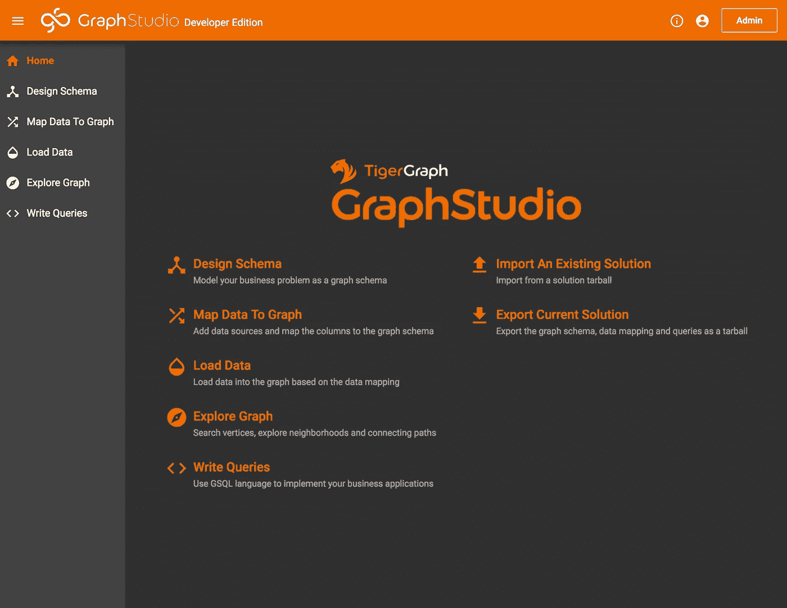
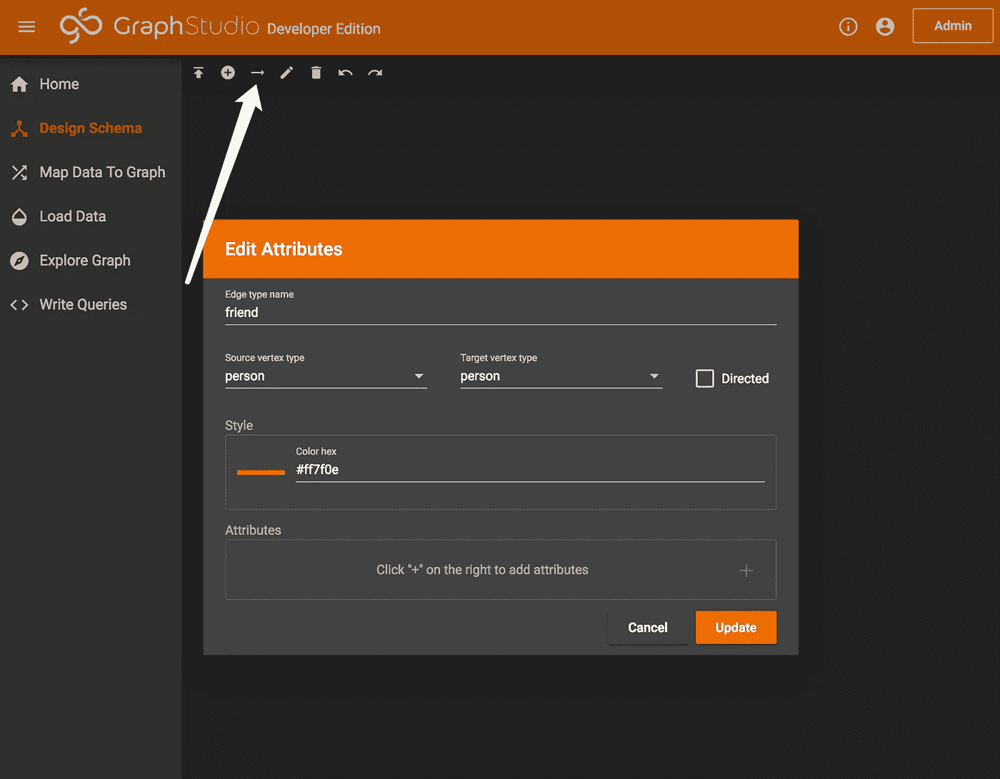
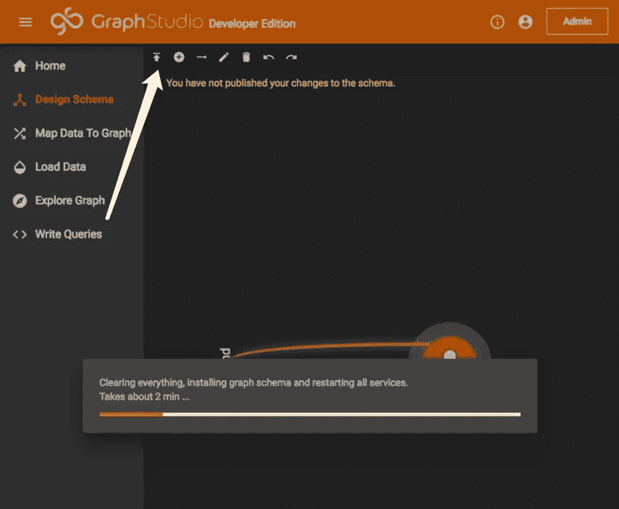
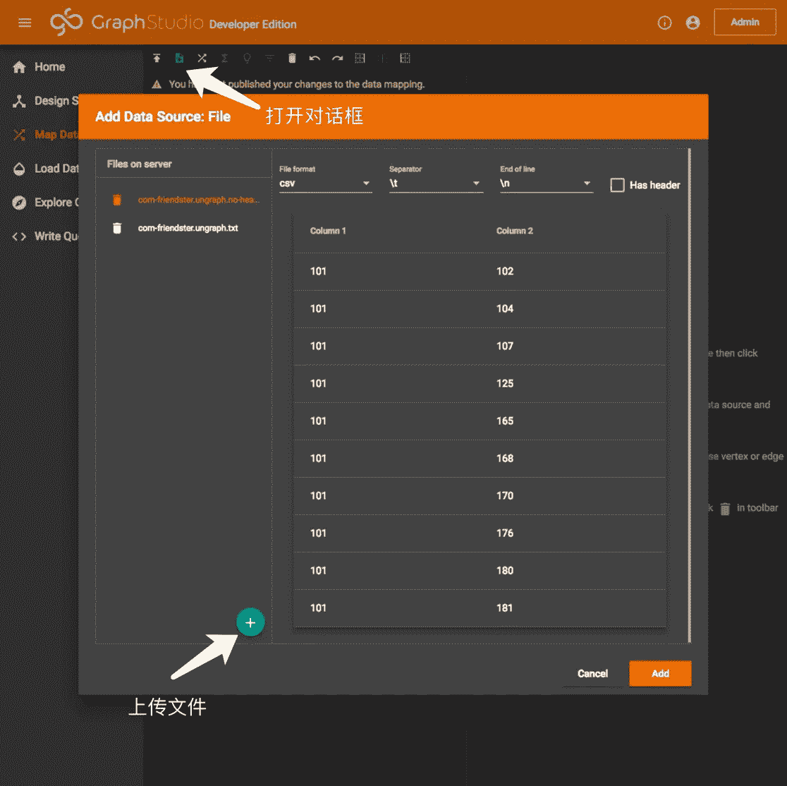
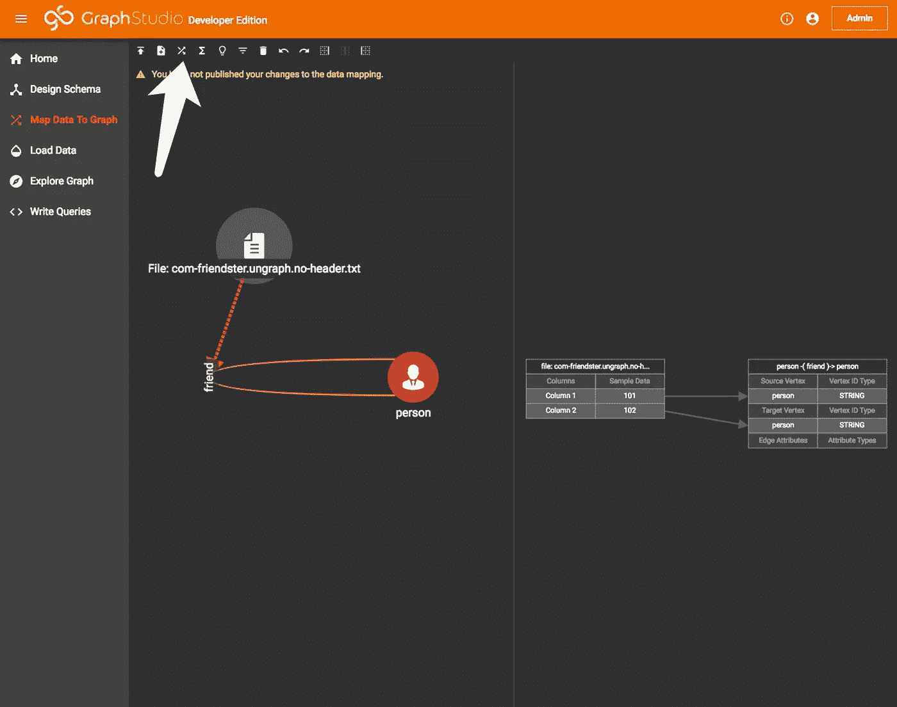
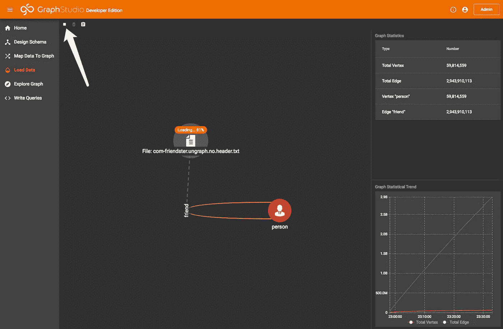
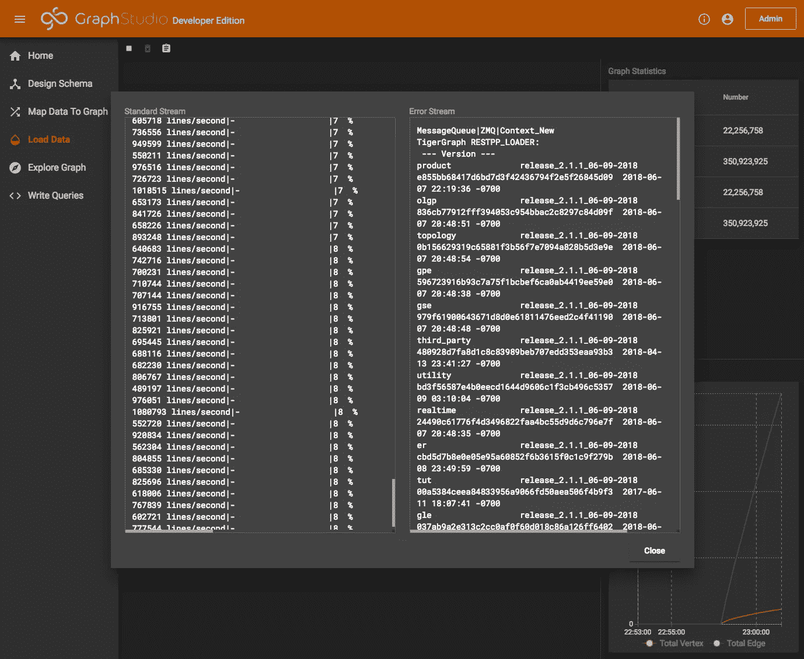
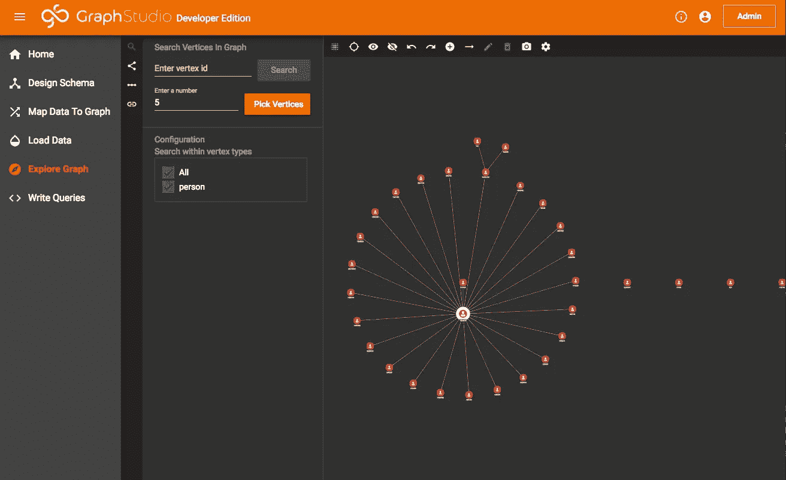
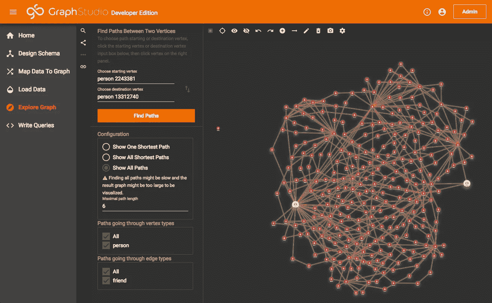
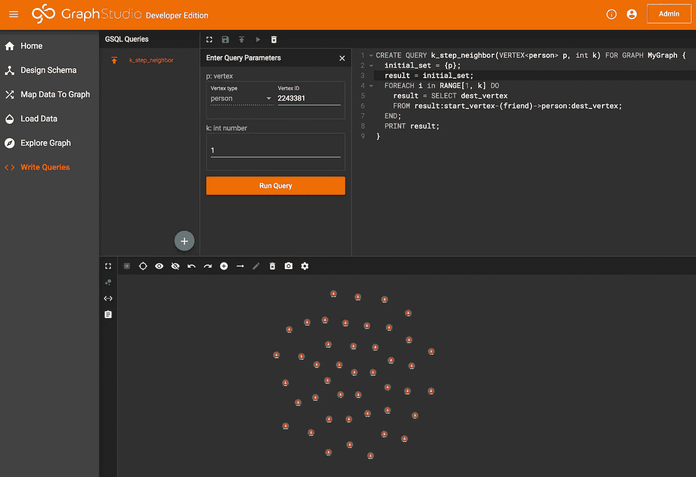

# 性能爆炸！TigerGraph 开发者版简介

> 原文：<https://towardsdatascience.com/performance-exploding-introduction-to-tigergraph-developer-edition-486d6e6a409?source=collection_archive---------24----------------------->

*This document is translated from:* [*性能炸裂！图数据库 TigerGraph 开发者版本入门 — 知乎*](https://zhuanlan.zhihu.com/p/38016914)

# 介绍

图数据库是随着大数据的普及而增长的一种数据库类型。

在多年专注于商业市场后，TigerGraph 发布了其免费开发者版。TigerGraph 本身自称是 Graph Database 3.0，具有处理海量数据的能力，支持实时更新和查询，它还定义了一种新的语言，称为 GSQL。这对于图形数据库爱好者来说无疑是一个好消息。

开发者版可在[https://www.tigergraph.com/download/](https://www.tigergraph.com/download/)获得填写表格后，下载链接和相关文件将发送到您的电子邮件地址。

接下来，我们将逐步安装 TigerGraph，并尝试加载一个 31G 的社交网络数据集。TigerGraph 在测试结果中展现了他惊人的力量，在业界遥遥领先。

# 装置

目前，TigerGraph 支持包括 Ubuntu 和 CentOS 在内的主要 Linux 平台。

首先，我们需要解压缩下载的文件:

```
ubuntu@ip-172-31-6-254:~$ tar -xzvf tigergraph-developer-latest.tar.gz
tigergraph-2.1.2-developer/
tigergraph-2.1.2-developer/tsar.tar.gz
tigergraph-2.1.2-developer/LICENSE.txt
...
```

然后，以 root 权限运行`install.sh`。

```
ubuntu@ip-172-31-6-254:~/tigergraph-2.1.2-developer$ sudo ./install.sh -n
   _______                 ______                 __
  /_  __(_)___ ____  _____/ ____/________ _____  / /_
   / / / / __ `/ _ \/ ___/ / __/ ___/ __ `/ __ \/ __ \
  / / / / /_/ /  __/ /  / /_/ / /  / /_/ / /_/ / / / /
 /_/ /_/\__, /\___/_/   \____/_/   \__,_/ .___/_/ /_/
       /____/                          /_/Welcome to the TigerGraph platform installer![PROGRESS]: Checking operation system (OS) version ...
[NOTE    ]: OS obtained: UBUNTU 16.04
[NOTE    ]: OS check passed [OK]
...
---------------------------------------------------------------
Congratulations! Installation Finished!
---------------------------------------------------------------Thank you for using TigerGraph platform!
[PROGRESS]: Cleaning up ...
DONE
[NOTE    ] The TigerGraph user: tigergraph
ubuntu@ip-172-31-6-254:~$
```

现在，`/home/tigergraph/tigergraph/`下已经安装了 tigergraph。有两点需要注意:

1.  安装过程中会创建一个操作系统用户`tigergraph`。由于我们使用了`-n`选项(默认配置)，所以密码也是`tigergraph`。
2.  所有后续操作都应该在用户`tigergraph`下完成，而不是拥有`root`权限的原用户。

# 服务管理

TigerGraph 使用命令`gadmin`来管理系统，该命令应该在 OS 用户`tigergraph`下运行。

# 开始和停止

默认情况下，TigerGraph 将在安装后启动。

`gadmin start`和`gamin stop`可用于启动和停止服务。

# 系统状况

命令`gadmin status`可用于检查各部件的状态。

```
tigergraph@ip-172-31-6-254:~/$ gadmin status
Welcome to TigerGraph Developer Edition, for non-commercial use only.
=== zk ===
[SUMMARY][ZK] process is up
[SUMMARY][ZK] /home/tigergraph/tigergraph/zk is ready
=== kafka ===
[SUMMARY][KAFKA] process is up
[SUMMARY][KAFKA] queue is ready
=== gse ===
[SUMMARY][GSE] process is up
[SUMMARY][GSE] id service has NOT been initialized (online)
...
=== Visualization ===
[SUMMARY][VIS] process is up (VIS server PID: 37708)
[SUMMARY][VIS] gui server is up
```

# 应用

接下来，我们将创建一个最简单的图形，加载数据并运行一些简单的查询来查看 TigerGraph 的性能。

# 硬件和数据集

TigerGraph 的要求比较低，最低 8G 内存，20G 磁盘空间，这样就可以在虚拟机中运行。当然，加载大型图形需要更多的磁盘空间和内存。

可以在[亚马逊共购网](https://snap.stanford.edu/data/com-Amazon.html)数据集上做简单测试，解压缩后只有 12.6M。

为了让它更有趣，这里我们使用 [Friendster 社交网络](https://snap.stanford.edu/data/com-Friendster.html)数据集，它与[亚马逊共同购买网络](https://snap.stanford.edu/data/com-Amazon.html)具有相同的格式，但是具有更多的顶点和边:650 万个顶点和大约 20 亿条边。测试在 AWS EC2 c4.8xlarge 上进行，带 GP2 磁盘，操作系统为 Ubuntu 16.04。

首先我们需要解压数据文件:`gunzip com-friendster.ungraph.txt.gz`

未压缩的数据文件大小为 31G。在开始测试之前，我们先检查一下磁盘使用情况，加载后可以对比一下。

```
tigergraph@ip-172-31-6-254:~/data$ ll com-friendster.ungraph.txt  --block-size=G
-rw-rw-r-- 1 tigergraph tigergraph 31G Nov 13  2012 com-friendster.ungraph.txt
tigergraph@ip-172-31-6-254:~/data$ df -h
Filesystem      Size  Used Avail Use% Mounted on
udev             30G     0   30G   0% /dev
tmpfs           5.9G  8.5M  5.9G   1% /run
/dev/xvda1      194G   67G  127G  35% /
tmpfs            30G     0   30G   0% /dev/shm
tmpfs           5.0M     0  5.0M   0% /run/lock
tmpfs            30G     0   30G   0% /sys/fs/cgroup
tmpfs           5.9G     0  5.9G   0% /run/user/1000
```

为了感受这个数据集有多大，我们可以运行`time wc -l com-friendster.ungraph.no.header.txt`:

```
tigergraph@ip-172-31-6-254:~/data$ time wc -l com-friendster.ungraph.no.header.txt
1806067135 com-friendster.ungraph.no.header.txtreal    3m8.286s
user    0m31.372s
sys     0m18.412s
tigergraph@ip-172-31-6-254:~/data$ ls -al --block-size=G com-friendster.ungraph.no.header.txt
-rw-rw-r-- 2 tigergraph tigergraph 31G Jun 12 05:36 com-friendster.ungraph.no.header.txt
```

从结果中我们可以看到，这个文件有 18 亿行，在 SSD 上运行`wc -l`差不多要 4 分钟！

# 创建图表

创建图表有两种方法，要么通过 cmd 工具`gsql`，要么通过 GUI 工具`GraphStudio`。

这里我们使用 GraphStudio。要访问 GraphStudio，在浏览器上键入`http://localhost:14240`。如果是远程服务器，只需将`localhost`更改为远程 IP，主页将显示:



TigerGraph Home Page

切换到左侧面板中的`Design Schema`，添加一个顶点，设置属性、颜色和图标，点击箭头指向的按钮:


Add Vertex

要添加边，点击下一步按钮，然后选择源顶点和目标顶点，会弹出一个对话框:



Add edge

然后，只需点击`publish`按钮，图表将被创建。



Publish

# 添加数据源

切换到左侧面板上的`Map Data To Graph`。点击如图所示的按钮上传文件:



Add source

考虑到本次测试的数据文件太大，并且已经在服务器上，我们可以直接将其移动到`/home/tigergraph/tigergraph/loadingData/`或者使用`ln`命令创建一个硬链接，而不是上传。

在选择了正确的文件类型和分隔符后，我们可以将数据源添加到操作面板中。在这里，我们可以点击如图所示的按钮，然后选择名为`friend`的文件和边，我们可以很容易地指定数据到属性的映射。



File Mapping

# 加载数据

切换到`Load Data`，点击`start`按钮，加载开始。点击`loading log`按钮可以看到加载日志。



Load Data



Loading log

以下是加载日志的一部分:

```
filename = .gsql.loader.progress.2018.6.12-5.57.54, progress size = 309
...
906761 lines/second|------------------- |99 %
899769 lines/second|------------------- |99 %
907965 lines/second|--------------------|100%
352247 lines/seconddestroy worker06:41:54.181621 gcleanup.cpp:38] System_GCleanUp|Finished
```

我们可以看到，31G 的原始数据，从 5:57 开始到 6:41，总共需要 44 分钟。其实我们创建的是无向图，所以实际加载的数据量要翻倍，相当于 62G 的有向图。这只是开发者版，太神奇了！

这是磁盘使用情况

```
tigergraph@ip-172-31-6-254:~$ df -h
Filesystem      Size  Used Avail Use% Mounted on
udev             30G     0   30G   0% /dev
tmpfs           5.9G  8.5M  5.9G   1% /run
/dev/xvda1      194G  110G   85G  57% /
tmpfs            30G     0   30G   0% /dev/shm
tmpfs           5.0M     0  5.0M   0% /run/lock
tmpfs            30G     0   30G   0% /sys/fs/cgroup
tmpfs           5.9G     0  5.9G   0% /run/user/1000
```

当前磁盘使用量为 110G，加载前为 67G，与原始数据相当于 62G 有向图相比，磁盘使用量只增加了 43G！

让我们看看记忆，

```
tigergraph@ip-172-31-6-254:~/data$ free -m
              total        used        free      shared  buff/cache   available
Mem:          60382       24114       19564          16       16703       35686
Swap:             0           0           0
```

加载后，磁盘使用量只有 24G。

# 询问

数据加载后，我们可以切换到`Explore Graph`进行一些基本的查询。因为 TigerGraph 是一个实时数据库，数据加载过程是在线的。因此，实际上我们不需要在运行查询之前等待加载完成。

下图显示了拾取顶点、1 步邻居和 6 步连通子图的结果。



Query Neighbors



K-step Subgraph

发动机反应如此之快，没有明显的延迟。

在`Write Queries`面板中，使用查询语言 GSQL，可以完成更多的定制查询。GSQL 的风格类似于一些常用的编程语言，很容易上手。IDE 非常强大，有漂亮高亮显示和实时的语法和语义检查。

给定一个顶点，下面是一个简单的 k 步邻居查询。

```
CREATE QUERY k_step_neighbor(VERTEX<person> p, int k) FOR GRAPH MyGraph { 
  initial_set = {p};
  result = initial_set;
  FOREACH i in RANGE[1, k] DO
    result = SELECT dest_vertex 
      FROM result:start_vertex-(friend)->person:dest_vertex
    ;
  END;
  PRINT result;
}
```

保存并安装查询后，我们就可以运行它了



此外，更多的条件和过滤器可以添加到查询中，例如，顶点和边属性上的过滤器。这里我们不赘述。

在附录中提到的 TigerGraph 的 testdrive 中还有更复杂的用例可用，比如反欺诈、供应链、社交网络、公司信息知识图、

# 结论

TigerGraph 开发者版性能惊人。UI 工具 GraphStudio 提供了流畅的入门体验，查询语言也很容易学习。

TigerGraph 开发版的推出可能会开启图形数据库的新时代。

# 附录

*   [《让我们学习图形数据库》:图形数据库介绍](https://zhuanlan.zhihu.com/p/32857155)
*   TigerGraph 开发者文档【https://doc.tigergraph.com 
*   TigerGraph Testdrive [ [中文](http://testdrive.tigergraph.com.cn/) ] [ [英文](http://testdrive.tigergraph.com/) ]
*   GSQL 教程[https://doc.tigergraph.com/2.1/GSQL-101.html](https://doc.tigergraph.com/2.1/GSQL-101.html)