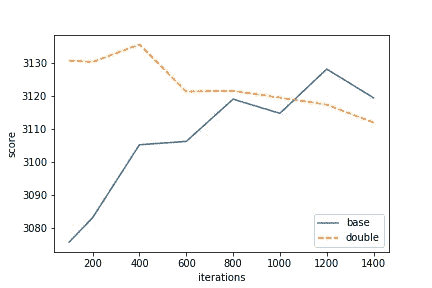
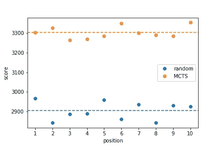
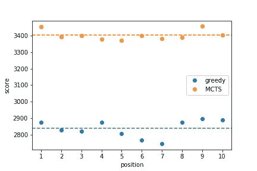
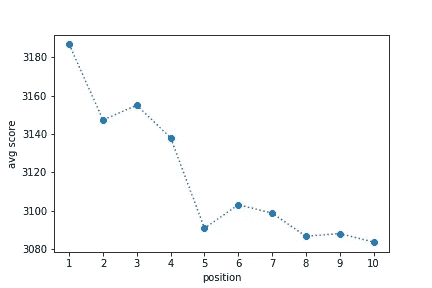

# 蒙特卡洛树搜索在梦幻足球选秀中的表现

> 原文：<https://towardsdatascience.com/performance-of-monte-carlo-tree-search-for-fantasy-football-drafts-269075d08088?source=collection_archive---------10----------------------->

*本帖中的代码也可作为* [*Jupyter 笔记本*](https://github.com/ykeuter/ffl/blob/master/notebooks/mcts_analysis.ipynb) *。*

在我之前的帖子中，我们看到了使用蒙特卡洛树搜索法为你的梦幻足球选秀。这篇文章将分析我们的 MCTS 算法的性能。


Photo by [Tajuana Delamora](https://pixy.org/author/Tajuana_Delamora/) on [Pixy](https://pixy.org/)

## 设置迭代次数

在我们开始研究性能之前，您可能记得 MCTS 的一个参数涉及到要运行的迭代次数。上次我们将其设置为 1000 次迭代(相当随意)，但这可能值得研究一下。一个简单的分析方法是让 MCTS 和另一个迭代次数更多的 MCTS 竞争。如果后者优于前者，那么至少有更高的迭代次数是有意义的，并且测试更高的迭代次数是否仍然优于后者。在某些时候，我们期望迭代次数达到一个平衡，在这种情况下，我们可以停止增加迭代次数。

下面我们看到了这个练习的结果。事实证明，对于可接受的性能来说，1000 次迭代似乎就足够了。



## 随机策略下的绩效

作为一个基本的基准，现在让我们来看看 MCTS 是如何对付一个随意选秀的对手的。这个策略的实现非常简单。

```
def random_draft(state):
    return np.random.choice(state.GetMoves())
```

下面是两种策略在不同蛇顺序位置的结果。正如所料，MCTS 胜过随机策略。



## 针对贪婪策略的性能

接下来，让我们看看 MCTS 对一个采用贪婪策略选秀的对手的表现。贪婪的意思是你在你的花名册上选择现在最有价值的位置，而不考虑未来选择的后果。例如，首先选择四分卫可能会增加很多价值，但以后可能会错过优秀的跑卫，因为他们很快就会变得稀缺。该策略的实现如下所示。

```
def greedy_draft(state):
    def result(move):
        st = state.Clone()
        st.DoMove(move)
        return st.GetResult(st.playerJustMoved)

    res, move = max((result(m), m) for m in state.GetMoves())
    return move
```

我们很高兴地看到，下面的结果表明，我们的 MCTS 算法仍然优于这种贪婪策略——但请注意，贪婪策略似乎比随机更差！



## 蛇订单位置的值

最后，让我们看看你的蛇顺序位置有多重要。很多人都在讨论第一次选人的价值——以及等待下一次选人的漫长时间——与随后的选人相比。我们可以在多个草稿上运行我们的 MCTS 算法，然后查看每个草稿位置的平均结果。



而且，是的，这似乎证实了拥有第一选择的确很重要…在一个糟糕的赛季后的另一个借口；-)

起草愉快！