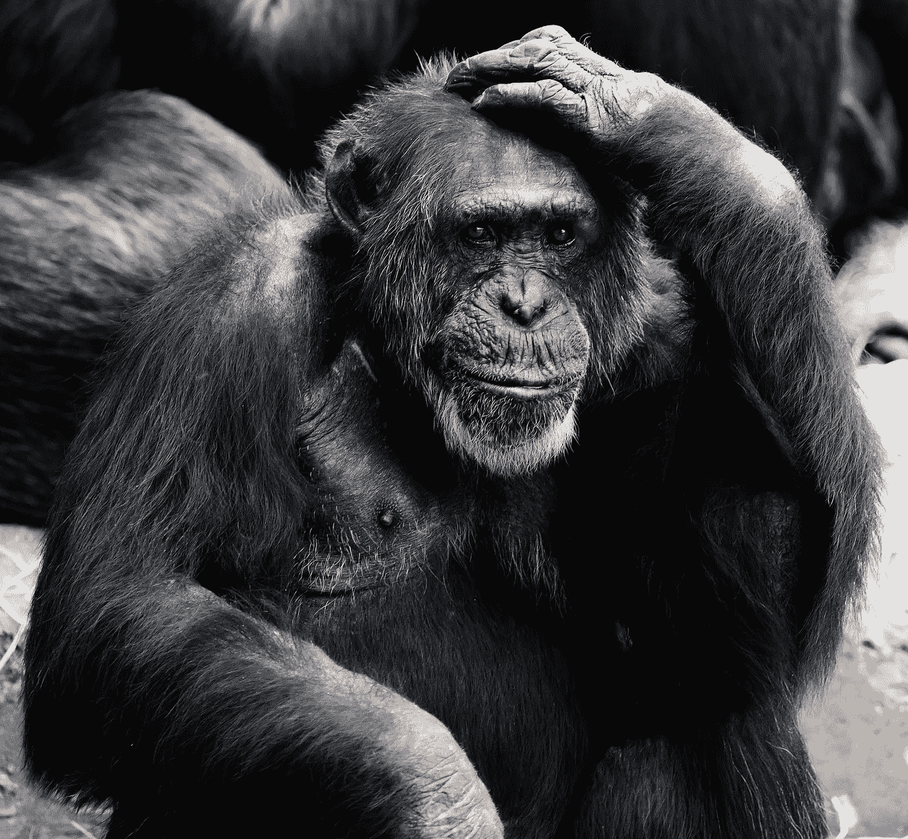

# 强人工智能的 24 种已知成分

> 原文：<https://towardsdatascience.com/periodic-table-of-ai-at-the-edge-of-chaos-6666598c7d3c?source=collection_archive---------0----------------------->

## 本文汇集了有益于人工智能开发的观点和见解。

这些理论是用来构建整个智力理论的候选理论。有 24 分。结合任何 2 或 3 点，你会得到一个 AGI 发展的新方法。祝你好运。

列表里除了我混乱的视野，没有任何系统。好消息是有一个[理论](https://ww2.kqed.org/mindshift/2014/05/06/on-the-edge-of-chaos-where-creativity-flourishes/)，一些有趣的东西只能出现在混沌的[边缘](https://en.wikipedia.org/wiki/Edge_of_chaos)。

*   **艾在近**。我的意思是，我们到处都有智能，能够进行必要数量的实验，以获得关于这一现象的所有信息。
*   **人工模拟环境**。(例如来自 OpenAI 或任何其他模拟的[宇宙。)这些世界应该使得在现实世界中引入 AI 成为可能。但是智能和所有需要进一步改进的过程的出现在那里是可能的。这里重要的部分是代理从周围的世界获取信息，这个世界必须充满不同的动态。](https://universe.openai.com/)
*   **定义**。至少是最初的近似值。M. Hutter 已经做了相关的研究。累积的定义是— *智能衡量一个代理在广泛的环境中实现目标的能力*。
*   **图灵机就是一切，一切都是 TM** 。我们的世界有史以来最大。没有一个系统在某种程度上是孤立存在的。
*   **TM 的简化与转化。我认为无论是我的知识还是总体的计算机科学都存在巨大的差距。假设我们有模拟月球绕地球飞行的程序。我们如何重写它使它变得更简单？如果我们有一个程序来模拟癫痫轨道中一个点是如何围绕另一个点运动的呢？我们如何用关于物体大小的附加信息来扩展它呢？关键是我们(人类)很容易做到。**
*   **概括能力**。接近 TM 的简化。这个世界如此复杂，如果不进行归纳，我们就无法处理所有的数据。重用它的能力很重要。
*   系统以这样的方式运行，某个量变成它的最小(小于:最大)可能值。**热力学第二定律**就是这个原理的一个基本例子。关于神经网络，反向传播代表了最小化错误率的能力。从神经网络的内部来看，反向传播看起来像基本定律。[槽 vs 进化](https://www.linkedin.com/pulse/what-drives-spontaneous-progress-kieran-d-kelly-1)。
*   [**solomonff 感应**](https://en.wikipedia.org/wiki/Solomonoff's_theory_of_inductive_inference) 。算法概率。信息距离。
*   [**AIXI 模型**](http://www.hutter1.net/ai/aixigentle.htm) 和其实现。尽管有各种限制，我认为在某种意义上这是最接近真正的 AGI 技术的想法。
*   **优化**。我们知道多少种优化？计算能力优化，即使用更有效的算法。降低内存消耗的内存优化。电源优化。更一般的优化——比如创建更好的编程语言来优化开发时间。还有很多。优化使少花钱多办事成为可能。这就是我们希望人工智能做的——用最少的干预为我们处理很多事情。
*   A [**哥德尔机**](https://wiki.lesswrong.com/wiki/G%C3%B6del_machine) 采用了 Jürgen Schmidhuber 提出的递归自我改进架构。
*   **机器理解错误**。这是机器的一种问题。
*   **自组织**。混乱的边缘。Prigogine 的耗散系统理论解释了“从某种事物中可以产生某种完全不同的事物”。思想和法律如何从无到有？
*   **创新的演变**和潜在规律。从基因编程玩具到生物进化，甚至进一步到进化的元理论。
*   使用人类最强大的工具——类比。类比思维或**同构思维**。*同构的类比可以用于科学假说的归纳。这个想法有双重好处；在研究中使用它的能力对发明来说是至关重要的。它如何工作的理论可能对重建机器的智能至关重要。*
*   **翻译**。这一点值得大量的研究，但接下来的想法是:翻译的过程在所有情况下都非常相似。要么把英文文本翻译成中文，要么把一个程序的要求翻译成源代码，要么把房子的蓝图翻译成房子。另外，翻译必须是对称的。点击此处阅读更多内容:

 [## 是什么让翻译成为智能的本质

### 你们中有多少人认识上图中的图案？是的，是斐波那契数列:

medium.com](https://medium.com/@mikecorp/what-makes-translation-the-essence-of-intelligence-4f67302bbc35) 

*   **种子 AI 概念**与**渐进学习**。从我们探索和研究的第一步开始，进化就给了我们适应周围世界的能力。
*   **迁移学习**是存储在解决一个问题时获得的知识，并将其应用于另一个相关问题。学而不忘与泛化思想密切相关。
*   能够**处理不完整信息**。好消息， [AI 已经会玩扑克了](https://www.wired.com/2017/01/mystery-ai-just-crushed-best-human-players-poker/)。
*   **递归**和自引用可能性。
*   正式系统。人们赋予系统意义的方式。数学作为一个正式的系统，在人类的意义上有很多意义。FS 应该相对于 [**哥德尔的不完全性定理**](https://en.wikipedia.org/wiki/G%C3%B6del's_incompleteness_theorems) **来考虑。**
*   **AGI 出现的风险**。风险考量是 AI 不可分割的一部分。
*   **深度学习作为****最有前途和最广泛发展的技术。关于它已经写了太多，但还不足以将一个强大的人工智能带到现实中。**
*   ****ML 算法。**他们每一个都是通用人工智能的特例。**

**那么，你觉得错过了什么？列表中是否提到了关键成分？**

**如果你觉得这篇文章有趣**按下心脏**或**分享**这篇文章**。****

**另外，目前我正在**寻找人工智能或人工智能领域的工作**。**

**你可以在这里找到我:[脸书页面](https://www.facebook.com/mike.corp.3)， [Linkedin 页面](https://www.linkedin.com/in/snowman647/)。**