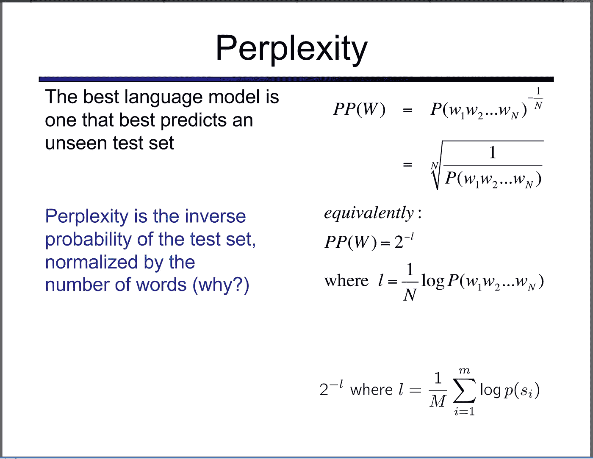
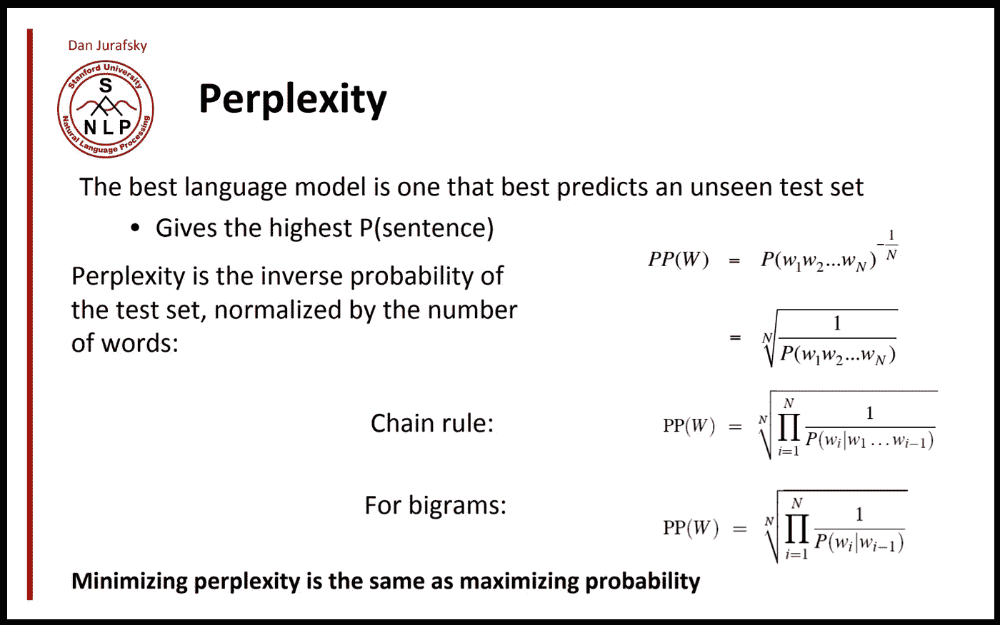
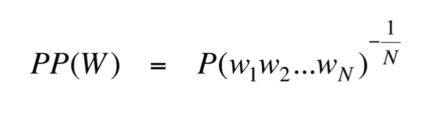
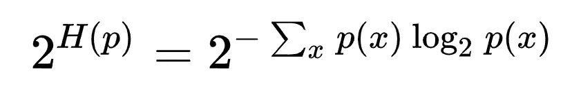
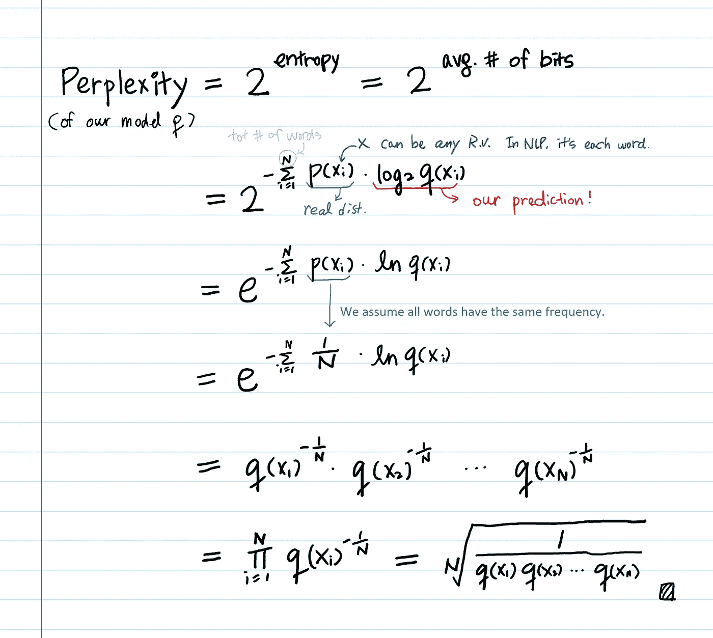

# 困惑直觉(及其衍生)

> 原文：<https://towardsdatascience.com/perplexity-intuition-and-derivation-105dd481c8f3?source=collection_archive---------1----------------------->

## 永远不要再被困惑所困扰。

您可能在 NLP 类中看到过类似这样的内容:

A slide from [Dr. Luke Zettlemoyer’s NLP class](https://courses.cs.washington.edu/courses/csep517/18au/)

或者

A slide of [CS 124](https://web.stanford.edu/class/cs124/) at Stanford (Dr. Dan Jurafsky)

在课堂上，我们真的没有花时间去推导困惑。也许困惑是一个你可能已经知道的基本概念？这篇文章是为那些不知道的人写的。

一般来说，困惑是一个概率模型如何预测样本的度量。在自然语言处理的背景下，困惑是**评估语言模型**的一种方式。

# 但是为什么 NLP 中的困惑是这样定义的呢？

如果你在维基百科上查找**离散概率分布的困惑**:

from [https://en.wikipedia.org/wiki/Perplexity](https://en.wikipedia.org/wiki/Perplexity)

其中 **H(p)是分布 p(x)** 的熵，而 *x* 是所有可能事件的随机变量。

[在之前的帖子](https://medium.com/@aerinykim/the-intuition-behind-shannons-entropy-e74820fe9800)中，我们从零开始推导了 **H(p)** 并直观地展示了**为什么熵是我们对信息进行编码所需的平均位数。**如果你不明白 **H(p)** ，请先阅读此⇩ 再进一步阅读。

 [## 香农熵背后的直觉

### 【警告:太容易了！]](https://medium.com/@aerinykim/the-intuition-behind-shannons-entropy-e74820fe9800) 

现在我们同意 H(p)=-σp(x)log p(x)。

# 那么，困惑只是**熵的一个**幂运算**！**

是的。熵是对随机变量中包含的信息进行编码的平均位数，因此熵的幂应该是**所有可能信息的总量，**或者更准确地说，是随机变量具有的选择的加权平均数**。**

例如，**如果测试集中的平均句子可以用 100 比特编码，则模型困惑度是每个句子 2 ⁰⁰。**

让我们确认维基百科中的定义与幻灯片中的定义相匹配。

在哪里

**p** :我们要建模的概率分布*。*从 **p** 中抽取一个训练样本，其分布未知。

**q** :提出的概率模型。我们的预测。

> 我们可以通过测试从 **p.** 抽取的样本来评估我们的预测 **q** ，然后**基本上就是计算交叉熵**。在上面的推导中，我们假设所有单词在 **p** 中具有相同的概率(1 /单词数)。

## 评论

*   当 **q(x) = 0** 时，困惑度将为 **∞** 。事实上，这也是 NLP 中引入[平滑概念的原因之一。](https://nlp.stanford.edu/~wcmac/papers/20050421-smoothing-tutorial.pdf)
*   如果我们对 **q** (简单来说就是所有单词的 1/N)使用统一的概率模型，那么困惑度就等于词汇量。
*   以上推导仅用于说明目的，以便得出 UW/斯坦福幻灯片中的公式。在这两张幻灯片中，它假设我们正在使用一个 unigram 模型计算整个语料库的困惑度，并且没有重复的单词。(它假设总单词数(N)与唯一单词数相同。)此外，它假设所有单词具有相同的概率 1/N。这些都不是现实的假设。

## **外卖**

*   较小的熵(或较少无序的系统)比较大的熵更有利。因为可预测的结果优于随机性。这就是为什么人们说**低困惑是好的，高困惑是坏的，因为困惑是熵**的幂(你可以放心地认为困惑的概念是熵)。
*   语言模型是句子的概率分布。最好的语言模型是能够最好地预测一个未知测试集的语言模型。
*   **为什么我们要用困惑度而不是熵？** 如果我们把困惑想象成一个**分支因子**(一个随机变量拥有的选择的加权平均数)，**那么这个数字比熵更容易理解。我觉得这很令人惊讶，因为我以为会有更深刻的原因。我问 Zettlemoyer 博士，除了容易理解之外，是否还有其他原因。他的回答是“我想就是这样！**这在很大程度上是历史性的，因为许多其他指标也可以合理使用！”****