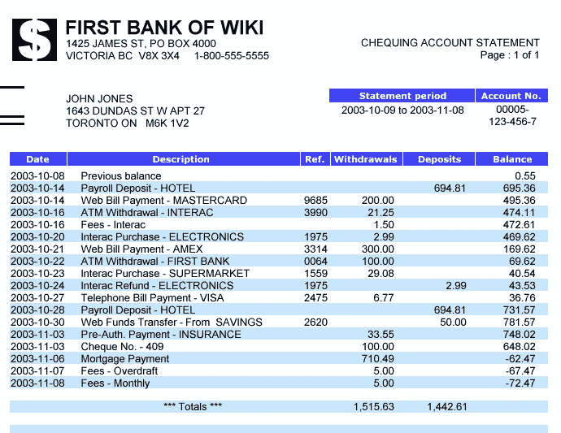
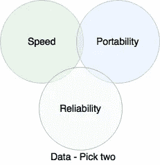

# docker 和云的持久数据

> 原文：<https://towardsdatascience.com/persistent-data-for-docker-and-the-cloud-a395dc42f2d7?source=collection_archive---------1----------------------->

当我们谈论计算时，有两种类型的数据，非持久或临时数据，以及持久数据。

## 非持久性

临时数据也具有滑动标度，

*   在线游戏中用于决策的随机数；需要，但持续时间不到一秒，
*   用于跟踪您在网站上的登录详细信息的会话 ID；通常持续整个疗程，大约 30-45 分钟，
*   在线商店购物篮的内容；亚马逊会保存几天，甚至几年。

如果丢失了其中的任何一个，也不是什么难事，新的数据可以很快被重新创建。

## 坚持的

持久数据旨在具有更长的生命周期，并且通常难以再生

*   银行交易，
*   客户关系系统(CRM)中的客户记录，
*   你的照片上传到云存储。

## 数据存储在哪里？

这对不可变的服务器模式有明显的影响，在这种模式下，服务器的生命周期很短，部署一个服务器，当不需要它或者发生一些配置或软件更新时，部署一个新的，旧的被销毁(蓝/绿部署)。当我描述这种模式时，通常会被问及的第一个问题是，数据呢？它去哪里或从哪里来？当我使用 9–5 台服务器时，这一点尤其重要。他们在工作时间之外根本不存在。这也适用于运行在 [Docker](https://www.docker.com/) 容器中的应用程序。有三个地方可以存储这些数据。

*   备份设备或存储上，如自动气象站 S3。
    这个访问速度很慢，但是非常便携和可靠。存储在这里的数据通常会被复制到可以访问的地方。当构建 web 服务器前端时，它将保存 web 应用程序的配置和静态文件。
*   在共享数据服务器上，可由“计算”服务器在运行时访问。他们通过网络访问数据。
    这个快一点，便携，可靠。这里的问题归结为哪个服务器托管数据。你可以有一个网络文件系统(NFS)服务器，但是，你可能最终会得到一个“宠物”。我在关于[宠物和牛](http://www.neilmillard.com/2016/10/06/pets-vs-cattle/)的帖子里讨论过宠物服务器。
*   在服务器本身，这是从备份位置恢复的，然后在服务器或群集上进行管理。
    有了这一选择，您可以快速、可靠地挑选，但不便于携带。有些应用程序会支持可移植性，但这主要是在应用程序设计层面。如果它不支持，我们必须使用第三方工具来完成。

为了说明我的意思，我们举三个例子。

## wordpress 软件

目前部署最多的开源网站管理系统是。
这个软件作为一个单独的安装程序运行良好，但是扩展它会是一件非常痛苦的事情。最大的问题是 wordpress 将网站的数据存储在本地服务器上。如果您有多个 web 前端，它们将很快变得不同步。你为你的博客上传了一个文件，它只存储在其中一个服务器上。
Wordpress 确实有一些插件，我们可以告诉它使用 S3 作为共享数据位置，但是配置文件仍然保存在每个服务器的本地。对于这些数据，NFS 可以作为一个在线共享数据源，但是你最终可能会得到一个宠物服务器。这可以通过使用另一个 AWS 服务器[弹性文件系统(EFS)](https://aws.amazon.com/blogs/aws/amazon-elastic-file-system-shared-file-storage-for-amazon-ec2/) 来避免。

## 数据库

数据库管理员最头疼的是输入/输出操作(IOPS)。为了从数据库获得快速响应，它读取的数据需要尽可能接近。这排除了上面详述的共享网络选项。几个数据库系统将在一个集群中工作，在节点间共享和分发数据。MySQL、MongoDB 和 [CouchDB](https://en.wikipedia.org/wiki/CouchDB) 等软件支持分布式节点之间的同步，以扩展部署，CouchDB 将此作为核心设计目标。这些系统支持添加和删除节点(支持故障和替换)，同时保持数据安全和一致。然而，你会发现一些数据滞后，最终一致性。

## 码头工人

docker 容器之间的数据同步对于这项发展中的技术来说仍然是一个很大的问题。一些解决方案正在开发中，包括 ClusterHQ with Flocker、Portworx、Hedvig 和 StorageOS。我将在整理客户的整个应用程序堆栈时检查这些内容。我已经成功地使用了 [BTSync](https://www.resilio.com/) ，它将数据保存在容器中，而不是托管卷上。这样就把数据和 Docker 主机分开了(避开另一个宠物)。

你见过哪些解决方案？有你想要我尝试的吗？请在下面的评论中告诉我。

*本文原帖* [*在我自己的网站*](http://www.neilmillard.com/2017/03/18/persistent-data-docker-and-cloud/) *。*