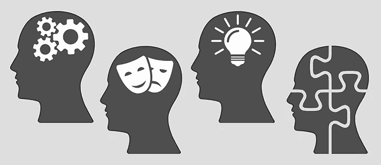

# 性格:是机器学习模型的重要变量吗？

> 原文：<https://towardsdatascience.com/personality-an-important-variable-for-machine-learning-models-e834e429c8b7?source=collection_archive---------17----------------------->

在这个机器学习的世界里，每家公司都在试图实现不同的预测模型，以了解他们的客户未来的行为。在本文中，让我们尝试关注几乎每个金融机构都面临的一个典型问题，即对违约和非违约客户进行分类，以及**是否可以通过在评估程序中添加与个性相关的问题来提高准确性**(**是否**在这里很重要)。

典型的金融机构在向客户提供贷款之前首先评估他们的客户，大多数评估问题是关于客户的主要收入和活动、他们的家庭信息、支出等。根据这些变量，这些机构建立一个模型来对他们的客户进行分类。客户分类可以通过多种方式完成，使用监督学习方法，如逻辑回归、线性判别分类、支持向量机和神经网络，或者通过 K-means 聚类，这是最常用的非监督学习技术。今天这里的主要目的不是建立一个模型，但首先重要的是要理解:为什么客户会违约？仅仅在评估过程中增加几个与性格特征相关的问题就能改变什么吗？

从机构选错客户，缺乏金融素养到不愿意还款，客户不还款，违约的原因有很多。在我看来，至少它可以提高预测能力，但最棘手的部分是应该添加什么样的问题？对于经理来说，这一部分一直是一个黑匣子，他们中的大多数人都不认为它有任何重要性。要理解这种相关性，首先应该理解理性和非理性的思维方式，一个聪明的人(理性的)永远不会把手头的现金花在不太重要的事情上，除非同一个人(完全非理性的)很容易受情绪的影响或操纵。

*是的，我们都有两面性。*

性格告诉我们一个人的思想、情感反应和行为，这些在不同的情况下显然是不同的，但可以用来预测一个人的诚实和正直，这在以后可能有助于改善。关键是要问正确的问题。