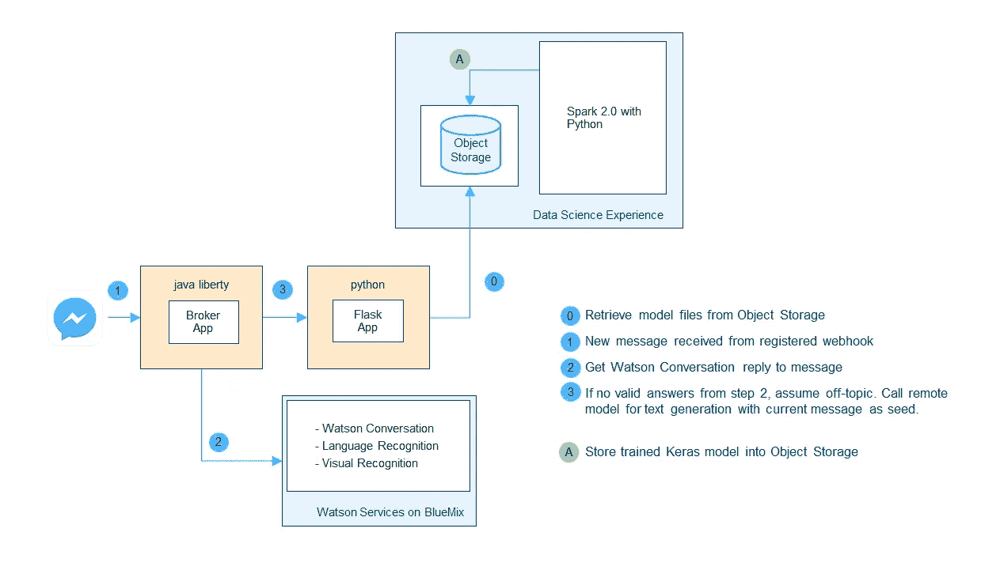
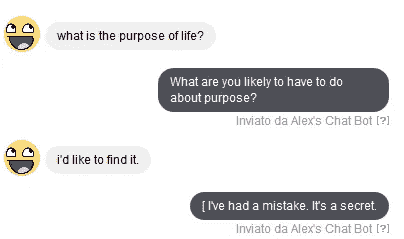

# 你的聊天机器人的个性与循环神经网络

> 原文：<https://towardsdatascience.com/personality-for-your-chatbot-with-recurrent-neural-networks-2038f7f34636?source=collection_archive---------0----------------------->

Hello, how can I help you today?

在[之前的一篇短文中，](https://medium.com/@5agado/building-a-personal-virtual-assistant-step-1-your-cv-as-a-chatbot-a4381fce6983#.qd1435nsg)我介绍了聊天机器人:它们目前的高人气，一些平台选项和基本的设计建议。

在这篇文章中，我将阐述我认为更有趣的场景:****基于深度学习的解决方案，用于构建聊天机器人的跑题行为和“个性”**。换句话说，当遇到离题的问题时，机器人会试图仅基于预先训练的 RNN 模型，从头开始自动生成可能相关的答案。**

**接下来是四个自成一体的部分，所以你应该能够跳来跳去，只关注你感兴趣的部分，没有问题。**

*   **[简短介绍聊天机器人的任务和类型。](#1b87)**
*   **[所用 RNN 模型的详细信息:](#d887)高级模型架构、关于训练数据源和预处理步骤的信息，以及到代码库的链接。我不会详细介绍 RNN，但我会包括一些我认为最相关的资源和教程。**
*   **[最终工作解决方案的架构](#c4ee):工作中的聊天机器人包含独立的异构组件。我将举例说明它们和它们的交互，同时描述所有涉及的工具和资源。**
*   **[聊天机器人展示](#5205):这是免费的技术细节，纯粹的娱乐，所以如果你对其他部分不感兴趣，或者需要检查其他部分的动力，就跳到这里。**

# **聊天机器人**

**聊天机器人(或对话代理)可以分解为两个独立但相互依赖的任务:理解和回答。**

**理解是对用户输入的语义和语用意义的解释和分配。回答是根据理解阶段获得的信息和聊天机器人的任务/目标，提供最合适的回答。**

**[这篇文章](http://www.wildml.com/2016/04/deep-learning-for-chatbots-part-1-introduction/)很好地概述了回答任务的两种不同模型，并深入探讨了深度学习在聊天机器人中的应用。**

**对于**基于检索的模型，**回答过程主要包括从一组预定义的答案中进行某种查找(具有不同的复杂程度)。当前在生产环境中使用的、向客户和顾客展示或处理的聊天机器人很可能属于此类。**

**另一方面，**基于生成的模型**被期望，嗯…生成！它们通常基于基本的概率模型或机器学习模型。他们不依赖于一套固定的答案，但他们仍然需要接受训练，以产生新的内容。马尔可夫链最初用于文本生成的任务，但最近，递归神经网络(RNN)获得了更多的流行，在许多有前途的实际例子和展示之后([卡帕西的文章](http://karpathy.github.io/2015/05/21/rnn-effectiveness/) )
聊天机器人的生成模型仍然属于研究部门，或者属于那些只是喜欢构建和演示他们自己的模型的测试应用的人的游戏领域。
我认为，对于大多数业务用例来说，它们仍然不适合生产环境。我无法想象如果提出一个生成模型选项，客户不会提出 [Tay](http://www.theverge.com/2016/3/24/11297050/tay-microsoft-chatbot-racist) 。**

# **RNN 模型**

**递归神经网络是专门用于处理序列的深度学习模型。这里，内部状态负责考虑并正确处理连续输入之间存在的依赖性(RNN[速成班](http://machinelearningmastery.com/crash-course-recurrent-neural-networks-deep-learning/))。
除了相对优雅的模型之外，仅仅从展示其生成能力的许多在线演示和示例中，就不可能不被它捕获和迷住。从[手写](http://distill.pub/2016/handwriting/)到[电影剧本生成](https://arstechnica.co.uk/the-multiverse/2016/06/sunspring-movie-watch-written-by-ai-details-interview/)。**

**鉴于其特性，该模型确实非常适合各种 NLP 任务，并且正好在文本生成上下文中，我开始探索它，使用 [Theano](http://deeplearning.net/software/theano/) 和 [Tensorflow](https://www.tensorflow.org/) 玩基本概念，然后转移到 [Keras](https://keras.io/) 进行最终的模型训练。Keras 是一个高级神经网络库，可以运行在 Theano 或 Tensorflow 之上，但如果你愿意学习和玩 RNN 和机器学习模型的更基本的机制，我建议尝试一下提到的其他库，特别是如果再次遵循 Denny Britz 的[伟大教程](http://www.wildml.com/2015/09/recurrent-neural-networks-tutorial-part-1-introduction-to-rnns/)。**

**在我的任务中，我训练了一个单词级的序列对序列模型:我向网络输入一个单词列表，并期望得到相同的输出。我没有使用普通的 RNN，而是使用了长期/短期记忆(LSTM)层，这保证了对网络记忆机制的更好控制([理解 LSTM](http://colah.github.io/posts/2015-08-Understanding-LSTMs/) )。最终的架构只包括两个 LSTM 层，每一层后面都有一个 dropout。
至于现在我还是依靠每个单词的一键编码，往往限制了词汇量的大小(< 10000)。强烈建议下一步是探索使用单词嵌入的选项。**

**我在不同的语料库上训练模型:个人对话、书籍、歌曲、随机数据集和电影字幕。最初的主要目标是纯文本生成:从零开始，生成任意长的单词序列，就像 Karpathy 的文章一样。通过我的适度设置，我仍然获得了相当好的结果，但是您可以看到这种方法在聊天机器人文本生成的相同假设下是如何不起作用的，聊天机器人最终是一个问答场景。**

## **聊天机器人训练**

**问答是 NLP 研究的另一个大问题，它有自己的复杂和组件异构管道生态系统。即使只关注深度学习，也存在不同复杂程度的不同解决方案。我在这里想做的是首先用我的基线方法进行实验，看看离题问题处理的结果。**

**我使用了[康奈尔电影对话语料库](http://www.cs.cornell.edu/~cristian/Cornell_Movie-Dialogs_Corpus.html)，并基于类似问答情景的两个连续互动的串联建立了一个训练数据集。每个这样的问答对最终构成了最终训练集的一个句子。在训练期间，模型获得从最后一个元素截断的句子作为输入，而期望的输出是从第一个单词截断的相同的输出。**

**在这样的前提下，模型并不是真的学习什么是答案，什么是问题，而是应该建立一个能够连贯地生成文本的内部表示。这或者通过从随机元素开始从头生成句子，或者简单地通过一次一个单词地继续完成种子句子(潜在问题)，直到满足预定义的标准(例如，产生标点符号)。所有新生成的文本都会被保留并作为候选答案提供。**

**你可以在[我的 Github 库](https://github.com/5agado/recurrent-neural-networks-intro)中找到更多的细节和 WIP 实现。我们非常欢迎所有的批评和评论。**

# **体系结构**

**与聊天机器人交互就像在脸书·梅桑格上发送消息一样简单，但完整的解决方案涉及不同的异构组件。这是当前架构的最小视图**

****

**Chatbot Solution Architecture**

**数据处理和 RNN 模型训练已经在 IBM 数据科学平台的 Spark 实例上运行。我通过 Jupyter 笔记本直接与它交互，简直太棒了！使用 Keras callbacks 系统，我在训练期间自动跟踪模特的表现，并在适当的时候备份重量。在每次训练结束时，最佳快照(模型权重)以及 Keras 模型架构和与训练语料库相关的附加数据(例如词汇索引)被持久地移动到与 Spark 实例连接的对象存储中。**

**第二部分是模型即服务组件；一个基本的 Flask RESTful API，通过 REST 调用公开文本生成的训练模型。每个模型是一个不同的端点，接受不同的参数用于生成任务。参数的示例有**

*   ****种子**:用于生成任务的种子文本**
*   ****温度**:一个方差指数，或者在预测过程中你想给模型多少“自由”**
*   ****句子最小长度**:生成的句子可接受的最小长度**

**在内部，该应用程序负责从远程对象存储中检索模型并将其加载到内存中，以便当调用相应的端点时，它们准备好生成文本。**

**最后一个组件是一个 Java Liberty web 应用程序，它充当脸书 Messanger 平台的代理。它负责处理脸书网页挂钩和订阅，存储用户聊天记录，并实现应答任务逻辑。一方面，它依赖于我在上一篇文章中描述的系统，使用 IBM Watson 服务，如语言识别和对话，另一方面，当满足特定要求或没有提供有效答案时，它可以依赖于文本生成位，并在最方便的端点调用 Flask API。**

**Java 和 Python 应用程序都托管在 Bluemix 上，关于前者，我目前正在覆盖其他消息平台，如 Slack、Whatsapp 和 Telegram。**

# **给我看看机器人！**

**你可以简单地通过脸书·梅桑格与聊天机器人互动，但要让你的机器人公开(任何进入其页面的人都可以使用)需要一些工作、演示视频和脸书连续的官方批准。至于现在，我必须手动添加人作为我的应用程序的测试人员，以允许他们使用它，所以如果你有兴趣，就给我留言。**

**尽管如此，我不得不承认，已经看到少数当前测试者的互动是一个相当有趣的经历，一个很好的娱乐、羞耻、恐惧、骄傲的情绪过山车…**

**让我们从一些混合的结果开始(右边是机器人的回复，左边是一些朋友的输入，很好地匿名化了)。**

****

**请注意，这里有混合行为:“嫁给我”响应是基于自然语言分类的，而其余的都是生成的。已经有语法错误的句子了，但与此同时，第二个答案给我留下了很好的印象，我被愚弄了，从中读出了一种有意识的无所不能的感觉。**

**有时回复看起来完全是随机的，但仍然建立了一个很好的互动，一个害羞、困惑和羞愧人格的模拟，也许还有点浪漫。**

****

**给定训练数据，它还学习了正确的标点符号，因此如果之前的输入不以标点符号结尾，它可能会以一个以标点符号开头的句子来回复。
它也能想出一些看似深奥的东西，但最终惨败，尤其是考虑到短暂的新的高预期。**

****

**请注意，答案之间绝不存在上下文保留，它只是没有建立在模型或系统中，只是产生这种错觉的交互流，有时会巧合地给人留下非常好的印象:**

****

**我知道这一切都没有突破，结果可能会让我“失望”，但毕竟，很多人对他们的“婴儿的第一句话”感到疯狂兴奋，据我所知，这远远低于我在这里设定的标准…**

**在观察它说话的同时，我对其背后的机制有了相当好的理解，这让一切变得更加迷人。它所能表达的一切令人感到不合理的惊讶，没有关于它被告知什么和它回复什么的实际语义知识，只有统计信号和模式……我想知道，毕竟，有多少人可能实际上以几乎相同的方式工作，只是他们的大脑中有一个更强大的借来的计算实例，他们的肩膀上有一个更长更丰富的跑步训练。**

****