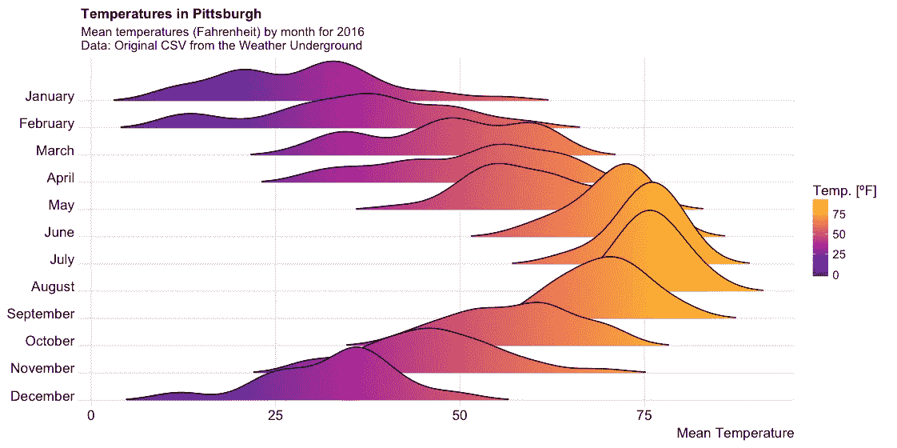
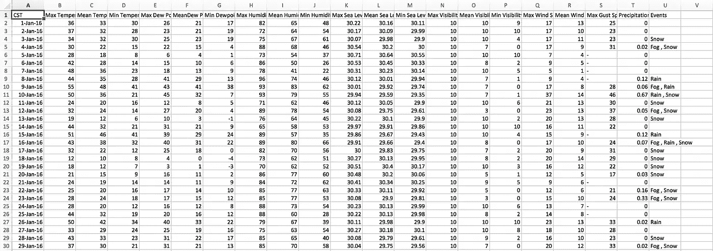
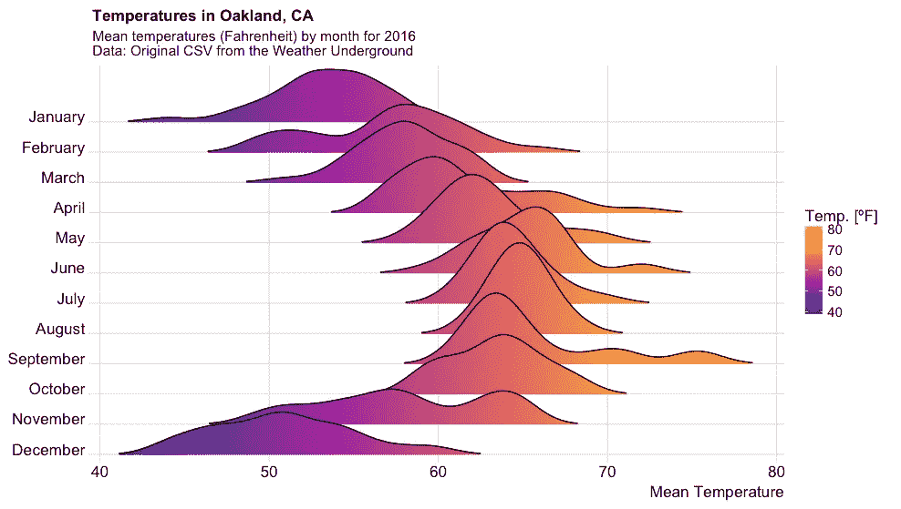

# 天气数据、绘图和代码

> 原文：<https://towardsdatascience.com/pgh-weather-data-plot-and-code-19d8e8b670f?source=collection_archive---------3----------------------->

改编自 Austin Wehrwein 的博客文章和 Claus O. Wilke 的 [Cran page](https://cran.r-project.org/web/packages/ggridges/vignettes/gallery.html) 。地下气象站的数据。



生成如上图的 R 代码可以在 Austin Wehrwein 的[博客](http://austinwehrwein.com/data-visualization/it-brings-me-ggjoy/)和这个 [Cran page](https://cran.r-project.org/web/packages/ggridges/vignettes/gallery.html) 上找到，但是我也把它包含在下面，做了一些小的修改和如何从 Weather Underground 检索你自己的数据的细节。

## 数据:

在这个 [Weather Underground](https://www.wunderground.com/history/airport/KAGC/2017/1/1/CustomHistory.html?dayend=17&monthend=9&yearend=2017&req_city=&req_state=&req_statename=&reqdb.zip=&reqdb.magic=&reqdb.wmo=&MR=1) 页面上选择地区和自定义时间段。将表格数据复制/粘贴到 Excel 中(可能需要删除额外的列标题)。按照格式“%d-%b-%y”或“2016 年 1 月 1 日”重新标记日期。重新标记列标题。另存为 CSV。

注:你可以尝试用[这个教程](https://topbullets.com/2017/04/12/how-to-download-data-from-weather-underground-topbullets-com/)直接从 R 抓取，但是吴最近改了他们的 URL 方案，所以这个技术可能不行。



Your data should look something like this. Mean Temp (Col C) is what I plotted, but pretty much any numeric variable can be used.

## 图书馆:

```
library(viridis)     ## color palette
library(ggjoy)       ## ridges
library(hrbrthemes)  ## plot theme
```

## 导入和次要数据清理:

```
pgh_weather <- read.csv("weather_data.csv") ## setwd() to your own
months <- c("December","November","October","September","August","July","June","May","April","March","February","January") ## need this string vector for sorting laterpgh_weather$months <- as.Date(pgh_weather$CST, format = "%d-%b-%y") %>%
  months() %>%
  as.factor() %>%
  factor(., levels = months)#scales
mins <- min(pgh_weather$Min.TemperatureF)
maxs <- max(pgh_weather$Max.TemperatureF)
```

## 情节:

```
## black and white
ggplot(pgh_weather,aes(x = Mean.TemperatureF,y=months,height=..density..))+
  geom_joy(scale=3) +
  scale_x_continuous(limits = c(mins,maxs))+
  theme_ipsum(grid=F)+
  theme(axis.title.y=element_blank(),
        axis.ticks.y=element_blank(),
        strip.text.y = element_text(angle = 180, hjust = 1))+
  labs(title='Temperatures in Pittsburgh',
       subtitle='Median temperatures (Fahrenheit) by month for 2016\nData: Original CSV from the Weather Underground', x = "Mean Tempterature [ºF]")## in color
ggplot(pgh_weather, aes(x = `Mean.TemperatureF`, y = `months`, fill = ..x..)) +
  geom_density_ridges_gradient(scale = 3, rel_min_height = 0.01, gradient_lwd = 1.) +
  scale_x_continuous(expand = c(0.01, 0)) +
  scale_y_discrete(expand = c(0.01, 0)) +
  scale_fill_viridis(name = "Temp. [ºF]", option = "C") +
  labs(title = 'Temperatures in Pittsburgh',
       subtitle = 'Mean temperatures (Fahrenheit) by month for 2016\nData: Original CSV from the Weather Underground', 
       x = "Mean Temperature") +
  theme_ridges(font_size = 13, grid = TRUE) + theme(axis.title.y = element_blank())
```

## 后续步骤:

下载年度数据，用 GIF 或褪色的脊线追踪上升的温度。

