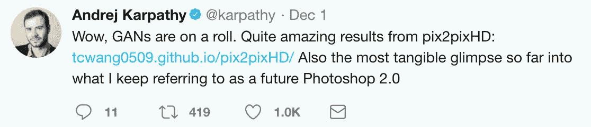
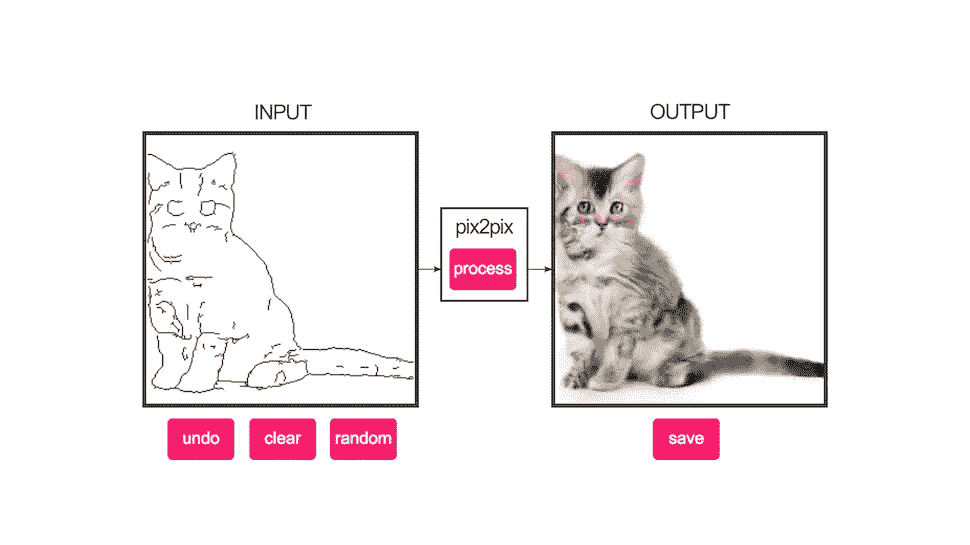
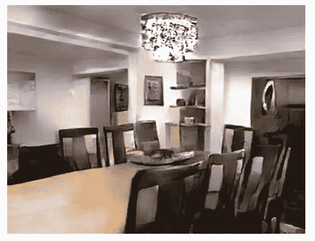
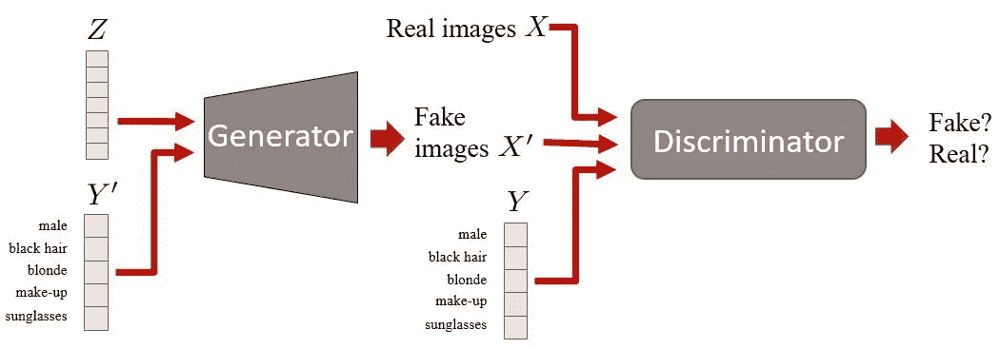
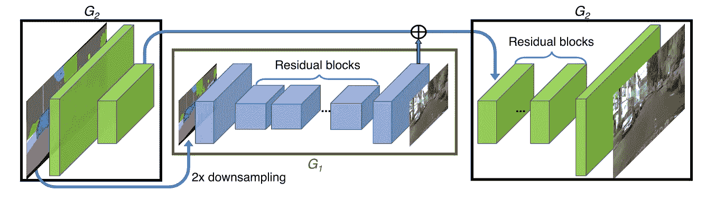
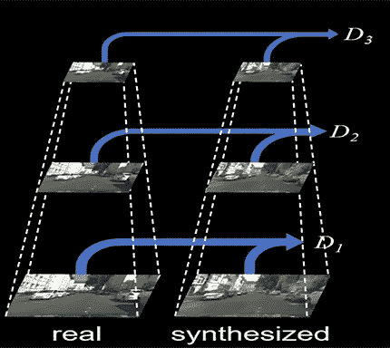
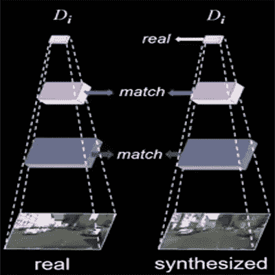
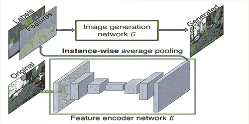
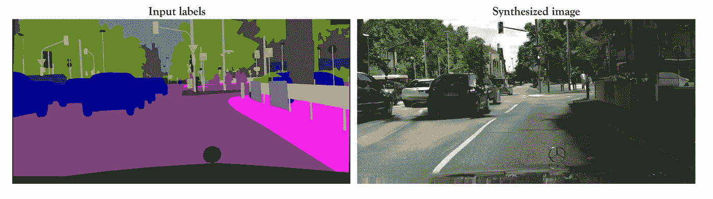

# Photoshop 2.0

> 原文：<https://towardsdatascience.com/photoshop-2-0-a49990e483?source=collection_archive---------5----------------------->

## 如果说软件 2.0 是深度学习，Photoshop 2.0 就是 GAN

# Photoshop 1.0 是什么？

我们可以使用 **Photoshop** 来“改变”图像，比如照片、下载的图标或扫描的艺术品。改变图像包括做一些事情，比如**改变图像内的颜色**，**修改图像的尺寸**和**比例**，或者将一张图片“放入”另一张图片。

需要多少时间？那**完美呢？**你还是设法做到了。那很好。

# 甘家擅长什么？甘是如何有所作为的？

**生成性对抗网络**擅长将图像从一个领域翻译到另一个领域。

比如:从用户草图生成猫。

我们所有人都不擅长编辑照片。但有时我们必须自己去做。假设你想改变头发的颜色或者尝试不同的发型，该怎么做呢？如果你不熟悉这些工具，就很难把图像转换成你想要的样子。

GANs 可以将你的草图转换成逼真的图像。

Semantic label Map

Real Image

**生成器**可以将**语义标签图**翻译成**逼真的图像**，而鉴别器 D 旨在将真实图像与翻译后的图像区分开来。

# pix2pix 架构

pix2pix 方法是一个**条件 GAN 框架**，用于在给定输入语义标签图的情况下对真实图像的条件分布进行建模。

Conditional GANs

**条件 GAN**是 GAN 框架的扩展。这里我们有条件信息 Y，它描述了数据的某些方面。例如，如果我们在处理人脸，Y 可以描述头发颜色或性别等属性。

当生成高分辨率图像时，结果不令人满意。所以为了提高**的真实感**和**的分辨率**，开发了一种新的架构。

开发了一个**粗到精生成器**、一个**多尺度鉴别器**架构和一个鲁棒的**对抗学习目标函数**。

# **粗到精发生器**

Network architecture of the generator.

生成器由**全局生成器网络(G1)** 和**局部增强器网络(G2)组成。**

**全局生成器(G1)** 从语义图中提取降采样输入，并生成低分辨率输出。**局部增强器(G2)** 组合来自生成器和原始标签图的特征图，以产生最终输出。

为了以更高的分辨率合成图像，可以使用**附加的局部增强器网络**。

**生成器** G={G1，G2}，**输出图像分辨率** =2048×1024

**生成器** G={G1，G2，G3}，**输出图像分辨率** =4096×2048

在训练过程中，我们首先训练全局生成器，然后按照分辨率的顺序训练局部增强器。然后我们一起微调所有的网络。

# **多刻度鉴别器**

多尺度鉴别器由 **3 个鉴别器(D1，D2，D3)** 组成，它们具有相同的网络结构，但在不同的图像尺度下工作。

他们接受过训练，能够以 **3 种不同的比例区分真实图像和合成图像。**

在最粗尺度下工作的鉴别器具有最大的感受野。另一方面，以最精细的尺度操作的那个引导生成器产生更精细的细节。

# **对抗性学习目标函数**

基于鉴别器的特征匹配损失是不可行的。从鉴别器的多个层提取特征，并学习匹配来自真实和合成图像的这些中间表示。

# 学习实例级特征嵌入

添加**低维特征通道**作为生成器的输入，可以产生**多样的**图像，并允许**实例级控制**。

训练一个**编码器网络**来为地面真实图像中的每个对象实例找到低维特征向量。然后，我们将这些特征与标签图连接起来，生成最终的图像。我们可以通过操作不同的特征来产生不同的输出。

# **结果**

Semantic labels → Cityscapes street views

## 参考

[https://tcwang0509.github.io/pix2pixHD/](https://tcwang0509.github.io/pix2pixHD/)