# 使用 Jupyter 笔记本进行物理计算

> 原文：<https://towardsdatascience.com/physical-computing-using-jupyter-notebook-fb9e83e16760?source=collection_archive---------5----------------------->

了解如何在树莓 Pi 上安装 Jupyter Notebook，并直接在上面读取传感器并对执行器进行操作。

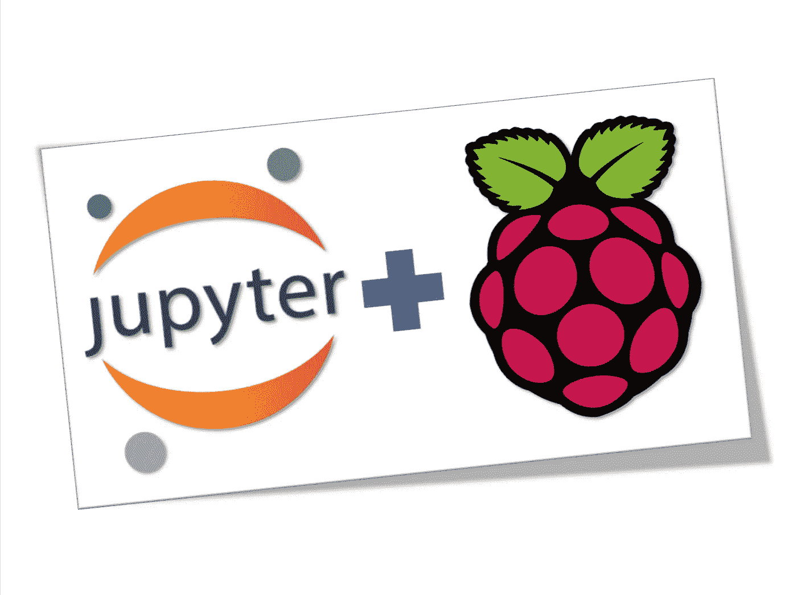

我们都知道 Jupyter Notebook 是一个非常棒的工具，或者更好，是一个开源的 web 应用程序，它允许您创建和共享包含实时代码、等式、可视化和叙述性文本的文档。

Jupyter 笔记本很大程度上用于数据科学，清理和转换数据，做数值模拟，统计建模，数据可视化，机器学习，等等！

> 但是，用 Jupyter 笔记本控制树莓 Pi GPIOs 怎么样？

这就是我们在本教程中要做的。我们将学习如何在树莓 Pi 上安装 Jupyter Notebook，并直接在其上读取传感器并对执行器进行操作。

# 1.介绍

这张图表给我们提供了该项目的概况:

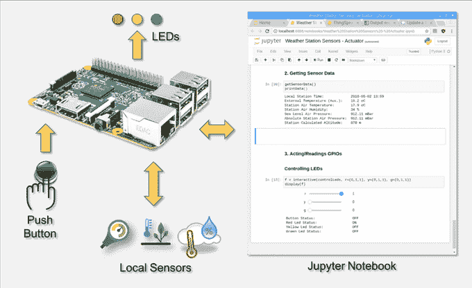

这部电影可以给你一个提示，当 Pi 遇到 Jupyter 时可能会得到什么！

# 2.硬件

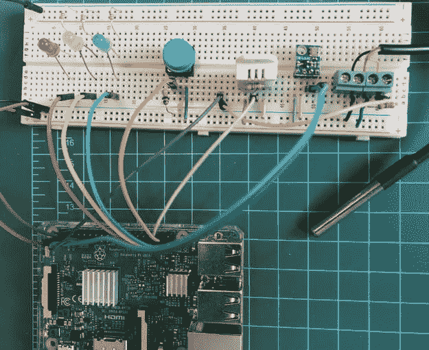

## 材料清单

*   树莓 Pi V3
*   DHT22 温度和相对湿度传感器
*   DS18B20 防水温度传感器
*   BMP180 气压、温度和海拔传感器
*   LEDS (3x)
*   按钮(1x)
*   电阻器 4K7 欧姆(2x)
*   电阻器 1K 欧姆(1x)
*   电阻器 330 欧姆(3x)
*   原型板和电缆

## 电气图

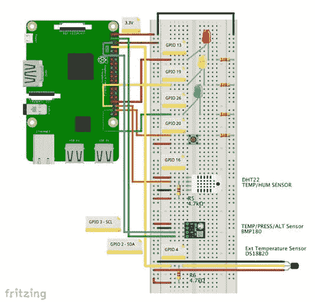

让我们按照上面的电路图，将所有 3 个传感器、按钮和 led 连接到 Raspberry Pi。

本项目中使用的传感器与我的教程中使用的传感器相同:

[带 RPi 和 ESP8266 的物联网气象站](https://www.hackster.io/mjrobot/iot-weather-station-with-rpi-and-esp8266-f382d7)

我建议您看一下那个教程，在那里我一个一个地解释了如何安装传感器和它们的库，在运行完整的程序之前单独测试它们。

# 3.安装 Jupyter

要在您的 Raspberry 上安装 Jupyter(将与 Python 3 一起运行)，请打开终端并输入以下命令:

```
sudo pip3 install jupytersudo ipython3 kernelspec install-self
```

现在，在您的终端上，运行命令:

```
jupyter notebook
```

就是这样！！！！太神奇了！非常简单容易。Jupyter 笔记本将作为服务器运行在:

```
http:localhost:8888
```

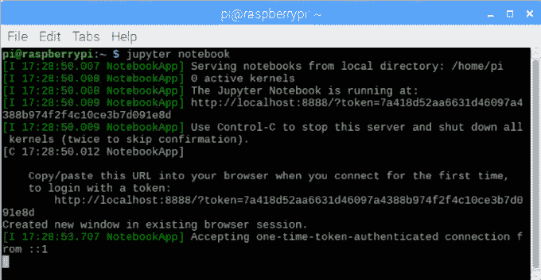

但是，这对你来说并不重要，因为，你的默认浏览器会自动在那个地址打开，运行一个“主页”。

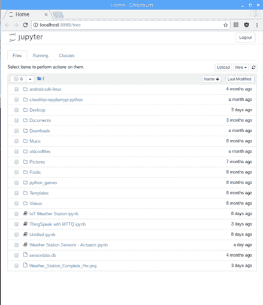

要停止服务器并关闭“内核”(Jupyter 笔记本)，您必须使用键盘上的[Ctrl] + [C]。

从现在开始，任何时候你启动你的 Pi 并想使用 Jupyter 笔记本，只需在你的终端上键入命令“Jupyter 笔记本”并让**让它一直运行。**这很重要！如果您需要使用终端执行其他任务，例如运行程序，请打开一个新的终端窗口。

# 4.在 Jupyter 笔记本上运行 Python 脚本

我们假设你熟悉 Jupyter 笔记本。它将在您的 Pi 上工作，就像在您的桌面上工作一样。

> 网上有“大量”好的 Jupyter 笔记本教程，只要浏览一下，你肯定会找到一个更适合你的。

让我们玩一个我已经为本教程创建的笔记本。

从我的 GitHub 下载:[气象站传感器—执行器](https://github.com/Mjrovai/Python4DS/blob/master/RaspberryPi/Weather%20Station%20Sensors%20-%20Actuator.ipynb)

将笔记本保存在您的树莓 Pi 上。在我的情况下，我把它保存在我的主目录中(见上面的主页打印屏幕)。观察我主目录中现有的 4 个笔记本(笔记本有一个“小笔记本”图标)。只要点击它。笔记本将被加载，显示如上图所示。如果你再次看到主页，你会意识到“笔记本图标”现在是“绿色”，这意味着它正在运行。

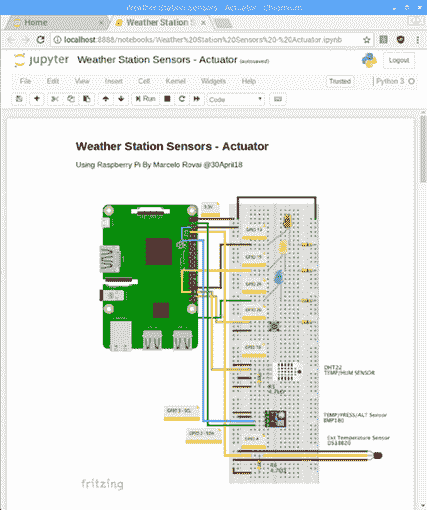

此外，请注意，在我的笔记本电脑的第一个单元有一张硬件的图片。为了让图片正确显示，你必须将它放在同一个目录中(这是我的情况)，或者如果你使用另一个目录来存储图片，则改变它在笔记本上的路径。

> 您可以在笔记本电脑上直接输入 Unix 命令，就像在终端上一样

例如，该命令:

```
ls
```

将列出笔记本运行的当前目录中的所有文件，如下所示:

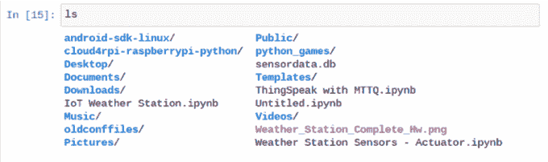

# 5.初始化(1):在 Jupyter 笔记本上创建 Python 脚本并导入库

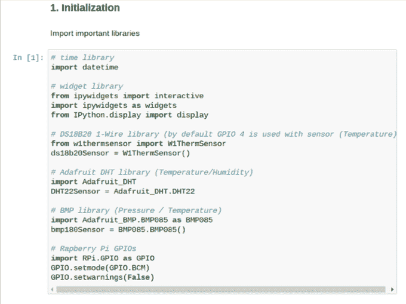

因此，我们的想法是以您习惯使用 Python IDE 的相同方式(和顺序)开始编写脚本。

我将把我的笔记本分成 3 个阶段，我们将这样做:

1.  初始化

*   导入库
*   定义 GPIOs
*   初始化 GPIOs
*   创建重要功能

2.读数传感器

3.读取和操作 GPIOs(按钮和 led)

请注意，通常情况下，您只需运行一次初始化阶段。之后，您可以使用您的传感器和 GPIOs，只运行为阶段 2 和 3 创建的相关单元，如本例所示。

> 为了更好地理解第一阶段，您可以跟随介绍电影。

# 6.初始化(2):定义和初始化 GPIOs

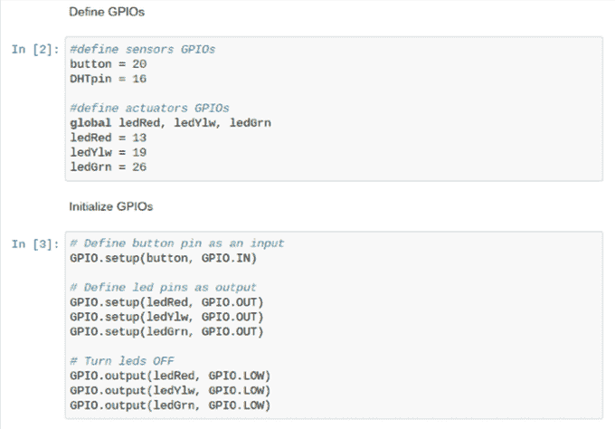

# 7.初始化(3):显示数据的函数

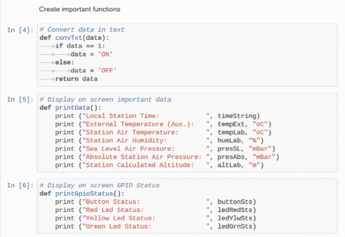

# 8.初始化(4):处理传感器的功能

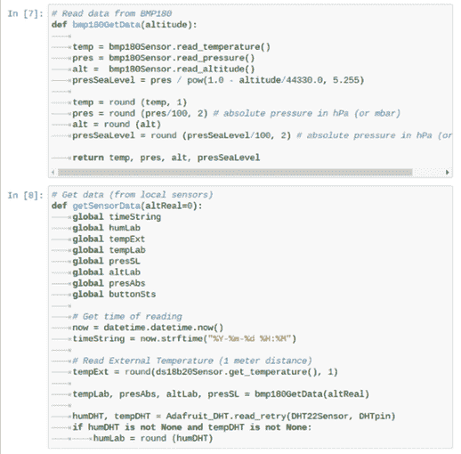

# 9.初始化(5):用于处理 GPIOs 的函数

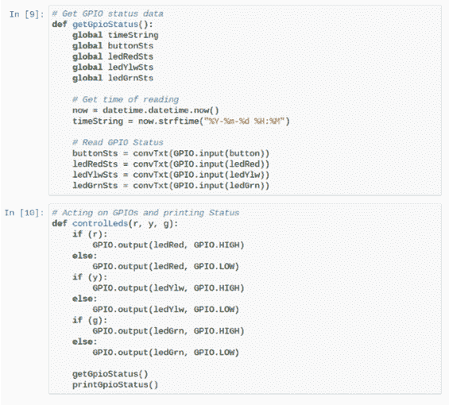

# 10.获取传感器数据并使用 GPIOs 进行处理

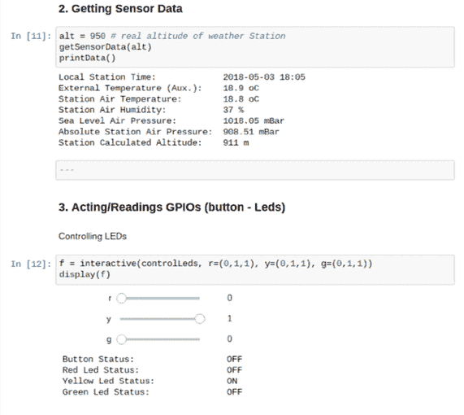

运行单元[11]您将获得所有传感器数据:

**Widgets**

在这里，重要的是要引起对“小部件”的注意。

小部件是多事件的 python 对象，在浏览器中有一个表示，通常是像滑块、文本框等控件。您可以使用小部件为您的笔记本构建交互式 GUI。您还可以使用小部件在 Python 和 JavaScript 之间同步有状态和无状态信息。

在本例中，我们使用小工具(“滑块”)来控制单元[12]，实时控制致动器的状态，在本例中，打开或关闭 led。小工具可以为 Jupyter 笔记本电脑添加更多动态行为。

正如你所看到的，在代码中，我们必须在任何时候运行单元[11]来更新传感器的值，但是当然，这里也可以实现一个小部件来自动完成，或者通过按下一个按钮来完成。我会把它作为对你的挑战！；-)

**安装**

为了使用小部件，您必须安装 Ipywidgets 库。对于以下命令使用:

```
sudo pip3 install ipywidgets
jupyter nbextension enable --py widgetsnbextension
```

安装后，只调用 Jupyter 笔记本上的库。

请注意，我们已经在初始化阶段完成了这项工作:

```
# widget library
from ipywidgets import interactive
import ipywidgets as widgets
from IPython.display import display
```

这个小部件“交互式”易于实现，而且功能非常强大。点击此链接可以了解更多关于互动的内容:[互动小工具](http://ipywidgets.readthedocs.io/en/latest/examples/Using%20Interact.html)。

# 11.数据科学、机器学习、物理计算、计算机视觉、物联网和……未来！

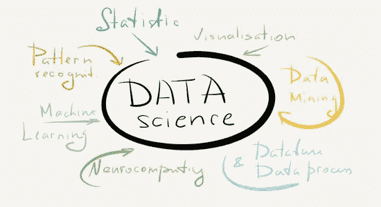

我正在这个迷人的技术世界开始新的旅程。我们今天看到的一切都与数据相关，更好地了解这些数据是帮助人们的相关项目的关键。你会在这里和我的博客 MJRoBot.org[上看到越来越多的教程，其中数据科学与物理计算、计算机视觉、机器学习和物联网相结合。](https://mjrobot.org)

作为一个例子，我使用了以前的物联网项目的数据，ArduFarmBot:

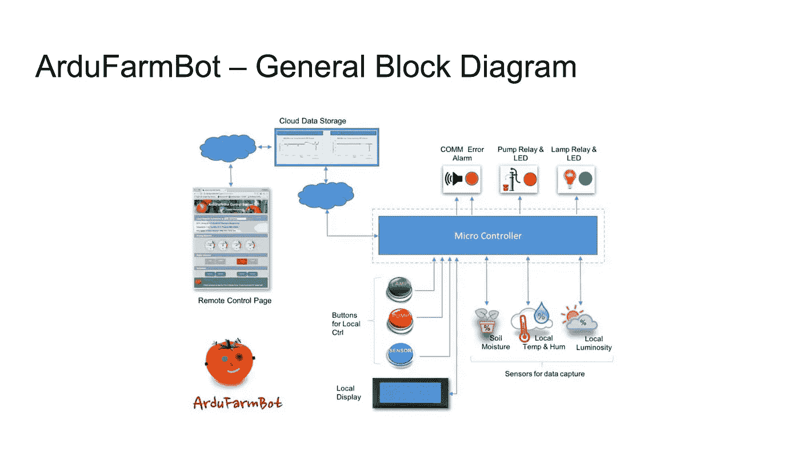

使用在物联网平台上记录的数据，ThingSpeak 和 appliyng 机器学习这些数据，可以预测(事实上确认)灯和泵应该何时打开。

结果很惊人！！！！！！

可以在我的 GitHub 上看到 Jupyter 笔记本和最终报告:[ArduFarmBot _ Data _ Analysis](https://github.com/Mjrovai/Python4DS/tree/master/ArduFarmBot_Data_Analysis)

就这些了，伙计们！；-)

# 12.结论


一如既往，我希望这个项目可以帮助其他人找到进入令人兴奋的电子世界的方法！

详情和最终代码请访问我的 GitHub 仓库: [Pyhon4DS/RaspberryPi](https://github.com/Mjrovai/Python4DS/tree/master/RaspberryPi)

更多项目，请访问我的博客:[MJRoBot.org](https://mjrobot.org)

敬请期待！下一个教程我们将基于 Raspberry Pi Flask Web 服务器将数据从远程气象站发送到中心气象站:

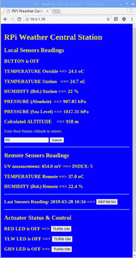

来自世界南部的 Saludos！

下节课再见！

谢谢你，

马塞洛