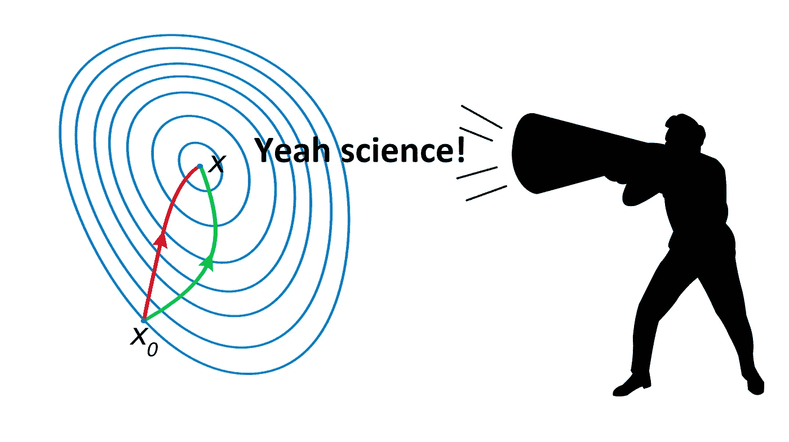
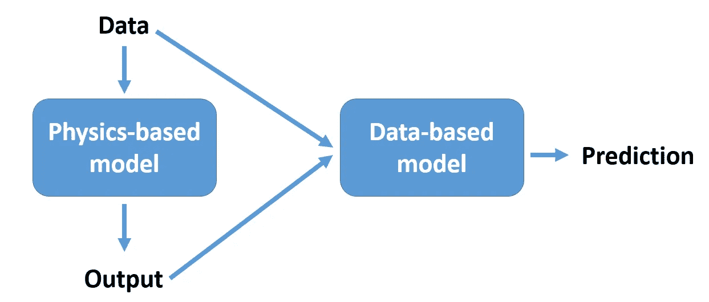
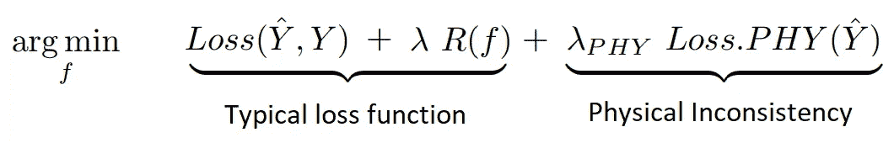
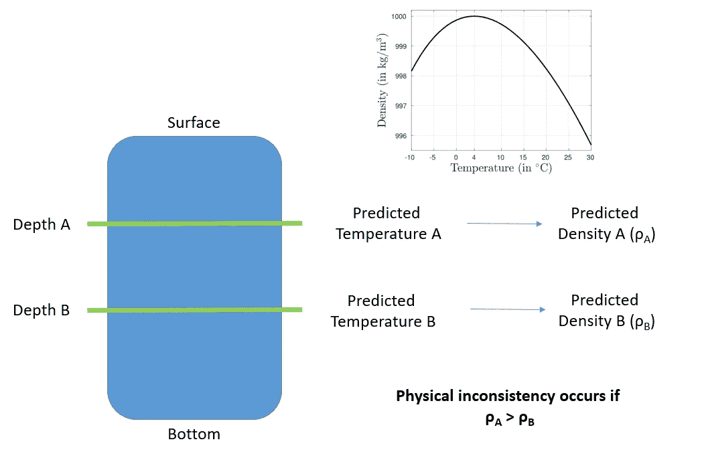
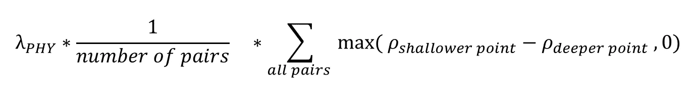
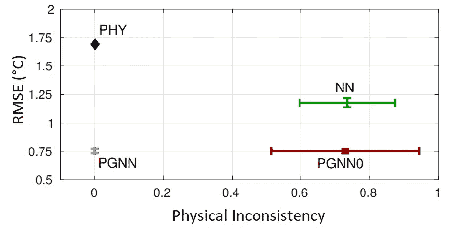
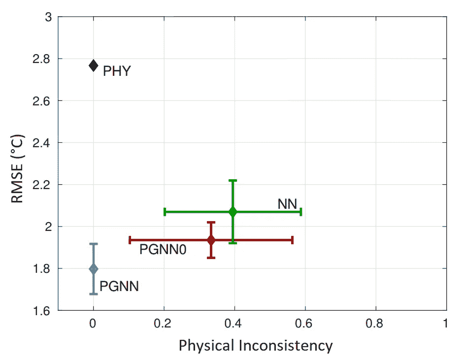

# 物理引导的神经网络

> 原文：<https://towardsdatascience.com/physics-guided-neural-networks-pgnns-8fe9dbad9414?source=collection_archive---------5----------------------->

Talking some sense into gradient descent.

## 基于物理的模型是当今科技的核心。近年来，数据驱动模型开始提供一种替代方法，并在许多任务中胜过物理驱动模型。即便如此，他们也渴望数据，他们的推论可能很难解释，归纳仍然是一个挑战。结合数据和物理可以揭示两个世界的精华。

当机器学习算法在*学习*时，它们实际上是在你选择的算法、架构和配置所定义的假设空间中搜索解决方案。即使对于相当简单的算法，假设空间也可能相当大。数据是我们在这个巨大的空间中寻找解决方案的唯一指南。如果我们可以利用我们对世界的了解——例如，物理学——以及数据来指导这种搜索，会怎么样呢？

这就是 Karpatne 等人在他们的论文[中解释的物理引导神经网络(PGNN):在湖泊温度建模](https://arxiv.org/abs/1710.11431) *中的应用。*在这篇文章中，我将解释为什么这个想法至关重要，我还将通过总结这篇文章来描述他们是如何做到的。

想象一下你把你的外星人👽朋友(优化算法)到一家超市(假设空间)去买你喜欢的奶酪(解)。她唯一的线索就是你给她的奶酪的照片(数据)。由于她缺乏我们对超市的先入之见，她将很难找到奶酪。她可能会在到达食品区之前逛逛化妆品和清洁用品。

Finally reached the food section (courtesy of [**Dominic L. Garcia**](https://www.instagram.com/dom_l_garcia_/)).

这类似于梯度下降等机器学习优化算法寻找假设的方式。数据是唯一的指南。理想情况下，这应该工作得很好，但大多数时候数据是嘈杂的或不够的。将我们的知识整合到优化算法中——在食品区搜索奶酪，甚至不要看化妆品——可以缓解这些挑战。接下来让我们看看，我们实际上是如何做到这一点的。

## 如何用物理学指导一个 ML 算法

现在，让我总结一下作者如何利用物理学来指导机器学习模型。他们为此提出了两种方法:(1)使用物理理论，他们计算额外的特征(特征工程)以与测量值一起输入到模型中，以及(2)他们将物理不一致项添加到损失函数中，以便惩罚物理不一致的预测。

(1) Feature engineering using a physics-based model

(2) Data + Physics driven loss function

第一种方法是特征工程，广泛用于机器学习。然而，第二种方法令人信服。非常类似于添加一个正则项来惩罚过度拟合，他们在损失函数中添加了一个物理不一致性项。因此，有了这个新术语，优化算法还应该注意最小化物理上不一致的结果。

在论文中，Karpatne 等人将这两种方法与神经网络相结合，并展示了一种他们称为物理导向神经网络(PGNN)的算法。PGNNs 可以提供两个主要优势:

*   [**实现泛化**](https://developers.google.com/machine-learning/crash-course/generalization/video-lecture) 是机器学习中的一个根本性挑战。由于物理模型大多不依赖于数据，它们可能在看不见的数据上表现良好，即使来自不同的分布。
*   机器学习模型有时被称为黑盒模型，因为并不总是清楚模型如何达成特定决策。有相当多的工作进入 [**可解释的 AI (XAI)**](https://en.wikipedia.org/wiki/Explainable_Artificial_Intelligence) 来提高模型的可解释性。PGNNs 可以为 XAI 提供一个基础，因为它们提供了物理上一致和可解释的结果。

## 应用示例:湖泊温度建模

文中以湖泊温度建模为例，验证了 PGNN 的有效性。水温控制着湖中生物物种的生长、存活和繁殖。因此，对温度的准确观察和预测对于理解社区中发生的变化是至关重要的。任务是开发一个模型，可以预测给定湖泊的水温，作为深度和时间的函数。现在让我们看看他们是如何应用(1)特征工程和(2)损失函数修正来解决这个问题的。

(1)对于特征工程，他们使用了一种称为 [*通用湖模型(GLM)*](http://aed.see.uwa.edu.au/research/models/GLM/) 的模型来生成新的特征并将它们输入到神经网络中。这是一个基于物理学的模型，它捕捉了湖泊温度动态的控制过程(太阳加热、蒸发等。).

(2)现在让我们看看他们是如何定义这个物理不一致性术语的。众所周知，密度较大的水下沉。水温与其密度之间的关系也是已知的。因此，预测应该遵循这样的事实:点越深，预测的密度越高。如果对于一对点，模型预测离表面越近的点密度越高，这是物理上不一致的预测。

现在有可能将这一想法纳入损失函数。如果ρA> ρB，我们就惩罚它，否则什么也不做。而且，对于较大的不一致，处罚力度应该更高。这可以很容易地通过将函数 *max( ρA- ρB，0)* 的值加到损失函数上来实现。如果ρA > ρB(即不一致)，该函数将给出一个正值，该正值将增加损失函数(我们试图最小化的函数)的值，否则将给出零，保持损失函数不变。

此时，为了正确使用该函数，需要对其进行两处修改。重要的是所有对的平均不一致性，而不是一个对。因此，可以对所有点的 *max( ρA- ρB，0)* 求和，然后除以点数。此外，控制最小化物理不一致性的相对重要性也很关键。这可以通过将平均物理不一致性乘以超参数(类似于正则化参数)来实现。

Physical inconsistency term of the loss function

## 结果

以下是 4 个模型的结果。它们是:

*   **PHY:** 将军湖模型(GLM)。
*   **NN:** 一个神经网络。
*   **PGNN0:** 具有特征工程的神经网络。GLM 的结果作为附加特征输入到神经网络中。
*   **PGNN:** 具有特征工程和修改的损失函数的 NN。

和两个评估指标:

*   **RMSE:** 均方根误差。
*   **物理不一致:**模型做出物理不一致预测的时间步长的分数。

Results on Lake Mille Lacs

Results on Lake Mendota

将神经网络与 PHY 进行比较，我们可以得出结论，神经网络以物理上不一致的结果为代价给出了更精确的预测。比较 PGNN0 和 PGNN，我们可以看到，由于修改的损失函数，物理不一致性被消除。精度的提高主要是由于特征工程以及损失函数的一些贡献。

**总而言之**，这些初步结果向我们表明，这种新型算法 PGNN 非常有希望提供准确且物理上一致的结果。此外，将我们对世界的知识结合到损失函数中提供了一种改善机器学习模型的泛化性能的优雅方式。这个看似简单的想法有可能从根本上改善我们进行机器学习和科学研究的方式。

你可以在推特上找到我 [@malicannoyan](https://twitter.com/malicannoyan) 。

**延伸阅读**
[理论指导下的数据科学:从数据中进行科学发现的新范式](https://arxiv.org/abs/1612.08544)

[物理学通知深度学习(上):非线性偏微分方程的数据驱动解](https://arxiv.org/abs/1711.10561)