# PiExa--> Raspberry Pi+Amazon Alexa:使用 Raspberry Pi 构建自己的免提 Alexa 的分步指南

> 原文：<https://towardsdatascience.com/piexa-raspberry-pi-amazon-alexa-a-step-by-step-guide-to-build-your-own-hands-free-alexa-with-285c4bc73705?source=collection_archive---------3----------------------->

> **M** otivation **M** onk:读日常没人读的东西**读**，想日常没人想的东西**想**。思想总是一致的一部分是不好的。

PiExa？？我知道你们一定想知道这个作者在做什么，PiExa 是什么，为什么这个术语会和亚马逊 Alexa 和树莓 Pi 有关系。好了，我的读者朋友们，你们所有明确的问题、疑惑都将通过这篇文章的结尾得到解答。


**目标**:这篇文章是一步一步的全面指导，使用 Alexa 语音服务(AVS)，用 Raspberry Pi 3 构建你自己的免提亚马逊 Alexa。通过这篇文章，我将演示如何使用 Java 示例应用程序(运行在 Raspberry Pi 上)、Node.js 服务器和第三方 wake word 引擎来访问和测试 AVS。所以，到这篇文章结束时，如果你跟着我，你可能会有你自己的手免费 Alexa 起来和你说话。

**命名**:我特意创造了“**PiExa”**这个术语，清楚地反映了树莓 Pi 与亚马逊 Alexa 的融合。

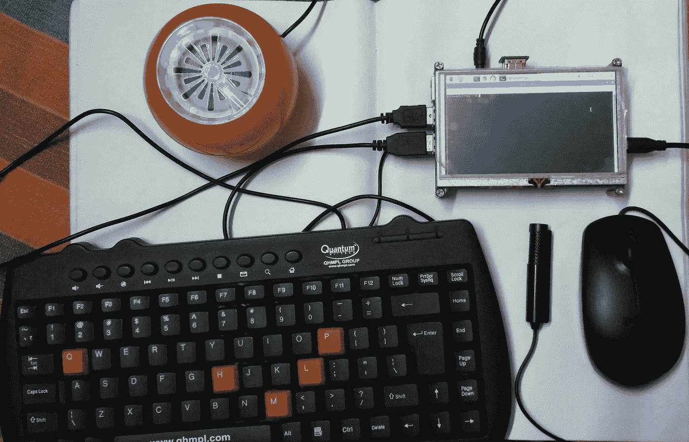

**倒叙**:几周前，当我为 Raspberry Pi 构建了自己的基于开源自然语言处理的语音助手[Mycroft——Picroft](https://mycroft.ai/documentation/picroft/)时，我开始思考是否有可能使用 Raspberry Pi 制作自己的 Alexa，使用廉价的扬声器和通用串行总线(USB)麦克风，就像我构建 Picroft 一样。

我好奇的头脑和少量的谷歌搜索把我带到了 Alexa 知识库，它让我把我简单的想法变成了现实。

因此，没有任何进一步的欺骗，让我们开始一步一步地用 Raspberry Pi 3 构建自己的 Alexa。

硬件需求:

1.  [树莓 Pi 3](https://www.amazon.in/s/ref=nb_sb_ss_i_6_12?url=search-alias%3Daps&field-keywords=raspberry+pi+3&sprefix=raspberry+pi%2Caps%2C1513&crid=2D4QP75CENSBN&rh=i%3Aaps%2Ck%3Araspberry+pi+3) (推荐)或 [Pi 2 Model B](https://www.amazon.in/s/ref=nb_sb_ss_i_7_14?url=search-alias%3Daps&field-keywords=raspberry+pi+2+model+b&sprefix=raspberry+pi+2%2Caps%2C301&crid=BEL0CVWHYTFW&rh=i%3Aaps%2Ck%3Araspberry+pi+2+model+b) (支持)。
2.  树莓派的微型 USB 电源线。
3.  微型 SD 卡(最低 8 GB) —您需要一个操作系统才能开始使用。NOOBS(新的开箱即用软件)是一个易于使用的树莓 Pi 操作系统安装管理器。你可以很容易地下载并安装在你的 SD 卡上(查看[这里](https://github.com/alexa/alexa-avs-sample-app/wiki/Raspberry-Pi#step-1-setting-up-your-pi))。
4.  [USB 2.0 迷你麦克风](https://www.amazon.in/s/ref=nb_sb_ss_i_3_7?url=search-alias%3Daps&field-keywords=usb+microphone&sprefix=usb+mic%2Caps%2C374&crid=9NDBXH5NN0M6) —树莓 Pi 没有内置麦克风；要与 Alexa 互动，你需要一个外部插件。
5.  带 3.5 毫米音频线的外置扬声器。
6.  一个 USB 键盘和鼠标，以及一个外部 HDMI 显示器。
7.  互联网连接(以太网或 WiFi)

在你为这个项目收集所有的成分(硬件)之后，开始按照下面提到的步骤。

# 步骤 1:设置您的 Pi

**N** 注:除非您已经在 Pi 上安装了 Raspbian Stretch 或 Jessie，否则请遵循指南— [设置 Raspberry Pi](https://github.com/alexa/alexa-avs-sample-app/wiki/Setting-up-the-Raspberry-Pi) ，该指南将引导您完成下载和安装 Raspberry Pi 以及连接硬件的过程(如果您不熟悉 Raspberry Pi，我强烈建议您遵循上面的指南，在继续下一步操作之前设置好 Pi 并做好准备)。

如果您已经在您的 Pi 上安装了 Raspbian Stretch Lite，那么您将需要安装 Java 以便启动并运行 Java 示例应用程序。只要您有互联网连接，就可以使用以下命令来实现:

```
sudo apt-get update
sudo apt-get install oracle-java8-jdk
```

# 第二步:注册一个亚马逊开发者账户

除非你已经有了一个，否则就去 developer.amazon.com[创建一个免费的开发者账户。请务必在此](https://developer.amazon.com/login.html)处查看 AVS 条款和协议[。](https://developer.amazon.com/public/solutions/alexa/alexa-voice-service/support/terms-and-agreements)

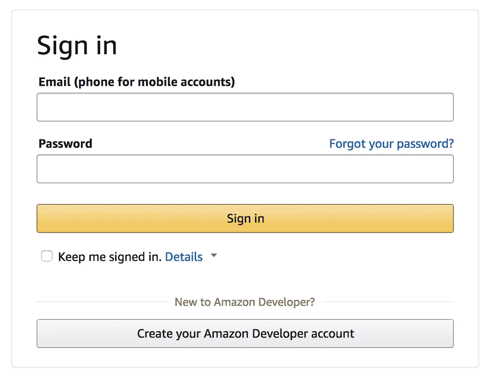

# 步骤 3:创建设备和安全配置文件

按照这里的步骤[注册您的产品并创建安全配置文件。](https://github.com/alexa/alexa-avs-sample-app/wiki/Create-Security-Profile)

请注意以下参数。在下面的步骤 5 中，您将需要这些。

*   `ProductID`，
*   `ClientID`，以及
*   `ClientSecret`

重要提示:确保在安全配置文件> Web 下设置了允许的来源和允许的返回 URL(参见[创建设备和安全配置文件](https://github.com/alexa/alexa-avs-sample-app/wiki/Create-Security-Profile)):

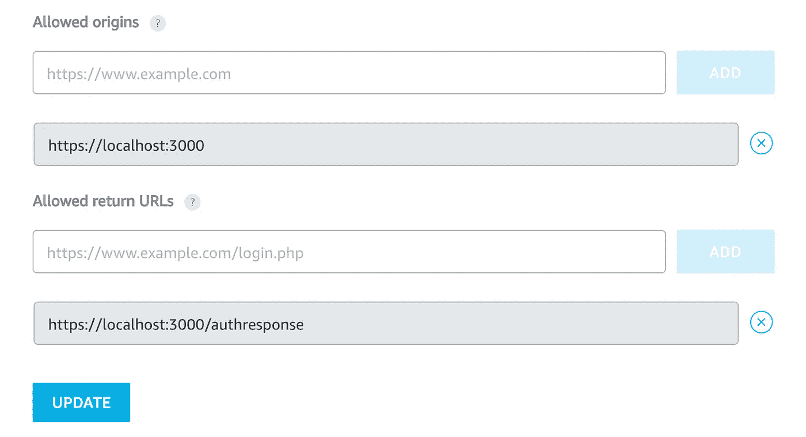

*   允许的来源: [https://localhost:3000](https://localhost:3000/)
*   允许返回的 URL:[https://localhost:3000/authresponse](https://localhost:3000/authresponse)

# 步骤 4:克隆示例应用程序

打开终端，并键入以下内容:

```
cd Desktop
# (Information: Currently the GitHub link is down due to some maintenance issue)git clone [https://github.com/alexa/alexa-avs-sample-app.git](https://github.com/alexa/alexa-avs-sample-app.git)
```

# 步骤 5:用您的凭据更新安装脚本

在运行安装脚本之前，您需要使用您在步骤 3 中获得的凭证来更新脚本— `ProductID`、`ClientID`、`ClientSecret`。在终端中键入以下内容:

```
cd ~/Desktop/alexa-avs-sample-app
nano automated_install.sh
```

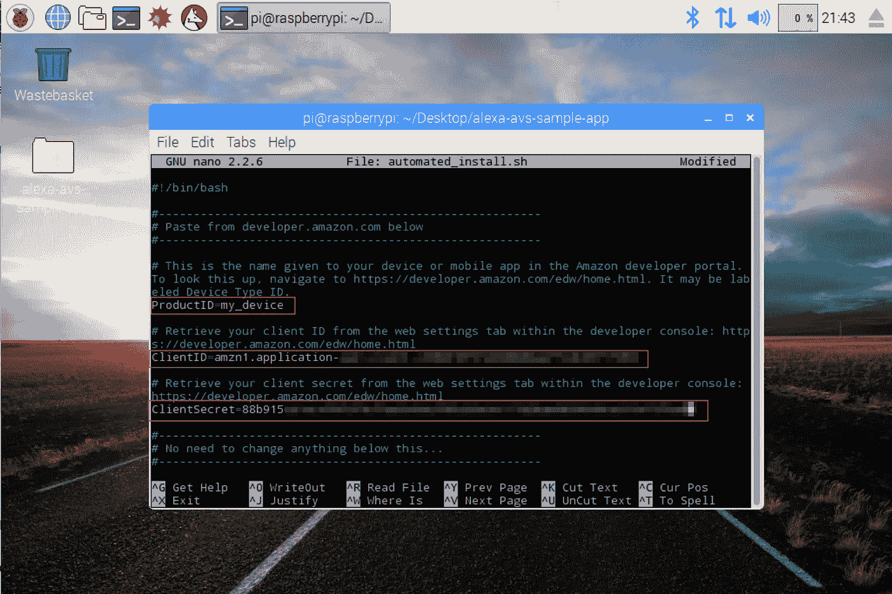

粘贴从上面第 3 步中获得的`ProductID`、`ClientID`和`ClientSecret`的值。

更改应该如下所示:

*   `ProductID="RaspberryPi3"`
*   `ClientID="amzn.xxxxx.xxxxxxxxx"`
*   `ClientSecret="4e8cb14xxxxxxxxxxxxxxxxxxxxxxxxxxxxx6b4f9"`

键入 ctrl-X 和 Y，然后按 Enter 保存对文件的更改。

# 步骤 6:运行安装脚本

您现在可以运行安装脚本了。这将安装所有依赖项，包括 Sensory 和 KITT.AI 的两个唤醒词引擎。

注意:安装脚本将在运行脚本的文件夹中安装所有项目文件。

若要运行该脚本，请打开“终端”并导航到克隆项目的文件夹。然后运行以下命令:

```
cd ~/Desktop/alexa-avs-sample-app
. automated_install.sh
```

在继续之前，系统会提示您回答几个简单的问题，回答这些问题并完成所有必要的先决条件。

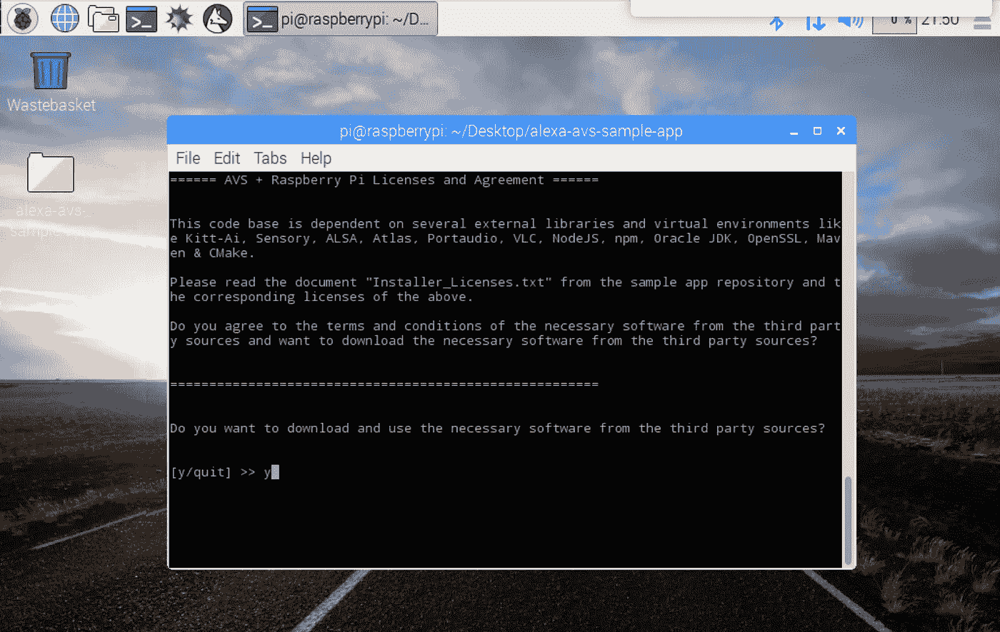

当向导启动时，完成整个过程需要 25-30 分钟，所以在此期间，你可以去喝杯茶或咖啡来打发时间。

# 第 7 步:运行你的网络服务，样本应用程序和唤醒词引擎

现在安装已经完成，您需要在三个独立的终端窗口中运行三个命令:

1.  终端窗口 1:运行 web 服务进行授权
2.  终端窗口 2:运行示例应用程序与 AVS 通信
3.  终端窗口 3:运行唤醒词引擎，允许您使用短语“Alexa”开始互动。

注意:这些命令必须按顺序运行。

## 终端窗口 1

打开一个新的终端窗口，键入以下命令以打开用于授权 AVS 示例应用程序的 web 服务:

```
cd ~/Desktop/alexa-avs-sample-app/samples
cd companionService && npm start
```

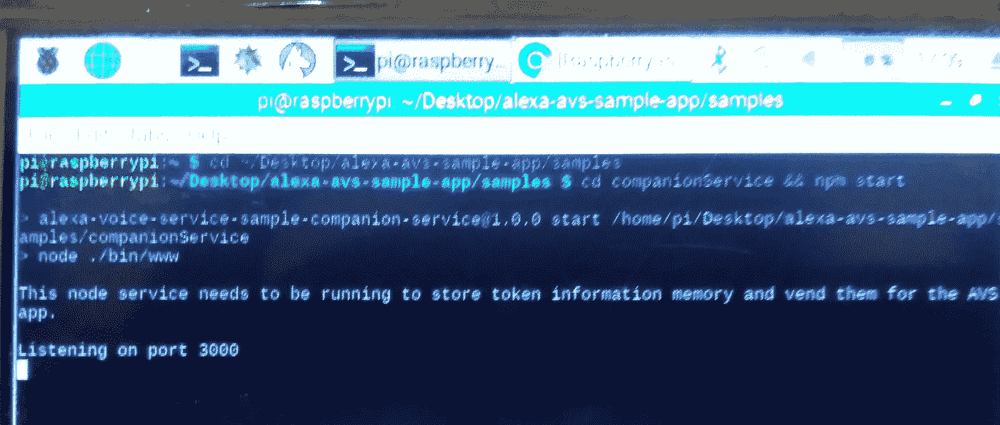

服务器现在运行在端口 3000 上，您已经准备好启动客户端。

参见 [API 概述>授权](https://developer.amazon.com/public/solutions/alexa/alexa-voice-service/content/avs-api-overview#authorization)了解更多关于授权的信息。

让我们来看一下与窗口 2 相关的下几个步骤。

1.  当你运行客户端时，会弹出一个窗口，显示一条消息

*请在网络浏览器中访问以下 URL 并按照说明注册您的设备:*[*https://localhost:3000/provision/d 340 f 629 BD 685 deeff 28 a 917*](https://localhost:3000/provision/d340f629bd685deeff28a917)*。是否要在默认浏览器中自动打开该 URL？*

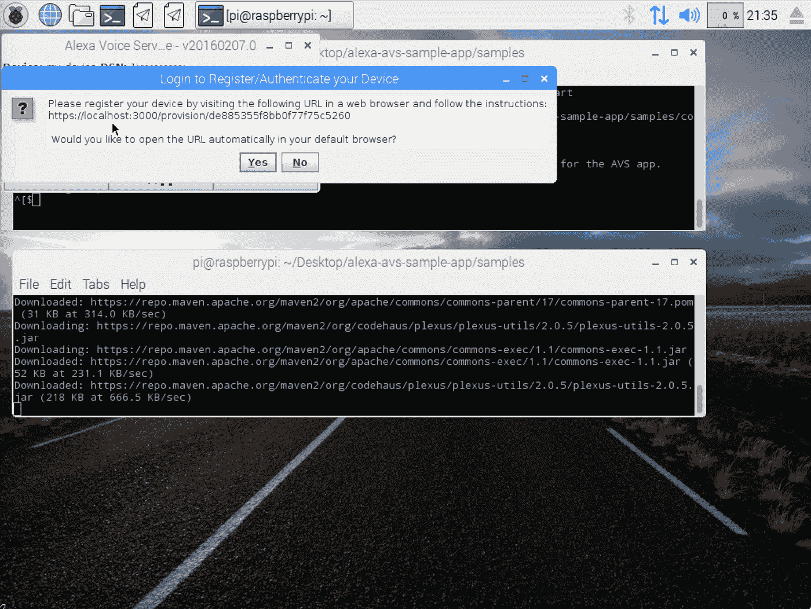

单击“是”在默认浏览器中打开该 URL。

2.如果你用 Pixel desktop(和 Chromium 浏览器)运行 Raspbian，你可能会从浏览器得到一个警告。你可以通过点击高级->进入本地主机(不安全)来避开它。

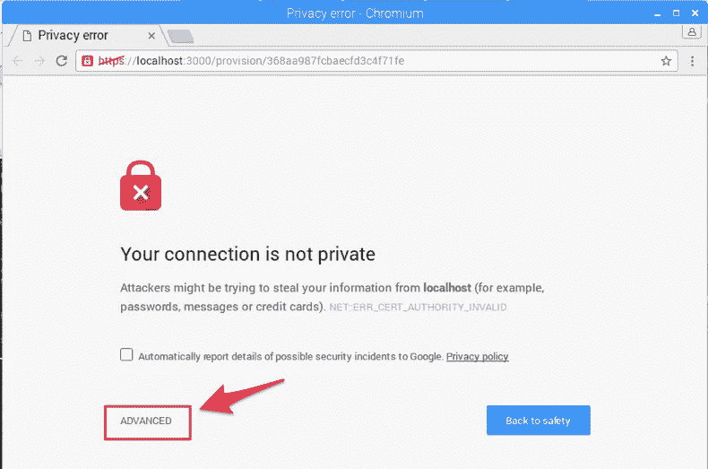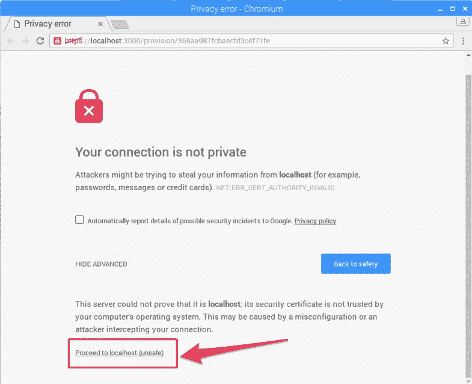

3.你将被带到一个登录亚马逊网页。输入您的亚马逊凭证。

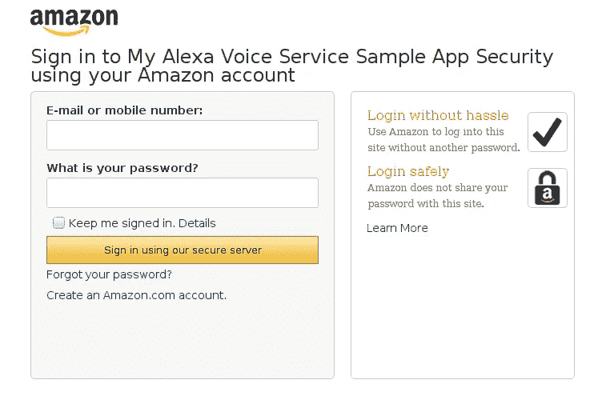

4.您将进入开发人员授权页面，确认您希望您的设备访问之前创建的安全配置文件。

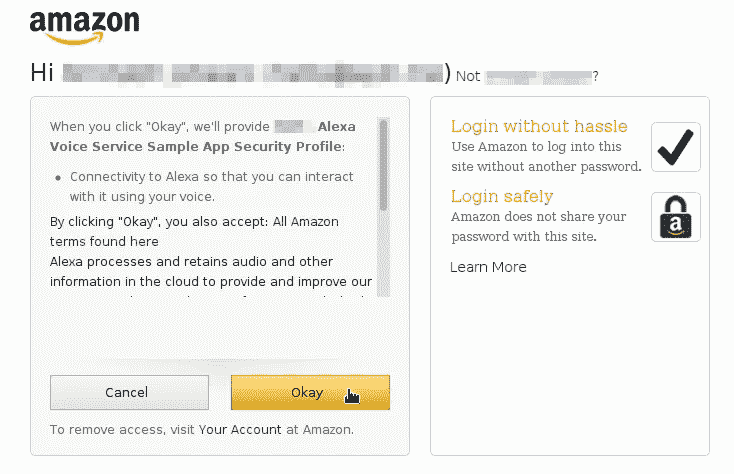

单击确定。

5.您现在将被重定向到一个以`https://localhost:3000/authresponse`开头的 URL，后跟一个查询字符串。网页正文将显示设备令牌就绪。

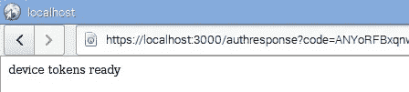

6.返回到 Java 应用程序并单击 OK 按钮。客户端现在可以接受 Alexa 的请求了。

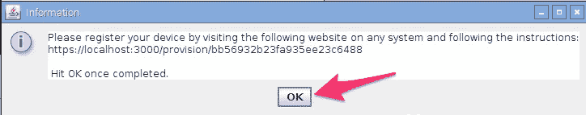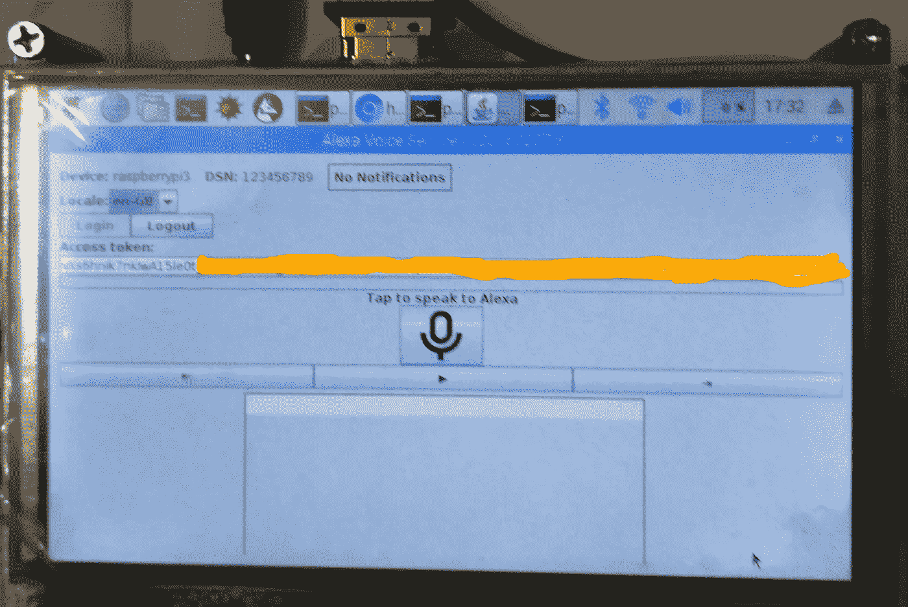

## 终端窗口 3

注意:*跳过这一步，在没有唤醒词引擎的情况下运行相同的应用*。

这个项目支持两个第三方唤醒词引擎:Sensory 的 truly 免提和 KITT。艾的雪娃娃。`-e`参数用于选择代理，支持{engine}}的两个值:`kitt_ai`和`sensory`。

打开一个新的终端窗口，使用以下命令从 Sensory 或 KITT.AI 调出唤醒词引擎。唤醒词引擎将允许您使用短语“Alexa”启动交互。

要使用感官唤醒词引擎，请键入-

```
cd ~/Desktop/alexa-avs-sample-app/samples
cd wakeWordAgent/src && ./wakeWordAgent -e sensory
```

或者，键入这个来使用 KITT。AI 的唤醒词引擎-

```
cd ~/Desktop/alexa-avs-sample-app/samples
cd wakeWordAgent/src && ./wakeWordAgent -e kitt_ai
```

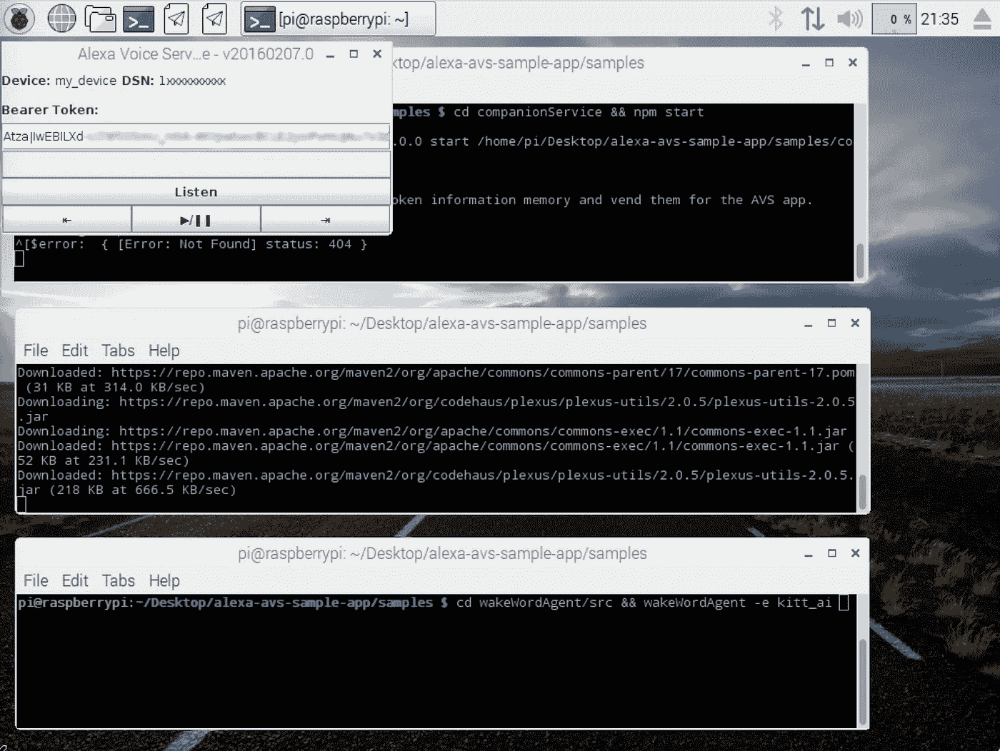

现在你有一个工作免提 AVS 原型！

使用以下资源了解有关可用唤醒词引擎的更多信息:

*   [感官](https://github.com/Sensory/alexa-rpi)
*   凯特。艾

# 第八步:和 Alexa 谈谈

你现在可以通过简单地使用唤醒词“Alexa”来与 Alexa 交谈。尝试以下方法-

说“Alexa”，然后等哔声。现在说“几点了？”

如果你愿意，你也可以点击“听”按钮，而不是使用唤醒词。在“听”按钮上点击一次，在释放点击之后，在开始讲话之前等待音频提示。可能需要一两秒钟才能听到音频提示。

# 步骤 9:如何注销示例应用程序

按照以下说明退出 AVS java 示例应用程序:

1.  退出 AVS java 示例应用程序(CTRL + C)。
2.  打开`/samples/javaclient/config.json`并清除您的`sessionId`。它应该是这样的:

`"sessionId": ""`

3.删除`samples/companionService`中的`refresh_tokens`文件。

下次登录时，系统会提示您进行身份验证。

# 演示时间

下面是有和没有唤醒词“Alexa”的视频，所以只要坐下来享受:

第 1 部分:没有唤醒词“Alexa”

[https://www.youtube.com/watch?v=T1uyG9YNWbk](https://www.youtube.com/watch?v=T1uyG9YNWbk)(视频 1)

第 2 部分:用唤醒词“Alexa”

https://www.youtube.com/watch?v=a2XvL1L65tM(视频 2)

因为，现在你们都知道从上到下用 Raspberry pi 3 构建自己的免提亚马逊 Alexa 的每一步，使用 Alexa 语音服务(AVS)。因此，我想鼓励我所有的读者朋友、深度学习/机器学习实践者、爱好者和爱好者拿出你自己的带 Raspberry pi 3 的免提亚马逊 Alexa，并在上面发布 LinkedIn 或 twitter 帖子(** **但不要忘记给我加标签:)**。我将急切地等待你的帖子。

参考资料:

1.  要了解更多关于 Alexa 语音服务的信息，请点击[这里](https://developer.amazon.com/alexa-voice-service)。
2.  要了解更多关于语音助手的信息，请点击[这里](https://www.google.co.in/search?q=what+is+voice+assistant&oq=what+is+voice+assistant&aqs=chrome..69i57.7018j0j8&sourceid=chrome&ie=UTF-8)。
3.  我用来实现这个项目的库可以在这里找到。(信息:目前 GitHub 链接由于一些维护问题而关闭)

**感谢您的关注**

你利用你的时间阅读 T21，我的工作对我来说意味着一切。我完全是这个意思。

如果你喜欢这个故事，疯狂鼓掌吧👏 **)** 按钮！这将有助于其他人找到我的工作。

还有，**跟我上** [**中**](https://medium.com/@naveenmanwani)**[**Linkedin**](https://www.linkedin.com/in/naveen-manwani-65491678/)**[**Twitter**](https://twitter.com/NaveenManwani17)**如果你想！我很乐意。******