# 改变您的硬件以在您的 PC 上实现更快的深度学习

> 原文：<https://towardsdatascience.com/pimp-up-your-pc-for-machine-learning-d11f68c2815?source=collection_archive---------5----------------------->

# 为深度学习系列提升您的电脑——第 1 部分

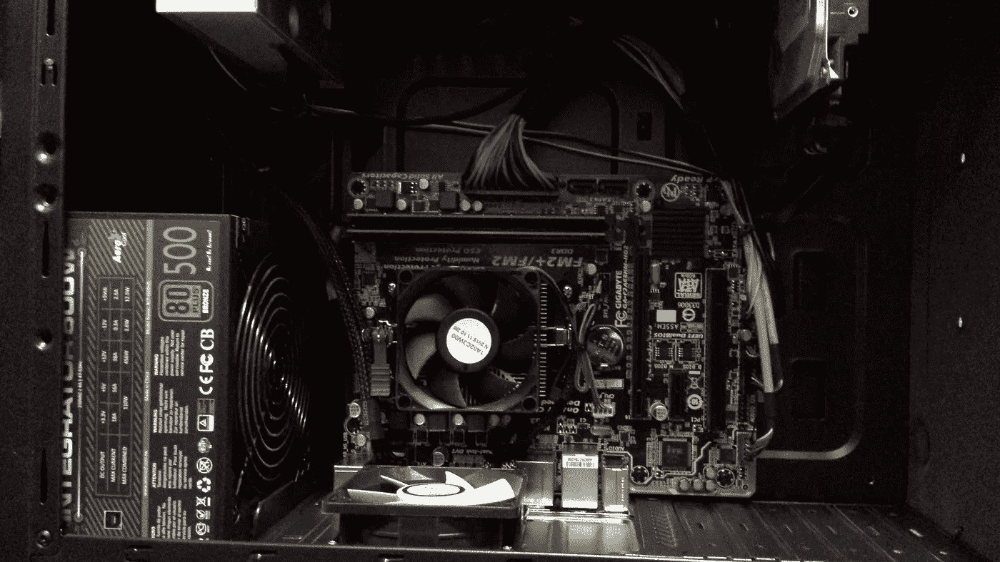

诸如 [Tensorflow](https://www.tensorflow.org) 、 [Pytorch](https://pytorch.org/get-started/locally/) 、 [Theano](http://deeplearning.net/software/theano/index.html) 和[认知工具包(CNTK)](https://www.microsoft.com/en-us/cognitive-toolkit/) 等框架(以及与其一起工作的任何深度学习库，例如 [Keras](https://keras.io/) )允许在使用 GPU(图形处理单元)支持时进行比使用 CPU 快得多的深度学习训练。然而，对于那些框架可用的 GPU 支持，GPU 本身必须与 [CUDA 工具包](https://developer.nvidia.com/accelerated-computing-toolkit)和任何额外需要的 GPU 加速库兼容，例如 [cuDNN](https://developer.nvidia.com/cudnn) 。

目前 CUDA 兼容性仅限于[Nvidia GPU](https://developer.nvidia.com/cuda-gpus)。*因此，如果你有其他的 GPU 硬件(例如 AMD)，你将不得不把它从你的电脑中换出来，并安装新的驱动软件。*这是我不得不为我的旧电脑做的事情，**这篇文章将一步一步地指导你完成这个过程。**

**注**:因为我的 PC 安装了 64 位 Windows 10(至少目前如此)，所以下面关于使用软件和卸载安装 GPU 驱动的说明都会参考 Windows 10。然而，由于我计划将这台电脑用于机器学习和其他编程项目，我将擦拭 Windows 并在其位置上安装 Linux Ubuntu 18.04 LTS(长期支持)——请关注此空间的未来帖子。

# 第一步:通过操作系统检查电脑上现有的显卡和驱动软件

升级电脑的第一步是检查你已经有的电脑。我的电脑是一台 Chillblast Fusion Inferno 2 游戏电脑，我最初是在 2016 年 1 月购买的。Chillblast Fusion 在主板上有一个 AMD 镭龙 R7 图形驱动程序(6595 MB 内存，VRAM 991 MB 和 5604 MB 共享内存)。

您可以使用 windows 上的“DirectX”诊断工具来检查这一点。你可以进入 Windows 开始菜单，输入“运行”,图 1 所示的窗口就会弹出。

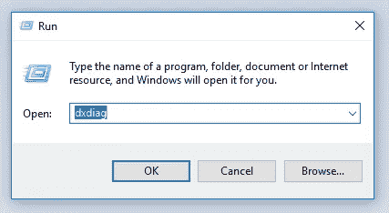

Fig 1: Checking the onboard graphics card via DirectX diagnostic tool on Windows

如图 1 所示，键入“dxdiag ”, DirectX 诊断工具打开(图 2)。从这个工具中，我可以看到我有一个 AMD 镭龙 R7 图形处理器，它与 CUDA 不兼容。这证实了 GPU 升级的必要性。

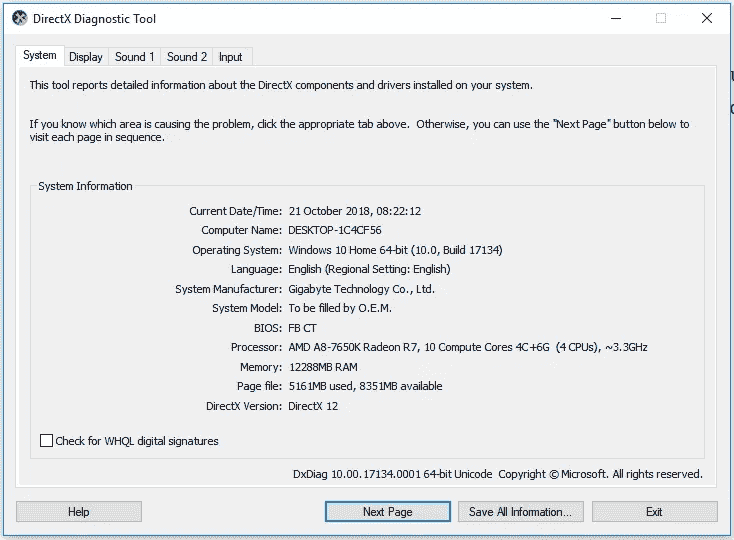

Fig 2: DirectX Diagnostic Tool for checking system and display hardware

除了通过 Windows 进行检查，我认为在选择或订购新的 GPU 之前检查 PC 内部也很重要。这是为了确认，首先，什么插槽将可用于 GPU，其次，任何可用的电源。许多 GPU 需要自己的冷却系统，因此需要使用电源设备。这在步骤 2 中执行。

# 第二步:在选择新的 GPU 之前，先看看你的电脑内部

上面已经提到，一个新的 GPU 安装需要你的主板上有一个可用的插槽；这是一个 PCI express (PCIe)插槽。打开电脑，确认有一个插槽可用于安装 GPU。图 3 显示了我的电脑。

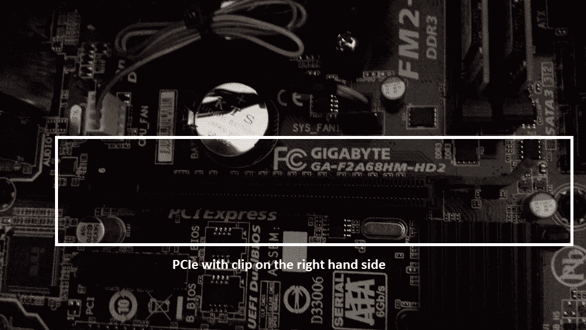

Fig 3: Motherboard with empty PCI Express slot and clip available for the new GPU

除了主板上的插槽要求之外，大多数 Nvidia GPUs 都需要专用电源来冷却。打开电脑外壳有助于检查已有的电源(如果没有电源，可订购一个额外的电源)。

我的电脑中可用的电源是 500 W(见图 4)。它还有一根备用电缆，其中一根有一个 6 针连接器。电缆未被使用，被塞在 PC 机箱的角落里，6 路引脚可以连接到 GPU 插座，为 it 提供冷却所需的电力。

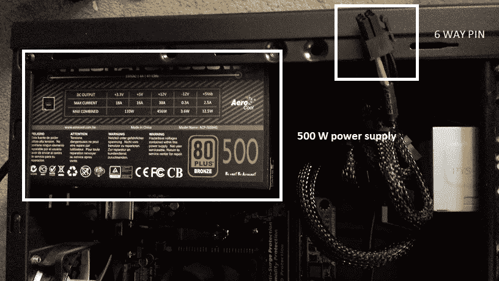

Fig 4: Inside the Chillblast PC — showing 500 W power supply and spare 6-way pin which will be able to provide power to the GPU when installed

# 第三步:选择一个新的 Nvidia 兼容的 GPU

GTX 1000 系列中的大多数卡需要一个单独的电源单元(PSU)，尽管 GTX 1050 Ti 具有不需要来自 PSU 的额外电源连接器的优势，因此如果您不想购买额外的硬件，这是一个不错的入门级选择。我选择了 EVGA Geforce GTX 1060 6GB，这被认为是一个具有成本效益的入门解决方案。这里有一个关于各种 Nvidia GPU 选项的很好的讨论。

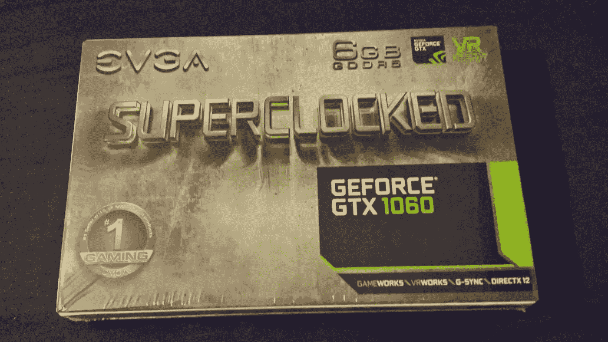

Fig 5: My new Nvidia compatible GTX 1060 graphics card by EVGA

查看 Geforce GTX 1060 GPU 的硬件要求:

*   显卡所需功率为 120 W
*   推荐的 PSU(电源装置)最低为 400W
*   GPU 的电源连接是来自 PSU 的 6 针连接器

之前在步骤 2 中对我的电脑内部进行的检查表明，我已经拥有的 500 W 电源足够了，由于电源也有一个可用的 6 针连接器，我拥有连接 Geforce GTX 1060 GPU 所需的一切。

# 步骤 4:卸载旧 GPU 的驱动程序

为了删除下载的软件，最好使用显示驱动卸载程序(“DDU”)。我用的是[Wagnardsoft](http://www.wagnardsoft.com)；这是免费软件，但是开发者会感谢捐赠。DDU 软件建议您在删除驱动程序时将电脑重启至安全模式。一旦你在安全模式下重启(在 Windows 10 上有很多方法可以做到这一点)，转到你下载 DDU 软件的文件夹，右击显示驱动卸载程序(它有文件类型:应用程序)，图 4 中的窗口就会出现。

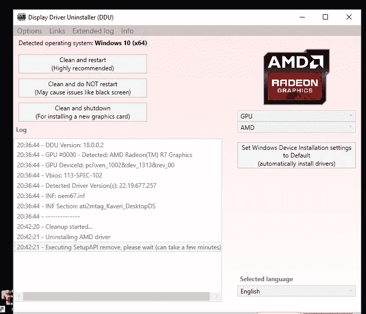

Fig 4: Display Driver Uninstaller (DDU) software detecting and uninstalling the AMD graphics driver on my PC

在图 4 所示的 DDU 选项中，最好的选择是“清理并重启(强烈推荐)”——这样在删除驱动程序时，您至少可以检查您的机器是否再次启动。图 4 所示的“清理并关闭(用于安装新显卡)”选项可能听起来更适用于这种情况，但它并不像您在重启时无法检查 PC 那样有用。

# 步骤 5:安装新的 GPU 硬件

我不得不移除机箱后面的两个面板，以便 GPU 可以放进去；这在图 5 中示出。一旦安装了 GPU，就可以从电脑机箱的背面直接接触到它的连接插槽。

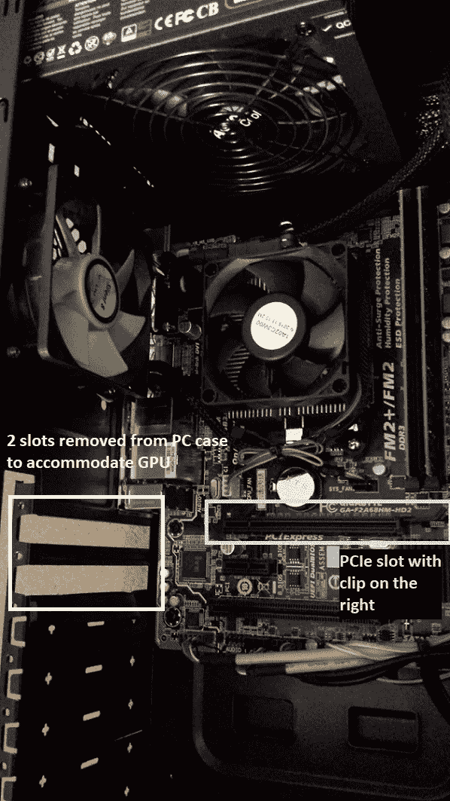

Fig 5: GPU installation — removal of 2 slots from the side of the PC case at the back to enable the GPU to fit. The GPU’s socket (HDMI and DVI) connections are then accessible from the back of the computer via those slots

当 GTX 1060 GPU 作为新品到达时，它在要插入 PCIe 插槽的引脚上有一个保护性的黑色橡胶盖。首先从引脚上取下保护盖。握住 GPU 的风扇一侧(即印刷电路板的另一侧)，小心避免静电放电，在触摸 GPU 之前，触摸大型金属物体(如计算机机箱)可能会损坏 GPU。将 GPU 推到 PCIe 插槽上；您应该会感觉到 PCIe 插槽夹卡嗒一声卡住了 GPU。图 6 显示了我的电脑的最终设置。

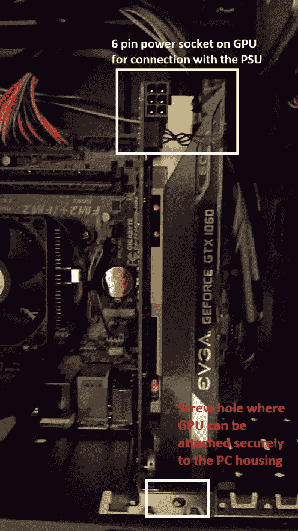

Fig 6: Nvidia GPU pushed and clipped into the PCIe slot; the GPU power socket are shown (top) and the screw hole where the GPU can be attached securely to the PC housing is also shown (bottom)

一旦 GPU 已经安全地插入到 PCIe 插槽中，将 500 W 电源的 6 针电源插入到 GPU 单元的顶部。GPU 上的电源插座如图 6(顶部)所示，插上电源的 GPU 如图 7(底部)所示。

此外，它有一个 GPU 的螺丝附件；这可用于将其牢固地拧到电脑机箱上，如图 7(顶部)所示。

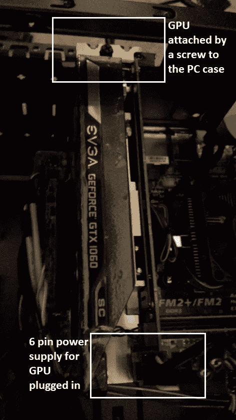

Fig 7: Installed GPU screwed to case and with the 500 W power supply now plugged in

既然 GPU 已经固定到位，请在外壳一侧关闭的情况下启动计算机，以确保 GPU 上的风扇正在旋转。当你很高兴你的 GPU 布线整齐存放，风扇正在运行，你可以关闭你的电脑外壳。

# 连接电脑显示器的注意事项

在安装 GPU 之前，我的显卡通过插入主板的 HDMI 电缆连接到我的 PC 显示器上；参见图 8 中的 HDMI 插座(主板)标签)。安装 GPU 时，它带有几个连接，包括自己的 HDMI 和 DVI 插座(在图 8 中分别标记为“HDMI 插座(GPU)”和“DVI 插座(GPU)”。当电脑仍然关闭时，我从主板上拔下 HDMI 电缆，并将其插入 GPU。然后我打开电脑，它重新启动进入 windows。如果在打开和启动之前没有将显示器连接器(HDMI 或 DVI)从主板插座切换到 GPU 插座，尽管您的计算机启动了，但您的显示器仍会出现黑屏。您的电脑现在可以在启动时识别 GPU，默认显示输出从主板切换到新的 GPU。

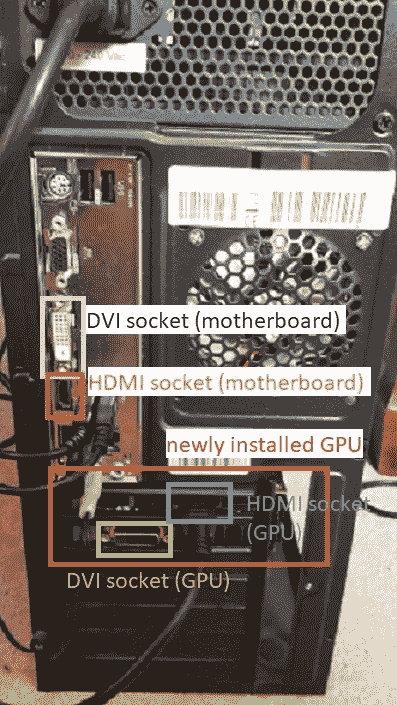

Fig 8: The back of the computer case showing existing (motherboard) and new (GPU) DVI and HDMI sockets respectively

终于把你的电脑组装好了，是时候为你的新 GPU 安装驱动程序了。

# 第六步:为你的新 GPU 获取驱动软件

如果你购买了新的 Nvidia GPU 驱动程序，会附带一张驱动程序光盘，但是，当你得到它时，它可能已经过时了。另一种选择(也可能是更好的选择)是直接从 Nvidia 网站[这里](https://www.nvidia.co.uk/Download/index.aspx?lang=en-uk)下载驱动软件。Geforce GTX 1060 驱动程序软件被列为 Geforce 10 系列的一部分，如图 9 所示。

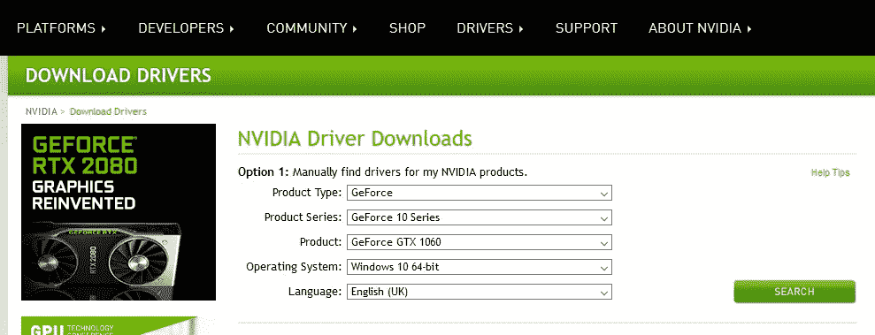

Fig. 9: Downloading the Geforce GTX 1060 driver software from the Nvidia site

选择图 9 中的选项并点击“搜索”会将您带到图 10 所示的下载页面。

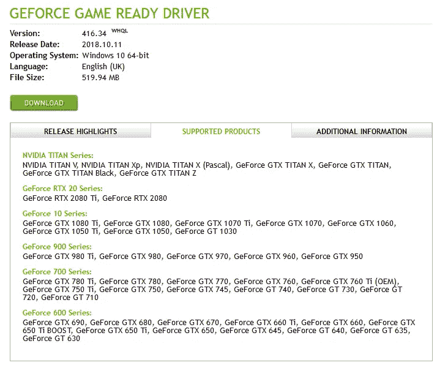

Fig 10: Driver download for the GTX 1060

下载并运行软件后，您将看到图 11 中的消息，提示您提取并安装 Nvidia 软件。

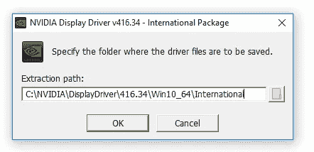

Fig 11: Downloading and installing Nvidia display driver software

# 故障排除说明

一旦我按照上面的安装过程，包括 Nvidia 显示驱动程序软件，我发现我的电脑没有立即检测到我的新 Nvidia GPU。我试图解决这个问题的一个方法是“关机再开机”——简单的重启。这对我很有效。但是，如果您发现您的系统无法检测到您的新 GPU，我发现下面的链接是一个有用的资源，可以帮助您诊断为什么会出现这种情况。

 [## 完全修复:在 Windows 10、8.1 和 7 上检测不到 Nvidia 显卡

### 您的图形卡是电脑上最重要的组件之一。然而，许多用户反映英伟达…

windowsreport.com](https://windowsreport.com/nvidia-graphics-card-windows-10/) 

# 步骤 7:在 Windows 中检查 GPU 安装

当你的 GPU 安装最终被识别时，它应该会以一些形式出现在 Windows 上。首先，您应该能够在“设备管理器”中看到它(如图 12 所示)。

请注意，我禁用了微软基本显示适配器(也列在图 12 中)，因为它显示了一个错误，从我删除旧的 AMD 驱动程序时开始；在任何情况下，我都不需要 microsoft basic 显示适配器。

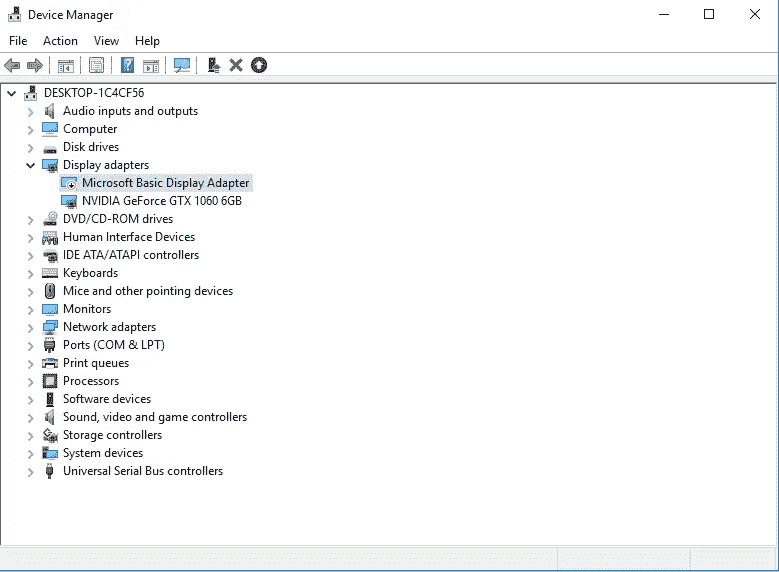

Fig 12: Windows 10 device manager showing display adapters (including new NVIDA GeForce card); I have disabled the Microsoft Basic Display Adapter

在 Windows 任务管理器中，您的新 GPU 也应该作为附加 GPU 列出。从图 13 可以看出，我的原始 GPU——“GPU 0”被列为 AMD 镭龙(TM) R7 图形，而新的 GPU——“GPU 1”现在是 Nvidia GeForce GTX 1060 6GB。

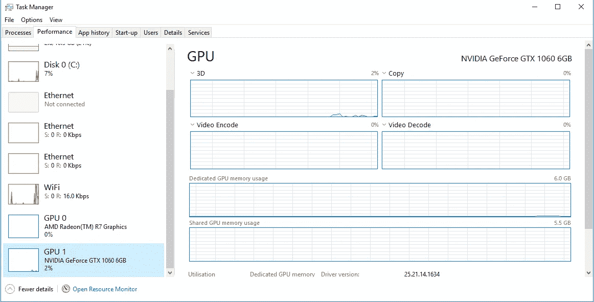

Fig 13: Windows task manager showing the new GPU 1 Nvidia GeForce GTX 1060 6GB

# 结论

本文介绍了如何检查当前计算机是否适合 GPU 升级，以及如何在计算机中安装新的 GPU 和驱动程序。该系列的下一步将是 CUDA 和 CUDnn 的安装，因为在将深度学习框架与 GPU 支持(如 Tensorflow、Pytorch 等)放在一起之前需要这些。

这篇文章也发表在[这里](https://schoolforengineering.com/tutorial/change-gpu-faster-deep-learning-on-pc/)的[https://schoolforengineering.com](https://schoolforengineering.com)上。