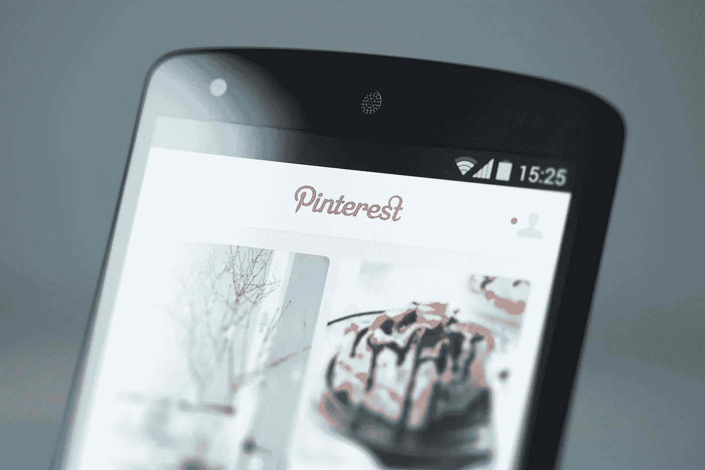
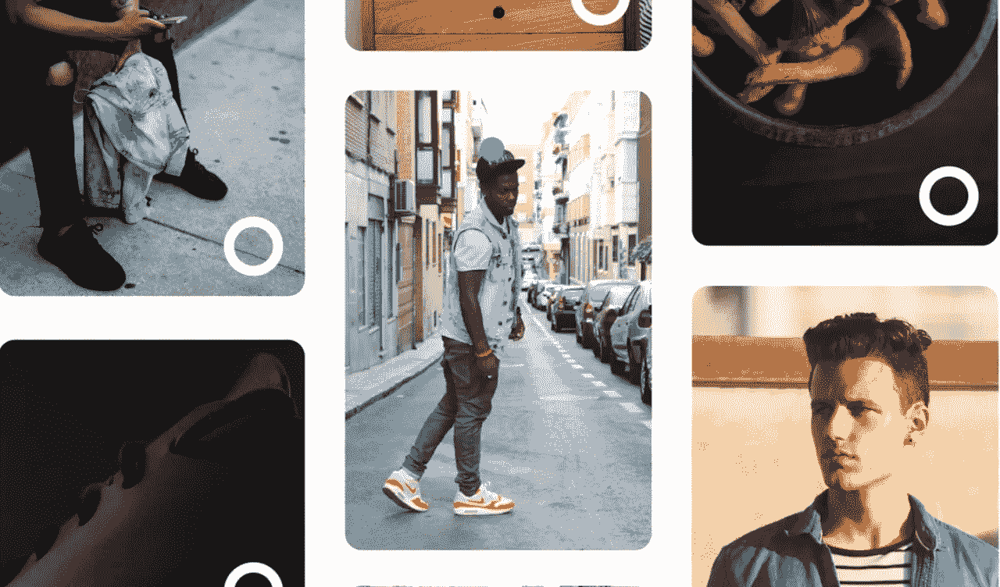
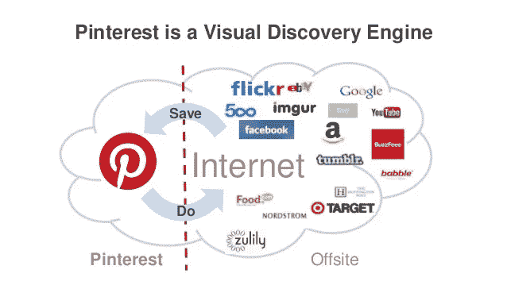
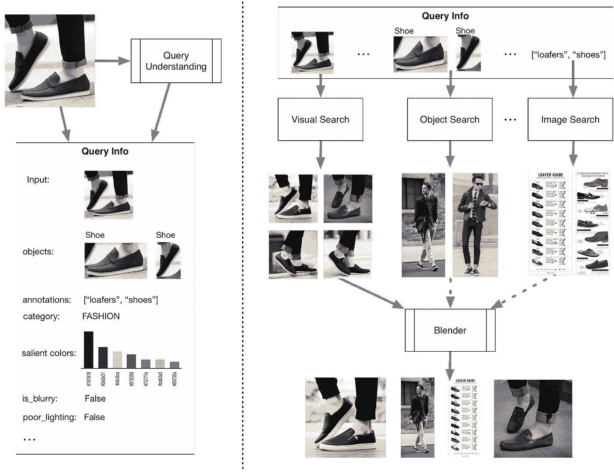
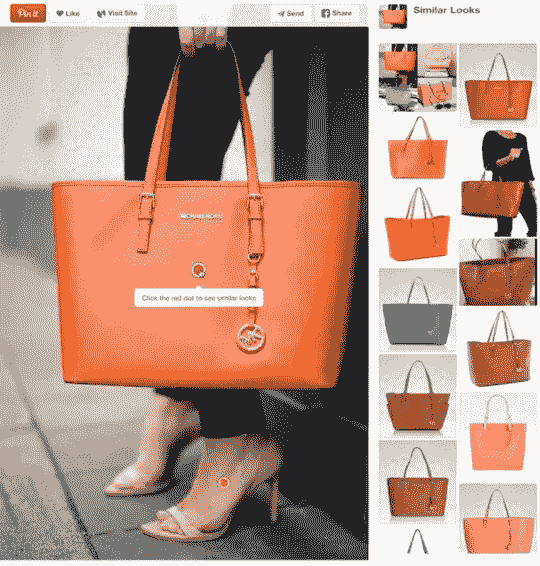
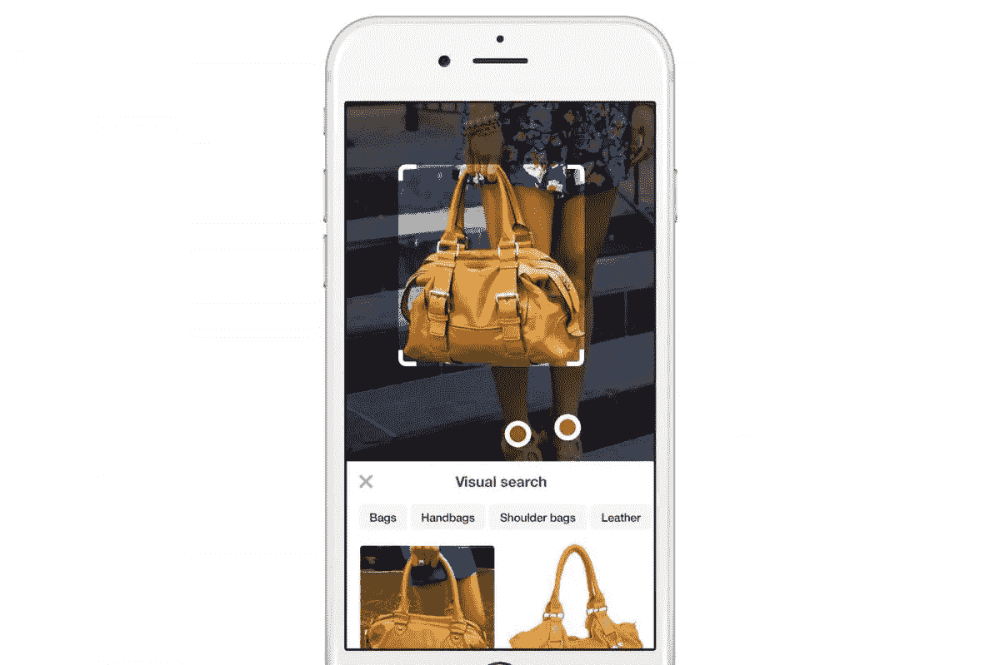
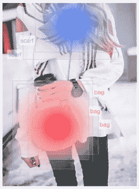
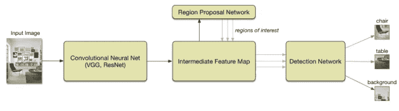
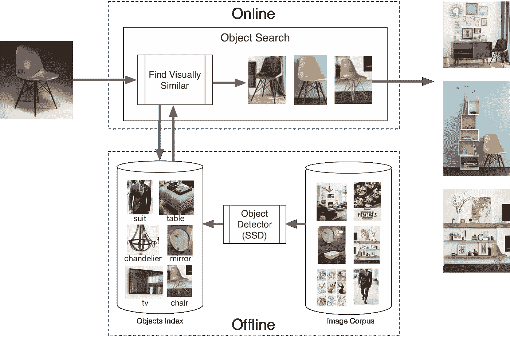
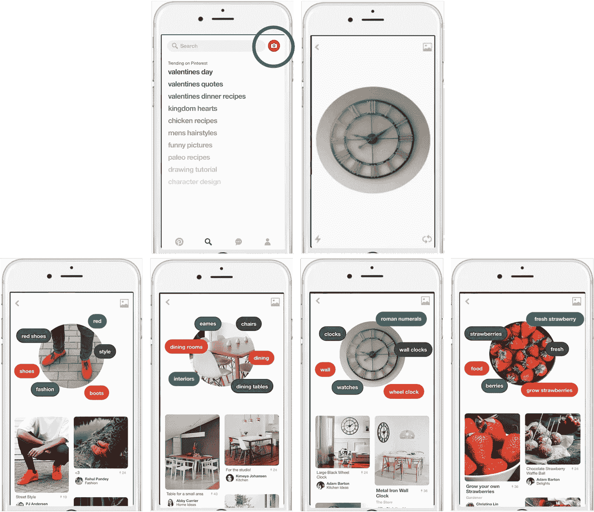

# Pinterest 的视觉镜头:计算机视觉如何探索你的品味

> 原文：<https://towardsdatascience.com/pinterests-visual-lens-how-computer-vision-explores-your-taste-5470f87502ad?source=collection_archive---------7----------------------->

## 个性化视觉推荐背后的科学

当谈到寻找你想尝试的东西时——一个新的沙拉食谱，一件新的优雅服装，一把客厅的新椅子——你真的需要先看看它。人类是视觉动物。我们用眼睛来决定某样东西是否好看，或者是否符合我们的风格。

我是 Pinterest 的超级粉丝，尤其是它的视觉镜头。为什么？它让我发现让我感兴趣的事物，并让我深入其中。当我在世界上发现一些看起来有趣的东西，但当我稍后试图在网上搜索它时，我说不出话来。我脑海中有这个丰富多彩的画面，但我无法翻译成我需要找到它的文字。Pinterest 的视觉镜头是一种发现想法的方式，而不必先找到合适的词来描述它们。

只需将镜头对准一双鞋，然后点击查看相关的风格，甚至是搭配什么的想法。或者在桌子上试一试，寻找相似的设计，甚至是同一时代的其他家具。也可以用镜头配食物。只要把它指向花椰菜或土豆，看看会出现什么食谱。图案和颜色也可以引导你走向有趣的方向，甚至是怪异的新方向。

那么 Pinterest 是如何通过视觉搜索并为用户提供个性化视觉推荐的呢？经过两周对该公司的工程博客和媒体曝光的挖掘，我很感激终于得以一窥幕后。事实证明，该产品是 Pinterest 的机器学习应用程序的一个实例，这些应用程序广泛应用于各种商业领域。让我们缩小一下，看看机器学习在 Pinterest 是如何使用的。

# Pinterest 使用机器学习的概述

作为一个视觉发现引擎，Pinterest 有许多具有挑战性的问题，这些问题可以使用机器学习技术来解决:

*   我们应该向新用户推荐什么样的兴趣？
*   如何产生引人入胜的主页反馈？
*   引脚之间是如何关联的？
*   一根针属于什么利益？

关键时刻发生在 2015 年 1 月，Pinterest 收购了[Kosei](https://www.crunchbase.com/organization/kosei)——一家擅长推荐系统的机器学习初创公司。从那时起，机器学习已经在多个领域跨 Pinterest 使用:从提供推荐、相关内容和预测一个人将内容锁定的可能性的发现团队；成长团队使用智能模型来确定发送哪些电子邮件，并防止流失；来自做广告表现和相关性预测的货币化团队；给用 Spark 构建实时分布式机器学习系统的数据团队。

让我们更深入地了解一下 Pinterest 的工程师们是如何利用机器学习来保持该网站 1.75 亿多用户的锁定和共享的:

*   **识别视觉相似性:**机器学习不仅可以确定图像的主体，它还可以识别视觉模式，并将其与其他照片进行匹配。Pinterest 使用这项技术每月处理 1.5 亿次图像搜索，帮助用户找到看起来像他们已经上传的图片的内容。
*   **分类和管理:**如果用户锁定了一张上世纪中期的餐桌，该平台现在可以提供同一时代其他物品的建议。钥匙？元数据，如发布图片的公告板和网站的名称，有助于平台理解照片代表了什么。
*   **预测参与度:**虽然许多平台优先考虑用户朋友和联系人的内容，但 Pinterest 更关注个人的品味和习惯——他们在什么时候发布了什么——这使得该网站能够提供更多个性化的推荐。
*   **优先考虑本地口味:** Pinterest 是一个日益全球化的平台，超过一半的用户位于美国以外。它的推荐引擎已经学会用用户的母语推荐他们当地的热门内容。
*   超越图片:分析照片中的内容是网站推荐的一个重要因素，但它并不能提供全部信息。Pinterest 还会查看以前固定内容的标题，以及哪些项目被固定在同一个虚拟板上。举例来说，这使得 Pinterest 可以将一件特定的衣服与经常钉在旁边的一双鞋子联系起来，即使它们看起来一点也不像。

Pinterest Lens 是识别视觉相似性的努力的一部分，还有许多其他工程作品。它们都在一个不断发展的领域中利用机器学习算法和技术，这个领域称为计算机视觉，我将在下面深入解释。

# Pinterest 的计算机视觉简史

**计算机视觉**是计算机科学的一个领域，也是机器学习的一个子领域，致力于使计算机能够像人类视觉一样看到、识别和处理图像，然后提供适当的输出。这就像把人类的智慧和本能传授给计算机。Pinterest 大量使用计算机视觉来支持他们的视觉发现产品。

Pinterest 在 2014 年将目光投向了视觉搜索。那一年，该公司收购了一家图像识别初创公司 [VisualGraph](https://techcrunch.com/2014/01/06/pinterest-visualgraph/) ，并与一小群工程师一起建立了其计算机视觉团队，并开始展示其工作。

2015 年，它推出了 [**视觉搜索**](https://blog.pinterest.com/en/our-crazy-fun-new-visual-search-tool) **，**一种无需文字查询的搜索创意的方式。第一次，视觉搜索给了人们一种方法来获得结果，即使他们找不到合适的词来描述他们正在寻找的东西。

2016 年夏天，随着 Pinterest 推出 [**对象检测**](https://medium.com/@Pinterest_Engineering/introducing-automatic-object-detection-to-visual-search-e57c29191c30) ，视觉搜索得到了发展，它可以实时找到一个大头针图像中的所有对象，并提供相关结果。此后，视觉搜索成为其最常用的功能之一，每月有数亿次视觉搜索，检测到数十亿个物体。

2017 年初，它在视觉发现基础架构上推出了 3 款新产品:

*   **Pinterest Lens** 是一种通过手机摄像头发现创意的方式，其灵感来自用户看到的周围世界。
*   **购物外观**是一种购物和购买用户在胸针内看到的产品的方式。
*   **即时创意**是一种只需轻轻一点，就可以用类似的创意改变用户主页内容的方式。

最近大约 2 个月前，它宣布了为用户寻找产品和想法的更多方法:

*   **Lens Your Look** 是从你的衣柜和 Pinterest Lens 的下一个重大步骤中获得灵感的一种新方法。
*   **响应式视觉搜索**是一种通过放大大头针对象来搜索图像的无缝沉浸式方法。
*   Pinterest Pincodes ，你只需拿出 Pinterest 相机，扫描任何 Pincode，就能看到 Pinterest 上的策划创意，灵感来自你在现实世界中看到的东西。

让我们更深入地挖掘 Pinterest 工程师在 Pinterest Lens 背后用于视觉发现工作的计算机视觉模型。

# Pinterest 镜头如何工作

## 1 —镜头架构:

Lens 将 Pinterest 对图像和对象的理解与其发现技术相结合，为 Pinners 提供了一系列不同的结果。例如，如果你拍了一张蓝莓的照片，Lens 不只是返回蓝莓:它还会给你更多的结果，如蓝莓烤饼和冰沙的食谱，排毒磨砂等美容想法或种植自己的蓝莓灌木的技巧。

为此，Lens 的整体架构分为两个逻辑组件。

1.  第一个组件是一个**查询理解层**，在这里 Pinterest 导出关于给定输入图像的信息。在这里，Pinterest 计算视觉特征，如检测物体，计算突出的颜色，检测照明和图像质量条件。使用视觉特征，它还计算语义特征，例如注释和类别。
2.  第二个组件是 Pinterest 的**混合器**，因为 Lens 返回的结果来自多个来源。Pinterest 使用**视觉搜索**技术返回视觉上相似的结果，使用**对象搜索**技术返回具有视觉上相似的对象的场景或项目，使用**图像搜索**返回与输入图像语义上(非视觉上)相关的个性化文本搜索结果。混合器的工作是根据查询理解层中获得的信息动态地改变混合比率和结果源。

如上所示，镜头结果在视觉上并不严格相似，它们来自多个来源，其中一些仅在语义上与输入图像相关。通过为 Pinners 提供视觉相似之外的结果，Lens 是一种新型的视觉发现工具，它将现实世界的相机图像与 Pinterest 味觉图联系起来。

让我们继续分析 Lens 混合组件，包括图像、对象和视觉搜索。

## 2 —图像搜索:

Pinterest 的**图像搜索**技术可以追溯到 2015 年，当时该公司分享了一份[白皮书](https://arxiv.org/abs/1505.07647)，详细介绍了其系统架构和从实验中获得的见解，以建立一个可扩展的机器视觉管道。Pinterest 使用基准数据集和 A/B 测试的组合对两个 Pinterest 应用程序、相关 pin 和一个具有相似外观的实验进行了一系列全面的实验。

特别是，相似外观的实验允许 Pinterest 根据大头针图像中的特定对象显示视觉上相似的大头针推荐。它尝试了不同的方法来使用表面对象识别，这将使 Pinner 点击到对象。然后，它使用对象识别从大头针的图像中检测出包、鞋和裙子等产品。从这些检测到的对象中，它提取视觉特征来生成产品推荐(“相似的外观”)。在最初的实验中，如果针中的物体上有一个红点，Pinner 就会发现建议。点击红点会载入一系列视觉上相似的物品。

## 3 —视觉搜索:

当 Pinterest 在 2016 年为 Pinterest 上最受欢迎的类别引入自动对象检测时，视觉搜索得到了显著改善，因此人们可以在一个大头针的图像内视觉搜索产品。

由于一张图片可以包含几十个对象，Pinterest 的动机是尽可能简单地从其中任何一个开始发现体验。与自动完成改善文本搜索体验的方式相同，自动对象检测使视觉搜索体验更加无缝。视觉搜索中的对象检测也启用了新功能，如对象对对象匹配。例如，假设你在 Pinterest 或朋友家里发现了一张你喜欢的咖啡桌，很快你就能看到它在许多不同的家居环境中会是什么样子。

Pinterest 在构建自动对象检测方面的第一个挑战是收集图像中感兴趣区域的标记边界框作为我们的训练数据。自推出以来，它已经处理了近 10 亿个图像作物(视觉搜索)。通过在数百万张参与度最高的图片中聚合这种活动，它可以了解 Pinners 对哪些对象感兴趣。它将视觉上相似的结果的注释聚合到每个裁剪中，并在数百个对象类别中分配一个弱标签。下面的热图显示了这种情况的一个示例，其中形成了两个用户裁剪聚类，一个围绕“围巾”标注，另一个围绕“包”标注。

由于 Pinterest 的视觉搜索引擎可以使用任何图像作为查询——包括网络上看不见的内容，甚至是你的相机——检测必须实时进行，在几分之一秒内。Pinterest 广泛试验的最广泛使用的检测模型之一是 [**更快的 R-CNN**](https://arxiv.org/pdf/1506.01497.pdf) ，它使用深度网络在两个主要步骤中检测图像中的对象。

首先，它通过在输入图像上运行完全卷积网络来产生特征图，从而识别图像中可能包含感兴趣对象的区域。对于特征图上的每个位置，网络考虑一组固定的区域，这些区域的大小和长宽比不同，并使用二进制 softmax 分类器来确定每个区域包含感兴趣对象的可能性。如果找到一个有希望的区域，网络还输出对该区域的调整，以便它更好地框住对象。

一旦网络发现了感兴趣的区域，它就检查最有希望的区域，并试图将每个区域识别为特定类别的对象，或者如果没有发现对象，就丢弃它。对于每个候选区域，网络在卷积特征图的相应部分上执行空间汇集，从而产生具有固定大小的特征向量，而与区域的大小无关。该汇集的特征然后被用作检测网络的输入，该检测网络使用 softmax 分类器来将每个区域识别为背景或我们的对象类别之一。如果检测到对象，网络再次输出对区域边界的调整，以进一步改进检测质量。最后，对检测执行一轮非最大值抑制(NMS ),以过滤掉任何重复的检测，并将结果呈现给用户。

## 4 —对象搜索:

传统上，视觉搜索系统将整个图像视为一个单元。这些系统索引全局图像表示以返回与给定输入图像整体相似的图像。随着深度学习的进步带来了更好的图像表示，视觉搜索系统达到了前所未有的精确度。然而，Pinterest 希望推动视觉搜索技术的界限，超越以整个图像为单位的界限。通过利用其数十亿对象的语料库，结合其实时对象检测器，Pinterest 可以在更细粒度的水平上理解图像。现在，它知道其图像语料库中数十亿个对象的位置和语义。

**物体搜索**是以物体为单位的视觉搜索系统。给定一张输入图像，Pinterest 在几分之一秒内从数十亿张图像中找到视觉上最相似的对象，将这些对象映射到原始图像，并返回包含相似对象的场景。

# Pinterest 视觉发现的未来

在一个每个人口袋里都有相机的世界里，许多专家认为，视觉搜索——拍照而不是通过文本查询进行搜索——将成为我们查找信息的事实方式。

Pinterest 坐拥可能是世界上最干净、最大的数据集来训练计算机看图像——这相当于一个隐藏着核军备的小国。这是数十亿张家具、食物和服装的照片，多年来一直由 Pinterest 的用户手工标注。

在 Pinterest，用户可以随意浏览“美好生活”,从非常不具体的查询开始，比如“晚餐创意”或“时尚”,他们可能会一周又一周地反复搜索。由于这种行为和网站照片大头针的网格布局，Pinterest 可以在其平台中建立视觉搜索，而不是提供一个完美的答案，而是一个不完美的灵感集合。

据 Pinterest 的首席执行官本·希伯尔曼称，该公司正在用计算机视觉做三件事。他们试图了解产品或服务的美学品质，这样他们就能提供更好的建议。他们希望能够看到包含多个项目的图像内部，放大其中的一部分，然后通过计算说，“嘿，就是这种类型的对象。你可以在这里找到类似的东西。”然后，最终，他们想让相机工具，你可以查询你周围的世界。计算机视觉是驱动这三者的基础技术。

## 最后一次外卖

Pinterest 有一个指导他们计算机视觉工作的基本原则:帮助人们发现和做他们喜欢的事情。视觉是一个罕见的、未被封闭的空间。文字分享？这个象限属于脸书和推特。视觉分享？脸书、Instagram 和 Snapchat。搜索文本？那就是谷歌和必应。但是通过视觉搜索呢？Pinterest 似乎在引领潮流。

我希望这是有益的，并像它一样激起你的好奇心。目前，我将通过我自己的 Pinterest 镜头工作，发现我新喜欢的对象，了解并欣赏所有在幕后进行的计算机视觉。

— —

*如果你喜欢这首曲子，我希望你能按下鼓掌按钮*👏*这样别人可能会偶然发现它。你可以在* [*GitHub*](https://github.com/khanhnamle1994) *上找到我自己的代码，在*[*【https://jameskle.com/】*](https://jameskle.com/)*上找到更多我的写作和项目。也可以在* [*推特*](https://twitter.com/@james_aka_yale) *，* [*上关注我直接发邮件给我*](mailto:khanhle.1013@gmail.com) *或者* [*在 LinkedIn*](http://www.linkedin.com/in/khanhnamle94) *上找我。*

**其他来源:**

*   [*机器学习在 Pinterest 的未来*](https://medium.com/@Pinterest_Engineering/the-future-of-machine-learning-at-pinterest-88e6d4bf1968) *(迈克尔·洛普，Pinterest 的工程副总裁)*
*   [*蜂巢智库:Pinterest 的 ML*](https://www.slideshare.net/HiveData/the-hive-think-tank-machine-learning-at-pinterest-by-jure-leskovec-61383413)*(Jure Leskovec，Pinterest 首席科学家)*
*   [*Pinterest 如何使用 ML 来牵制其用户*](https://www.fastcompany.com/3065228/how-pinterest-uses-machine-learning-to-keep-its-users-pinned)*【fast company】*
*   [*介绍 Pinterest 上视觉发现的未来*](https://medium.com/@Pinterest_Engineering/introducing-the-future-of-visual-discovery-on-pinterest-48fb469b0d67) *(Dmitry Kislyuk，Pinterest 的视觉搜索工程经理)*
*   [*介绍下一波视觉搜索和购物*](https://blog.pinterest.com/en/introducing-next-wave-visual-search-and-shopping) *(Jeff Harris，Pinterest 的视觉发现产品经理)*
*   **(Kevin Jing，Pinterest 的视觉发现工程经理)**
*   *[*将自动物体检测引入视觉搜索*](https://medium.com/@Pinterest_Engineering/introducing-automatic-object-detection-to-visual-search-e57c29191c30) *(Dmitry Kislyuk，Pinterest 的视觉搜索工程经理)**
*   *[*构建 Pinterest 镜头:一个真实世界的视觉发现系统*](https://medium.com/@Pinterest_Engineering/building-pinterest-lens-a-real-world-visual-discovery-system-59812d8cbfbc) *(Andrew Zhai，Pinterest 的视觉搜索技术负责人)**
*   *[*Pinterest 看到未来*](https://www.fastcodesign.com/90152812/pinterest-sees-the-future)*(fast company)**