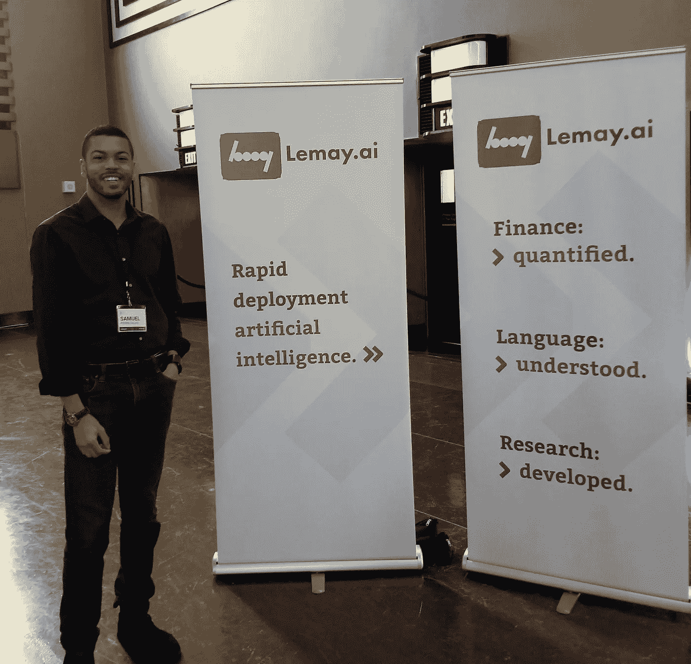

# 向商务人士推销人工智能

> 原文：<https://towardsdatascience.com/pitching-artificial-intelligence-to-business-people-f8ddd8fb2da2?source=collection_archive---------12----------------------->

## 从银弹综合症到一线希望

在这篇文章中，我计划与你分享我们最近向商界人士推销人工智能的经验，以及我们在这一过程中吸取的教训。

作为一家人工智能专家的小公司，我们遵循认知营销方法。我们不是仅仅依赖一个营销渠道，而是参加像多伦多机器学习峰会这样的会议。虽然这是一个很好的方式来满足上升的人才，并产生线索和压力，在线游戏也很重要。

[Sam](https://www.linkedin.com/in/samuel-pierre-gilles/) and I manned the booth @ TMLS. Special thanks to [Dave Scharbach](https://medium.com/u/74fb6f5802d2?source=post_page-----f8ddd8fb2da2--------------------------------) for continuing to exceed expectations on organizing the 1K person annual event.

我们已经为企业客户提供人工智能咨询近 3 年了，几个月前，我们认为几个简短的营销视频是与世界分享我们所做事情的好方法。

事实证明，我们有很多东西要了解商业人士在观看视频时是如何误解人工智能技术的当前能力的。我们的内容营销方法在博客和 LinkedIn 上效果很好，但是视频营销的效果不佳。让我们来谈谈哪里出了问题，以及我们做了什么来修复它。

我们开始将我们的能力提炼成一些有趣的片段(见下文),向决策者展示我们在做什么，以及为什么这对他们很重要。第一步是建立概念:展示人工智能的各种应用，以暗示我们的专业知识。

以下是我们想要传达的 6 条关键信息:

*   **适应或者死亡:**不采用 AI 的人会被采用 AI 的竞争对手和新人吹走
*   **AI 分析的文档:**目前由人类执行的文档处理解决方案的自动化。更一般地说，业务流程自动化
*   **我们的人工智能开发能力:**一般来说，定位我们，说我们为企业客户做人工智能的事情
*   **释放数据的价值:**通过创建人工智能系统来提高收入、质量和成本等关键绩效指标，从而实现数据货币化
*   **边缘计算:**将你的 ML 模型部署到移动应用中，这样你就不需要海量的 GPU 能力来做推理了
*   **人工智能真正的样子:**在 tensorboard 中显示嵌入向量，因为它很酷

愿景对我们来说似乎很清晰，我们直接投入了生产。

## 银弹综合症——严酷的现实考验

我们对我们的新视频内容感到非常自豪，我们计划并在 LinkedIn 上发布我们的视频，但令我们惊讶的是，我们获得了很多浏览量，却很少有线索。总之，这些线索并没有改变我们人工智能产品和服务的销售。

在跳到解决方案之前，让我们先看一下我们创建的内容，让您对这个问题有个大概的了解。以下播放列表包含 10 个预告视频。花点时间看看这些短片，想想一个没有 AI 背景的 [CxO](https://whatis.techtarget.com/definition/CxO) 的反应，或者它是如何工作的。以下是预告视频的播放列表:

A playlist of 10 teaser videos advertising our AI services.

一旦我们了解到活动进展不顺利，我们就从广告上退一步来评估哪里出了问题。

发生的情况是，我们的“决策者”客户在 C-suite 职位上对内容做出了我们没有预料到的假设。当我们展示一个人工智能生成艺术的例子时，我们的观众认为我们有一个只进行人工智能艺术生成的产品。更狭隘的是，他们认为我们只制作日本动漫艺术。我们试图展示专业知识，但却被解释为产品特性和功能的狭窄范围。我们的目标客户认为我们在销售视频中的应用程序，而不是制作应用程序所需的功能，这是我们的错误。

> **问题:我们试图展示专业知识，但却被解释为产品特性和功能的狭隘范围。**

有过这种经历后，我喜欢用一个类比来说明，潜在客户认为刀切肉的视频告诉他们，我们卖的刀只切肉。然而，我们卖切蔬菜、手指、费用和时间的刀。我们的结论是，为了解释先进的人工智能能力，需要更长更深入的内容。观看上面的视频，回想起来，你会发现理解一个复杂主题的短视频中的信息是多么困难。

## [一线希望](https://www.urbandictionary.com/define.php?term=Silver%20lining)——我们发现并修复了问题

那么，有哪些[有效内容的例子](https://www.youtube.com/watch?v=uTjb6WhOd1A)？

基本上是长格式内容，高制作价值的真实媒体机会。以下是我们点击的 4 个内容示例。双关语。我选择了 4 个不同的人工智能项目来表明，推介人工智能更多的是关于价值信息，而不是人工智能本身。

> 详细内容:在 VanillaSoft 为 [Lemay.ai](http://Lemay.ai) 举办的人工智能网络研讨会

This one hour long webinar on AI led to a bunch of leads and conversations that we did not see from the teaser videos.

在我们的一个客户那里举行的网上研讨会是一个友好的场所，在现场观众的参与下，讨论了我对行业发展的看法。我去年曾指出，由于缺乏数据科学家，小公司比大公司更糟糕，现在我们已经成长，行业也成熟了，我觉得是时候重新讨论人工智能咨询业务的发展了。我们获得了很好的注册人数(约 150)，这些人数转化成了潜在客户，然后我们还从在线观看内容的人那里获得了后续联系。

> 解说视频: [Stallion.ai](http://Stallion.ai) 文档理解介绍

Stallion.ai document understanding intro video (2 minutes instead of 13 seconds). [Stallion.ai](http://Stallion.ai) is our venture in the UAE, serving the MENA region.

一旦我们理解了短视频的问题所在，我们就能在视频制作中获得更多的细节。这段讲解文档处理的视频介绍了问题、解决方案、价值主张以及解决方案的一般性。新视频并没有展示一个飞过的演示，而是希望观众能明白其中的意思，而是清楚地展示了这项技术的能力，以及价值得以实现的原因。

> 高级别介绍:[内部审计人工智能 AuditMap.ai](http://AuditMap.ai)

AuditMap.ai intro video on making sense of internal reports with AI. It is one minute long.

在这个视频中，我们决定不显示用户界面，因为它会随着我们为客户添加新功能而不断变化。我们实际上是在上述 10 个预告剪辑之前开发了这个审计图介绍视频。在播放这个视频后，我们一直在问一个主要问题，那就是“我能看看演示吗？”我对这个问题没有问题，因为我们为大约 1 小时的演示保留了好的内容。AuditMap 非常复杂，我们不想在与客户(通常在银行业)实际交谈之前展示太多内容，以便在电话直播中解决他们的问题。

> 激发用例:investifai.com[人工智能资产管理简介](http://investifai.com)

3 minute intro video to investifai

它需要大量的内部审议和客户互动，以找出什么样的信息对投资者有效。他们是与我们通常的决策者客户完全不同的细分市场。我们必须非常简单地强调关键点:人工智能不是情绪化的。没有计算机，投资组合管理对人类来说太复杂了。在这个周期结束的时间点，风险调整后的回报是必不可少的，市场变得越来越可怕，将资金投入一个资产类别不是一个明智的选择。

到目前为止，这个视频的反馈是积极的。

## 结论

在这篇文章中，我开始给你一个快速回顾我们在营销我们的人工智能开发能力和解决方案的道路上的坎坷。我们发现，为了解释这些人工智能能力，需要更长的内容。不管底层技术如何，内容需要向观众推销为什么解决方案更好，而不是为什么解决方案更酷。

如果你喜欢这篇文章，那就看看我过去读过最多的文章，比如“[如何给人工智能项目定价](https://medium.com/towards-data-science/how-to-price-an-ai-project-f7270cb630a4)”和“[如何聘请人工智能顾问](https://medium.com/towards-data-science/why-hire-an-ai-consultant-50e155e17b39)”我还准备了一些关于寻求采用机器学习的公司所面临的其他问题的文章，比如“[没有云和 API 的机器学习](https://medium.com/@lemaysolutions/locked-in-a-box-machine-learning-without-cloud-or-apis-76cc54e391c8)”

下次见！

丹尼尔

您可能喜欢的其他文章:

*   [人工智能和不良数据](/artificial-intelligence-and-bad-data-fbf2564c541a)
*   [人工智能的图像数据集](/image-datasets-for-artificial-intelligence-bbb12615edd7)
*   [人工智能:让你的用户给你的数据贴上标签](https://medium.com/towards-data-science/artificial-intelligence-get-your-users-to-label-your-data-b5fa7c0c9e00)