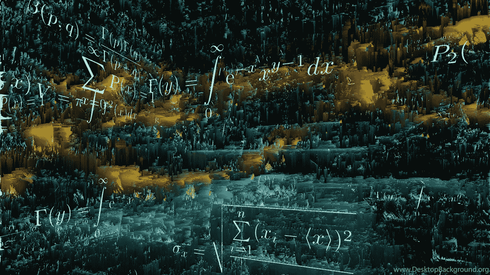
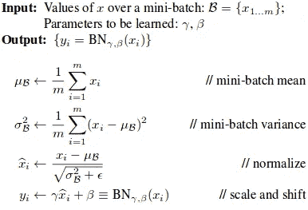
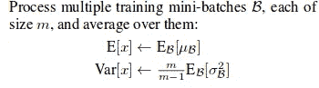
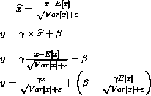

# 张量流批量范数的缺陷和训练网络的健全性检验

> 原文：<https://towardsdatascience.com/pitfalls-of-batch-norm-in-tensorflow-and-sanity-checks-for-training-networks-e86c207548c8?source=collection_archive---------2----------------------->



## 在这篇文章中，我将写下我们在编写深度学习模型和一些健全性检查时犯的错误，这将帮助你缩小小守护进程的范围，并挽救你的夜晚睡眠。

# I .让我们一劳永逸地完成 TensorFlow 中的批量定额

## 批量标准化的简要理论

这项革命性的技术是由 Sergey Ioffe，Christian Szegedy 在[论文](https://arxiv.org/pdf/1502.03167.pdf) [，](https://arxiv.org/abs/1502.03167)中介绍的，到目前为止被引用了 4994 次。根据该论文，批量标准化减少了内部协方差移动，即，它使得网络中各层的学习更加相互独立。批量范数层的目标是向激活层输入，单位高斯，使得神经元在 sigmoid 和 tanh 的情况下不会饱和。它有助于网络的快速收敛，允许你不用关心权重的初始化，作为正则化来代替丢失和其他正则化技术。现在我不会讨论太多的理论细节，而是更多地讨论实现。我将带您了解 TensorFlow 及其数学中批处理规范的实现。
在训练的时候-



At training time. Images taken from Batch Normalization paper.

现在假设卷积层和激活层之间使用批量范数层，那么 ***x*** 是卷积层的输出， ***y*** 是批量范数层的输出，输入到激活层，可能是 ReLU，sigmoid 等。批量定额层学习参数 ***γ*** 和 ***β*** ， ***y*** 取决于它们的值。因此，示出了使用 ***γ*** 和 ***β*** 来学习 ***x*** 的最佳表示。请注意另外两个统计量，即***【x】***和***Var【x】***、总体均值和方差。它们是通过训练期间的移动均值和移动方差来估计的。

在推断的时候-



At inference time

推理时向前通过批范数层与训练时不同。在推断时，我们不用批均值(*)和方差(***【σ2***)而是用总体均值(***e【x】***)和方差(***var【x】***)来计算 ***x^*** 。假设您在推断过程中给定批量大小为 1 的批，并使用批均值和批方差进行归一化，在这种情况下，*为 ***μ=x*** 然后 ***y=β*** ，这表明层输出*(****y**)*对于任何输入 *(* **)因此，为了在推断时进行标准化，我们使用总体均值和方差，这是我们在训练期间使用移动均值和方差计算的。在下一节中，我们将介绍 TensorFlow 中批处理规范的实现。******

## **TF 中批量定额的注意事项**

*   ****移动平均值和方差不更新:** 张量流是基于图形的，计算按依赖关系的顺序进行。**

```
**import tensorflow as tfa = tf.placeholder(tf.float32, shape=[1,3])
b = tf.placeholder(tf.float32, shape=[1,3])
c = tf.Variable(tf.zeros([1, 3]), dtype=tf.float32) def train(a,b):
    c = tf.add(c,a)
    e = some_train_op(a,b)
    return eoutput = train(a,b)
loss = tf.log(output)sess = tf.Session()
saver = tf.train.Saver()
sess.run(tf.global_variables_initializer())for itr in range(1000):
    ls = sess.run(loss, {a:x, b:y})saver.save(sess, some_path)#Note that this code is for reference only.** 
```

**现在，在此我们运行 ***损失*** 张量在每次迭代中，对于每次迭代 ***列车*** 函数都会被调用。 ***c*** 是一个变量，对所有迭代的 ***a*** 的值求和。因此，当我们保存模型时，我们期望变量 ***c*** 等于在每次迭代中传递给占位符*的所有值的总和。***

***让我们详细分析一下，这个模型的图中的依赖关系。当我们运行 ***损失*** 张量， ***输出*** 将被计算然后 ***输出*** 将调用 ***列车*** 从 ***e*** 中需要哪个值，将使用*和 ***b*** 来计算在所有这些计算中 ***c*** 根本不会被计算为 ***损失*** 张量的值不依赖于 ***c*** 。解决方法是在计算*e 之前加上 ***c*** 作为依赖。因此，解决方案*****

```
**def train(a,b):
    c = tf.add(c,a)
    with tf.control_dependencies([c]):
        e = some_train_op(a,b)
    return e**
```

**在训练网络时，我们调用优化器 op 来完成所有计算并更新所有权重，但是优化器 op 从不依赖于移动平均值或方差的计算。因此，移动平均值和方差永远不会更新，而是保持其初始值。**

**解决方案:TensorFlow 为批量规范化提供了三个主要函数**

```
****tf.nn.batch_normalization()** - Never use this for training, it just compute the y = gamma*x^hat + beta where x^hat = (x-mean)/std_dev.
It doesn't account for keeping moving mean and variance. **tf.layers.batch_normalization()** -This function can be used for your model. Note: Always add batch norm dependency when using this, either on optimizer op or any other op which you sure that will execute when optimizer op is run. ex:-update_ops = tf.get_collection(tf.GraphKeys.UPDATE_OPS)                            with tf.control_dependencies(update_ops):                                                            
    self.solver = tf.train.AdamOptimizer(learning_rate=1e-04) 
                  .minimize(self.loss)Here tf.GraphKeys.UPDATE_OPS is the collections which have moving mean and variance op. **tf.contrib.layers.batch_norm()** - This function is in contrib module of TensorFlow. This function gives two ways to add dependencies as follows:
1.It has '*update*' parameter, set *update=None* while calling the function and dependency will be added inside the function itself and you don't have to anything else.
**Note:This is believed to be slow in comparison to the next method.**2\. Let the *update* parameter have it's default value which is "*tf.GraphKeys.UPDATE_OPS*". Now here also you have to manually add dependency as above with tf.layers.batch_normalization().**
```

**因此，您可以使用**TF . layers . batch _ normalization()或 TF . contrib . layers . batch _ norm()**进行适当的更新依赖处理。**

*   ****训练和测试时的不同用法:**
    从训练到测试时，我们要在批均值和方差或者总体均值和方差之间切换。我们在 tf.contrib.layers.batch_norm()和 tf.nn.batch_normalization()中分别有参数`is_training`和`training` 。当其值为`True`时，使用批均值&方差并更新移动均值和方差来估计总体均值和方差。在`False`上，使用总体均值和方差。因此你应该为此使用一个占位符`train_phase`。因此，解决方案如下所示**

```
**def Bn(x, **is_train**):
        return tf.contrib.layers.batch_norm(x, decay= 0.99,                                                                                                               
          ***is_training=is_train***,center= True, scale=True, 
          reuse= False)*train_phase = tf.placeholder(tf.bool, name="is_training")*
data = tf.placeholder(tf.float32, shape=[None,240,240,3],                                                                                                        name="Image") bn_layer = Bn(data, train_phase)loss = some_loss_op()solver = tf.train.AdamOptimizer().minimize(loss)# Training iteration
sess.run(solver, {data: input_data, *train_phase:True*})#Validation iteration
sess.run(loss, {data: input_data, *train_phase:False*})**
```

*   ****共享批次范数参数:** 通常你在两个并行网络中共享权重，比如 siamese 或者在 GANs 的鉴别器中。当您共享您的重量时，批量定额参数也会被共享。有时候，跨两个网络共享批量定额参数也不能健康，具体什么时候我会告诉你。
    假设我们正在训练一个 GAN，它将有两个具有共享参数的鉴别器实例，当训练开始时，伪图像和真实图像的分布是不同的。现在我们用两种不同的分布来更新移动平均值和方差，一种是假图像，另一种是真实图像。但是随着训练的继续和生成器学习真实数据的分布，假数据和真实数据的分布最终变得近似相同。然后我们在更新同分布的均值和方差，所以我们的总体均值和方差应该是完整训练后真实数据的估计统计量。因此，理论上，在 GANs 的情况下，共享批量定额参数可能不是一个大问题。但是我会在这两种条件下做一些实验，并在新的博客上更新实验结果。
    现在 [**这篇博文**](https://www.alexirpan.com/2017/04/26/perils-batch-norm.html) 可以很好地解释共享批量定额参数会对模型的准确性产生不利影响的情况，并具有更好的可视化效果。
    简而言之，在两个共享批次范数层的输入分布相同之前，共享批次范数参数是可以的，如果不是这种情况，请尝试在上述批次范数函数中使用`reuse=False`，这将允许您在想要共享权重的两个网络中拥有独立的批次范数参数。**

## **二。健全性检查和调试-**

*   ****端到端图像模型:**
    在图像分割或深度预测等以图像为输入的任务中，我们希望输出大小相同的图像。训练您的模型以学习身份函数，即将输入图像作为目标图像。在这种情况下，网络将代表身份功能。如果这是完美的训练，但你仍然无法学习分割或深度，可能是你的模型没有足够的能力。你可以尝试添加更多的层或可能更好的损失功能为您的任务。**
*   ****目标和输出范围:**
    如果您已经将目标图像归一化为 0 到 1，那么请确保在图像生成层中使用 sigmoid 作为激活函数，而不是 tanh，因为 tanh 将具有-1 到 1 的范围，这将使学习变得困难。如果归一化在-1 到 1 之间，则使用双曲正切。**
*   ****波动损失:**
    最可能的原因可能是您的机型没有足够的容量。因此，权重快速改变以学习模型，但是由于容量有限，它们保持快速改变它们的权重，但是从未接近最优。你也应该试着降低学习速度。**
*   ****超参数:**
    千万不要忽略超参数。一般来说，它们对于你的网络的准确性和性能可能不是非常关键，但是对于训练的收敛性和稳定性绝对是非常重要的。疏忽的权重初始化可能导致网络中的梯度或 NaNs 被利用/消失。如果你使用正态分布，检查你的权重初始化的 std_dev，范围[0.2，0.01]是可以的。如果损失表现异常，学习率和批量大小是首先要试验的。**
*   ****顺序数据的混排:**
    当您的输入数据是顺序数据时，这种情况在视频中最常见，如自动驾驶中的分段、深度预测等。你应该考虑改变数据，用连续数据训练会对测试中的模型准确性产生负面影响。
    **注:每当任务需要时间一致性时，如光流、视觉里程计等，你应该有顺序数据。****
*   ****缩放损耗:**
    如果您在网络中使用一种以上的损耗类型，例如 mse、对抗性、L1、[特征损耗](https://arxiv.org/pdf/1603.08155.pdf)、 [SSIM](https://www.tensorflow.org/api_docs/python/tf/image/ssim) ，那么请确保所有损耗都被适当缩放到相同的阶数，即 MSE 为 1e-01，特征损耗为 1e03，然后将特征损耗缩放到相同的阶数。**
*   ****图形可视化，这场战争中最大的武器:**
    如果你使用 TF 和其他有可视化工具的框架。您应该使用可视化来检查连接，它们将帮助您找出遗漏的连接、尺寸误差或重量分配误差。**
*   ****共享批量定额参数:**
    如上所述，如果您在两个网络中共享批量定额参数，那么请确保两个网络的输入数据分布相同。**

**这篇[博文](https://blog.slavv.com/37-reasons-why-your-neural-network-is-not-working-4020854bd607)还详尽列举了你的网络失败的其他原因。**

**感谢大家阅读这篇博客，希望它能拯救你与批量定额和培训网络的斗争。我欢迎您的所有评论，如果您想添加任何内容或觉得任何内容有误导性，请告诉我。如有疑问，可发邮件至 dishank.bansal@iitkgp.ac.in 联系我。**

## **参考资料:**

*   **[https://arxiv.org/abs/1502.03167](https://arxiv.org/abs/1502.03167)—批量定额纸**
*   **[https://r2rt . com/implementing-batch-normalization-in-tensor flow . html](https://r2rt.com/implementing-batch-normalization-in-tensorflow.html)**
*   **[https://medium . com/machine-learning-world/how-to-debug-neural-networks-manual-dc2a 200 F10 f 2](https://medium.com/machine-learning-world/how-to-debug-neural-networks-manual-dc2a200f10f2)**
*   **[https://github . com/tensor flow/tensor flow/blob/r 1.8/tensor flow/python/layers/normalization . py](https://github.com/tensorflow/tensorflow/blob/r1.8/tensorflow/python/layers/normalization.py)**