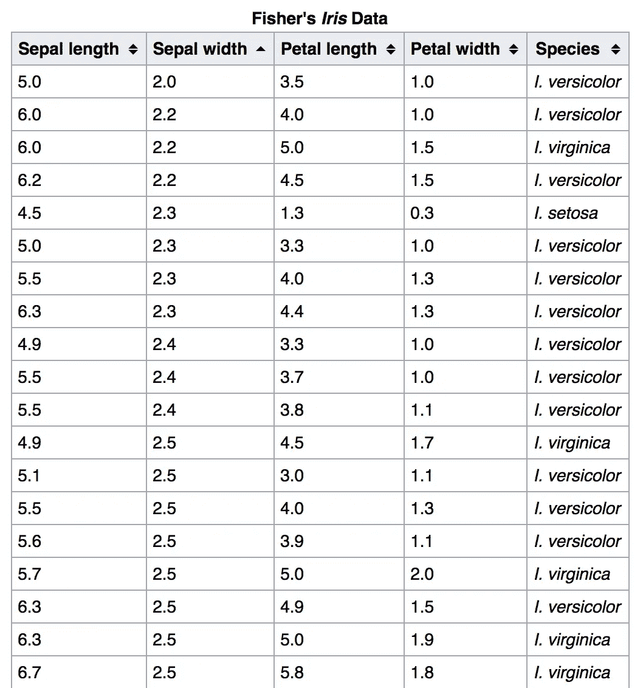
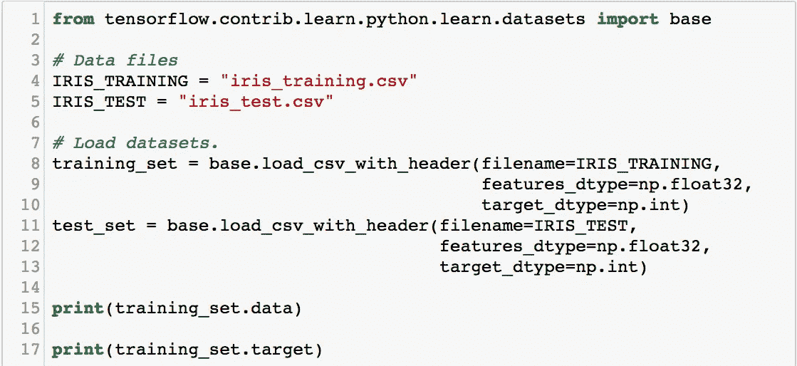
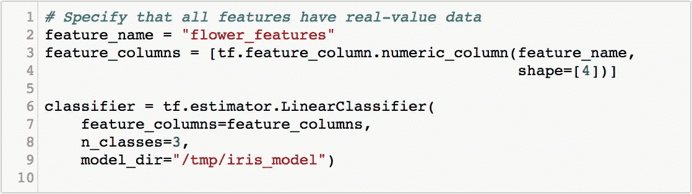
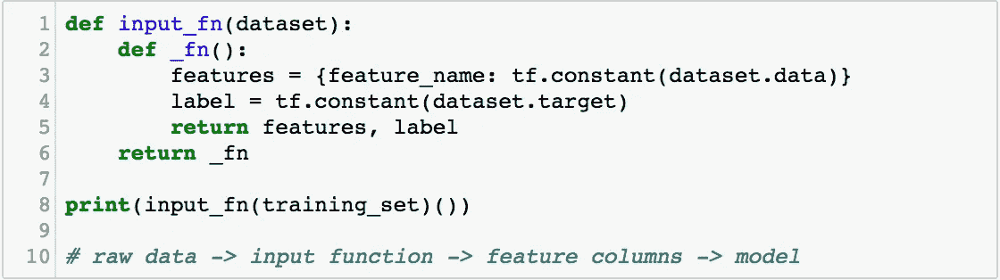
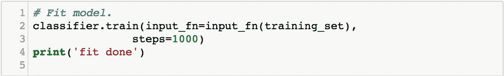
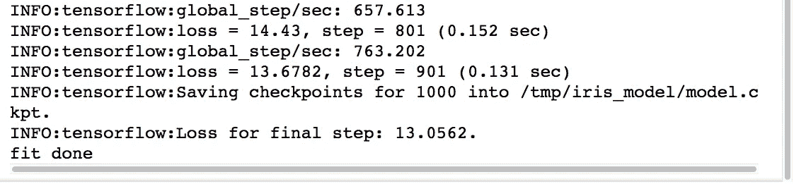
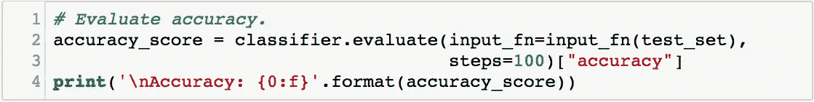
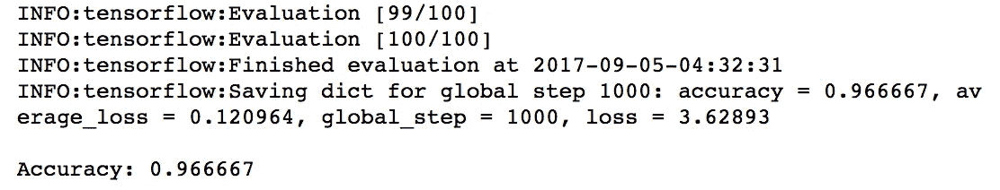

# 简单估计量

> 原文：<https://towardsdatascience.com/plain-and-simple-estimators-d8d3f4c185c1?source=collection_archive---------2----------------------->

机器学习很棒，除非它强迫你做高等数学。机器学习的工具变得越来越好，训练你自己的模型变得前所未有的简单。

我们将利用我们对数据集的理解，而不是对原始数学的理解来编写一个模型，让我们获得洞察力。

在这一集里，我们将只用几行代码来训练一个简单的分类器。以下是我们今天要看的所有代码:

# 机器学习的张量流估计器

为了训练我们的分类器，我们将使用 TensorFlow，谷歌的开源机器学习库。TensorFlow 有一个相当大的 API 面，但是我们要关注的部分是高级 API，称为估计器。

评估人员为我们打包了训练循环，因此我们可以通过配置它来训练模型，而不是手工编码。这去掉了许多样板文件，允许我们在更高的抽象层次上思考。这意味着我们将开始玩机器学习的有趣部分，而不会陷入太多的细节。

由于到目前为止我们只讨论了线性模型，我们将把它放在这里。我们将在将来再次讨论这个例子，以扩展它的功能。

# 花卉分类:就像葡萄酒 vs 啤酒一样有趣？

本周我们将建立一个模型来区分三种不同类型的非常相似的花。我意识到这是一个*小*有点不如前一集的啤酒和葡萄酒令人兴奋，但这些花有点更难区分，使这成为一个更有趣的挑战。

 [## 机器学习的 7 个步骤

### 从检测皮肤癌，到分拣黄瓜，到检测需要维修的自动扶梯，机器学习已经…

medium.com](https://medium.com/towards-data-science/the-7-steps-of-machine-learning-2877d7e5548e) 

特别是，我们将对不同种类的[鸢尾花](https://en.wikipedia.org/wiki/Iris_flower_data_set)进行分类。现在，我不确定我能从一片玫瑰丛中挑出一朵鸢尾花，但我们的模型旨在区分鸢尾、杂色鸢尾和海滨鸢尾。

Iris Setosa, Iris Versicolour, and Iris Virginica

我们有一个测量这些花的花瓣和萼片的高度和宽度的数据集。这 4 个栏目将作为我们的“特色”。

# 加载数据

导入 TensorFlow 和 NumPy 后，我们将使用 TensorFlow 的`load_csv_with_header`函数加载数据集。数据或特征以浮点数表示，每行数据或目标的“标签”记录为整数:0、1 或 2，对应于 3 种花卉。

我已经打印出了我们加载的结果，我们可以看到，我们现在能够使用命名属性访问训练数据和相关联的标签或目标。

# 建立模型

接下来，我们将构建模型。为此，我们将首先设置特性列。要素列定义了进入模型的数据类型。我们使用一个 4 维特征列来表示我们的特征，并将其命名为“flower_features”。

使用估计量建立我们的模型非常简单。使用“tf.estimator.LinearClassifier ”,我们可以通过传入刚刚创建的特征列来实例化模型；模型预测的不同输出的数量，在本例中为 3；以及一个存储模型的训练进度和输出文件的目录。这使得 TensorFlow 可以在需要时从中断的地方继续训练。

# 输入功能

这个分类器对象将为我们跟踪状态，我们现在*几乎*准备好继续训练了。将我们的模型与训练数据联系起来还有最后一个环节，那就是输入函数。输入函数的任务是创建张量流操作，为模型生成数据。

因此，我们从原始数据到输入函数，输入函数传递数据，然后由特征列映射到模型中。请注意，我们对特性使用了与定义特性列时相同的名称。这就是数据的关联方式。

# 运行培训

现在是时候开始我们的训练了。为了训练我们的模型，我们只需运行 classifier.train()，将输入函数作为参数传入。这就是我们连接数据集和模型的方式。

train 函数处理训练循环并在数据集上迭代，每一步都提高其性能。就这样，我们完成了 1000 个训练步骤！我们的数据集并不大，所以完成得相当快。

# 评估时间

现在是时候评估我们的结果了。我们可以使用之前的相同分类器对象来实现这一点，因为它保存了模型的训练状态。为了确定我们的模型有多好，我们运行 classifier.evaluate()并传入我们的测试数据集，并从返回的指标中提取准确性。

我们得到了 96.66%的准确率！一点都不差！

# 评估人员:简单的工作流程

让我们在这一周暂停一下，回顾一下到目前为止我们使用估算器所取得的成果。

Estimators API 为我们提供了一个很好的工作流程:获取原始数据，通过输入函数传递数据，设置我们的特征列和模型结构，运行我们的训练，以及运行我们的评估。这个易于理解的框架允许我们考虑我们的数据及其属性，而不是数学的基础，这是一个很好的地方！

# 下一步是什么

今天我们看了 TensorFlow 的高级 API 的一个非常简单的版本，使用了一个固定的估计器。在未来的几集中，我们将探讨如何用更多的细节来扩充这个模型，使用更复杂的数据，并添加更多的高级功能。

喜欢这一集吗？在 YouTube 上查看整个播放列表！