# 行星蜂巢

> 原文：<https://towardsdatascience.com/planet-beehive-aeca53ba0326?source=collection_archive---------24----------------------->

## Ep。1:探索我们星球的旅游活动

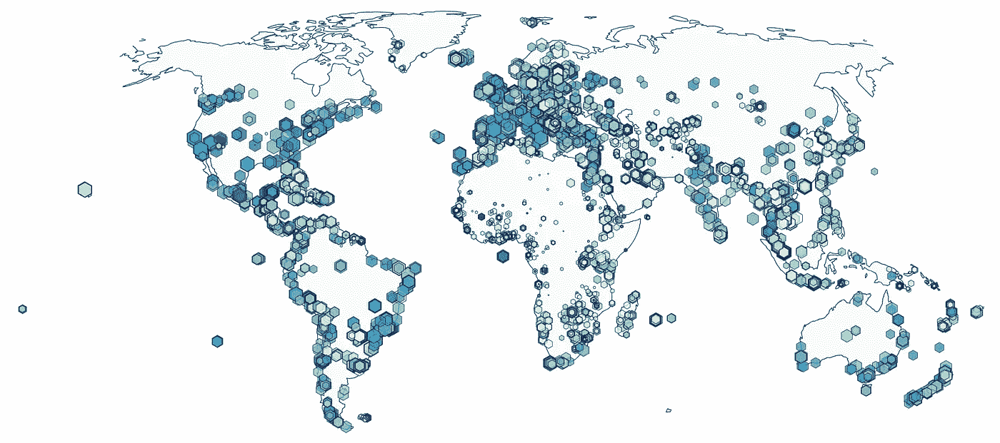

Our output for today; Make sure to read below how we get there; Calculate our measures and for a interactive visualization

闭上你的眼睛一秒钟，忽略外面的雨滴，新邮件的嘟嘟声，深入思考你的待办事项清单上的十项全球活动..

老实说，有多少人参加了世界上最常去的活动？这没什么不好，他们来访是有原因的。然而，它们真的值得我们花费有限的资源去那里旅行吗？或者有没有其他没有立即想到的选择？

这些问题是我们今天想要回答的问题。我们能否客观地创建一个衡量标准，不仅代表访问量最大的活动，还代表*评分最高的*全球活动，我们能否将这些活动可视化为一个易于发现的新珍珠地图？

# 我们的方法

1.  我们将查看当前可用的度量，并根据需要对数据进行 ***转换*** 以增强下游分析和可视化

3.  **在地区、国家和个人活动水平上执行 ***探索性数据分析*** ，以验证我们新创建的衡量标准**
4.  *****将我们的数据可视化到一个交互式图表中，我们将在接下来的几集里将这些数据修改到一个交互式仪表盘中*****

# **数据**

**我们今天将使用的数据包括:活动元数据、评论数量、用户评级和一些额外的地理数据。我们最初将从以下来源获得这些信息:**

*   **:*收集******的活动，用户评论数和他们的评分*** *，他们收集的活动将是我们的起点。在这里，我们只关注在每个国家的“首要任务”清单上的活动或有超过 750 条评论的活动。*****
*   ****[Google](http://www.google.com) : *通过使用 Google Places 和 Geocoding API，我们丰富了来自猫途鹰的活动数据，收集来自 Google 用户的* ***地理数据*** *(即坐标)以及***。******
*   ****[CIA World Factbook](https://www.cia.gov/library/publications/resources/the-world-factbook/) : *关于国家的参考数据(大小，公民等。)我们将使用《中情局世界概况》中的综合数据库。我们从 174 个国家开始*****

# ****数据转换****

****我们的数据集从 7，044 个活动开始，其中 5，971 个活动我们还可以得到谷歌用户评级。今天练习的良好开端。****

****让我们通过创建两个散点图来看看数据是什么样的，这两个散点图包含我们最关心的 4 个指标:一个包含**纬度**和**经度**，另一个包含**评论数量**和**每项活动的平均评分******

****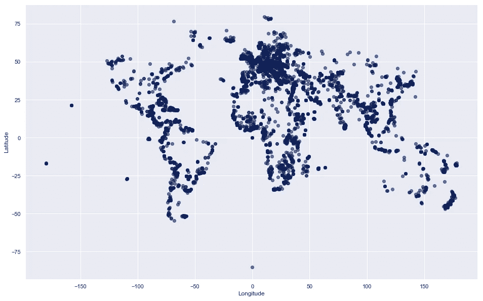********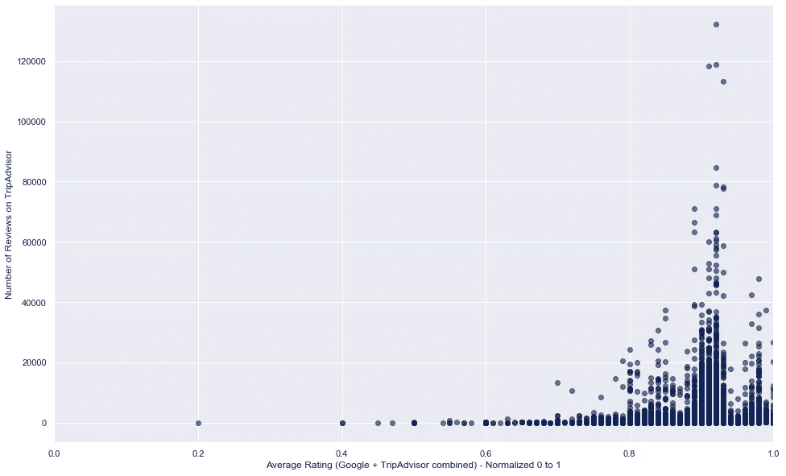****

****Fig. 1, 2 Scatter plots created with Matplotlib in Python****

****以下是一些初步要点:****

*   ****欧洲的活动似乎非常多。这可能是由使用猫途鹰的用户偏见造成的。然而，总的来说，我们的地理数据看起来很干净，我们有一个适当的全球多样化。****
*   ****我们喜欢给高收视率！几乎没有低于 6/10 的评分，显然大多数评分都高于 8/10。简单的平均综合评分甚至是惊人的 8.98/10！****
*   ****说到评论的数量，似乎大多数活动只有 20，000 或更少的评论。与此同时，有相当多的离群值，以及超过 120，000 条评论的明确亮点活动！(你能猜出这是哪个亮点吗？)****
*   ****评论的数量和平均评级标准都不是正态分布的****

****而后者是我们这里的重点。因为我们今天的目标是使用这些度量来进行比较，所以我们希望在这两种情况下获得尽可能多的正态分布度量集。*图 2* 告诉我们一些关于这两个度量的信息，以及它们是如何分布的。****

****首先来看一下**评论数量**，考虑到大量较小的值和非常有限的非常高的值，我们似乎正在处理一个对数正态分布。为了证实这一观察结果，我们将绘制两个 QQ 图，一个具有正常轴，另一个具有对数轴，一条直对角线将证实正态分布:****

****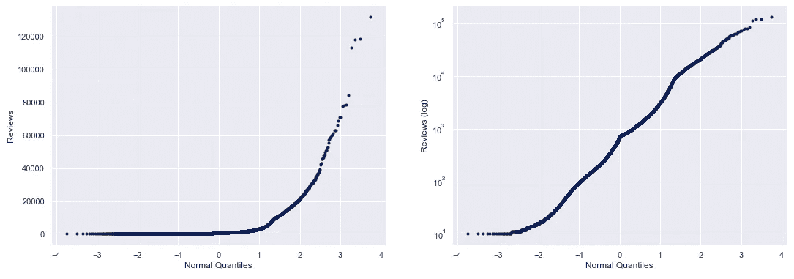****

****Fig. 3, 4 QQ plots with regular y-axis (left) and log y-axis (right) produced with [Probscale](https://matplotlib.org/mpl-probscale/api/probscale.html) in Python****

****正如所料，对数标度比常规标度更适合正态分布数据集。因此，我们将对审核措施的数量应用 LOG10 转换。我们将使用这一新方法来比较未来的评论。****

****然后进行**平均评级的分配。**这里的问题似乎不一定代表数据的偏斜，而是用户给出过高评级的问题。如果只看 8 分以上的评分，这种分布似乎更接近正常。****

****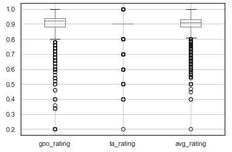****

****Fig. 5 Boxplots produced with Pandas in Python****

****我们可以用左边的方框图来证实这一观察结果。查看每个评级值以及两个来源的平均值，我们可以看到，在 8 到 10 之间的分布可以被视为正态分布，任何低于 8 的评级都有异常值。****

****因此，我们将把数据转换成一个新的衡量标准，其最低阈值为 0.8(意味着 0.8 等于≤ 0.8)****

****最后一步，我们将对这两个测量值应用最小最大归一化。****

****现在，我们可以在下面的 jointplot 比较中比较转换后的度量的分布与原始度量的分布:****

****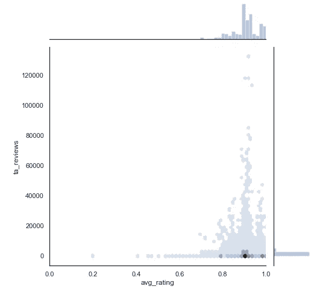********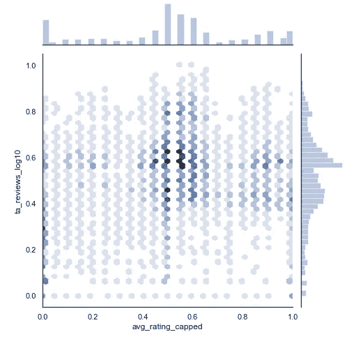****

****Fig. 6, 7 Combined distribution plots Before and After respectively created with Seaborn in Python****

****由此，我们可以创建一个新的度量，它应该代表这两个度量的最佳组合。将它们相乘将得到一个值，该值代表评论数量的加权分数(即评论越多，其评级越可靠):****

> ******活动评分:******
> 
> ****正常。平均下限。访客评级*****
> 
> ****(规范。log10 审核计数/平均值(标准。log10 审核计数))****

# ****探索我们的活动****

****既然我们已经创建了评分标准，我们就可以开始研究数据了。****

****让我们首先将全球区域的活动评级与每项活动的平均点评数进行比较:****

****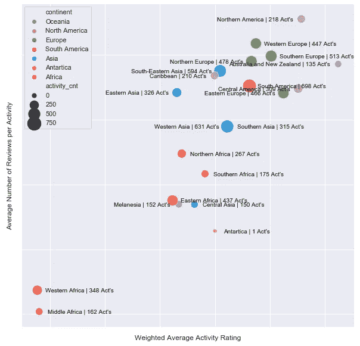****

****Fig. 8 Scatter plot generated with Seaborn in Python****

****现在越来越有趣了！这里有些非常特殊的事实可能会违背你的先入之见。****

****首先，在高水平上，这两个变量之间显然存在正相关关系。这自然是有道理的，活动评价越高，就会有越多的人来参观。当然，直到你到达一个点，访问者的数量在评级中变成一个负变量:****

> ****没人去那里了。太拥挤了。****

****其次，看看平均评论数量排名前三的地区，这些似乎是我们许多人都可以猜到的顺序。西欧、南欧和北美有许多著名的旅游热点，接待许多游客，因此平均每项活动也有许多评论。****

****排名前三的地区也是如此:澳大利亚和新西兰、中美洲和北美洲是经常被称赞的地区。我个人认为最令人惊讶的地区是东欧，排名第四，领先于任何其他欧洲地区！****

****最后，从大洲的角度来看:美洲和欧洲表现最好，而亚洲、大洋洲和非洲则表现得更加分化。尤其是西部和中部非洲在这两项指标上都是绝对垫底的，而南部和北部非洲也没有落后其他地区太多。****

****让我们转到国家视图，根据加权平均评级绘制排名前 10 位和后 10 位的国家，看看我们能从中得到什么:****

****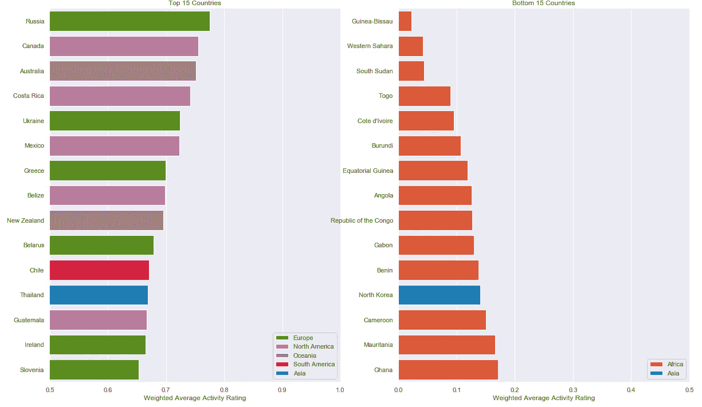****

****俄罗斯占据了头把交椅！对于我们中的一些人来说，这可能是出乎意料的，但同时我们看到乌克兰也进入了前 5 名，与之前的地区概况完全一致，另外两个东欧国家也进入了前 15 名(白俄罗斯和斯洛文尼亚)****

****我想对我们大多数人来说，前 15 名中的所有其他国家都是显而易见的，它们都是非常著名的度假目的地。可能最令人惊讶的是看到辣椒击败所有其他美国南部国家。****

****很高兴看到前 15 名来自七大洲中的 5 个国家。但是排名最后的 15 个国家看起来没有那么多样化，而且几乎完全由非洲国家主导(更准确地说，主要是西非和中非)。朝鲜是唯一一个来自另一个大陆的国家，能够融入这个不那么有声望的名单。****

****为了让这些国家的热点在全球范围内更加明显，我们可以创建一个全球热图，绘制每个国家的加权平均活动得分:****

****Interactive Chart #1\. Choropleth Map created with [Plotly](https://plot.ly/)****

****这个图很大程度上证实了我们以前已经发现的东西。有明显的热点地区，包括欧洲(尤其是东欧和西南欧)、北美(尤其是加拿大和中美洲)、大洋洲和南美洲，尽管巴拉圭和北部的一些小国是这些地区的负面离群值。****

****“冷”点在非洲中部和西部最为明显。而南部、北部以及东部非洲的一些地区得分略高。亚洲的情况非常复杂，一些国家属于绝对寒冷地区(朝鲜、巴布亚新几内亚、吉尔吉斯斯坦)，而其他国家的得分很高(泰国、土耳其、也门)。****

****到目前为止，我们已经很好地了解了地区和国家是如何被同路人评价的，现在是时候看看个人活动了。毕竟，我们今天的目标是在地图上标出每个活动，并使其在平均评分和评论数量上具有可比性。****

****因此，在下面的图中，我们看到了纯粹基于*评论数量*的前 15 项活动，以及基于我们新创建的评分标准的前 15 项活动:****

****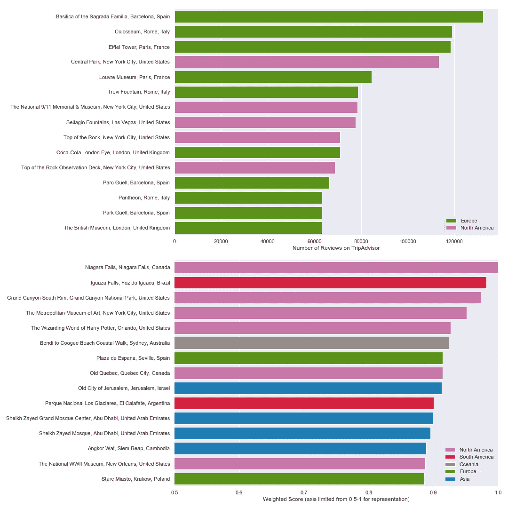****

****多么有趣的差异啊！一些关键要点:****

*   ****在**评论数**前 15 名的活动，可能没有一个让任何人感到非常惊讶；完全被欧洲和北美(实际上是纽约)的著名活动所主导。****
*   ****同时，我们新创建的**加权评分指标**中的前 15 项活动反映了当前各大洲的高度多样性(7 个中的 5 个),并且肯定包括了一些我个人的新列表条目。****
*   ****令我惊讶的是，没有一个基于评论数量的顶级活动也能进入加权得分排行榜。这意味着他们在网上获得的平均评分明显低于加权评分活动的前 15 名。****
*   ****虽然上面的图表主要是欧洲的活动，但第二个图表只包括欧洲的两项活动。因此，虽然他们收到了大量的评论(和访客)，但他们的评级却比其他(较少访问的)活动稍低。****

# ****总结图表****

****现在是时候让我们所有人自己探索所有活动，同时能够清楚地区分每个活动的评级和评论数量了。我们现在将绘制所有活动，标记填充是最低平均评级，而标记的大小是评论的数量。当您将鼠标悬停在标签上时，每个活动的所有详细信息都会显示在标签中。****

****此外，您还可以在下面找到基于我们新创建的衡量标准的前 100 项活动，以供进一步参考。****

> ****一定要放大你的祖国(不要责怪地图上的细节少了点)或你的下一个旅行目的地，因为你可能会发现一些真正的好东西！****

****Interactive Chart #3 scatter plot with hex bins as markers with Plotly****

****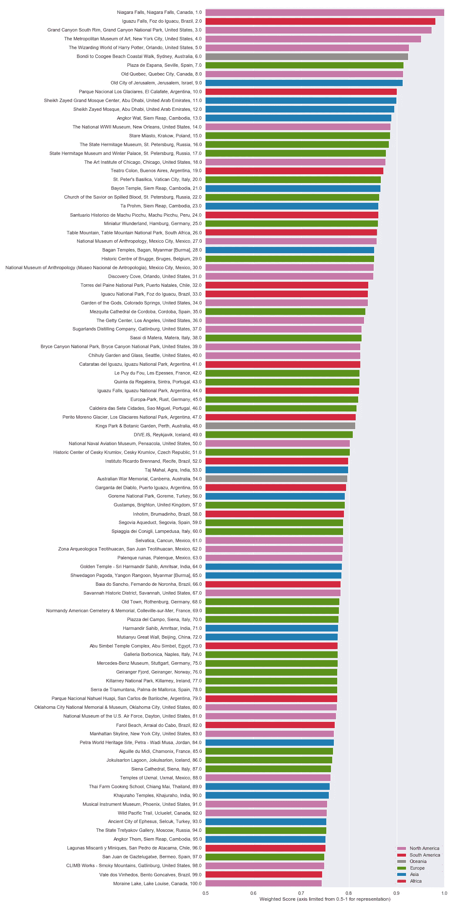****