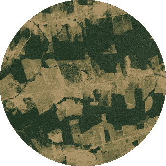

# 星球，重访

> 原文：<https://towardsdatascience.com/planet-revisited-ca37faefab45?source=collection_archive---------24----------------------->

用 fastai 1.0 进行卫星图像分析。

我想在[xfiew](http://xviewdataset.org)数据集、 [DIUx 的](https://www.diux.mil)卫星图像竞赛上工作。我已经有一段时间没有做计算机视觉工作了，随着 [fastai](https://www.fast.ai/2018/10/02/fastai-ai/) 和 [PyTorch](https://pytorch.org) 的 1.0 发布和预发布，我认为重温[星球亚马逊 Kaggle 竞赛](https://www.kaggle.com/c/planet-understanding-the-amazon-from-space)将是一个很好的热身。

我的目标是在继续前进之前打破最高分。那个位置由最合适的[占据，他现在是 Kaggle 上排名第二的竞争者，之前是第一。所以我的第一站是查看他的采访——因为 Kaggle 在其博客上采访比赛获胜者。实际上，我有几次回想起这件事:第一次很困惑，感觉“哦，就这样了？”最后一次。](https://www.kaggle.com/bestfitting)

有件事。当你阅读一个知道自己在做什么的人写的新的技术- *任何东西*时，真的很容易失去平衡。你一遍又一遍地发现，那些看起来很重要的事情，其实并不重要。机器学习(或任何领域)任务的基本概念通常非常简单。能够从低级细节到高级概述进行上下文切换是非常有价值的。

所以第一个命令是，看看胜利者是如何做到的。xView 将有创新的空间；我的目标是尽快度过难关，比赛结束。所以让我们看看什么有效。

我想我把采访看了三遍，并写了两遍，画了一个关于 bestfitting 所说的图表，以便在整个过程中帮助我。它的要点是这样的:

*   使用去雾算法预处理图像(使模糊→清晰)
*   使用大约一打模特的组合
*   将每个模型的输出馈送到其自己的*岭回归*模型/层以学习数据中的相关性
*   将集合的输出提供给最终的岭回归模型。
*   也使用 F2 损失函数

什么是[岭回归](https://en.wikipedia.org/wiki/Tikhonov_regularization)？几天到一周的[迷茫](https://ncss-wpengine.netdna-ssl.com/wp-content/themes/ncss/pdf/Procedures/NCSS/Ridge_Regression.pdf) [阅读](https://onlinecourses.science.psu.edu/stat857/node/155/) [后来](http://statweb.stanford.edu/~tibs/sta305files/Rudyregularization.pdf)，我得到的是:‘岭回归’是损失函数中加入平方和项的线性回归。Anuja Nagpal 的帖子是我理清事情的关键。因此… ' [岭回归'将 L2 正则化](https://hackernoon.com/practical-machine-learning-ridge-regression-vs-lasso-a00326371ece#f0f7)添加到损失函数中…(并有一个 L1 对应项，添加了一个幅度和项，称为'拉索回归')。

from [Nagpal’s post](/l1-and-l2-regularization-methods-ce25e7fc831c)

还有一件事。当我听说某个工具被用来“寻找数据中的相关性”和“选择最强的模型来预测每个标签”时，我的想法是进城，尤其是当这个工具有自己的名字时。因为第一次，我很难想象带有平方和项的回归会做一些听起来很聪明的事情。它不可能是你可以从 scikit-learn 导入的东西，或者作为一个层编码到神经网络中，对吗？

*但还是*。****那*** 怎么办？“选择一个模型”等等。我到了那里会告诉你的。然而，事物的内部名称增加了进入一个领域的摩擦。就叫它是什么吧。*

*在这一点上，我对“岭回归”或“L2 回归”等的唯一困惑。，就是通过做才能得到答案的东西。当 bestfitting 说他们使用一个*模型*时，他们是指他们在 PyTorch 中编写了一个迷你神经网络，还是从 scikit-learn 中导入的？或者只是一个神经网络的线性层(比方说，附加在 CNN 模型的分类器头上)与 L2 正则化？最后一个更有道理…但是你怎么训练它呢？看，模型回归器是有意义的:把它做成一层，然后正常训练。但是整体回归器…你不能一次就建立一个巨大的神经网络。即使你有资源，不同的模型也会有不同的训练方案。所以最后一个回归变量要么是 PyTorch 要么是 scikit-learn 模型，对吗？听起来像是必须的。然后你也拟合它，在“原始”预测和实际标签之间，对吗？*

*…不幸的是，你必须被列为“贡献者层”才能被允许在 Kaggle 上联系其他人，所以我不能轻易要求。到了那里就知道了。*

*这留下了工作前的最后一个细节:去雾。去雾就像它听起来的那样:它只是从模糊的图像中去除薄雾。*

**

*from: [anhenghuang/dehaze](https://github.com/anhenghuang/dehaze/tree/master/image)*

*Bestfitting 使用了一种基于论文的算法:[使用暗通道先验的单幅图像去雾](https://www.robots.ox.ac.uk/~vgg/rg/papers/hazeremoval.pdf)。它显示了令人印象深刻的结果。我决定不去实现它——我在玩这样一个想法:快速完成一个项目包括选择在哪个山头插上你的剑。我就找了个好的外挂-&-玩版。我还是花了一天时间在这上面。我找到了一个 [Python 版本的](https://github.com/anhenghuang/dehaze)，但运行起来需要一秒钟，所以我找到了一个 [C++版本的](https://github.com/cedarz/DeHaze)，在我完成了与 Xcode 的战斗并重新学习了如何在其中构建一个项目之后，运行起来需要更长的时间。所以我想，“让我们用神经网络来做这件事吧”。但是我想知道如何正确地做这件事？我不想沉溺于设置一个环境*来运行一个我只作为预处理器使用过一次的模型。于是找了个[现成的 Caffe 型号](https://github.com/zlinker/DehazeNet)！从来没有使用过编译过的神经网络，最好学一段时间。一个陷阱。[如何安装](http://caffe.berkeleyvision.org/installation.html)[Caffe](http://installing-caffe-the-right-way.wikidot.com/start)？最好不要因为你打算用一次的东西而改变你的系统。啊，有一种方法可以将 Caffe 转换成 Caffe 2(T18)(它来自 PyTorch 的 conda 安装)……这涉及到`caffe`导入，因此需要*Caffe*——你知道我对 python 版本的看法。**

*——我还在 github 上找到了几个其他的 dehazers。 [DCPDN](https://github.com/hezhangsprinter/DCPDN) & [AOD 网](https://github.com/TheFairBear/PyTorch-Image-Dehazing)。—*

*现在我准备好实际做一些深度学习了。嗯，还没有，因为在玩 Xcode 和 HomeBrew 以及其他东西的时候，我设法破坏了我的 Mac 的 Python 2 安装——顺便提一下，这就是谷歌使用的，因此为什么 [gcloud](https://cloud.google.com/sdk/gcloud/) 不能连接到我的 [GCP](https://cloud.google.com/compute/) 实例；而是抛出一个令人困惑的“找不到模块 zlib”导入错误。我忘了[我是怎么修好那个](https://github.com/Homebrew/homebrew-core/issues/29176#issuecomment-398656987)的。从[苹果开发者网站](https://developer.apple.com/downloads/more)下载 Xcode 命令行工具有问题，因为它不能从*命令行*运行。然后是自制的东西。那花了一天时间。可能是同一天。*

*像这样的噩梦是我使用清单的原因。*

**现在*我准备好开始使用 [fastai](https://docs.fast.ai) 。我将在下一篇文章中讨论这个问题。*