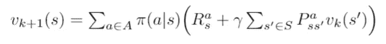
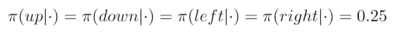
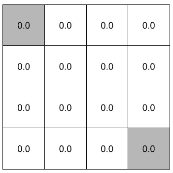
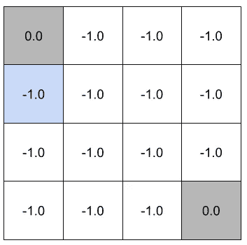
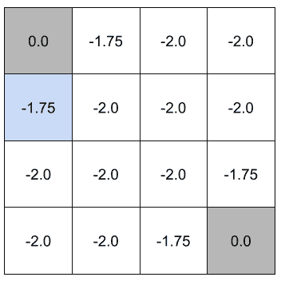
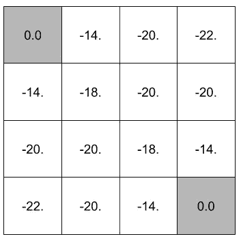
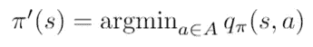
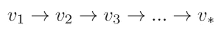
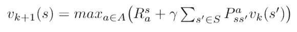

# 动态规划规划:强化学习

> 原文：<https://towardsdatascience.com/planning-by-dynamic-programming-reinforcement-learning-ed4924bbaa4c?source=collection_archive---------4----------------------->

## 第三部分:解释动态规划、策略评估、策略迭代和价值迭代的概念

在这篇博文中，我将解释如何使用动态编程来评估和寻找最优策略。这一系列的博客文章包含了 David Silver 在[强化学习简介](http://www0.cs.ucl.ac.uk/staff/d.silver/web/Teaching.html)中解释的概念总结。

零件:[1](/reinforcement-learning-an-introduction-to-the-concepts-applications-and-code-ced6fbfd882d)[2](/getting-started-with-markov-decision-processes-reinforcement-learning-ada7b4572ffb)3[4](/model-free-prediction-reinforcement-learning-507297e8e2ad)…

我们现在将使用前面部分中讨论的 MDPs 和 Bellman 方程等概念来确定给定策略有多好，以及如何在马尔可夫决策过程中找到最优策略。

# 动态规划

*动态规划*是一种通过将复杂问题分解为子问题来解决复杂问题的方法。子问题的解决方案被组合以解决整体问题。

动态编程的两个必需属性是:

*   ***最优子结构*** :子问题的最优解可以用来解决整体问题。
*   ***重叠子问题*** :子问题多次重复出现。子问题的解决方案可以被缓存和重用

马尔可夫决策过程满足这两个性质:

*   *贝尔曼方程给出了递归分解*，它告诉我们如何将最优值函数分解成两部分。即一个步骤的最佳行为，然后是剩余步骤的最佳值。
*   *价值函数存储并重用解决方案*。缓存所有 MDP 的好信息，告诉你从那个状态开始你能得到的最佳回报。

# 动态规划规划

当有人告诉我们 MDP 的结构(即当我们知道转移结构、奖励结构等)时，动态规划可以用来解决强化学习问题。).因此用动态规划对 ***规划*** 中的一个 MDP 进行求解:

*   **预测问题** *(政策评估)*:

给定一个 MDP*S，一个 P，一个 R，一个γ>和一个策略 *π* 。求价值函数 *v_π* (它告诉你在每种状态下你将要得到多少奖励)。也就是说，目标是找出一个政策 *π* 有多好*。**

*   **控制问题**(找到在 MDP 最好做的事情):

给定 MDP *< S，A，P，R，γ >。*求最优值函数 *v_π和*最优策略 *π*。*也就是说，我们的目标是找到能给你带来最大回报的政策，并选择最佳行动。

## 政策评价

***问题*** *:* 评估一个给定的策略 *π* 和 MDP。(找出一个政策 *π* 有多好)
***解*** :贝尔曼期望备份的迭代应用。

***方法:*** 从初始值函数*v₁*(MDP 中所有状态的一个值)开始。例如以值 0 开始。因此没有奖励。然后用*贝尔曼期望方程*计算 *v₂* ，重复多次，最终收敛到 *v_π。*

实现这种收敛的一种方法是使用*同步备份*，其中我们在每一步都考虑所有状态。

1.  在每次迭代 k+1 时，对于所有状态 s ∈ S
2.  更新 *vₖ₊₁(s)* 从*vₖ(s')*，其中*s’*是 *s* 的继承状态

*vₖ(s')* 使用第 2 部分中讨论的贝尔曼期望方程进行更新。

Bellman Expectation Equation

***举例:*** 假设我们有一个有 *14 个状态*的网格世界，其中每个方块代表一个**状态**。我们还有 2 个**终端状态**，一个在网格世界的右下角，另一个在左上角。我们可以采取将*向上*、*向下*、*向左*和*向右*的**动作**，我们采取的每一个过渡都会给我们一个 *-1* 的**即时奖励**，直到达到一个终止状态。由于**折扣因子**为 *γ=1* ，我们给定的代理策略 *π* 遵循统一的随机策略:

我们需要计算处于每个状态的值，以确定我们定义的策略 *π* 有多好。

1.按照我们上面描述的方法，我们可以从初始值函数 v₀开始，所有值都是 0。

v₀

2.接下来，我们通过应用一步前瞻，使用贝尔曼期望方程来计算新的价值函数 v₁。

v₁: Blue block is calculated using the Bellman Expectation Equation such that 0.25(-1+1(0))+0.25(-1+1(0))+0.25(-1+1(0))+0.25(-1+1(0)) = -1

3.重复使用 v₁计算 v₂的过程

v₂: Blue block is calculated using the Bellman Expectation Equation such that 0.25(-1+1(-1))+0.25(-1+1(-1))+0.25(-1+1(-1))+0.25(-1+1(0))=-1.75

4.用 *k=∞* 重复这个过程，最终将我们的价值函数收敛到 *v_π。*

vπ

因此，对于我们的策略 *π* ，我们计算了 MDP 中每个州的相关值。

**如何完善一项政策？** 在上面的方法中，我们已经评估了一个给定的策略，但是没有在我们的环境中找到最佳的策略(要采取的行动)。为了改进给定的策略，我们可以*评估*给定的策略 *π* 并通过*相对于 *v_π贪婪地*行动来改进策略。*这可以使用 ***策略迭代*** 来完成。

## 策略迭代

***问题*** *:* 为给定的 MDP 寻找最佳策略*【π*】*。
***解法*** :贝尔曼期望方程政策迭代与行事贪婪。

***方法:*** 以给定策略开始 *π*

1.  使用策略评估来评估策略 *π* (如上所述)
2.  通过 ***对 *v_π* 的贪婪*** 行为来改进 *π* 的策略，得到新的策略*π’*。
3.  重复直到新策略*π’*收敛到最优策略 *π** 。

为了贪婪地行动，我们使用一步前瞻来确定给予我们最大 ***行动值函数*** (在第 2 部分中描述)的行动:

回想动作值函数有以下等式:

action-value function

## ***值迭代***

控制问题的另一种方法是使用*贝尔曼最优方程*进行数值迭代。首先，我们需要定义如何使用 ***最优性原则将一个最优策略分成几个部分。***

**最优性原理** 任何 ***最优策略*** 都可以细分为使整体行为最优的两个组成部分:
-最优的第一个动作*A∫*
-随后是后续状态的最优策略 *S*

> **定理(最优性原理)** *A 策略* π(a|s) *从状态 s 达到最优值，*v _π(s)= v∫(s)*当且仅当:*
> - *对于从*s*-*-*可达的任意状态 s '达到最优值*

***值迭代(应用)***

***问题*** *:* 求给定 MDP 的最优策略*【π*】*。
***解*** :贝尔曼最优备份的迭代应用

***方法:*** 利用同步备份更新价值函数，直到计算出最优价值函数而不计算动作价值函数。

1.  在每次迭代 k+1 时，对于所有状态 s ∈ S
2.  更新 *vₖ₊₁(s)* 从*vₖ(s')*，其中*s’*是 *s* 的后继状态

*vₖ(s')* 使用第 2 部分中讨论的贝尔曼最优方程进行更新:

Bellman Optimality Equation

通过重复上述过程，最终收敛到 *v*。*注意，该过程不同于策略迭代，因为中间值函数可能不对应于任何策略。

# 摘要

这篇文章中描述的所有算法都是强化学习中规划问题的解决方案(这里我们给出了 MDP)。这些规划问题(预测和控制)可以使用同步动态规划算法来解决。

**预测**问题可以用*贝尔曼期望方程迭代* ( ***政策评估*** )来解决。

**控制**问题可以用*贝尔曼期望方程策略迭代&贪婪* ( ***策略改进*** )或*贝尔曼最优方程* ( ***值迭代*** )来解决。

# 参考

*   [关于 RL 的 UCL 课程——第 3 讲](http://www0.cs.ucl.ac.uk/staff/d.silver/web/Teaching_files/DP.pdf)
*   《强化学习导论》，萨顿和巴尔托，1998 年

如果你喜欢这篇文章，并想看到更多，不要忘记关注和/或留下掌声。