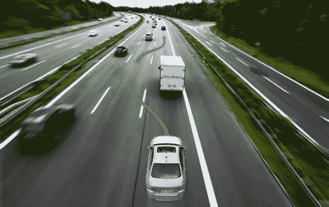
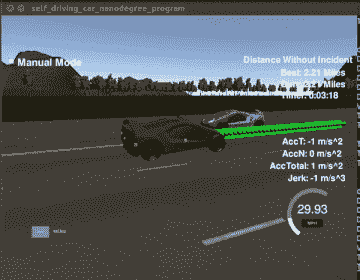

# 为高速公路上的自动驾驶汽车规划路径

> 原文：<https://towardsdatascience.com/planning-the-path-for-a-self-driving-car-on-a-highway-7134fddd8707?source=collection_archive---------5----------------------->

*用数据做酷事！*

Car deciding to make a lane change

路径规划是自动驾驶汽车的大脑。这个模块试图复制我们人类在驾驶时的思维和决策——阅读地图，分析我们的环境(其他车辆和行人)，并根据安全、速度和交通规则决定最佳行动。

对于我在 Udacity 自动驾驶汽车工程师 Nanodegree 项目第三学期的第一个项目，我实现了一个高速公路路径规划器，以在模拟的多车道和交通的高速公路上驾驶汽车。见下面的 gif 和视频。模拟器为我们提供汽车和交通的当前位置和速度，然后我们将下一个 x 和 y 位置发送给模拟器，这样它就可以将汽车开到那里。目标是驾驶汽车成功地避免任何碰撞，安全地改变车道，保持低于速度限制，但不要太慢，并尽量减少对乘客的冲击。

你可以在我的 [Github repo](https://github.com/priya-dwivedi/CarND/tree/master/Term3/CarND-Path_Planning-P1) 上找到完整的代码

Highway Path Planning

这是汽车启动，改变速度和车道，避免碰撞的视频。请注意终端是如何为用户显示所有有用信息的。

# 路径规划是怎么做的？

**第一步:分析传感器融合数据，并对其进行有意义的分类**

从模拟器中，我们获得模拟器中其他车辆的数据。这些数据包括汽车 id、汽车位置(x 和 y)、汽车速度(vx 和 vy)、汽车 s(沿车道的距离)和汽车 d(沿车道宽度的距离)..我获取了数据，并将模拟器中的所有汽车分为我自己的车道、我的左车道或我的右车道(如果这些车道存在的话)。然后，我计算出决策所需的重要指标。这些是

*   在我的车道上-到我前面最近的车的距离和最近的车的速度
*   相邻车道-左侧车道前后最近车辆的距离，右侧车道也是如此

我还确保了——如果我在最左边的车道上，那么我设置 violate_left = 1 来确保我不会左转。类似地，如果我在最右边的车道，那么我设置 violate_right = 1。如果我的车道是空的或者任何其他车道是空的，那么最近的车距被设置为 999

**第二步:计算决策成本，选择成本最低的行动**
我想到了我的汽车在任何情况下都可能做出的 4 个决策:

1.继续在我的车道上以最大速度行驶

2.继续在我的车道上行驶，但是减速到和前面的车差不多的速度

3.换到左侧车道

4.向右转

我决定为所有这些不同的功能分配成本:
***成本功能—在我的车道上继续***

*   如果我的车道上没有车辆，那么成本= 0(记住，我们希望最小化成本，所以这是最好的结果)
*   如果有交通，但前面最近的汽车>缓冲区(设置为距离差> 50 个单位)，则成本= 0
*   如果前面最近的汽车比缓冲器更近(距离差≤ 50 个单位)，则可能发生碰撞，因此成本增加到 50

***成本函数—变更为左车道/右车道***

*   如果我们可以转弯的车道不存在，那么碰撞是可能的，因此成本增加到 500
*   如果车道存在并且可以安全转弯，那么成本= 150(安全转弯定义为最近的汽车前方距离单位为 50，最近的汽车后方距离单位为 12。我通过在模拟器中玩来决定这些数字)
*   如果车道存在，但转弯不安全，则可能发生碰撞。所以成本= 500
*   我补充的一个额外条件是，如果前面最近的车是 200+的距离单位(前面的车道有点空)，那么这条车道的成本稍微低一些。我这样做是为了让程序可以选择一条车道，如果两条车道都可以安全转弯的话

***代价函数——慢行于我的车道***

我设定减速的代价= 200。这样做是为了使这个动作不如变道好，但比碰撞好。

在每个实例中，计算与所有决策相关的成本，并且最优决策是具有最小成本的决策

**第 3 步:一旦做出决定，确定该决定的目标速度和车道**

为了在模拟器中驾驶汽车，我采用了使用其 d 值(指示沿车道宽度的距离的参数)来决定目标车道的方法。通道 1 的目标差值为 2，通道 2 的目标差值为 6，通道 3 的目标差值为 10。因此，根据决定(留在车道上，或左转或右转)，我决定了目标 d 值
来控制模拟器中的速度，我使用了 s 增量(表示沿车道长度的距离的参数)..我发现 s 增量越小，汽车越慢，而 s 增量越大，汽车越快。为了以最大速度驾驶，我选择了 0.415 的 s 增量。当我需要在我的车道上刹车时，我根据我前面汽车的速度减少 s 增量。

**步骤 4:创建加加速度最小化轨迹**

为了获得平稳的驾驶体验，我们应该将加速度的导数——加加速度最小化。本质上，我们应该有更平滑的加速度增加和减少。我这样做是通过存储 s 和 d 参数的先前值，并在许多时间步长内逐渐改变它们。最后，我用样条拟合地图和目标 s 和 d 来决定 next_x 和 next_y 值。这些被发送到模拟器，汽车移动到这个位置。对参数做了一些调整后，汽车在模拟器中平稳地行驶了。

总的来说，这是一次奇妙的经历！

# 后续步骤

我的代码大部分时间都在模拟器中工作，但仍有一些改进的机会

1.  在程序中包含行为预测。我们可以通过观察他们相对于车道宽度的 d 位置来预测模拟器中其他汽车的计划吗？

这个想法是，如果另一辆车正在接近其当前车道的右侧，那么它很有可能正计划右转。诸如此类。

2.有时我的车在最左边的车道，中间的车道有车辆，转弯不安全，但最右边的车道是空的。一种更好的逻辑是识别出这一点，并执行一系列快速变道，以到达最右边的车道，而不是在当前车道减速。本质上，该逻辑当前在做出决定时仅查看紧邻的通道

3.我希望有更好的方法来设计加加速度最小化的轨迹，使用讲座中建议的一些数学方法

给我一个❤️，如果你喜欢这个职位:)希望你拉代码，并尝试自己。

**其他著述**:【https://medium.com/@priya.dwivedi/】T2

PS:我住在多伦多，我希望将职业生涯转向深度学习。如果你喜欢我的帖子，并能把我联系到任何人，我将不胜感激:)。我的电子邮件是 priya.toronto3@gmail.com

**参考文献:**

[乌达城](https://www.udacity.com/)无人驾驶汽车纳米学位——我感谢乌达城、巴斯蒂安·特龙、大卫·西尔弗和其他参与开发这门课程的人给我机会成为他们新的无人驾驶汽车项目的一部分。这是一次非常有趣的旅程。这里的图片和视频参考在课堂上被分享了