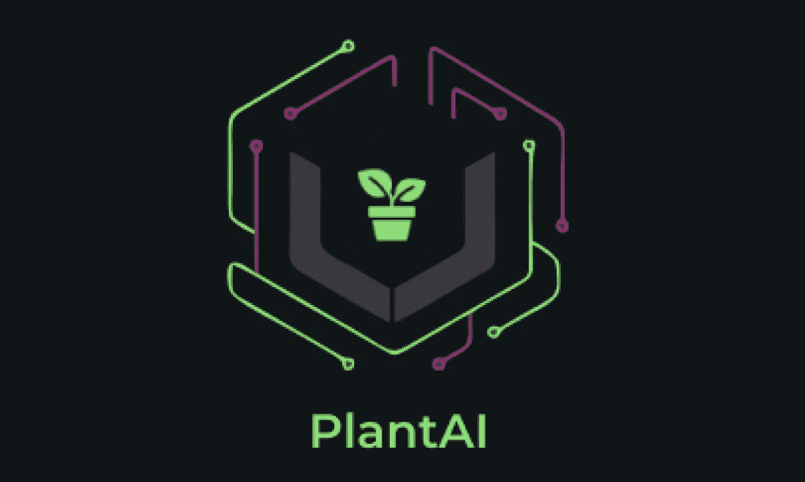
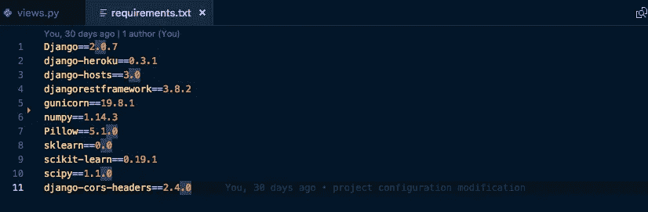
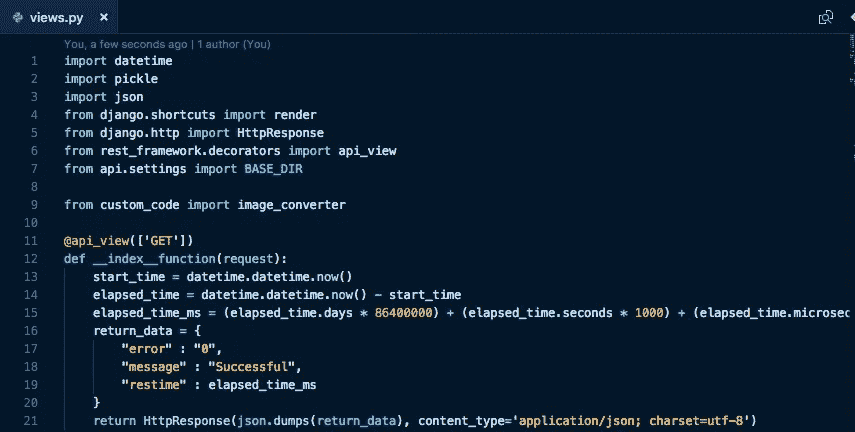
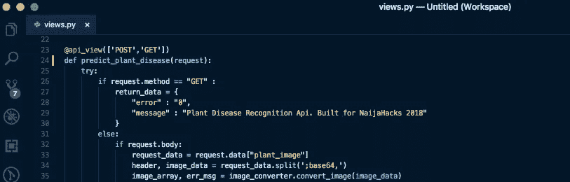
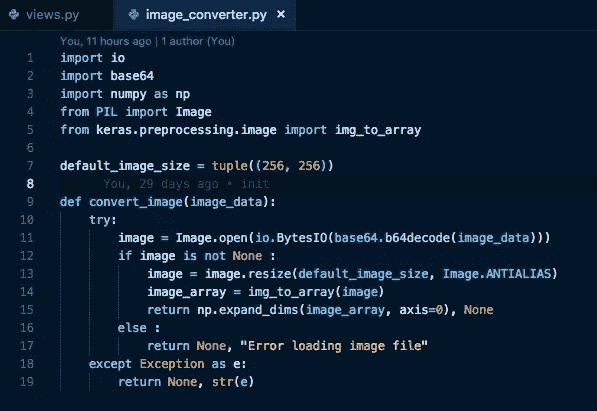
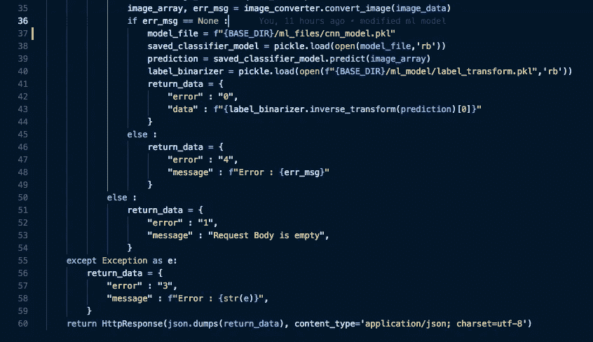
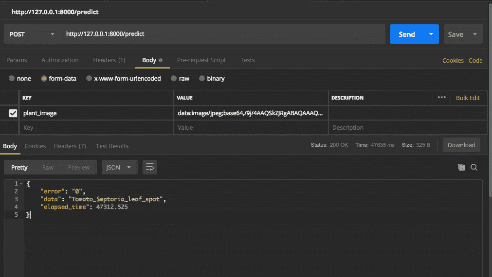

# 植物人工智能—部署深度学习模型

> 原文：<https://towardsdatascience.com/plant-ai-deploying-deep-learning-models-9dda5f6c1088?source=collection_archive---------3----------------------->

所以在我的[上一篇](https://medium.com/@tairuoluwafemi09/plant-ai-plant-disease-detection-using-convolutional-neural-network-9b58a96f2289)中，我谈到了我是如何构建植物 AI 的——一个使用卷积神经网络的植物病害检测模型。最后，我们有了一个模型，将在本文中部署。工厂 AI 的代码可以在[这里](https://www.kaggle.com/emmarex/plant-disease-detection-using-keras)找到，输出[这里](https://www.kaggle.com/emmarex/plant-disease-detection-using-keras/output)找到。

但是一个不能用的模型有什么好？因此，在这篇文章中，我将讲述我是如何通过 API 将这个模型部署到 Android 应用程序中的。

为了通过 API 部署我们训练好的模型，我们将做一些类似于下面的事情:

*   加载我们的训练模型
*   接受传入数据并对其进行预处理
*   使用我们加载的模型进行预测
*   处理预测输出。

我们可以在生产中以多种方式使用我们的模型，例如:

*   将它直接加载到我们的应用程序中:这里我们假设您的模型可以与其他应用程序文件一起保存。这允许我们直接加载模型。我们可以通过简单的编写来加载我们的模型

> model _ file = pickle . load(open(" CNN _ model . pkl "，' rb '))
> 
> 或者 model _ file = load _ model(' my _ model . H5 ')

*   通过 API 使模型可用。这就是我为植物人工智能所做的。有许多方法可以让我们通过 API 获得一个模型。其中一些包括:

**用 Django 或 Flask** 定制 REST-API:在这种情况下，我们用 [Flask](http://flask.pocoo.org/) 的 [Django](https://www.djangoproject.com/) 之一构建一个定制 REST-API。这样，我们必须使我们的模型在我们的项目文件夹中可用，如上所述，加载它并执行预测，然后将结果作为 JSON 响应发送回来。

**Tensorflow** :我们也可以使用 Tensorflow 部署我们的机器学习模型，使用 [Tensorflow 服务](https://www.tensorflow.org/serving/)。Tensorflow Serving 是为将机器学习模型部署到生产中而开发的，因此它包含用于与 Tensorflow 模型或任何其他模型集成的开箱即用工具。你可以看看这篇关于如何用 Tensorflow 机器学习模型的文章。

**AWS Lambda/无服务器**:这涉及到使用 AWS Lambda 使你的深度学习模型可用。你可以查看 [AWS 文档](https://aws.amazon.com/blogs/machine-learning/how-to-deploy-deep-learning-models-with-aws-lambda-and-tensorflow/)关于用 [Tensorflow](https://www.tensorflow.org/) 部署深度学习模型的帮助。

另一个选择是利用 Kubernetes 来部署你的模型。你可以查阅 Kubernetes 文档或这篇[中型文章](https://medium.com/analytics-vidhya/deploy-your-first-deep-learning-model-on-kubernetes-with-python-keras-flask-and-docker-575dc07d9e76)来获得如何使用 Kubernetes、Docker 和 [Flask](http://flask.pocoo.org/) 部署深度学习模型的指导

我用 [Django](https://www.djangoproject.com/) — Python Web 框架开发了 Plant AI 的 API。无论您决定使用哪种 Python 框架，过程都应该是相同的。

*   首先确保您已经安装了这些软件包

[**Django**](https://www.djangoproject.com/) :一个 python web 框架。使用 [Flask](http://flask.pocoo.org/) 或者你选择的任何其他 Python web 框架都没问题。

[**Django-Heroku**](https://github.com/heroku/django-heroku)(仅当您将在 [Heroku](https://www.heroku.com/) 上托管您的应用时需要)

[**Django-rest framework**](https://www.django-rest-framework.org/)**:**构建 web APIs 的强大工具。

[**guni corn**](https://gunicorn.org/)**:是一个用于 UNIX 的 WSGI HTTP 服务器。**

**[**Numpy**](http://www.numpy.org/):Python 编程语言的库，增加了对大型多维数组和矩阵的支持，以及对这些数组进行操作的大量高级数学函数。(来源:[维基百科](https://en.wikipedia.org/wiki/Scikit-learn))**

**[**Keras**](https://keras.io/) : Keras 是用 Python 编写的开源神经网络库。它能够在 TensorFlow、微软认知工具包或 Theano 上运行。旨在实现深度神经网络的快速实验，它专注于用户友好、模块化和可扩展。(来源:[维基百科](https://en.wikipedia.org/wiki/Scikit-learn))**

**[**Sklearn**](https://scikit-learn.org/stable/) :一款[免费软件](https://en.wikipedia.org/wiki/Free_software) [机器学习](https://en.wikipedia.org/wiki/Machine_learning) [库](https://en.wikipedia.org/wiki/Library_(computing))为 [Python](https://en.wikipedia.org/wiki/Python_(programming_language)) 编程语言。它具有各种[分类](https://en.wikipedia.org/wiki/Statistical_classification)、[回归](https://en.wikipedia.org/wiki/Regression_analysis)和[聚类](https://en.wikipedia.org/wiki/Cluster_analysis)算法，包括[支持向量机](https://en.wikipedia.org/wiki/Support_vector_machine)、[随机森林](https://en.wikipedia.org/wiki/Random_forests)、[梯度推进](https://en.wikipedia.org/wiki/Gradient_boosting)、[、 k -means](https://en.wikipedia.org/wiki/K-means_clustering) 和 [DBSCAN](https://en.wikipedia.org/wiki/DBSCAN) ，旨在与 Python 数值和科学库 [NumPy](https://en.wikipedia.org/wiki/NumPy) 和[互操作(来源:](https://en.wikipedia.org/wiki/SciPy)[维基百科](https://en.wikipedia.org/wiki/Scikit-learn))**

**[**Django-cors-headers**](https://github.com/ottoyiu/django-cors-headers)**:**一款 Django App，为响应添加 CORS(跨源资源共享)头。**

*   **设置您的 Django 项目。**
*   **接下来，确保您的模型在项目文件的一个文件夹中。你可以在这里下载植物 AI [的模型](https://www.kaggle.com/emmarex/plant-disease-detection-using-keras/output)**
*   **下面是我的代码的样子**

****

**像往常一样，在**线 1–7**上，我导入了所需的必要包。**

****

**在**的第 33 行**，我将通过 API 端点发送的数据(base64 中患病植物的图像)保存在 request_data 中。然后在**第 34 行**我分割数据，只得到图像。然后使用下面的 **convert_image** 函数将图像转换成一个数组。该函数将返回一个图像数组，或者不返回任何图像数组，如果有错误消息，则返回一条错误消息。**

****

**在下面的第 38 行，我使用 Pickle 加载了生成的模型。然后在第 39 行，我将图像数组传递给模型。这将返回一个二进制化的标签。在我们的项目[中加载的标签二进制化器的帮助下，我能够将模型预测转换成任何可用的标签(在这种情况下是各种植物疾病)。](https://www.kaggle.com/emmarex/plant-disease-detection-using-keras/output)**

****

****第 41–43 行**包含一个 Python 字典，该字典包含该 API 将要传递的输出。在第 60 行上，这个 dict 作为 JSON 响应被发送回来。是的，就是这样！！！**

**使用 Postman 测试我的 API，在大约 47312.525 毫秒(47.3 秒)内给出了我想要的结果。**

****

**这个项目可以在 Github [这里](https://github.com/Emmarex/naijahacks-fort-API)获得。感谢阅读。**