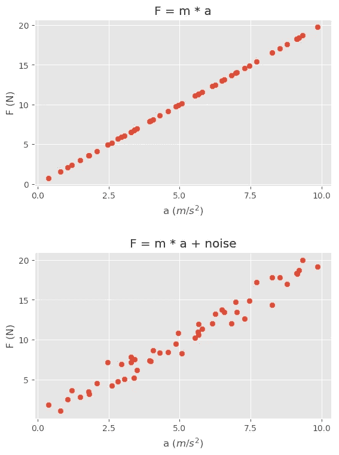
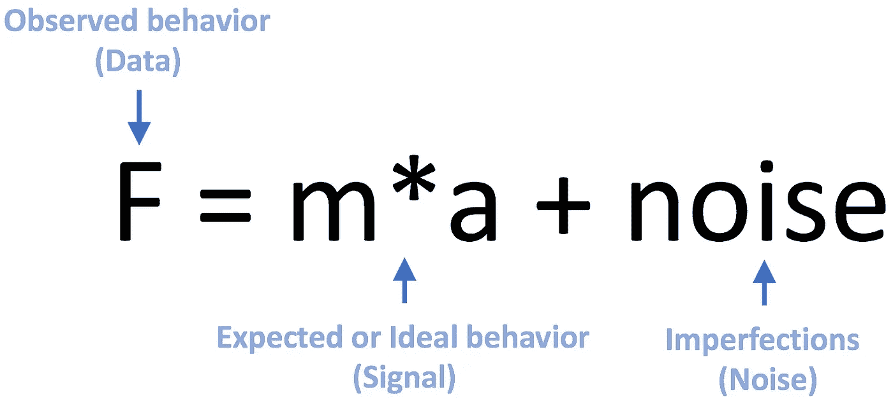
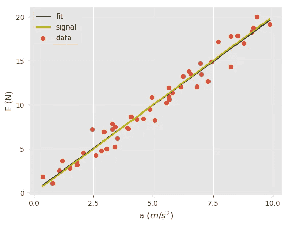
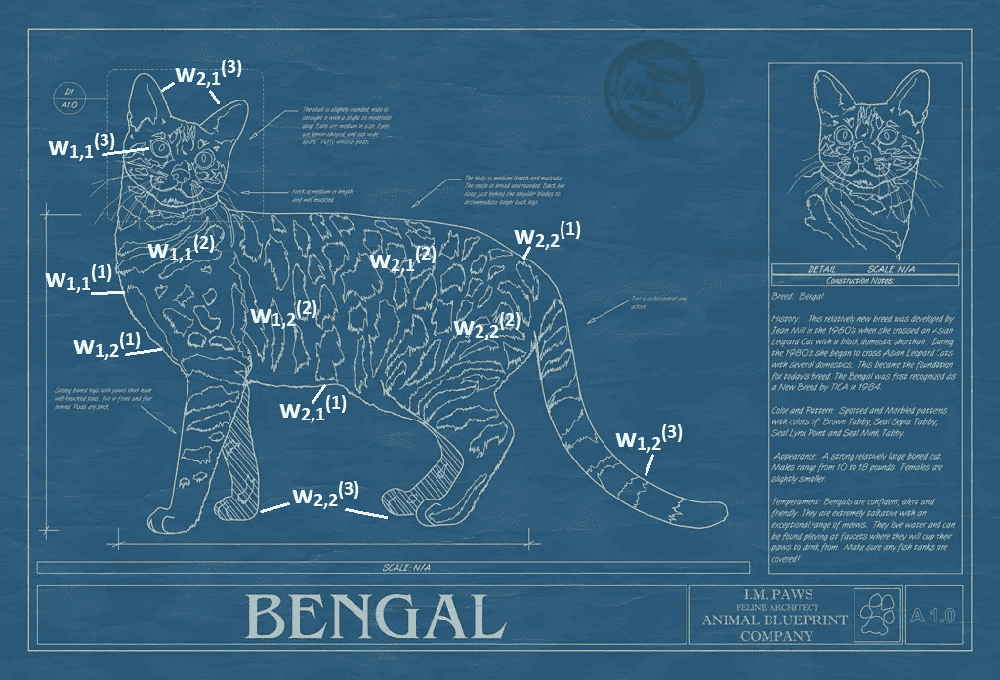

# 柏拉图、亚里士多德和机器学习

> 原文：<https://towardsdatascience.com/plato-aristotle-and-machine-learning-521c3252cbd1?source=collection_archive---------7----------------------->

雅典学院是世界上最著名的壁画之一。这是一幅描绘古典时代伟大哲学家的文艺复兴杰作，由拉斐尔于 1509-1511 年间创作。


The School of Athens, Fresco by Raphael, 1509–11.

虽然这幅壁画中有很多值得讨论的地方，但我想请大家注意其中的两个中心人物:指向天空的柏拉图和指向大地的他的学生亚里士多德。


Plato (left) and Aristotle (right)

拉斐尔为什么要这样描绘他们？

柏拉图认为我们生活的这个世界，物质世界，只是理想世界的一个影子。例如，我们在这个世界上看到的苹果是理想世界中完美苹果的不完美反映。柏拉图称这些完美或理想的事物为它们的*形式*，因此有了他的形式理论。形式论不限于对象，我们还可以谈教育的形式，友谊的形式等等。然而，亚里士多德反对他的老师，声称物质世界是真实的。他认为形式存在于正在讨论的事物内部，存在于物质世界中。如果没有苹果，就没有苹果身份。他们都相信形式，但不同意它们是否存在于另一个世界(柏拉图)或这个世界(亚里士多德)。

现在你可能会猜到拉斐尔想要传达的信息，柏拉图指出天空是因为他相信形体在另一个世界，相反亚里士多德指出地球说形体实际上可以在物质世界中找到。

这个讨论属于形而上学中的共相问题的范畴。共性是两个或两个以上的实体所共有的东西(例如，根据柏拉图，是一只猫或理想的猫)，一个共性有称为细节的实例。加菲猫是一只特别的猫。他有所有猫共有的属性，像试图适应一个盒子，以及其他属性，不是每只猫都有，如懒惰，愤世嫉俗和橙色。哲学家讨论共相是否真的存在，如果真的存在，它们存在于何处。

但是这一切和机器学习有什么关系呢？在回答这个问题之前，我将尝试从数据、信号和噪声方面解释什么是机器学习。让我们首先澄清这些术语:

**数据**:您观察或测量的值。

**信号:**观察或测量的期望值。

**噪声:**导致期望值和观察值不同的缺陷。

基于这些定义，我们可以说*数据=信号+噪声*。让我试着用一个具体的例子来解释这个概念。

你如何绘制一个 m = 2 kg 的物体的力(N)与加速度(m/s)的关系曲线？理想情况下，它应该遵循牛顿第二定律，F = m*a。然而，在我们生活的世界中，我们知道事情并不完美。因此，观察到的行为将类似于 F = m*a +噪声。下面您可以看到这些图以及用于生成这些图的代码:

```
m=2 #mass of the object
a=10*np.random.rand(50,1) #50 random acceleration values
F_ideal=m*a #Ideal F
F_observed=m*a+np.random.randn(50,1) #Observed F
```



Ideal vs. Observed behavior



Data = Signal + Noise

本质上，机器学习算法试图学习数据内部的信号。需要强调的是，给了这些算法数据，但它们不知道数据的哪一部分是信号，哪一部分是噪声。

例如，让我们对上面生成的数据应用线性回归。可以看到拟合度几乎等于信号。机器学习算法不知道我用来生成这些数据的信号，但它能够找到一个非常接近的近似值。

```
import sklearn
from sklearn import linear_model
model = linear_model.LinearRegression()
model.fit(a, F_observed)
```



Fit tries to find the signal

现在，我们可以看到机器学习和共性问题之间的对应关系。

**机器学习:**数据=信号+噪声

**共相问题:**我们所见=共相+特殊性质

假设您的朋友要求您构建一个孟加拉猫分类器。您收集孟加拉猫图像(数据)，并为此任务训练卷积神经网络(CNN)。该算法查看数据，将信号(通用孟加拉猫)与噪声(特定事物，例如一只猫有伤疤，在另一幅图像中背景处有一棵树等)分开。)因此*学会了*一只理想的孟加拉猫应该是什么样子。该算法将学习到的内容存储为称为“权重”的参数。换句话说，训练后的 CNN 的权重对应于通用的孟加拉猫——信号。



Blueprint of a Bengal cat (the ideal Bengal cat), is captured by the weights of a CNN. Edges are captured by the first layer, the second layer learns the contours, the third layer learns the eyes, ears, and the tail. [Source](https://www.animalblueprintcompany.com)

这篇文章的关键是，机器学习算法的目标是*学习*数据中的共性(也称为形式或信号)。希望这能帮助你从不同的角度看待机器学习中的一些概念，并更容易掌握它们。

你可以在推特 [@malicannoyan](https://twitter.com/malicannoyan) 上找到我。