# 数据的魔力|泰坦尼克号生存预测

> 原文：<https://towardsdatascience.com/play-with-data-2a5db35b279c?source=collection_archive---------5----------------------->

在我以前的文章中，我们讨论了数据特征以及与之相关的常见问题和挑战，还简要讨论了应该遵循什么方法来处理它。

*   [了解您的数据|第 1 部分](https://medium.com/@KtheAgent/know-your-data-part-1-c6bd56553ae8)
*   [了解你的数据|第二部分](https://medium.com/@KtheAgent/know-your-data-to-build-effective-machine-learning-models-part-2-8402dbf968b3)

这些文章从总体上给出了一些关于数据清理过程的想法，让我们尝试一下对真实数据集的理解。为了让事情变得简单有趣，我选择了 ***Kaggle*** *下的* [***泰坦尼克号:机器从灾难中学习***](https://www.kaggle.com/c/titanic/data)**竞赛* ***下的泰坦尼克号生存数据集。****

*在这个挑战中，我们需要使用 ML 技术来分析人们的生存状况。我将在这个实验中使用 iPython Jupyter 笔记本，人们可以根据自己的舒适度选择使用 R 或其他。*

*我们先来了解一下可用于预测的目标和数据集。我建议大家阅读下面快照中提到的数据定义或者直接从 Kaggle [**页面**](https://www.kaggle.com/c/titanic/data) **中获取。***

*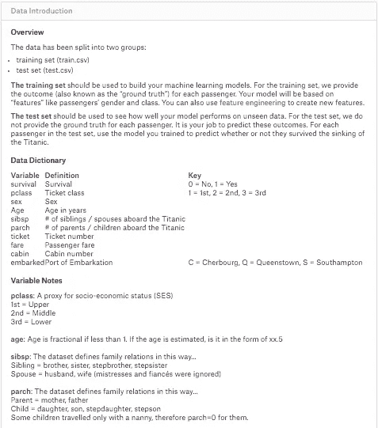*

*简而言之，我们有两个数据集，一个用于训练，一个用于测试。 ***数据集中的生存属性是目标属性。*** 生存归因在训练数据集中可用，但在测试中不可用，因为我们需要预测同样的结果。最后，我们需要得出一个结果集，其中给定一个来自测试集的 PassengerId，我们应该有*生存预测。**

> ***加载训练数据***

*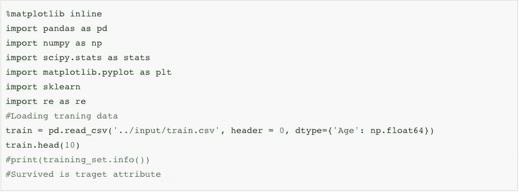*

*Loading Training Data*

*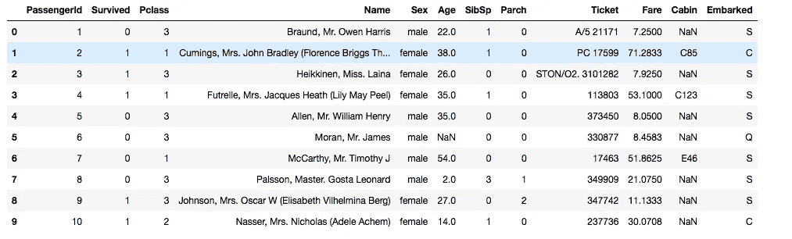*

*Training Data Set*

*数据集由 12 个混合了定性(分类)和定量(数字)的属性组成。*

***定性属性:** PassengerId，幸存，Pclass，性别，车票，客舱&上船。
**数量属性:** SlibSp，Parch &车费。*

> ***加载测试数据***

*这只是为了对测试数据集有个大概的了解。 ***我们可以观察到，它没有目标属性。****

*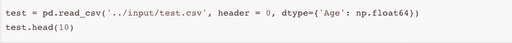*

*Loading Test Data Set*

*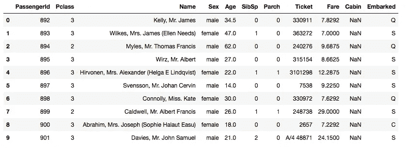*

> ***结果集***

*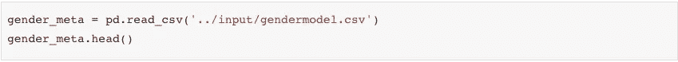*

*Result Set (Need to be produced)*

*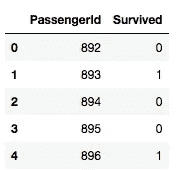*

> ***特色工程***

*让我们检查缺失值上下文中的所有属性。*

*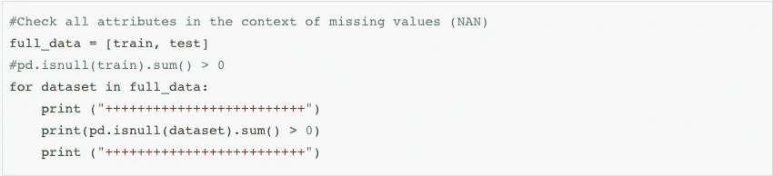**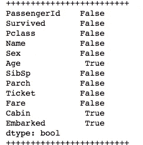*

*很明显，年龄、船舱和船只是我们唯一缺少价值的属性。*

*让我们逐一检查每个属性，看看它对训练数据的影响。*

***PassengerId** 是一个名义属性，这意味着如果我们重新分配所有乘客 Id，对数据集没有任何影响，因此我们现在可以忽略它。*

***幸存下来的**是目标属性。*

***Pclass** 是数字属性，它没有任何缺失值，让我们检查它对目标属性的影响。*

*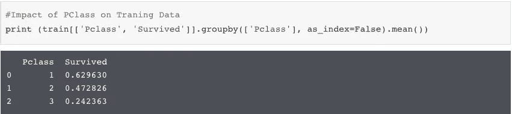*

*这里我们取了平均值，这个数据代表 Pclass=1 存活率是 62.96%。*

***性别**属性是值为男性或女性的分类属性，没有缺失值。*

**

****雌性更安全*** ，雌性存活率比雄性多。*

***SibSp** 是代表兄弟姐妹/配偶的数值属性。*

*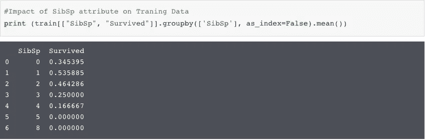*

***Parch** 也是代表孩子/父母的数值属性。*

*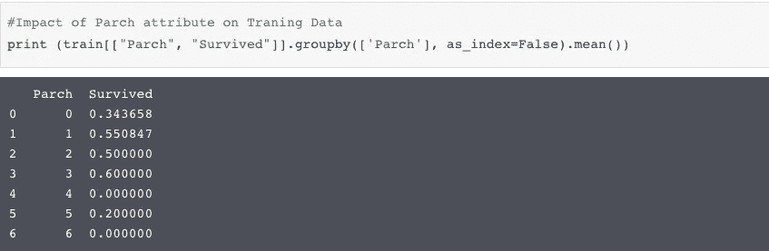*

***家庭规模***

*基于 **SibSp & Parch** 的影响，让我们创建一个名为“家庭规模”的新属性。*

*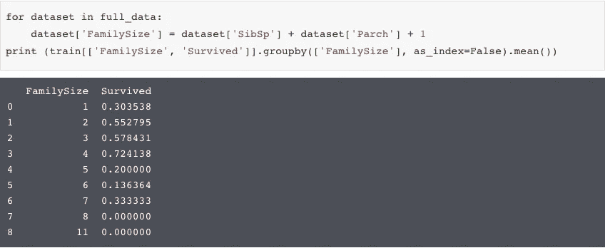*

*这似乎对我们的预测有很好的影响，让我们看看独自在这艘船上会有什么影响。*

*艾索隆*

*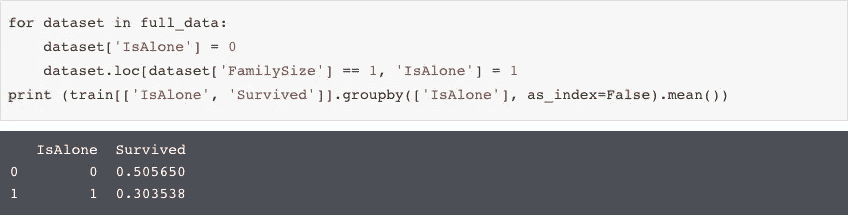*

*至少有时独处是好的:)*

***着手进行***

*已装载的属性缺少值，填充该属性的最佳方式是使用最常出现的值。在该数据集中，已装载属性最常出现值是' S'。*

**

***Fare** 是一个数字属性，它也有缺失值。对于票价，用中位数填充缺失值将是比平均值更好的选择。它是一个数值属性，因此我们需要将其转换为分类属性，以便为我们将要使用的 ML 算法做好准备。在这里，我们将票价分为 4 类。*

*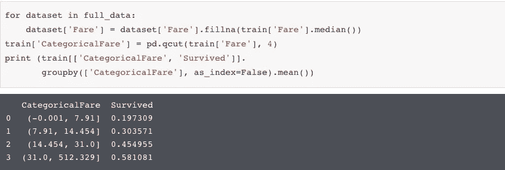*

***年龄**也是一个数字属性，并且有缺失值。填充年龄属性中缺失的值是一件棘手的事情。我们正在生成(平均值 **—** std)和(平均值 **+** std)之间的随机数，并对其进行填充。我们把年龄分成 5 个范围。*

*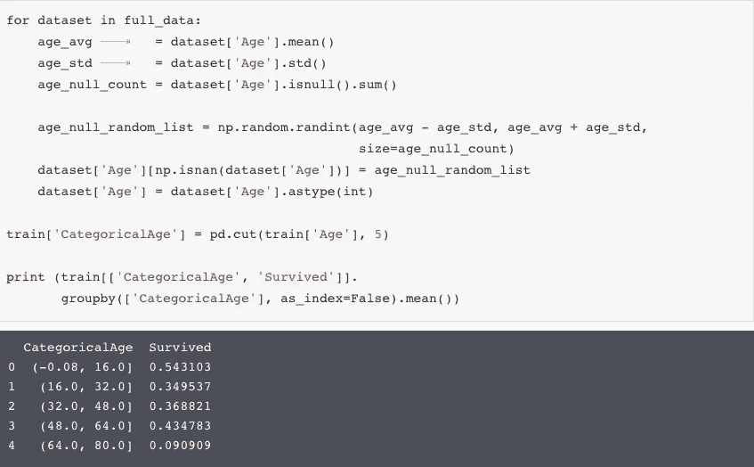*

***Name，**我首先想到的是忽略 Name 属性，但是如果仔细观察，就会发现 names 有可能对目标属性产生影响的标题。让我们交叉检查相同的。*

*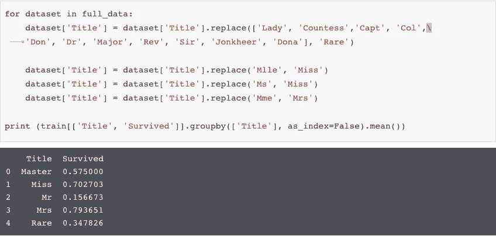*

*到目前为止，我们已经研究了所有的属性，引入了一些新的属性，并填充了缺失的值。现在是准备数据并为 ML 算法做好准备的时候了。*

> ***数据清理***

*在我们当前的数据集中，我们很少有非数字的属性/特征。这是将它们转换成数值的时候了。*

*   *性别属性有值(女性/男性)，我们分别将其映射到 0/1。*
*   *标题新生成的属性被映射到 1/2/3/4/5 值，缺少的值用 0 填充。*
*   *基于站台上车，已上车属性被映射到 0/1/2。*
*   *四个票价类别映射到四个分类值(0/1/2/3)*
*   *五个年龄类别映射到五个分类值(0/1/2/3/4)*
*   *删除预测不需要的属性，如乘客 Id、姓名、机票、舱位、SibSp、Parch 等。*

*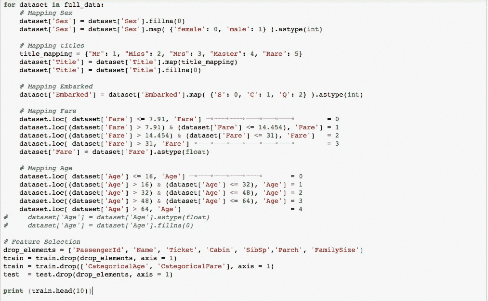*

*下面是结果，现在数据看起来干净。*

*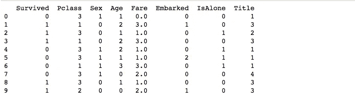*

> ***应用分类器***

*人们可以对这些数据应用多分类器，在本练习中，我将使用[***scikit learn***](http://scikit-learn.org/)内置库。以下是我现在想到的分类器列表。*

*   *邻居分类器(3)*
*   *SVC(概率=真)*
*   *决策树分类器()*
*   *RandomForestClassifier()*
*   *AdaBoostClassifier()*
*   *GradientBoostingClassifier()*
*   *高斯安 b()*
*   *线性判别分析()*
*   *QuadraticDiscriminantAnalysis()*
*   *物流回归()*

*让我们从 KNeighborsClassifier 开始，并检查其准确性以供参考，我们将使用[分层洗牌分裂交叉验证器](http://scikit-learn.org/stable/modules/generated/sklearn.model_selection.StratifiedShuffleSplit.html)来分裂训练和测试数据。*

*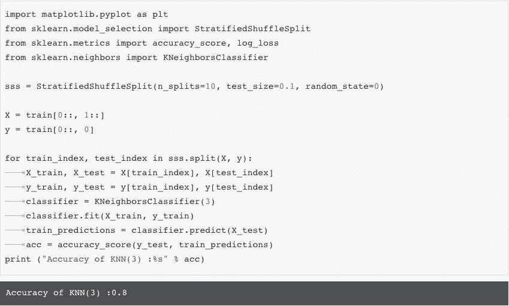*

*KNN Accuracy on Titanic Data Set*

*拥有 scikit 使所有的工作变得简单，您可以通过编写 3-4 行代码来应用大多数分类器。类似地，我们可以应用分类器列表并比较不同模型的准确性，请查看我的笔记本[此处](https://www.kaggle.com/borntomine/titanic-survival-prediction/notebook)查看 titanic 数据集上分类器列表的完整代码。结果表明，在下表提到的分类器中，SVM 是该数据的最佳分类器。*

*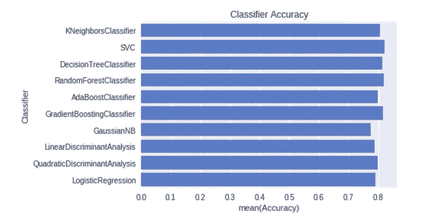*

> ***魔法:预言***

*现在我们已经准备好了模型，是变魔术的时候了。我们可以使用 SVM 分类器，并通过编写下面的代码来预测测试数据集的存活。*

****Scikit 你真棒！****

*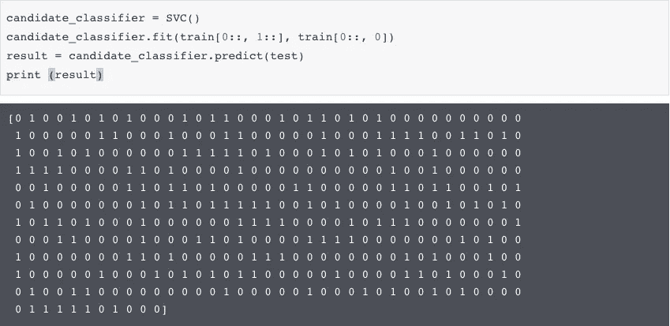*

*由于我们有预测结果，我们可以将其加载到数据框中，并生成所需的输出格式。*

*C 如果你在这个练习中观察，我们大部分时间花在分析和清理数据上。一旦数据准备好了，就很容易使用不同的分类器，因为市场上有标准的库，一个很好的例子就是 **scikit** 。*

*感谢您的阅读，请在评论中分享您的想法、反馈和想法。你也可以通过推特上的@ [simplykk87](https://twitter.com/simplykk87) 和 [linkedin](https://www.linkedin.com/in/krishna-kumar-tiwari-723b761b/) 联系我。*

*R 参考文献*

* [## 泰坦尼克号生存预测

### 使用泰坦尼克号的数据:灾难中的机器学习

www.kaggle.com](https://www.kaggle.com/borntomine/titanic-survival-prediction/notebook)*