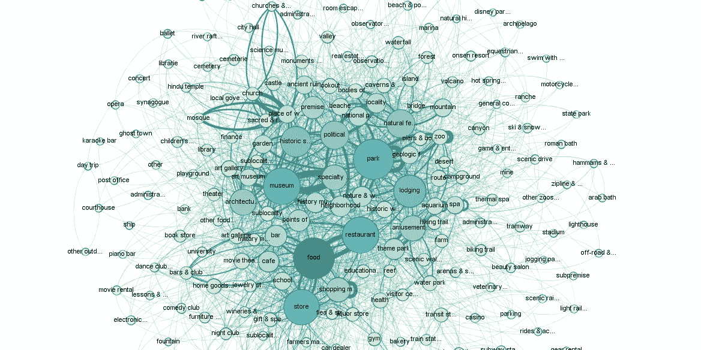
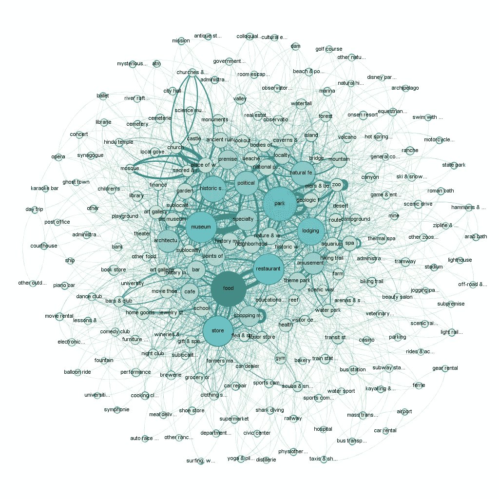
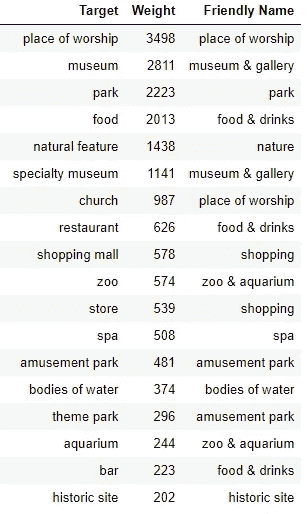
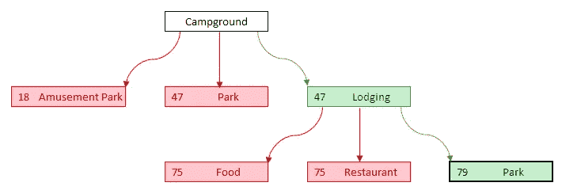
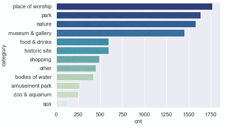
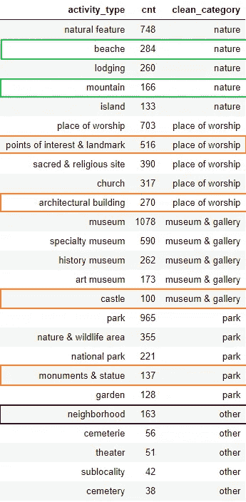
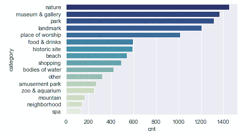
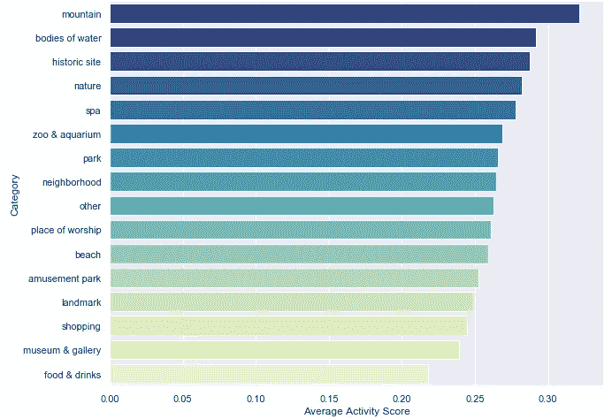
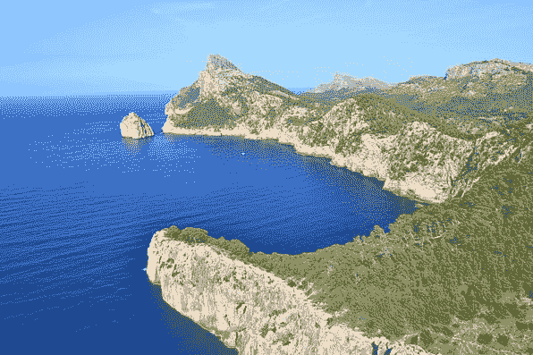
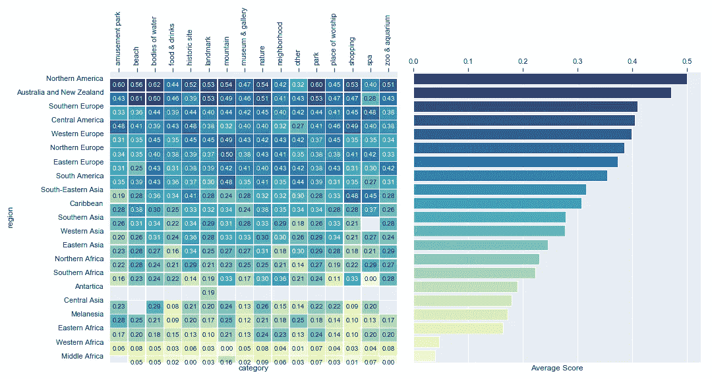

# 操场地球

> 原文：<https://towardsdatascience.com/playground-earth-238f8253b030?source=collection_archive---------17----------------------->

## Ep。2:使用分类数据挖掘对活动进行分类

Part of our output today; Network chart visualizing the co-occurrences between our categorical data

你同样喜欢瀑布、海滩、博物馆、食物、山脉、自然、游乐园、水族馆和城市地标*还是你对假期有一些偏好？或许你知道。然而，在[第一集](/planet-beehive-aeca53ba0326)中，我们客观地将世界上排名第一和第二的活动设定为瀑布..但是如果你不喜欢瀑布呢？你可能已经完成了这篇文章，并且完全不同意我们得出的任何结论。*

为了管理我们的主观偏好，我们将需要我们的算法能够按照用户的期望处理类别的***有限子集*** 的输入。由于活动的描述有很多种，我们今天的主要目标是将所有这些种类归纳为“核心”活动的子集。例如上面描述的那些。

很好，听起来我们今天要深入文本分类数据挖掘了！

# 我们的方法

1.  首先，我们必须将来自源数据的类别之间的关系创建到一个 ***共现矩阵中。*** 这将帮助我们建立最常提到的活动。
2.  ***将*** 这个矩阵可视化成一个 ***网络图*** 并检索每一个共现组合的权重。
3.  ***通过查看最高加权类别和(如果需要)人工干预，检索根类别子集***
4.  ***转换为父子层次*** 并为每个存在的子类别派生父根类别。从每个孩子开始，每次都是到它的最大权重的父母，直到我们到达一个根类别变量。

# 数据

对于今天的练习，我们可以完全依靠在[第 1 集](/planet-beehive-aeca53ba0326)中已经准备好的数据。来自猫途鹰和谷歌的数据都包括每个活动的一个或多个分类值。这些组合成一个列表，构成我们每个活动的总类别集。

此时，没有必要从其他外部数据源进一步丰富这些数据，我们完全可以从第 1 集停止的地方开始。

# 概括我们的类别

Fabrica La Aurora, San Miguel de Allende, Mexico — image source [http://fabricalaaurora.com](http://fabricalaaurora.com)

让我们从一个为什么我们的分类数据需要一般化的例子开始:墨西哥圣米格尔德阿连德的 Fabrica La Aurora。从网站上的图片(如上)和信息来看，这是一个很棒的艺术中心，由多个画廊、一些购买艺术相关物品的商店以及一些吃喝场所组成。听起来像是我假期绝对想去的地方，但它在我们的数据中属于哪一类呢:

> 美术馆；美术馆；咖啡馆；珠宝店；家具店；家居用品店；存储；餐厅；食物；

这些是许多不同的类别，许多重叠的类别(即艺术画廊与艺术画廊)，而且类别太广泛，不足以作为我们算法的输入过滤器。而且还有泛化的需要！

在我们 7，044 项活动中，共有 235 个不同类别的 14，806 次提及。这意味着平均每个活动有 2.1 个不同的类别。有了这些数字，我们也可以非常有把握地假设这 235 个类别的多种组合将在多个活动中同时出现(即最有可能的是*美术馆*将经常与*美术馆*同时出现)

为了探索当前类别之间的关系，我们将使用一种业余爱好者的方法来研究[网络理论](https://en.wikipedia.org/wiki/Network_theory)。最终目标是导出根值(最常发生的活动)和它们与较少发生的活动的链接(将它们作为叶子映射到它们的根)。

为此，我们首先需要创建一个共生矩阵。顾名思义，这意味着我们为 235 个类别中的两个类别的所有可能组合创建一个出现次数矩阵。

这种共现矩阵在网络图中最直观，该图将显示我们的类别之间的联系，还将显示最常见的共现活动和联系:

Fig. 1 Network chart of all our activities’ mentioned categories; Created with G[ephi](https://gephi.org/)

从这张图表中，我们可以立即看到一些最常出现的关键类别:食物、公园、博物馆、商店、餐馆、历史遗迹、自然景观等等。

还有一些联系相当清楚:'*礼拜场所*'显然与'*教堂*'、*清真寺*'、*'印度教寺庙*、*神圣的&宗教场所*'联系在一起，但也与'*建筑*'联系在一起；而'*商店*'、*餐厅*'、*咖啡馆*'、*酒吧*'和'*美食*'也经常齐头并进。

目标是定义一个可管理的根类别子集，通过这些共现，所有其他类别都可以与之相关联。

Fig. 2 Root categories

为了建立这些初始根类别，我们将使用图表后面返回的相关表，该表包括每个可能的类别组合的出现权重。

查看每个活动聚集的权重值的分布，我们将从筛选权重> 200 的类别开始。这将把我们带到图 2 左侧显示的根活动。

我们将这些类别中的每一个都映射到一个友好的名称，这个名称为我们提供了 12 个不同的类别，我们现在将这些类别视为我们的根类别子集，以进行进一步的分析。

下一步是为上面列表中的**而不是**的所有 235 个类别导出相关的根类别。为此，我们可以构建一个父子层次结构，并基于权重遍历所有类别，直到我们到达第一个根值。

换句话说，让我们寻找不在上面列表中的每个类别，根据权重它与哪个类别最同时出现，如果该活动不在根中，我们将再次寻找它最同时出现的类别，并且继续，直到我们找到在根中的类别。

下面的例子将告诉你这是如何工作的。在这种情况下，我们希望找到类别“*露营地*”的根类别。结果是'*朴*'(注意，当应用相等的权重时，以字母顺序为准):

Fig. 3 relation tree for category ‘Campground’ ending into root category ‘Park’

将这个转换应用到每一个类别，将会为每一个活动提供一个(或者多个)根类别。

所以回到 *Fabrica la Aurora* 为例；最初，我们看到谷歌/猫途鹰联合推出了以下类别:

> 美术馆；美术馆；咖啡馆；珠宝店；家具店；家居用品店；存储；餐厅；食物；

上述实施转换的结果分别概括为以下根类别:

> 博物馆和画廊；博物馆和画廊；食物和饮料；购物；购物；购物；购物；食物和饮料；食物和饮料；

或者说，应用唯一性的时候:**博物馆&画廊，购物**和**美食&饮品**。还不错！这意味着，只要上述三个类别中的*任何一个(或全部)*作为输入给出，该活动就会包含在算法的输出中。

在这一步之后，让我们为这些自动派生的根活动中的每一个补充将被过滤的活动数量的平衡:

Fig. 4 number of activities per root category, produced with Seaborn

# **手动干涉**

这种做法显然不防水，所以这里我想手动干预一些类别。让我们更详细地看看四个主要类别和'*其他*'类别(我们希望尽可能小)的子类别。

Fig. 5 Overview of all remaining categories to be mapped

在左边我们看到这些子类别；我想手动修改的，我在这里突出显示了。

首先，让我们将“海滩”和“山脉”从“自然”中分离出来，分别放入新的根类别中。尽管这种分配可以被认为是准确的(对自然而言)，但它们是假日如此重要的特征，以至于它们本身应该是根类别。

第二，我们看到一些错误分配的类别，这些类别可以归为一个新的类别'*地标*，包含子类别:'*名胜古迹&地标*'，'*建筑*'，'*城堡*'和'*古迹&雕像*'

最后，在' *other* '中的子类别' *neighborhood* '具有足够的权重来单独作为一个类别而不是其他类别。所以我们也将单独映射它。

做了这些调整后，我们最终得到了 16 个最终根类别，并由此产生了以下数量的与之相关的活动:

Fig. 6 final number of activities per root category, produced with Seaborn

因此，从我们的 235 个不同的类别中，我们成功地将它们归纳为 16 个不同的类别。我们只需手动干预这 235 项活动中的 7 项！我对结果很满意，让我们的最终算法能够轻松地过滤输入类别中的旅游活动。

# 把我们的分数加进去

现在我们有了我们的活动，我们可以回到我们在[第 1 集](/planet-beehive-aeca53ba0326)中创建的评分标准，并将两者结合起来。我们已经了解了按地区、国家和个人活动划分的加权平均分，现在让我们来看看哪些是评分最高的类别:

Fig. 7 score per category barplot produced with Seaborn

*山脉*绝对是我们最喜欢的(我个人非常同意)。紧随其后的是稍远处的水体、历史遗迹和自然景观。

由于图片胜过千言万语，让我们来看看每个类别中的前 3 项活动:

**Top 3 mountains:** #1 Table Mountain, Capetown, South Africa | #2 Serra de Tramuntara, Mallorca, Spain | #3 Aguille du Midi, Chamonix, France

**Top 3 bodies of water**: #1 Jokulsarlon Lagoon, Iceland | #2 Lagunas Miscanti y Miniques, San Pedro de Atacama, Chile | #3 Moraine Lake, Lake Louise, Canada

**Top 3 historic sites:** #1 Jerusalem Old City, Jerusalem, Israel | #2 Angkor Wat, Siem Reap, Cambodia | #3 St. Peter’s Basilica, Vatican City, Italy

**Top 3 nature:** #1 Niagara Falls, Canada | #2 Iguazu Falls, Foz do Iguacu, Brazil | #3 Table Mountain, Capetown, South Africa (yes, again)

嗯，我刚刚用这些发现更新了我的遗愿清单！

乍一看，对我们的概括结果的准确性感到非常惊喜。以及就地区和大陆而言，顶级类别中的巨大多样性。

# 结论

今天，我们已经成功地利用网络理论的基本形式，将我们所有的 235 个不同类别归纳为 16 个。为了以简化的方式过滤活动，同时仍然能够让算法只选择相关的活动，这是非常重要的。

下一篇文章，我们将关注**聚集**我们在实际度假目的地的活动！

要进一步了解，请查看下面的热图，比较每个地区的最佳得分活动:

Fig. 8 Heat map produced with Seaborn in Python

*关于我自己的更多信息，请随时查看我的* [*LinkedIn*](https://www.linkedin.com/in/thijs-bressers-a793bb19)