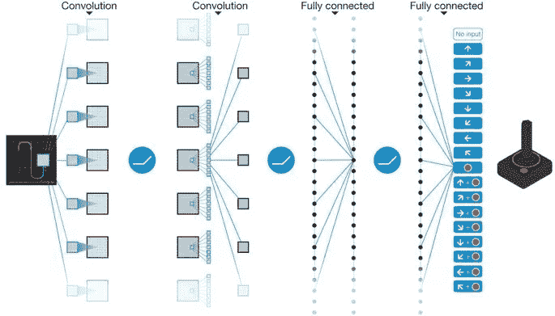
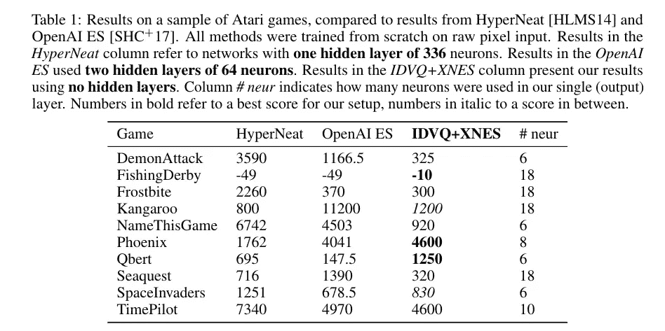

# 用 6 个神经元玩雅达利|开源代码

> 原文：<https://towardsdatascience.com/playing-atari-with-6-neurons-open-source-code-b94c764452ac?source=collection_archive---------12----------------------->

## #2 [研究论文](https://arxiv.org/abs/1806.01363)讲解

这篇论文为机器学习社区打开的大门是惊人的。这个微小的网络实际上玩的是 Atari 游戏，只有 6 个神经元相当，偶尔还会更胜一筹，让以前的网络看起来像笑话。最棒的是，代码在 [GitHub](https://github.com/giuse/DNE) 上是开源的，每个人都可以玩。所以，让我们开始吧…

[SOURCE](http://www.reddit.com/r/oddlysatisfying/comments/39t04m/cube/)

# 怎么可能！！！

我们已经知道，玩 atari 游戏的深度强化学习网络基本上是一个*密集的深度神经网络*既有又有的职责，通过将像素映射到中间表示(**也称为特征提取)**内部学习从图像中提取特征，允许最后(少数)层将这些表示映射到动作和**策略或决策。**

因此，两者是同时学习的，这使得分开研究政策几乎是不可能的。

[Source](https://www.google.com/url?sa=i&rct=j&q=&esrc=s&source=images&cd=&cad=rja&uact=8&ved=&url=https%3A%2F%2Fwww.nature.com%2Farticles%2Fnature14236&psig=AOvVaw0q5seT4_pWHGGBf2NONfwC&ust=1530192629980612)

因此，仅仅通过将表示学习部分从策略学习部分中分离出来，就可以使网络免于构建中间表示，从而使其能够专注于策略逼近，该策略逼近是根据通过交互获得的观察结果在线训练的。

本文有助于在复杂 RL 设置中同时学习*功能*而分别学习*功能*。

这使得一个较小的政策网络更具竞争力，并以更复杂的方式解决问题。

我们可以通过将它们分成两个不同的网络来更好地控制学习。

## 学习特征提取

本文采用了两种新的方法来训练网络:基于*矢量量化*的方法称为**增加字典(VQ)** 和基于*稀疏编码*的方法称为**直接残差 SC** 。

让我们看一些命令行程序来快速理解基本概念，然后我会在文章的后面解释新的东西。

> 矢量量化是一种神经网络算法，用于通过使用称为字典的矢量列表来学习二元或多元分类。

**注:**我鼓励你进一步学习 [**矢量量化**](https://www.techopedia.com/definition/32067/learning-vector-quantization-lvq) 和 [**稀疏编码**](http://ufldl.stanford.edu/tutorial/unsupervised/SparseCoding/) 以便更好的理解。

## 学习决策政策

使用能够应对维度增长的专门版本的**指数自然进化策略**来训练策略。

# 让我们建立系统💻

现在让我们了解一下他们是如何实现这篇论文的。我们的系统可以编码成 **4** 的简单步骤:

# 1.环境👾

该系统建立在 Atari 2600 的 OpenAI 框架上，具有原始控制台的所有限制。观测值由一个[210×180×3]张量组成，代表屏幕输入的 RBG 像素。

网络的输出被解释为 18 个离散动作中的一个，代表来自操纵杆的潜在输入。跳帧次数固定为 5。

# 2.压缩机💼

你也可以称之为预处理器。

压缩器是一个神经网络，当与环境交互时，它以一种*在线方式从观察中提取低维代码。*

为了获得在线学习的最佳性能，本文采用了两种新的方法，并将它们结合在一起。

## 增加字典矢量量化

这个版本的 VQ 增加了字典的大小，不像矢量量化有固定的字典大小。

字典大小的增长由阈值δ调节，指示被认为是有意义的增加的最小聚集残差。

## 直接残差稀疏编码

基于字典的算法的性能更多地取决于编码而不是字典训练。因此，为了提高 IDVQ 的性能，使用了直接剩余 SC。详细解释[请点击此处](https://arxiv.org/abs/1806.01363)。

# 3.控制器🎮

所有实验的控制器都是单层全连接递归神经网络(RNN)。

每个神经元通过加权连接接收以下输入:网络的输入、来自先前激活的所有神经元的输出(最初为零)和恒定偏置(总是设置为 1)。

输入**的数量**在任何给定的时间点都等于来自压缩机*变化*输出的代码的大小。

在**输出层**中的神经元数量保持等于每个游戏的动作，如 ALE 模拟器所定义的。这在一些游戏中低至 6，最多 18。

# 4.【计算机】优化程序🚀

优化器是我们的学习算法，随着时间的推移提高网络的性能，在这种情况下，一种称为...

## 指数自然进化策略💁[论文](http://people.idsia.ch/~juergen/xNES2010gecco.pdf)

自然进化策略是一个进化算法家族，它控制着个体的显式种群参数。

# 结果

下面给出了在 OpenAI 的 ALE 框架上，从数百个可用游戏中选出的 10 个 Atari 游戏的比较结果。

他们将他们的工作与最近的两篇论文进行了比较，这两篇论文提供了 Atari 游戏的广泛结果。

**RESULTS**

# 结论

我们提出了一种在强化学习任务(如 Atari 游戏)中学习视觉控制有效策略的方法，该方法使用比通常用于这些问题的深度神经网络小两个数量级的微小神经网络。

这是通过将策略学习与特征构建分离来实现的。

特征构造是在网络外部通过一种被称为递增字典矢量量化的新颖且有效的矢量量化算法来执行的，该算法是根据网络与环境的交互所获得的观测值来在线(即沿着网络)训练的。

如果你喜欢**拍拍**和**与社区分享**这个的解释。关注我的 **Medium** 和 **Twitter** 以获取更多# **研究论文解释**通知…

如果你对这篇论文有任何疑问，或者想让我解释你最喜欢的论文，请在下面评论。

# 你会喜欢的以前的故事:

 [## DeepMind 惊人的混搭 RL 技术

### 2018 年 6 月发布的研究论文解释

hackernoon.com](https://hackernoon.com/deepminds-amazing-mix-match-rl-techique-a6f8ce6ac0b4)  [## 纪元与批量大小与迭代次数

### 了解您的代码…

towardsdatascience.com](/epoch-vs-iterations-vs-batch-size-4dfb9c7ce9c9)  [## 50 tensor flow . js API 5 分钟讲解| TensorFlow.js Cheetsheet

### TensorFlow API Cheetsheet

towardsdatascience.com](/50-tensorflow-js-api-explained-in-5-minutes-tensorflow-js-cheetsheet-4f8c7f9cc8b2)  [## 激活函数:神经网络

### Sigmoid，tanh，Softmax，ReLU，Leaky ReLU 解释！！！

towardsdatascience.com](/activation-functions-neural-networks-1cbd9f8d91d6)  [## 手机上的 TensorFlow:教程

### 在 Android 和 iOS 上

towardsdatascience.com](/tensorflow-on-mobile-tutorial-1-744703297267)