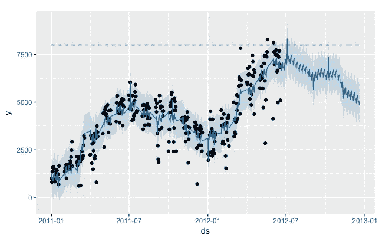
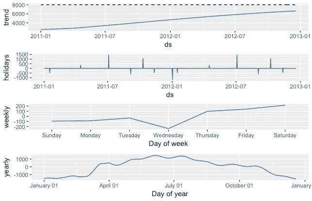
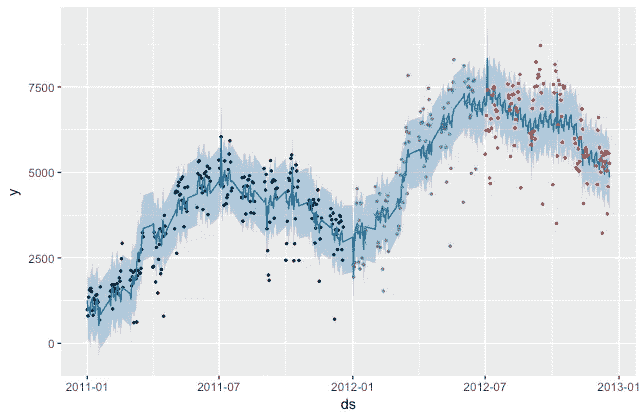

# 华盛顿特区自行车共享需求的预言家游戏(上)

> 原文：<https://towardsdatascience.com/playing-with-prophet-on-bike-sharing-demand-time-series-1f14255f7ff0?source=collection_archive---------2----------------------->

*更新:此处* *勾选本文第二部分* [*。*](/predicting-bike-sharing-demand-in-washington-d-c-part-2-56af211585a2)

最近，我发现脸书发布了一个名为 [Prophet](https://facebookincubator.github.io/prophet/) 的时间序列预测工具。它对 R 和 Python 都可用。

 [## 先知

### Prophet 是一个用 R 和 Python 实现的预测程序。它速度很快，并提供完全自动化的预测…

facebookincubator.github.io](https://facebookincubator.github.io/prophet/) 

根据官方网站:

> “它(Prophet)基于一个加法模型，非线性趋势与每年和每周的季节性以及假期相适应。它最适用于具有至少一年历史数据的每日周期数据。Prophet 对缺失数据、趋势变化和较大的异常值具有稳健性。”

更多细节，我建议阅读[论文](https://facebookincubator.github.io/prophet/static/prophet_paper_20170113.pdf)和[快速入门](https://facebookincubator.github.io/prophet/docs/quick_start.html)指南。

我想尝试一下这个新包，并决定使用两年前在华盛顿特区举行的与预测自行车共享需求相关的 Kaggle 比赛的数据集

这个项目的所有代码都可以在这个 [repo](https://github.com/jroberayalas/bikes_prophet/blob/master/experiment.R) 中获得。

# **数据**

数据集包含几个特征，包括:

*   日期-时间
*   假日(作为一个二元变量，表示该日是否被视为假日)
*   天气状况(一个有 4 类的分类变量)
*   温度
*   湿度
*   风速
*   自行车租赁总数

该数据集提供了跨越两年(2011 年和 2012 年)的每小时租金数据。对于比赛来说，训练集由每月的前 19 天组成，而测试集则是每月的第 20 天到月底。目标是仅使用租赁期之前的可用信息，预测测试集覆盖的每小时租赁的自行车总数。

因为数据来自一场比赛，测试集不包含租赁自行车的总数，所以对于这个实验，它不能用于评估模型的性能。另一个问题是，Prophet 最适合每日周期数据，所以我必须将数据从每小时转换为每天。

从上面的特性中，我们感兴趣的是日期时间、假期和自行车租赁的总数。

# 设置

我用的是 r 的 Prophet 包。[文档](https://facebookincubator.github.io/prophet/docs/quick_start.html)写得很好，提供了几个学习如何使用 Prophet 的例子。据此，有几个易于解释的参数，允许用户改进或调整预测。虽然默认的参数值可以很好地开始工作，但是我想使用非穷举的网格搜索来确定最佳的参数值。

首先，我决定将竞赛网站提供的训练集分成三部分:2011 年全年用于模型拟合，2012 年上半年作为参数调优的验证集，2012 年下半年作为检验所选模型性能的测试集。虽然我们没有整个月的数据，但这似乎不是 Prophet 软件包的问题，因为它对丢失的数据很健壮。

假日特性是一个二元变量，它只告诉我们日期是否是假日，但不提供它所指的是哪个假日的信息。我不得不做一些研究来确定这些日期，因为 Prophet 使用这些信息来正确地确定特定节日的贡献(这是非常有用的)。我使用了这个[网站](http://www.officeholidays.com/countries/usa/2011.php)，它包含了美国联邦假日的详细信息。

最后，需要一些调整的参数与我们希望给予模型的灵活性有关，以适应变化点、季节性和节假日。进行非详尽的网格搜索只是为了对参数的最佳值有一个模糊的概念。如果用户对手头的任务有一些专业知识，可以跳过这一步。

# 模型

使用平均绝对误差(MAE)作为性能度量来执行网格搜索，以识别最佳参数。

找到的最佳参数是:

*   运载能力:8000 人
*   改变点先验比例:0.5
*   季节性先验标度:10
*   假日优先比例:1

然后，在训练集和验证集上使用这些参数重新训练该模型。

确定的最佳模型的建模和预测自行车共享需求时间序列如下所示。可见大势已被捕捉。

Modeled and predicted bike sharing demand time series using the Prophet package.

此外，Prophet 还提供了绘制时间序列中不同部分的功能。这些显示如下，可以观察到一些有趣的事情。首先，似乎有些节日会增加租赁数量(如独立日-7 月 4 日)，而其他节日则会减少(如元旦)。第二，租金记录较少的一天是星期三。此外，随着周末的临近，租金往往会上涨，周六达到最高。最后，一年中，夏季月份的租赁次数往往高于冬季月份。

Time series components identified using the Prophet package.

最后，剩下的唯一事情是在测试集上观察模型的性能。下面显示了用于绘制它的代码。总的来说，我们可以说这个模型在预测方面做得很好。

Modeled and predicted bike sharing demand time series using the Prophet package. The black points correspond to the training set, the green ones to the validation set, and the red ones to the testing set.

# 评论

经过训练的最终模型似乎能够很好地捕捉总体趋势。我对 Prophet 软件包的易用性和用户可获得的灵活性印象深刻。

这只是一个小项目，有几件事可以考虑改进它:

*   使用原始的每小时数据集，而不是每天数据集。
*   将其余特征(天气和环境变量)纳入模型。这可以提供额外的信息，用于做出更好的预测。
*   纳入 NARX 建模方法，以包括外生变量。
*   为参数调整执行贝叶斯优化。
*   为正确的模型选择执行模拟历史预测。

*更新:查看本文第 2 部分* [*此处*](/predicting-bike-sharing-demand-in-washington-d-c-part-2-56af211585a2) *。*