# 在 python 中处理时间序列数据

> 原文：<https://towardsdatascience.com/playing-with-time-series-data-in-python-959e2485bff8?source=collection_archive---------0----------------------->

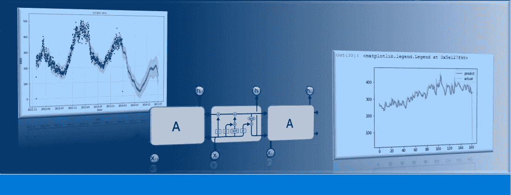

时间序列是日常生活中最常见的数据类型之一。股票价格、销售额、气候数据、能源使用量甚至个人体重都是可以定期收集的数据示例。几乎每个数据科学家都会在工作中遇到时间序列，能够有效地处理这些数据是数据科学工具箱中的一项重要技能。

这篇文章是开始使用 python 处理时间序列的快速介绍。这包括时间序列的小定义和一些数据操作，使用熊猫访问伦敦家庭的智能电表能耗数据。这篇文章中使用的数据可以在这里检索[。我在我认为有用的地方添加了代码。](https://data.london.gov.uk/dataset/smartmeter-energy-use-data-in-london-households)

让我们从基础知识开始，时间序列的[定义](https://en.wikipedia.org/wiki/Time_series):

> *时间序列是按时间顺序索引、列出或绘制的数据点的集合。*最常见的是，时间序列是在连续的等间隔时间点获取的序列。*因此它是一个离散时间数据序列。*

时间序列数据是围绕相对确定的时间戳组织的；因此，与随机样本相比，可能包含我们试图提取的额外信息。

## **装载和处理时间序列**

**数据集**

举个例子，让我们用 2011 年 11 月至 2014 年 2 月间参与英国电力网络领导的低碳伦敦项目的伦敦家庭为样本，使用一些以千瓦时(每半小时)为单位的能耗数据。我们可以从制作一些探索性的图开始，最好是了解结构和范围，这也将使我们能够寻找最终需要纠正的缺失值。

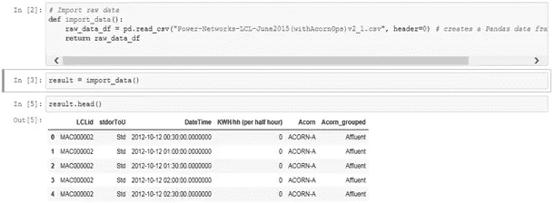

在这篇文章的剩余部分，我们将只关注*日期时间*和*千瓦时*列。

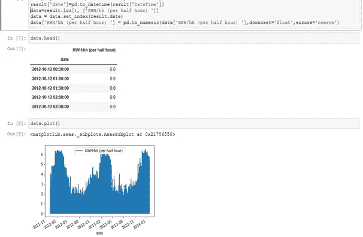

**重采样**

让我们从简单的重采样技术开始。重采样包括更改时间序列观测的频率。您可能对时间序列数据的重采样感兴趣的一个原因是要素工程。事实上，它可以用来为监督学习模型的学习问题提供额外的结构或洞察力。pandas 中的重采样方法与其 groupby 方法类似，因为本质上是按特定的时间跨度进行分组。然后，您可以指定重新采样的方法。让我们通过看一些例子来使重采样更加具体。我们将从每周总结开始:

*   data.resample()将用于对数据帧的 kWh 列进行重新采样
*   “W”表示我们希望按周重新取样。
*   sum()用于表示我们需要这段时间内的总千瓦时。

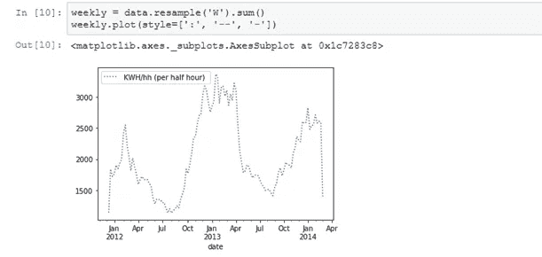

对于每日摘要，我们可以做同样的事情，对于每小时摘要，我们可以使用 groupby 和 mean 函数:

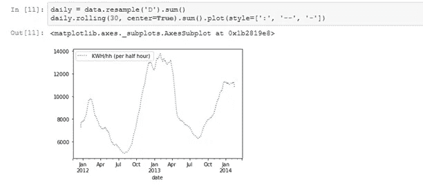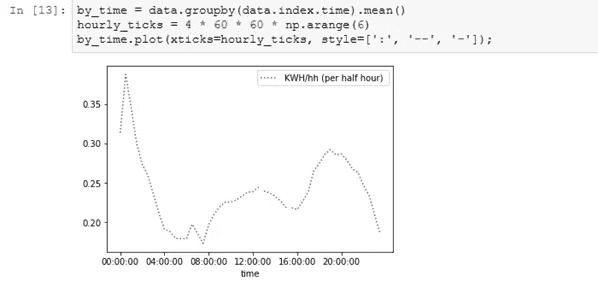

为了进一步进行重采样，pandas 提供了许多内置选项，您甚至可以定义自己的方法。以下两个表分别显示了表周期选项和一些可用于重采样的常用方法。

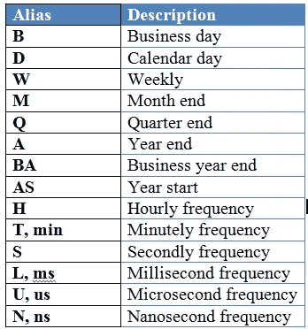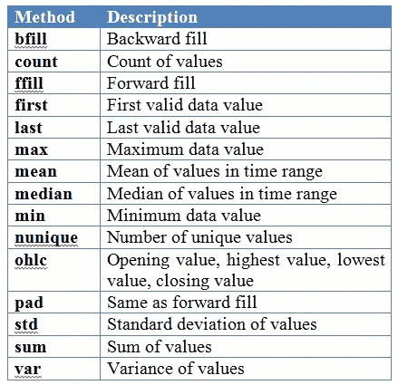

## **附加探索**

以下是您可以利用这些数据进行的一些探索:

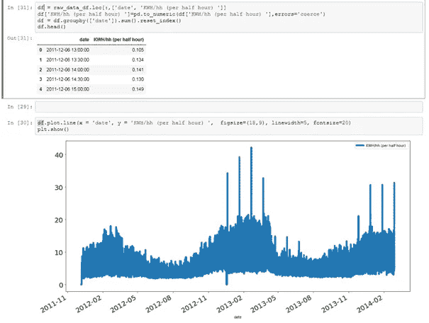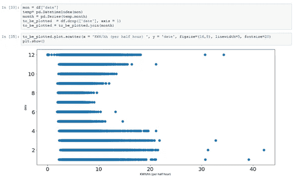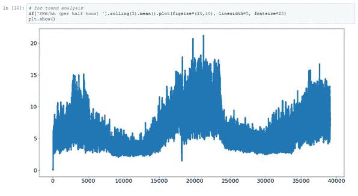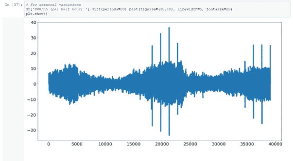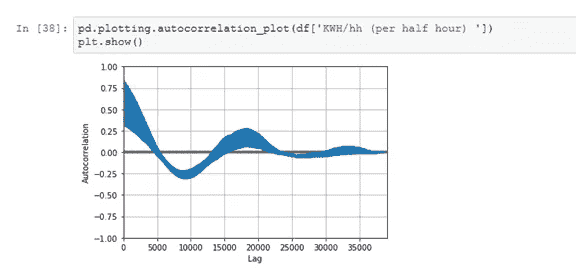

# **用先知造型**

脸书 Prophet 于 2017 年发布，可用于 Python 和 r。Prophet 旨在通过显示不同时间尺度上的模式的日常观察来分析时间序列。Prophet 对缺失数据和趋势变化非常稳健，通常能够很好地处理异常值。它还具有高级功能，可以对节假日对时间序列的影响进行建模，并实现自定义的变点，但我将坚持使用基本功能来建立并运行模型。我认为 Prophet 可能是快速预测的好选择，因为它有直观的参数，可以由具有良好领域知识但缺乏预测模型技术技能的人调整。关于先知的更多信息，读者可以在这里查阅官方文档[。](https://facebook.github.io/prophet/docs/quick_start.html)

在使用 Prophet 之前，我们将数据中的列重命名为正确的格式。日期列必须名为' *ds* ，我们要预测的值列必须名为' *y* '。在下面的例子中，我们使用了每日汇总数据。

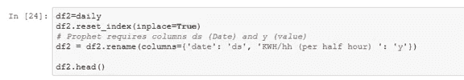

然后我们导入 prophet，创建一个模型并拟合数据。在 prophet 中，[change point _ prior _ scale](https://facebook.github.io/prophet/docs/trend_changepoints.html)参数用于控制趋势对变化的敏感程度，数值越高越敏感，数值越低越不敏感。在试验了一系列值之后，我将这个参数从默认值 0.05 设置为 0.10。

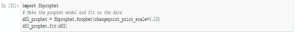

为了进行预测，我们需要创建一个所谓的未来数据框架。我们指定要预测的未来时间段的数量(在我们的例子中是两个月)和预测的频率(每天)。然后我们用我们创建的预言家模型和未来的数据框架进行预测。

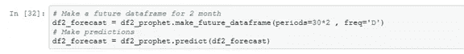

这很简单！未来数据框架包含未来两个月的估计家庭消费。我们可以用一个图来形象化这个预测:

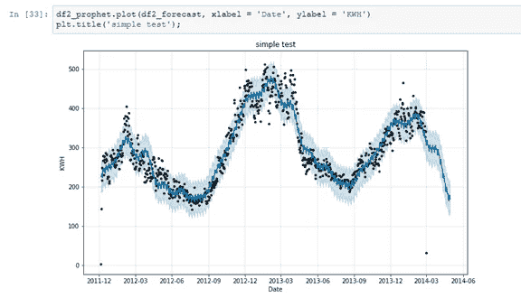

黑点代表实际值，蓝线表示预测值，浅蓝色阴影区域表示不确定性。

如下图所示，不确定性区域随着我们未来的进一步发展而增长，因为初始的不确定性会随着时间的推移而传播和增长。

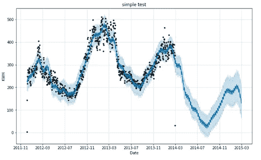

Prophet 还允许我们轻松地可视化整体趋势和组件模式:

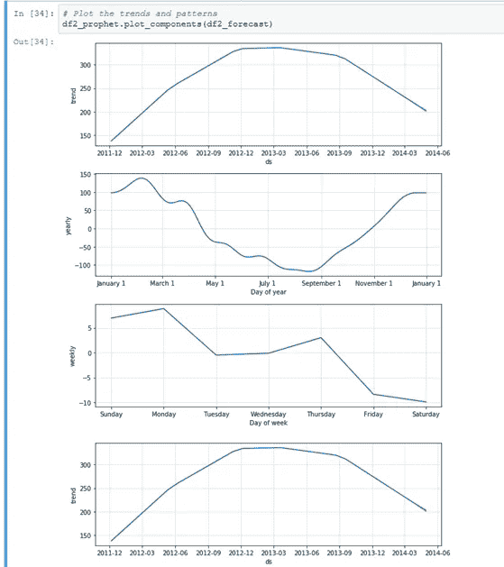

年度模式很有趣，因为它似乎表明家庭消费在秋季和冬季增加，在春季和夏季减少。直觉上，这正是我们期望看到的。从每周趋势来看，周日的消费似乎比一周中的其他几天多。最后，总体趋势表明，在缓慢下降之前，消费增长了一年。需要进一步的调查来试图解释这一趋势。在下一篇文章中，我们将尝试找出这是否与天气有关。

# **LSTM 预测**

长短期记忆递归神经网络有希望学习长序列的观察结果。这篇名为“理解 LSTM 网络”的博客文章以一种简单易懂的方式很好地解释了潜在的复杂性。这是描绘 LSTM 内部细胞结构的图像。

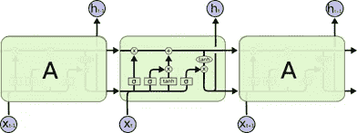

Source: [Understanding LSTM Networks](http://colah.github.io/posts/2015-08-Understanding-LSTMs/)

LSTM 似乎非常适合时间序列预测，事实也可能如此。让我们再次使用我们的每日汇总数据。

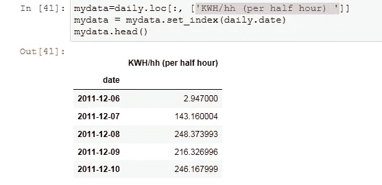

LSTMs 对输入数据的比例很敏感，特别是在使用 sigmoid 或 tanh 激活函数时。通常，将数据重新调整到[0，1]或[-1，1]的范围内是一种好的做法，也称为规范化。我们可以使用 scikit-learn 库中的 MinMaxScaler 预处理类轻松地规范化数据集。

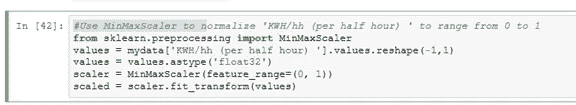

现在，我们可以将有序数据集分为训练数据集和测试数据集。下面的代码计算拆分点的索引，并将数据分成训练数据集，其中 80%的观察值可用于训练我们的模型，剩下的 20%用于测试模型。

我们可以定义一个函数来创建新的数据集，并使用该函数来准备用于建模的训练和测试数据集。

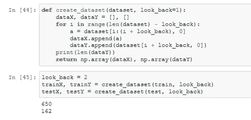

LSTM 网络期望输入数据具有特定的数组结构，其形式为:[样本、时间步长、特征]。

我们的数据目前以[样本，特征]的形式出现，我们将每个样本的问题框定为两个时间步。我们可以将准备好的训练和测试输入数据转换成预期的结构，如下所示:

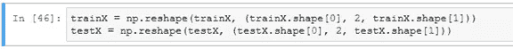

仅此而已！现在，我们已经准备好为我们的示例设计和安装我们的 LSTM 网络。

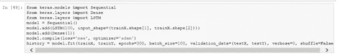

从损失图中，我们可以看到，该模型在训练和测试数据集上都具有相当的性能。

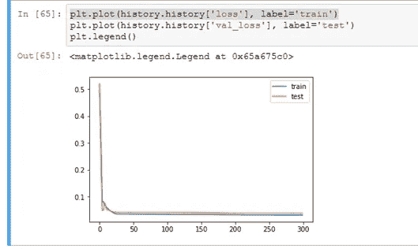

在下图中，我们看到 LSTM 在拟合测试数据集方面做得非常好。

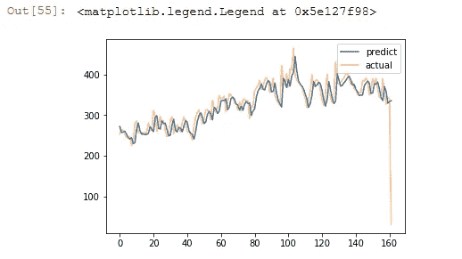

# **集群**

最后但同样重要的是，我们还可以对样本数据进行聚类。有相当多不同的方式来执行集群，但是一种方式是分层地形成集群。您可以通过两种方式形成层次结构:从顶部开始并拆分，或者从底部开始并合并。我决定在这篇文章中看看后者。

让我们从数据开始，我们简单地导入原始数据并添加两列，分别表示一年中的某一天和一天中的某一小时。

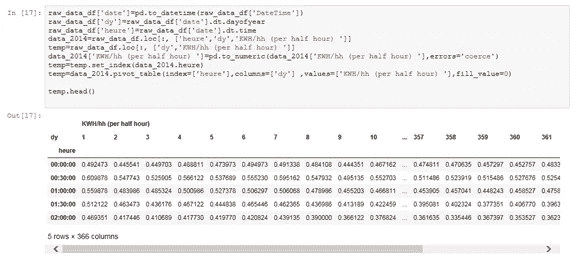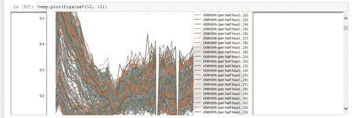

**连锁和树状图**

链接函数获取距离信息，并基于相似性将对象对分组到聚类中。这些新形成的集群接下来相互连接，形成更大的集群。重复该过程，直到原始数据集中的所有对象在分层树中链接在一起。

要对我们的数据进行聚类:

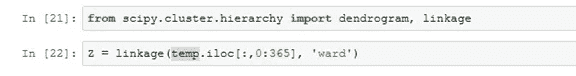

搞定了。！！这很简单，不是吗？

嗯，当然是，但是“病房”是什么意思，它实际上是如何工作的？正如 scipy linkage 文档告诉我们的，ward 是可以用来计算新形成的星团之间距离的方法之一。关键字“ward”使链接功能使用 Ward 方差最小化算法。其他常见的链接方法，如单一、完整、平均和不同的距离度量，如欧几里德、曼哈顿、汉明、余弦，也可以使用。

现在让我们来看看这种层次聚类的所谓树状结构。树状图是聚类的层次图，其中条形的长度表示到下一个聚类中心的距离。

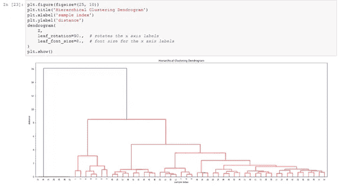

哇哦。！！！！！如果这是你第一次看到树状图，那看起来很吓人，但是不要担心，让我们来分析一下:

*   在 x 轴上你可以看到标签。如果你没有指定其他的东西(比如我)，它们就是你的样本在 x 轴上的索引。
*   在 y 轴上你可以看到距离(在我们的例子中是沃德方法的距离)。
*   水平线是聚类合并
*   垂直线告诉您哪些分类/标签是形成新分类的合并的一部分
*   水平线的高度告诉您形成新的集群需要“桥接”的距离

即使有了解释，之前的树突还是不明显。我们可以切掉一点，以便更好地查看数据。

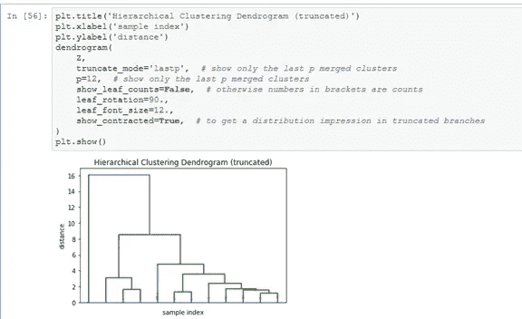

好多了，不是吗？查阅[凝聚集群文档](http://scikit-learn.org/stable/modules/generated/sklearn.cluster.AgglomerativeClustering.html)以了解更多信息并使用不同的参数。

# 参考资料和进一步阅读:

*   [https://joernhees . de/blog/2015/08/26/scipy-hierarchical-clustering-and-trendgram-tutorial/# Selecting-a-Distance-Cut-Off-aka-Determining-the-Number-of-Clusters](https://joernhees.de/blog/2015/08/26/scipy-hierarchical-clustering-and-dendrogram-tutorial/#Selecting-a-Distance-Cut-Off-aka-Determining-the-Number-of-Clusters)
*   [https://medium . com/open-machine-learning-course/open-machine-learning-course-topic-9-time-series-analysis-in-python-a 270 CB 05 E0 b 3](https://medium.com/open-machine-learning-course/open-machine-learning-course-topic-9-time-series-analysis-in-python-a270cb05e0b3)
*   [https://PE tolau . github . io/ts repr-clustering-time-series-re presentations/](https://petolau.github.io/TSrepr-clustering-time-series-representations/)
*   [https://www . analyticsvidhya . com/blog/2016/02/time-series-forecasting-codes-python/](https://www.analyticsvidhya.com/blog/2016/02/time-series-forecasting-codes-python/)
*   【http://colah.github.io/posts/2015-08-Understanding-LSTMs/ 
*   [http://docs . scipy . org/doc/scipy/reference/cluster . hierarchy . html](http://docs.scipy.org/doc/scipy/reference/cluster.hierarchy.html)
*   [https://facebook.github.io/prophet/docs/quick_start.html](https://facebook.github.io/prophet/docs/quick_start.html)