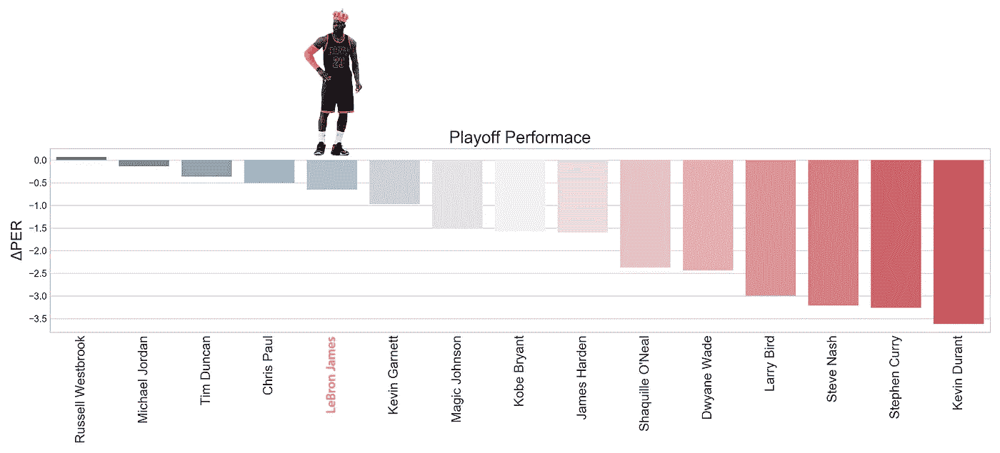
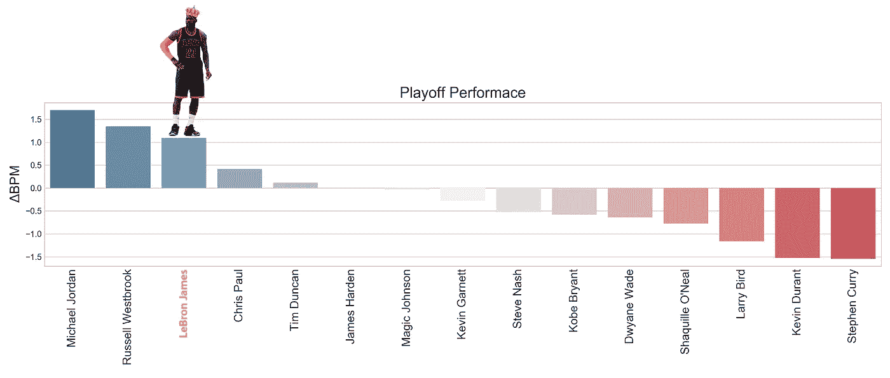
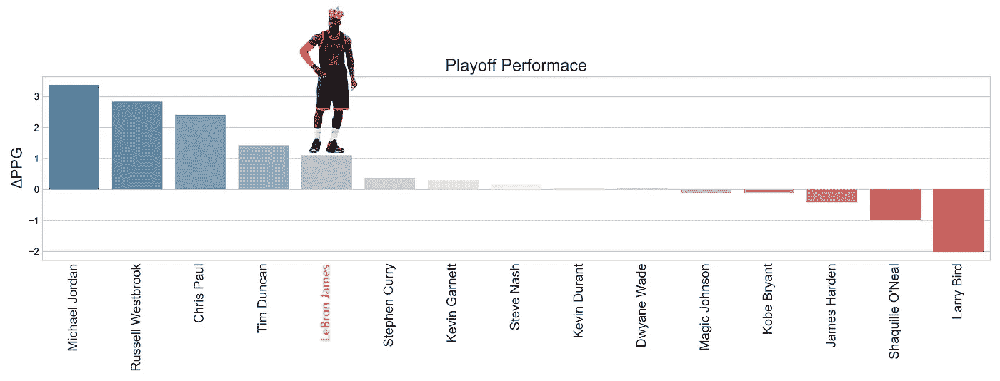
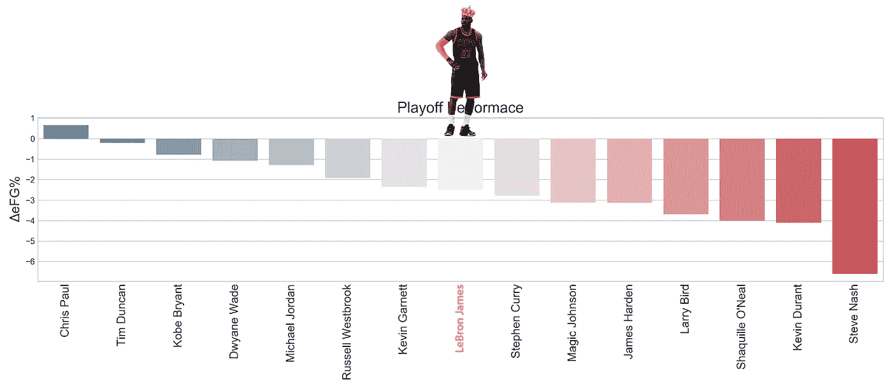
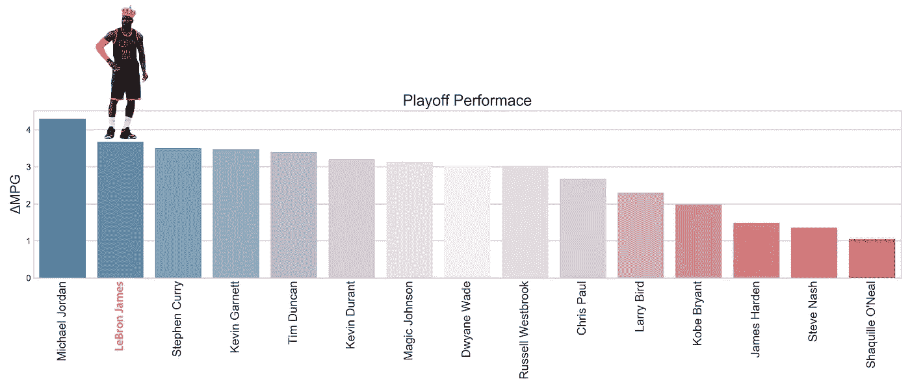
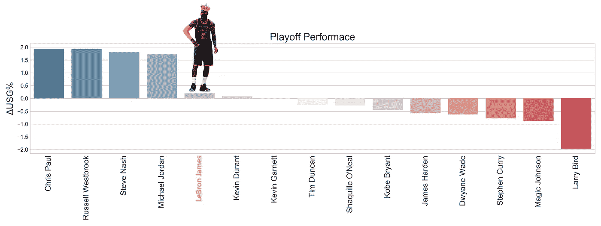
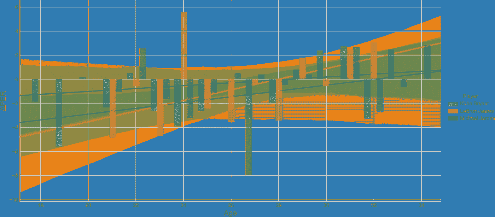
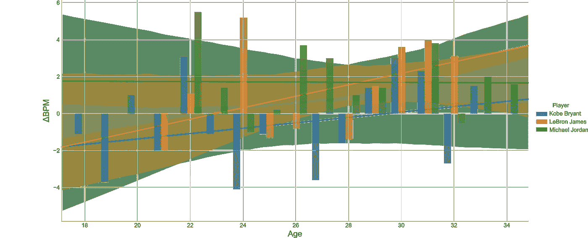

# 季后赛勒布朗

> 原文：<https://towardsdatascience.com/playoff-lebron-40ff6f1630fb?source=collection_archive---------11----------------------->

近年来，NBA 球队在比赛的许多方面变得更加聪明，一个主要的例子是球员在漫长而艰苦的常规赛中休息和调节的重要性。

这导致越来越多的人猜测，NBA 的一些大牌球星在整个常规赛中都处于“巡航控制”状态，在季后赛“按下开关”之前等待时机。自我标榜的“季后赛-P”角色(俄克拉荷马雷霆队的保罗·乔治)表明，球员们意识到了这种看法，但真正让我质疑的是勒布朗·詹姆斯迄今为止在东部季后赛中的主导表现——推动一支看似毫无生气的骑士队进入了东部决赛——勒布朗是否真的在季后赛中比常规赛运转得更好，这是最近的现象还是球员们在职业生涯后期可能会做的事情，以延长他们的寿命。

那么，“季后赛勒布朗”是真的吗？为了进一步调查，我在数据中做了一些挖掘。

将一些基本的和高级的统计数据分为常规赛和季后赛，然后只限制给定球员进入季后赛的赛季，我们可以从职业生涯的平均数据开始。绘制一组选定球员的常规赛和季后赛 PER ( [球员效率等级](https://www.basketball-reference.com/about/per.html))的差异(注意:**不是所有球员**！)，我们看到以下内容:

看来季后赛对球员效率的要求很苛刻！应该指出的是，有许多更先进的方法来区分常规赛和季后赛之间的差异，但这些是球员在常规赛和季后赛之间的 PER 的原始差异。

如果我们看看另一个高级统计，BPM ( [框加减](https://www.basketball-reference.com/about/bpm.html))，我们可以开始看到一些明显的区别:

从这几个图表来看，勒布朗、迈克尔·乔丹和拉塞尔·维斯特布鲁克真的会出现在季后赛中！也许与流行的观点相反，克里斯·保罗在我们的季后赛排名中也有很高的评价——事实上，他有历史上最高的季后赛 per，但一些高调的失误玷污了他的季后赛声誉。

原始得分数据呢？嗯，你可能已经猜到了，乔丹在这里是一个非常明显的领跑者，在季后赛中每场得分比常规赛多 3 分以上:

尽管一些球员得分上升，他们的得分效率在季后赛中如何转化？为此，我选择了 eFG% ( [有效投篮命中率](https://www.sportingcharts.com/dictionary/nba/effective-field-goal-percentage-efg.aspx))，尽管[真实投篮命中率](https://en.wikipedia.org/wiki/True_shooting_percentage)可能会得出类似的结果:

有一种普遍的看法认为，比赛在季后赛中会变慢，变得“更丑”。这是因为团队有更多的时间和动力去侦察和制定游戏计划，特别是去关闭他们的对手人员和最喜欢的场景。对方球队甚至可以刺激明星球员只采用效率最低的投篮类型，导致整体投篮效率下降。有趣的是，常规赛的效率之王——克里斯·保罗——在季后赛中奇迹般地拥有稍高的*eFG %!上帝，这才是重点。*

对于其他人来说，效率的下降也可能是由于单个玩家工作量的变化。我们知道，在季后赛中，轮换时间大大缩短，明星球员尽可能多地留在场上。让我们看看这在数据中是否突出:

看起来一些有史以来最好的球员在季后赛中被更多的使用，乔丹和勒布朗每场比赛都获得了更高的上场时间。

球员处理球的时间有多长，或者他们在球场上消耗了多少财产？这可以在 USG% ( [使用率](https://www.nbastuffer.com/analytics101/usage-rate/))中说明:

虽然勒布朗的使用率在季后赛中没有明显增加，但这可能是因为他在常规赛中的使用率已经非常高了，因为他在职业生涯的大部分时间里一直担任名义上的“控球后卫”。有趣的是，我们看到在我们的球员组合中，传统控卫(即克里斯·保罗、拉塞尔·维斯特布鲁克和史蒂夫·纳什)的使用量大幅上升——这是他们试图作为球队的首席调解人来做所有事情，还是季后赛期间进攻或防守理念战略差异的结果？有趣的是，许多得分后卫(如科比、詹姆斯·哈登、韦德、斯蒂芬库里)的使用率都下降了。在季后赛中，对手会更有效地阻止他们吗？像往常一样，蒂姆邓肯仍然是一致性的典范，无论在一年中的哪个季节，他都几乎没有改变他那令人难以置信的发挥！

最后，我想看看他们在整个职业生涯中，季后赛表现和常规赛表现之间的差异是如何演变的，而不是看球员的职业生涯平均值。人们常说，年轻球员在季后赛中挣扎，而老将被认为在季后赛中茁壮成长。我们对明星球员的分析证明了这一点吗？让我们先来看看 PER 数字:

尽管由于单个球员在一个赛季中参加的季后赛次数相对较少，数据存在较大差异，但随着球员的发展，似乎有明显的上升趋势。对于我们选择的超级巨星来说，他们 27-28 岁的赛季似乎代表了一个转折点，他们在季后赛的表现开始超过他们在常规赛的表现。这可能是因为季后赛的舒适度增加了，常规赛的方式更放松了，或者更有可能是两者的结合！然而，迈克尔·乔丹 22 岁的季后赛和勒布朗·詹姆斯 24 岁的季后赛真的很突出。让我们看看 BPM 数字来证实这一影响:

根据这个标准，看起来 MJ 在季后赛中一直都很棒——没有什么好惊讶的！不像飘忽不定的“Vino”，看起来勒布朗像一瓶好酒一样老化，自从他 27 岁的赛季以来，他的季后赛平均 BPM 通常超过他的常规赛数字。

他能保持这种状态多久还有待观察，但与此同时，看起来“季后赛勒布朗”绝对还活着&很好！(季后赛)王者万岁！

*用于分析的完整代码可用* [*此处*](https://github.com/tttgm/playofflebron) *。*