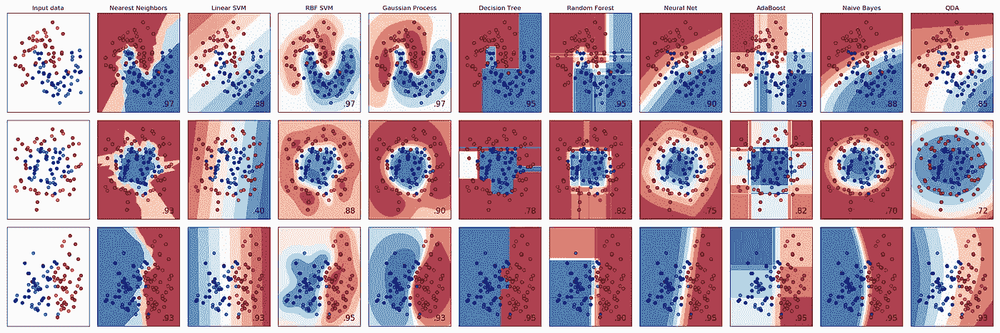
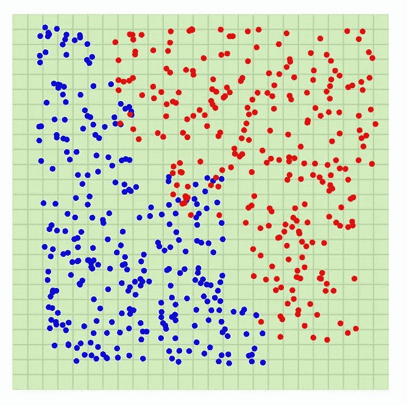
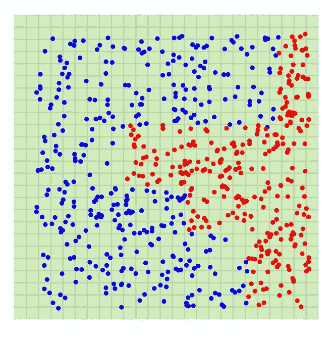
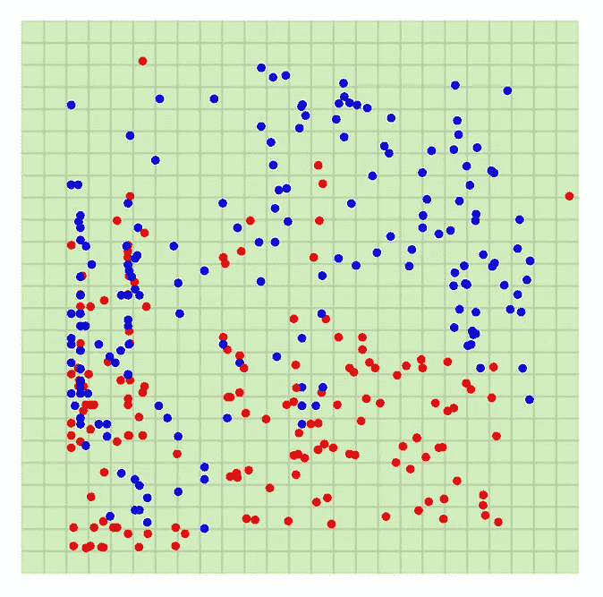
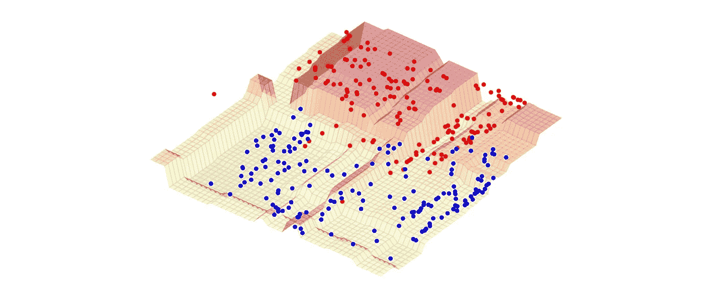

# 在 3D 中绘制决策边界—逻辑回归和 XGBoost

> 原文：<https://towardsdatascience.com/plotting-decision-boundaries-in-3d-logistic-regression-and-xgboost-e68ce0535b4b?source=collection_archive---------7----------------------->

View from Mt. Timpanogos trail, UT, photo by myself

把机器学习模型想象成一个函数——数据帧的列是输入变量；预测值是输出变量。这个函数的水平集(或 coutour)在 ML 术语中称为**决策边界**。

有很多关于划分决策界限的在线学习资源。比如下面这张取自 sklearn 文档的图，就挺受欢迎的。图中 x 轴和 y 轴变量代表数据帧的两个特征(变量)，颜色代表预测值。

[http://scikit-learn.org/stable/auto_examples/classification/plot_classifier_comparison.html](http://scikit-learn.org/stable/auto_examples/classification/plot_classifier_comparison.html)

最近，来自脸书的 Brandon Rohrer 制作了一个视频展示[决策树是如何工作的](https://www.youtube.com/watch?v=9w16p4QmkAI&feature=youtu.be)。看完之后，读者可能会对决策界限有更好的认识。

虽然已经有相当多的学习资源了，但我相信一个好的互动 3D 情节肯定会帮助读者获得对 ML 模型的直觉。这里我挑选两个模型进行分析: **Logistic 回归**，易于训练和部署，在很多领域都是常用的； **XGBoost** ，梯度增强树家族(gradient boosting，LightGBM 等)领先的 ML 算法之一。).

(这次跳过了随机森林，因为只有两个特征被用作可视化目的的模型输入，我不知道如何从仅有的两列中随机选择任何有意义的列。)

# 开始之前的一些注意事项

Dataset 1, 2, and 3

*   红点是标签为 1 的行，蓝点是标签为 0 的行。
*   表面图是由相应的 ML 模型生成的函数。
*   x 轴和 y 轴变量都用作输入变量(要素)，z 轴变量表示散点图的真实值或表面图的预测值。
*   在下面的交互式可视化中，圆点不会显示，直到你拖动图形。
*   为了了解这些情节是如何创造的，一个不错的学习资源是斯特凡·尼克的 d3 积木:[https://bl.ocks.org/Niekes](https://bl.ocks.org/Niekes)

# 数据集 1

对于逻辑回归图，点击[此处](http://www.math.utah.edu/~li/d3/logreg1)。

对于 XGBoost 图，点击此处的。

对于这个玩具数据集，两个模型都非常适合训练集。但实际上，数据永远不会是这个样子。

# 数据集 2

对于逻辑回归图，点击[此处](http://www.math.utah.edu/~li/d3/logreg2)。

对于 XGBoost 图，点击[此处](http://www.math.utah.edu/~li/d3/xgb2)。

逻辑回归可以捕捉线性，但不能捕捉单调性。另一方面，许多基于树的模型可以在这个数据集中表现良好。

# 数据集 3

对于逻辑回归图，点击[这里](http://www.math.utah.edu/~li/d3/logreg3)。

对于 XGBoost 图，点击[这里](http://www.math.utah.edu/~li/d3/xgb3)。

这些数据更加混乱，看起来更像真实世界的数据。在这种情况下，逻辑回归只能捕获数据分布的大致趋势，但不能识别阳性或阴性病例密集的关键区域。另一方面，XGBoost 可以识别关键区域，并且还可以避免在正反例都密集的区域上过度拟合。

# 为什么 XGBoost 决策边界看起来像这样？

XGBoost 算法是梯度提升树算法的一种。它首先生成一个优化目标函数的决策树(更准确地说，是目标函数的二阶泰勒近似，带有额外的正则化项)，然后将每棵树乘以一个常数(学习率)。下一棵树如何生长是基于所有先前的树，加上目标函数的效果。

因为每个决策树是特征空间的一个分区，其中每个区域具有不同的输出值，所以这些树的任何线性组合仍然是特征空间的一个分区。当模型中使用更多的树时，我们将得到更好的划分。

# 曲线拟合

许多机器学习专家表示，ML 只是曲线拟合(1-D 中的曲线，更高维度中的曲面)。从这些例子中，我们可以看到模型是以“适合”这些点的方式创建的。

模型性能不仅取决于“曲线”与训练数据集的拟合程度，还取决于测试数据的分布与训练数据的分布有多接近。如果训练数据和测试数据差异很大，并且您有一个非常“适合”训练数据的模型，这意味着该模型“过度适合”。

感谢阅读。