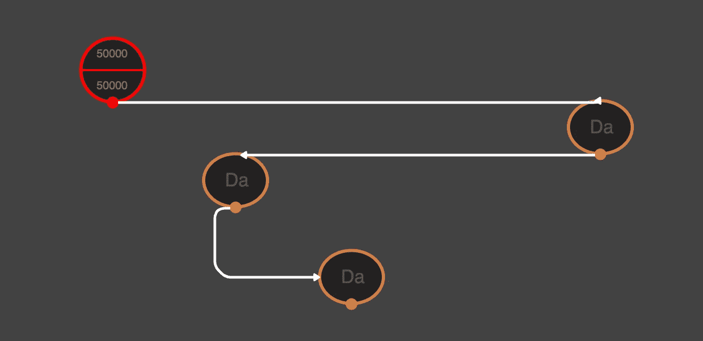
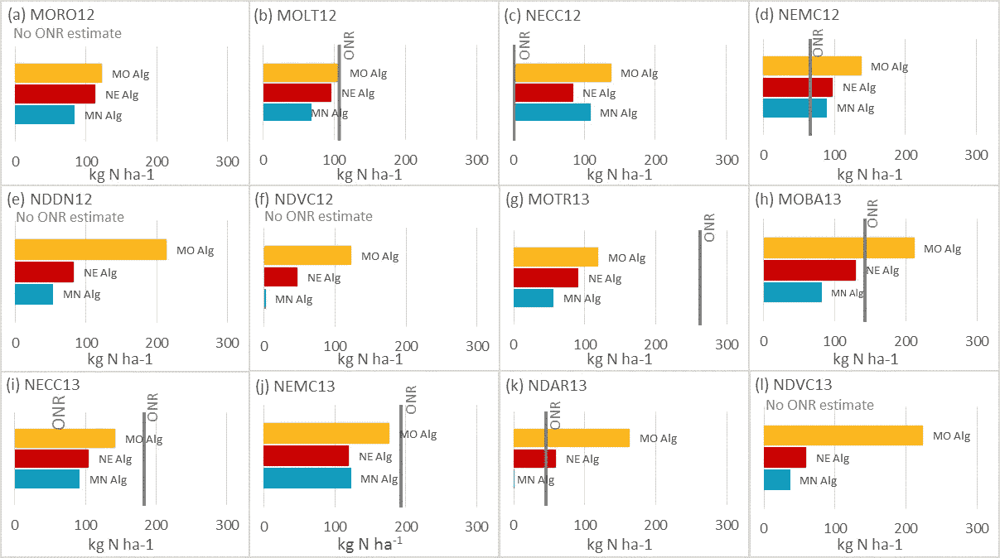
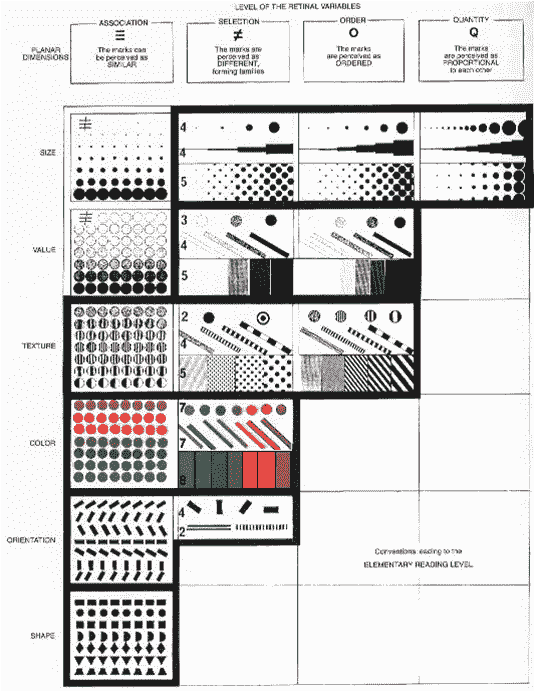
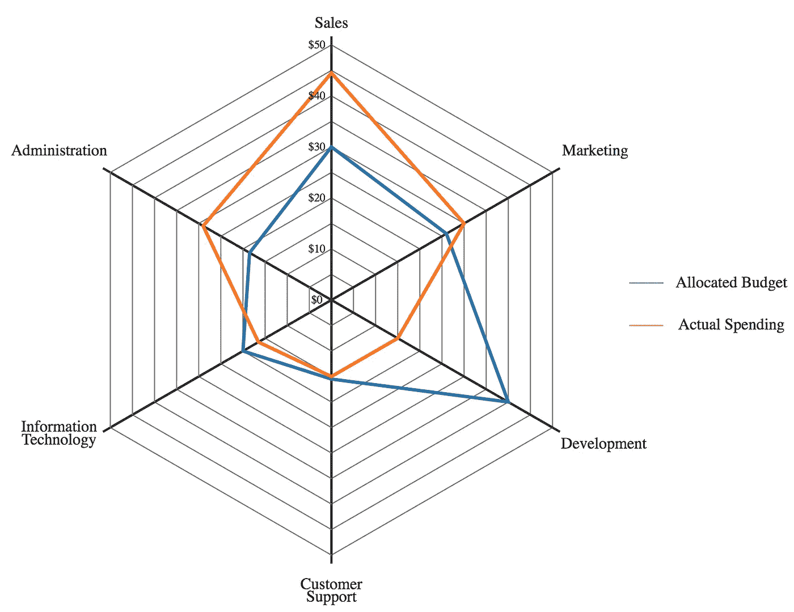
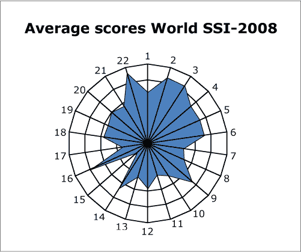
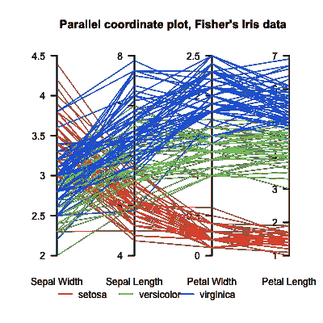
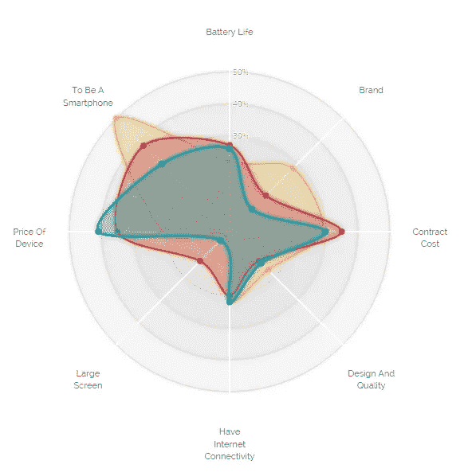
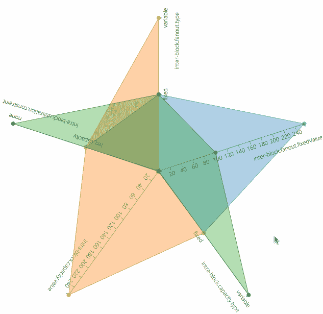
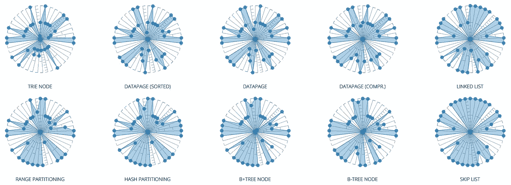
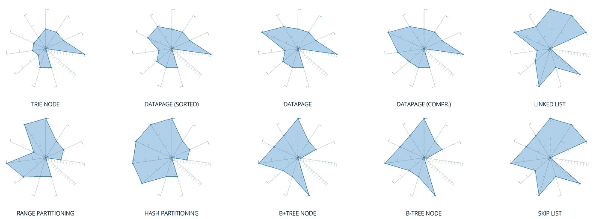

# 误用雷达图来区分多维数据

> 原文：<https://towardsdatascience.com/plotting-in-many-dimensions-382fbd7fe76e?source=collection_archive---------1----------------------->

常见的图表以二维或三维的形式显示数据，但除此之外呢？*(对于不耐烦的人:滚动到底部观看演示和一些代码)*。

一位同事最近带着一个问题来找我:他们正在开发一个点击式工具，通过将一组节点放置和连接在一起并创建一个图表，帮助用户可视化地设计系统。每个节点有许多(大约 30–40 个)不同的可配置设置，通常有不同的可能值:一些是数字，一些是布尔，一些是分类。

How is “Da” different than the other “Da”s?

问题是，查看每个节点并不能告诉您任何关于它的设置的信息，并且查看每个节点的许多设置的列表是非常耗时和令人沮丧的。我们如何让不同类型设置的节点一眼就能区分开来？

当我们有更多的维度，并且数据点具有不可比较的特征时(例如，每个变量可能有不同的最小值/最大值，一些可能是分类的，一些是数字的，等等)，视觉上区分数据变得更加困难。

下面是用条形图网格绘制多维图的样子:

Source: [“Visualization of Food-Based Dietary Guidelines”, Koening](https://www.karger.com/Article/PDF/103566)

在我们的例子中不同的是，我们的*远不止 3 个参数，也就是说，每个图表中有更多的条形。最重要的是，我们并不总是能够将迷你图表排列成整齐的网格(也称为“小倍数”)，这使得发现模式和差异变得更加困难。*

Source: “The Semiology of Graphics”, Bertin

数据可视化理论认为，人们可以使用“通道”对信息进行可视化编码(阅读更多关于 [Bertin 的视网膜变量](http://fellinlovewithdata.com/guides/the-hidden-legacy-of-bertin-and-the-semiology-of-graphics))。但是这对我们没有太大的帮助:工具已经牺牲了位置和大小(我们必须将节点放在图中)，而且一开始就没有那么多变量。

戴上我的数据科学帽子，首先想到的是降维(例如 [PCA](http://setosa.io/ev/principal-component-analysis/) 或 [t-SNE](https://distill.pub/2016/misread-tsne/) )。这是一种数学方法，它获取你的数据集，并神奇地吐出一个新的数据集，它具有更少的维度，以便于绘图。尽管很容易发现相似和不相似的数据点，但通常很难描述这些减少的维度意味着什么。

我同事的第一个建议完全不同——雷达图！这让我大吃一惊。雷达图得到[很多](http://www.darkhorseanalytics.com/blog/radar-more-evil-than-pie)[高射炮火](http://www.thefunctionalart.com/2012/11/radar-graphs-avoid-them-999-of-time.html)，而且往往有充分的理由。

Source: [https://commons.wikimedia.org/wiki/File:Spider_Chart.svg](https://commons.wikimedia.org/wiki/File:Spider_Chart.svg)

不过，我越想，就越觉得值得一试。通常在雷达图中，所有的轴都有相同的域(例如 1 到 10)，但事实并非如此。我们可以将每个轴重新想象为一个单独的维度，然后它可以作为一个 n 维的图。

雷达图的一个问题是，它们对形状进行了过度编码，这意味着对于人类来说，每个轴上的微小差异并不突出，但单个数据点的怪异多边形形状却很突出。但在这种情况下，我们可以利用这一点！

Source: [https://commons.wikimedia.org/wiki/File:Spider_SSI2008.gif](https://commons.wikimedia.org/wiki/File:Spider_SSI2008.gif)

方法如下:人类擅长注意形状之间的差异。我们试图做的是一眼就注意到广泛的差异，所以也许我们可以使形状本身更加突出，而单独的数据点不那么突出。最后，我们得到的是不同节点看起来不同的多边形形状，以及相似节点看起来相似的多边形形状。

解决这个问题的另一种方法是平行坐标图，它是我们假设的图表的近似展开版本:

Source: [https://en.wikipedia.org/wiki/Parallel_coordinates#/media/File:ParCorFisherIris.png](https://en.wikipedia.org/wiki/Parallel_coordinates#/media/File:ParCorFisherIris.png)

我更喜欢雷达版本的一个原因是因为它产生了一种紧凑的表示形式——径向线形成的多边形几乎就像是数据生成的符号。这允许您使用类似于[迷你图](https://en.wikipedia.org/wiki/Sparkline)的压缩表示，可以在另一个应用程序中使用。另一个原因是，我认为单独的线条不如多边形形状容易记忆。

另一个有趣的选择是[切尔诺夫的脸](https://en.wikipedia.org/wiki/Chernoff_face)，它们有相似的脉络，很搞笑，但人们很难认真对待:

Multivariate data abound!

显然，还有[切尔诺夫鱼](https://meagher.co/blog/2016/09/11/chernoff-fish/)。无论如何，这个想法让我很兴奋，我开始工作。我从使用 d3 的 [Nadieh Bremer](https://www.visualcinnamon.com/) 的优秀雷达图[文章和示例代码](https://www.visualcinnamon.com/2015/10/different-look-d3-radar-chart.html)开始:

The code was so nicely commented!

我移除了径向网格圆，以消除轴之间的连续性感觉——毕竟，它们现在代表不同的量。我还去掉了大部分美学上的细微差别，当你缩小图表的尺寸时，这些细微差别并不真正相关。

类似地，我也考虑过完全移除轴之间的径向线/区域，只在每个轴上有大点，但最终这些线作为视觉辅助工具帮助生成了一个整体多边形，似乎比彩色点更容易比较。

我不得不修改大量代码来支持多个不同的轴。此外，基于数据集逐个配置每个轴听起来很痛苦，所以我添加了一些代码来基于数据集本身自动生成刻度和轴:使用一些简单的标准(当前变量的类型——是字符串、布尔还是数字？)，你就可以半知半解的决定用什么样的轴了。您还可以查找最小值和最大值(在线性刻度的情况下)或所有唯一值(在分类变量的情况下)。你可以表面上更聪明地扩展它，例如，你可以测量一个变量的偏斜度，然后决定用对数轴来绘图。

这是一个中间结果，在同一组轴上绘制多个数据点，有些是分类的，有些是线性的:

当然，对于多个数据点来说，这并不实际，因为多边形开始重叠。更重要的是，让我们用一些实际数据来看一个小倍数的例子。我的同事试图为一个研究项目可视化数据结构的不同配置参数。因为我对这个数据集的主题有所了解，所以我希望看到不同的图形组，它们看起来彼此相似，但与其他的不同。

我认为它基本上实现了我们设定的主要目标:具有完全不同设置的节点看起来完全不同(例如，Trie 与范围划分)，而具有相似设置的节点看起来相似(例如，所有 B 树变体、所有数据页变体、链表和跳过列表)。

会扩大到 40 吗？我认为这是可疑的:

这并不奇怪——40 是很多。我怀疑这取决于你所看到的数据的结构。删除维度确实有点像作弊，但是我们仍然显示了比大多数其他可视化类型更多的维度。

要考虑的一件事是轴的顺序:因为变量之间没有特定的关系，所以不清楚什么顺序是最佳的。但是，保持相关的轴彼此靠近可能有助于生成更容易区分的形状。或者，先对分类轴进行分组，然后对附近的顺序轴进行分组可能会有所帮助。

另一个方面是颜色——使相似的形状看起来颜色相似可能是一个很大的改进，例如，像链表和跳表这样的南北向重的实例可以看起来不同于像 datapage 和 trie 这样的东西向重的实例。如何最好地做到这一点并不明显。

我不喜欢这个图表是因为它让分类变量看起来是有序的。无论如何，你必须在轴线上有一个定义好的类别选项顺序。这更像是语义上的吹毛求疵——因为目的是让不同的数据点看起来不同，这不一定那么重要:单个值不如成功的比较重要。

我们可以做一些更聪明的事情:最不常见的选项可以最接近原点，而最常见的选项可以最远，这意味着最“平均”的数据点将类似于一个大的等半径多边形，而该数据点的不常见变量将显示为易于区分的“倾斜”。

Slightly subtler styling. The first 4 shapes remind me of [Darwin’s finches](https://en.wikipedia.org/wiki/Darwin%27s_finches) for some reason.

总的来说，这对于相对较少的努力来说是不错的！如果你想试试，这里有一些演示和代码:

 [## 不同坐标轴的多元雷达图

### Mehmet Ali "Mali" Akmanalp 区块 9cb 99571 ee 74 b 169 DC 109 EC 3 fc 3d 4920

bl.ocks.org](http://bl.ocks.org/makmanalp/9cb99571ee74b169dc109ec3fc3d4920) 

它不是防弹的，因为我没有花太多时间在它上面(“最后的 20%花费了 80%的时间”)，但它只是几行代码来画一个图表，它应该可以完成工作！

***鸣谢*** *:感谢 Nicky Case、John Christian、Katherina Nguyen、Will Strimling 和 Justin Woodbridge 提供的宝贵帮助、建议和反馈！*