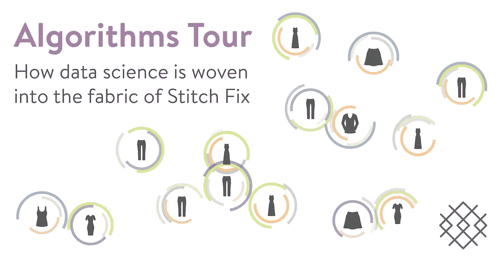

# 播客片段:与 StitchFix 的首席算法官在第 9 集的背景中

> 原文：<https://towardsdatascience.com/podcast-take-in-context-episode-9-with-stitchfixs-chief-algorithms-officer-7c96a1cbd830?source=collection_archive---------17----------------------->

语境播客[的最新一集是机器学习领域任何人的必听内容。Context 的主持人，](https://www.integrate.ai/podcast/) [integrate.ai](https://medium.com/u/dbf4eb8c5945?source=post_page-----7c96a1cbd830--------------------------------) 的[凯瑟琳·休姆](https://medium.com/u/376d12f93382?source=post_page-----7c96a1cbd830--------------------------------)，总是向一群令人印象深刻的客人提出商业和技术问题的完美平衡。

> 如果你以前没有听过语境中的[，我强烈推荐订阅！另一个很棒的剧集是第 7 集的](https://www.integrate.ai/podcast/)[“了解数据产品市场”](https://www.integrate.ai/podcast/2018/4/29/episode-7-understanding-the-marketplace-for-data-products-with-clare-corthell-sarah-catanzaro)，由 Clare Corthell 和 Sarah Catanzaro 主演。

埃里克·科尔森目前是在线订阅个人购物服务公司 StitchFix 的首席算法官，他最近首次公开募股。在 Stitch Fix 之前，Eric 是网飞数据科学&工程副总裁，这是另一家将机器学习[深度融入客户体验](https://medium.com/netflix-techblog/using-machine-learning-to-improve-streaming-quality-at-netflix-9651263ef09f)的公司。不用说，StitchFix 肯定是以切实的方式利用机器学习来影响其商业目标的顶级公司之一，其他公司还有优步、谷歌、Airbnb 和苹果。

虽然播客的标题专注于为 autonomy 招聘，但实际上这一集涵盖了许多有趣的主题——从构建数据科学团队到在组织中脱颖而出，“fullstack 数据科学家”，以及 StitchFix 自己的机器学习项目。

Stitch Fix’s Algorithms team has a [dedicated website](https://algorithms-tour.stitchfix.com/) that shows algorithms are integrated into every step of the Stitch Fix customer experience — highly recommend!

在本帖中，我将提供这一集的摘要，以及我的主要观点和听完后需要考虑的开放性问题。

## 注意事项:

1:24–1:34 >开始播客的关键问题:**“你如何发展一种促进问责制和自主权的文化？在数据科学+机器学习的背景下，自治是否面临特定的挑战？”**

3:30–4:37**缝合修复允许用户记录他们的偏好，然后将填充他们的选择。**

4:50–7:26 > Kathryn 提出了这样一个问题:“人工智能是否会夺走我们意外发现的能力？”(减少自我决定)Eric 用他使用 Stitch Fix 的经验来回应，他声称**让人们在服装选择上有更多的发现和信心。**

9:30–10:30 > Eric 谈到了 Stitch Fix 机器学习团队使用的不同算法:它们通过人类处理者(造型师)的判断来扩展经典的推荐系统。他指出，机器学习已经取得了进步，但仍然缺乏移情和建立关系的特定技能。

10:31-12:18 > Stitch Fix 有超过 85 名算法开发人员，其中只有 5 人从事推荐算法方面的工作。**库存管理、需求管理、物流和服装设计算法是 Stitch Fix 管道中的一些其他算法，有助于该公司相对于其他零售商的可持续竞争优势。**

12:26–12:56 >根据 Kathryn 指出的两个趋势，围绕 ML 算法作为可防御护城河的讨论:(1)开源的兴起和(2)工业和学术界之间权力动态的转移。

12:58 -14:42 >数据作为杠杆。**组织结构实际上作用于/拉动杠杆，因此公司实际上可以有效地利用数据和算法。** Stitch Fix 的组织结构将数据科学与其他关键业务职能相提并论。

15:34–17:55 > Eric 描述了 Stitch Fix algorithms 团队的**部门如何与营销或造型等其他合作伙伴业务部门**保持一致，以创造一种持续的主动性，而不仅仅是一个项目。**合作模式允许思想的双向流动。**

18:07- 19:00 > Kathryn 注意到这种合作关系如何为清晰的**“想象力的地平线”**-本质上，就是关于机器学习的可行性的知识。

19:03–21:34 >数据科学团队如何工作的两个特性: **(1)构思概念和(2)构思概念。Eric 主张让数据科学家参与其中，尤其是因为人们可能仍然没有清晰的想象力。**

22:00–24:18 > Kathryn 关于 Stitch Fix 是否有专门从事基础研究的人员的问题引发了围绕**移交风险的全面讨论。** Eric 描述了 Stitch Fix 算法团队如何通过拥有端到端流程来实现“自主、精通和有目的”。**凯瑟琳将这种方法与其他公司的专业角色(商业分析师、数据科学家和工程师)进行了对比。**

24:20 -29:35 > Eric 提出需要**全栈数据科学家**进行更多迭代流程，避免协调成本+等待时间的噩梦！🦄

32:05–36:35 > Stitch Fix 数据科学候选人来自广泛的学术领域，但通常都具有定量思维和基础，并且**偏向于行动**。埃里克还强调了从理论到实践的经验过渡的必要性。

41:29 -43:20 > Eric 认为已经专业化的组织可以转向更通用的自治结构。

## 要考虑的要点和问题:

播客中最引人注目的部分是 Eric 提出组织需要脱离专业角色，支持数据科学通才。Stitch Fix 似乎在这种模式下取得了成功，因为他们的文化、与其他业务部门的关系以及招聘流程有助于这种成功——看不出没有这些其他组件的公司会轻易改变结构。

老实说，我能看到在一个人领导下做事情的好处，让事情变得更快。我很想知道我们如何改善交流和分享，这样人们在拥有自主权和责任的同时还能合作。

**需要思考的一些问题—**

1.  数据科学家愿意做全栈数据科学家吗？雇佣这些“独角兽”真的像看起来那么难吗？
2.  Stitch Fix 的组织结构与您的团队/公司有何不同？您认为这对于完成工作和推动业务影响会更有效吗？
3.  数据产品在目标和需求方面与其他产品有何不同？
4.  你和你的团队正在做任何需求未知的任务吗？
5.  专业化和让多个利益相关者参与进来有什么好处？这些是否超过了让一个人在整个过程中完全自主的好处？
6.  Eric 描述了 Stitch Fix 算法团队如何针对“差异化能力的快速开发”进行优化——您的团队针对什么进行了优化？

> 想知道更多吗？还有一些其他令人惊叹的机器学习播客系列。从[马特·福格尔](https://medium.com/u/485f5a6213b1?source=post_page-----7c96a1cbd830--------------------------------)的名单[这里](https://medium.com/swlh/the-7-best-data-science-and-machine-learning-podcasts-e8f0d5a4a419)开始

## 觉得这篇文章有用？在 Medium 上关注我们( [Comet.ml](https://medium.com/comet-ml) )！

**Cecelia Shao** 是 Comet.ml 的产品负责人。🚀🚀🚀

在 Comet.ml 之前，她是 IBM Watson 的机器学习平台的产品经理，并在包括 Mattermark 和 Gemini 在内的几家初创公司运营。作为一名用户驱动的项目经理，交流数据的结果和建议是她的专长。