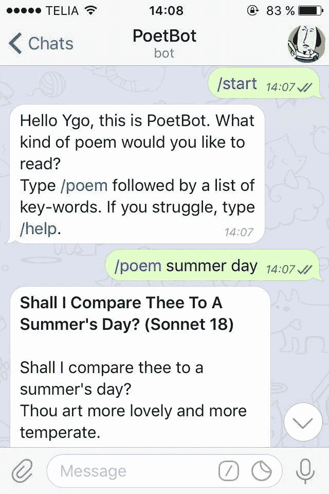

# PoetBot:一个推荐诗歌的电报聊天机器人

> 原文：<https://towardsdatascience.com/poetbot-2-a-telegram-chat-bot-for-poem-recommendation-70d1b809761c?source=collection_archive---------2----------------------->

## 从头开始构建你的第一个诗意聊天机器人

谁不需要生活中的一点诗意来度过呢？谁不想找一点代码让它发光呢？本教程的目的是为 [Telegram](https://telegram.org/) 中的诗歌推荐建立一个全功能的聊天机器人，这是一个类似于 WhatsApp 的即时通讯平台，除了比*好得多*、*好得多*。我们将把工作流程分成三大块:

1.  在网上搜索浪漫，输入我们的数据库。
2.  编写一个 Python 脚本来处理**文本处理和标记**。
3.  将聊天机器人嵌入电报。

你准备好了吗？现在，在我们开始之前，让我给你介绍一个人…

Hey, please meet PoetBot.

## 第一步:爬行

首先:在我们开始构思诗歌推荐引擎之前，我们必须有一些很酷的诗歌要分发。由于找不到符合我们需要的诗歌数据库，我们决定从网上搜集资料，建立自己的数据库。人们的目光很快停留在 Pomemhunter.com，这是一个提供来自世界各地酸甜苦辣的内容的门户网站。我们花了一些时间研究网站的架构，发现用户排名的前 500 首诗存储在 20 个相邻的网页上，其逻辑如下:

> [https://www.poemhunter.com/p/m/l.asp?a=0&l = top 500&order = title**&p = 1**](https://www.poemhunter.com/p/m/l.asp?a=0&l=top500&order=title&p=1)首诗 1 至 25 首
> https://www.poemhunter.com/p/m/l.asp?a=0&l = top 500&order = title**&p = 2**首诗 26 至 50 首https://www.poemhunter.com/p/m/l.asp?a=0&l = top 500&order =首
> 
> 随着 **p** 从 **1** 增加到 **20**

实际上，我们可以循环 p 属性来获得包含 500 首诗的 20 个页面的 URL 列表。这用 Python 来翻译(*警告:代码开始*):

我们现在知道指向每首诗的超链接存储在哪里，我们需要做的就是检索它们。回到[这里](https://www.poemhunter.com/p/m/l.asp?a=0&l=top500&order=title&p=1)并按下 *ctrl+U* ，我们注意到各个诗歌的 URL 包含在一个标签为‘title’的< td >元素中。根据这些信息，我们使用 requests 和 BeautifulSoup 编写一个代码来创建一个收集 500 个 URL 的列表(代码中的“链接”)。

所以，工作完成了一半。我们现在可以一首接一首地连接到诗歌，并保存每个作者、标题和全文。最后，我们将结果保存在一个 csv 表中供以后使用。

太好了，我们把所有的数据都放在一个地方。**辛苦工作之后，我们可以放松一下，享受一点诗歌，不是吗？**浏览我们刚刚创建的表格(顺便说一句，你会在这里找到它和所有其他代码)，[第 13 首最受欢迎的诗](https://www.poemhunter.com/poem/annabel-lee/)是罗尔德·达尔著名的“电视”，在这首诗中，这位英国作家对现代技术并不轻松(我一直同意你的观点)。关于孩子看电视，它是这样的:

> 他们坐着，凝视着，凝视着，坐着
> 直到他们被它催眠，
> 直到他们被那些令人震惊的可怕的垃圾完全灌醉。
> 哦，是的，我们知道它让他们保持安静，
> 他们不会爬出窗台，
> 他们从不打架或踢或打，
> 他们让你自由地做午饭
> 和在水槽里洗碗—
> 但是你有没有停下来想一想，
> 想知道这对你心爱的孩子到底有什么影响？

The culprit.

## 第二步:锁定目标

在开始锁定目标之前，我们需要**清理我们的数据**。我们的策略如下:我们从刚刚创建的[表](https://github.com/bugo99iot/poet_bot/blob/master/poems_collection.csv)上传原始文本，对于每首诗，我们将标题和文本连接在一起，我们删除停用词、标点符号和数字，我们标记，我们计算平均标记长度，我们截断太长的诗，我们扩展太短的诗以获得等长的行。*‘Pfiu！，我试着尽可能快地说出来。如果你想详细了解这是如何做到的，请参考下面的笔记本。如果没有(谁怪你)，就在' [tokenized_poems.csv](https://github.com/bugo99iot/poet_bot/blob/master/tokenized_poems.csv) '随便看看，继续下一段。*

好了，我们现在准备写我们的定位算法。当用户与机器人互动时，他们将被要求输入一个句子和/或一系列单词来描述他们想要的诗歌是什么样子的。依靠如此小的数据集，尝试将诗歌聚类成主题并使用它们作为目标是没有意义的。然后我们选择了一个简单得多的解决方案，老一套:“给我一袋单词，我会还给你包含最多单词的那首诗！“我们是有想象力的人，我们设计了一个 **Python 类**，它将优雅地接受一个字符串并返回我们的目标诗歌的全文。把刚才说的重新组织成子句和循环，代码看起来很庞大，如果你感兴趣的话，看看这里的。否则就继续读吧，在教程的最后，我会解释如何在不知道里面有什么的情况下使用这个机器人。

为了利用我们的类(对不起，Karl 不是那个意思)，我们写了一个‘main . py’程序，它为 Poet_class 创建了一个实例，并在其上调用‘get _ poem’方法。非常简单快捷:

## 第三步:将聊天机器人嵌入电报

最后，我们都在等待的时刻。我们有我们的数据，我们有如何选择诗歌的规则，我们知道如何从数据库中提取它们。我们所需要的是创建我们的机器人，并附上一套指令！为了做到这一点，我们首先导入相关的库并启动一个记录器，在错误发生时向终端显示错误。

然后我们定义一组机器人能够处理的指令。下面，每个函数对应一个方法。告诉机器人类似“/poem about cactus and roses”的内容将激活“poem”方法，该方法将处理输入并调用 Poet_class 来选择目标诗歌及其文本。

好了，一堆台词就给不出思路了。让我们试试机器人直播吧！从终端启动脚本并连接到 PoetBot，我们发出第一个请求:

工作正常！我们可以给机器人一个更简单的表达式，看看会有什么结果。

Guess what the word is…

机器人似乎再次做出了很好的反应，搜索“爱”这个词出现最多的诗歌(在这种情况下，它出现了很多)。

现在，完成了。你可以用更复杂的查询来测试这个算法，并希望从中获得一些奇怪和有趣的东西！注意:PoetBot 还没有部署，所以如果你想使用它，你必须自己获得它(说明如下)。万一有(烧瓶？)开发者正在看这个，想帮我们放到云上，请给我们喊一声，我们提供电子啤酒作为交换(互联网第 0 法则:如果你能想到，大概它已经存在了)。感谢大家的阅读。

## 建立你自己的机器人

安装你自己的机器人的步骤如下:

1.  下载电报应用到你的手机。
2.  问候 BotFather(默认情况下他会在你的联系人列表中)，然后告诉他你想创建一个新的 bot。命令: **/newbot**
3.  给你的机器人一个名字(将显示什么)和一个用户名(将用于识别)。在我的例子中，我选择了 *PoetBot* 和 *VioletsAreBlueBot* 。请不要问。
4.  爸爸会给你一个令牌。把它保存在某个地方。
5.  从[这个](https://github.com/bugo99iot/poet_bot) github repo，克隆到你的本地机器' bot.py '，' poet_class.py '，' tokenized_poems.csv '，' poems_collection.csv '和' requirements.txt '。
6.  在 bot.py 中，插入 BotFather 给你的令牌。
7.  通过访问您的本地文件夹，后跟命令“pip install -r requirements.txt”来安装要求
8.  运行“python3 bot.py”
9.  通过使用用户名作为搜索标准在 Telegram 上找到您的机器人，并享受它:)

*【poet bot 图片鸣谢:Ivan Kershner。】*