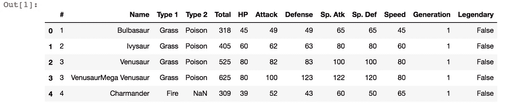
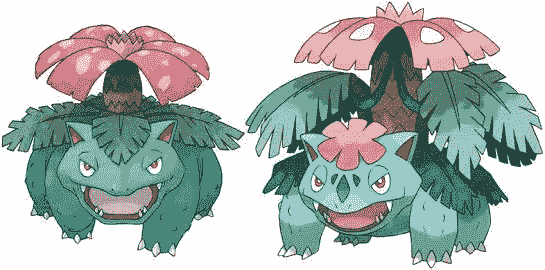
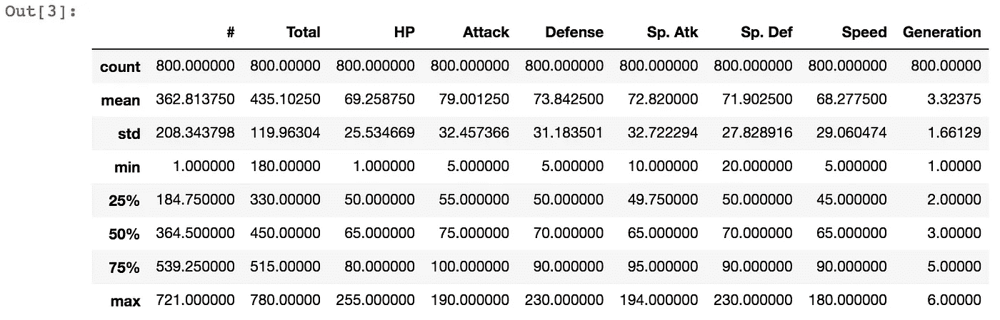
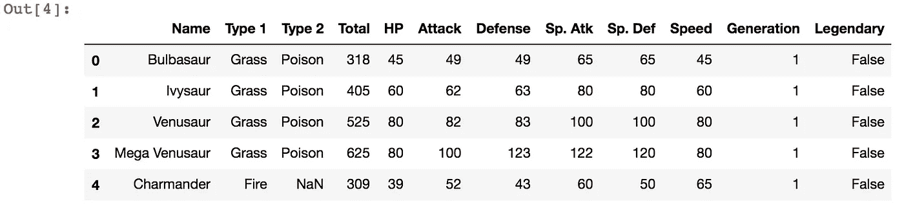
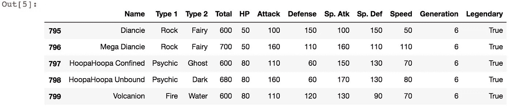
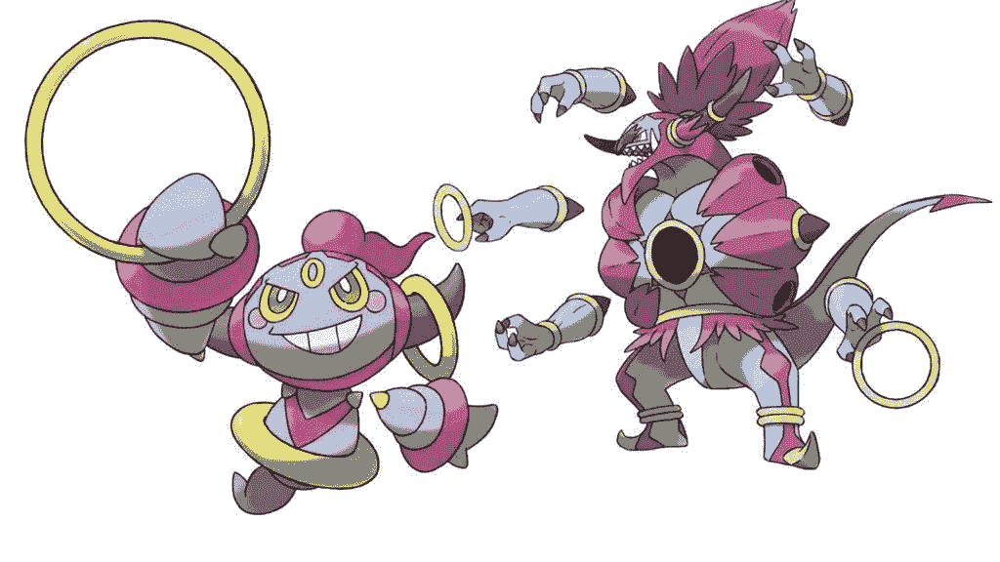
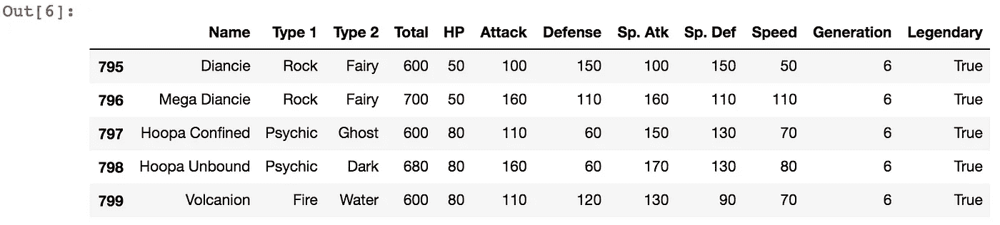
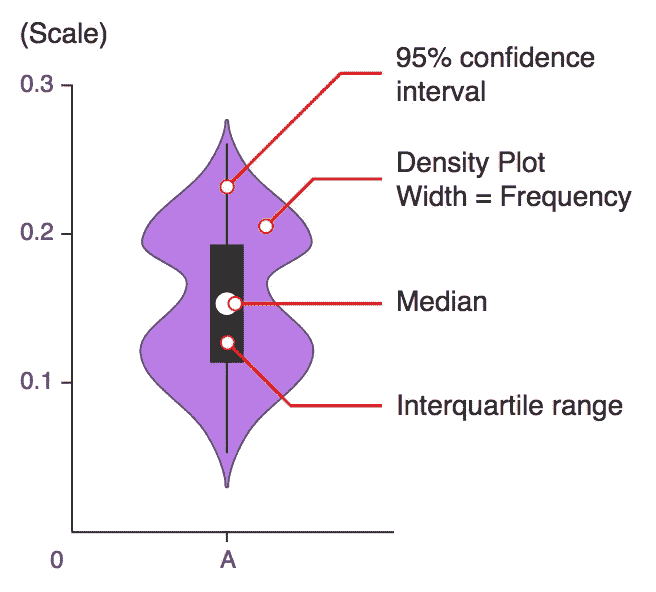
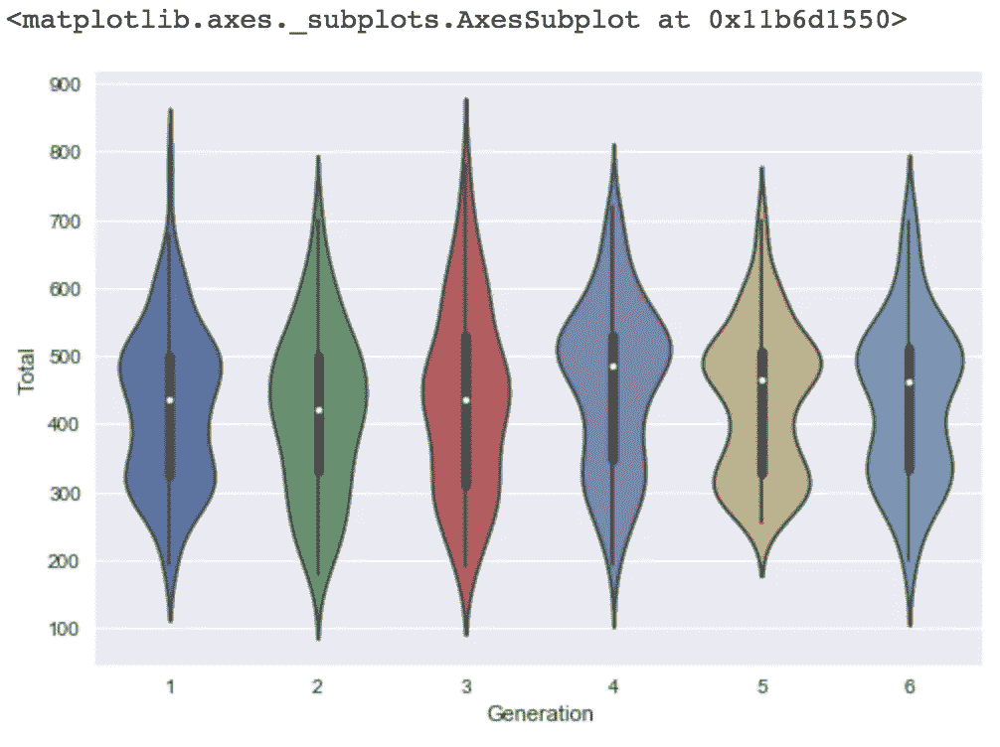

# 口袋妖怪代沟？(Python 数据分析)第 1 部分:清理，EDA

> 原文：<https://towardsdatascience.com/pokemon-generation-gap-python-data-analysis-part-1-cleaning-eda-265ff3cb5dff?source=collection_archive---------4----------------------->


Photo by [Thimo Pedersen](https://unsplash.com/@thimo?utm_source=medium&utm_medium=referral) on [Unsplash](https://unsplash.com?utm_source=medium&utm_medium=referral)

我一直在通过网络课程学习 Python 进行数据分析，有时也会学习 Youtube 视频等。我知道我只迈出了第一步，但我忍不住想把我学到的东西付诸实践。我坚信，知识不是你的，直到你实际应用和使用它。我没有那种“美丽心灵”类型的大脑，我不能仅仅通过观看来理解我头脑中的事物。考虑到我目前的 Python 流畅程度，我先从一些简单的基础分析开始。

我不是口袋妖怪极客，但我确实玩过口袋妖怪 Go。不幸的是，我是那些提前离开的人之一。我想我升到了 25 级，就这样了。我确实看过几集电视剧，但只是偶然。那么，为什么是口袋妖怪呢？我想从轻松、不太严肃也不太复杂的地方开始。当我在浏览 [Kaggle 的数据集](https://www.kaggle.com/datasets)时，我发现了[口袋妖怪数据集](https://www.kaggle.com/abcsds/pokemon/downloads/pokemon.zip)！数据的大小对我来说是可管理的，不包含太多的列，每一列对我来说都很容易理解。还有口袋妖怪很可爱…

我首先浏览了口袋妖怪数据集中的所有内核，许多很酷的分析有些对我来说太高级了，有些我能理解。所以我先从一个简单的问题开始。“不同年代的口袋妖怪有区别吗？”([从 1996 年到 2017 年](https://bulbapedia.bulbagarden.net/wiki/Generation)跨越了 7 个不同的世代)

首先，我下载了数据集并保存在我的电脑中，以便用 Python 阅读和查看。

```
import pandas as pd
df = pd.read_csv('Pokemon.csv')
df.head()
```



通过查看前 5 项数据，我已经发现了两个问题。第一，' # '列有重复，并且似乎口袋妖怪的巨型进化形式与其原始形式具有相同的 ID 号(巨型进化是口袋妖怪的终极形式，并不适用于所有口袋妖怪)。但是大进化前后肯定是不一样的。不仅他们的统计数据会改变，他们的长相也会改变。例如，第三个条目 Vensaur 的总属性点是 525，而第四个条目 Mega Venusaur 的总属性点是 625。外观如下。



Left: Venusaur, Right: Mega Venusaur (and No! they are not the same, take a closer look)

第二个问题是第四个条目 Mega Venusaurs 在名称列值的前面重复了 venus aur；“VenusaurMega Venusaur”。这需要处理。

只看前五个条目并不能给我完整的数据。所以为了看到更广阔的图景，我称之为“info”方法。

```
df.info()
<class 'pandas.core.frame.DataFrame'>
RangeIndex: 800 entries, 0 to 799
Data columns (total 13 columns):
#             800 non-null int64
Name          800 non-null object
Type 1        800 non-null object
Type 2        414 non-null object
Total         800 non-null int64
HP            800 non-null int64
Attack        800 non-null int64
Defense       800 non-null int64
Sp. Atk       800 non-null int64
Sp. Def       800 non-null int64
Speed         800 non-null int64
Generation    800 non-null int64
Legendary     800 non-null bool
dtypes: bool(1), int64(9), object(3)
memory usage: 75.9+ KB
```

我可以看到有 800 个条目，列的值是“object”或“int64”或“bool”，意思是字符串或整数或布尔值。对于“Type 2”变量，只有 414 个非空条目，这意味着缺少 386 个值。需要谨慎处理缺失值。它们丢失可能是有原因的，通过找出原因，您可能会发现一些有用的见解。有时缺失的部分甚至会扭曲整个数据。但在这种情况下，这只是因为一些口袋妖怪没有二级类型。对于我的分析，我不会使用“Type 2”属性，所以我会让它保持原样。

现在是时候来点 EDA(探索性数据分析)了！EDA 有两个方面，数字汇总和一些可视化方法，如图表。在 Python 中，只需一种方法“describe”就可以轻松提取汇总统计数据。

```
df.describe()
```



我可以在一个表中看到计数、平均值、标准差、最小值、四分位距、最大值，现在我对数据有了更好的理解。(“描述”方法只从数值中抓取结果。因此，具有字符串、布尔值:“名称”、“类型 1”、“类型 2”、“传奇”的列没有在此处显示。)尽管这个数据集很容易看出每一列的含义，但有时查看数据集的原始文档是非常有帮助的。根据上传数据集到 Kaggle 的 Alberto Barradas 的说法，[描述](https://www.kaggle.com/abcsds/pokemon)如下。

> #:每个口袋妖怪的 ID
> 
> 名称:每个口袋妖怪的名字
> 
> 类型 1:每个口袋妖怪都有一个类型，这决定了弱点/对攻击的抵抗力
> 
> 类型 2:一些口袋妖怪是双重类型，有 2 个
> 
> 总计:在此之后所有统计数据的总和，一个口袋妖怪有多强的一般指南
> 
> 生命值，或者生命值，定义了一个口袋妖怪在晕倒前可以承受的伤害
> 
> 攻击:普通攻击的基础调整值(例如抓伤，猛击)
> 
> 防御:对普通攻击的基础伤害抗性
> 
> 特殊攻击，特殊攻击的基础调整值(例如火焰冲击，气泡光束)
> 
> SP Def:对特殊攻击的基础伤害抗性
> 
> 速度:决定每轮哪个口袋妖怪先攻击

我猜‘世代’和‘传奇’变量是后来加上的。只是为了帮助你理解，“一代”变量是关于它是哪一代的口袋妖怪，“传奇”是口袋妖怪是否是一个传奇类。

我们继续吧。我首先想解决我在调用“df.head()”时看到的两个问题。“#”列的重复项和“名称”列的陌生名称。

```
df = df.drop(['#'],axis=1)
import re # importing regex library to use in below line
df.Name = df.Name.apply(lambda x: re.sub(r'(.+)(Mega.+)',r'\2', x))
df.head()
```



好的。我完全删除了“#”栏，也删除了超级进化形态前面重复的口袋妖怪名字。现在看起来好多了。让我们通过调用“tail”方法来查看条目的结尾。

```
df.tail()
```



哦等等。有些事情看起来不太对劲。条目编号 797，798 似乎在名字前面有重复。供您参考，胡帕是正确的名称，而不是胡帕胡帕，他们看起来像下面。



Left: Hoopa Confined, Right: Hoopa Unbound

我最好为胡帕整理一下这个名字。所以我写了另一个代码来修复两个胡帕条目。

```
df.Name = df.Name.apply(lambda x: re.sub(r'(HoopaHoopa)(.+)','Hoopa'+r'\2',x))
df.tail()
```



老实说，为了弄清楚是否还有其他奇怪的名字需要修改，我还打开了 csv 文件，并扫描了所有 800 个条目的“名称”列。我想我不能为 10，000 或 100，000 个条目这样做，可能需要考虑更聪明的方法来解决这个问题。但无论如何，我发现只有超级进化形态的口袋妖怪或胡帕在他们的“名称”列值中有这种问题。

最后，我准备好继续进行一些可视化 EDA。既然我想弄清楚口袋妖怪一代比一代有什么不同，那么把参赛作品按不同代分组，看看它们在剧情上的样子是个不错的主意。

“总计”栏是所有统计值的总和，我认为这是一个口袋妖怪整体统计的良好指标。所以，让我们看看'总'值是如何在同一代口袋妖怪中分布的。

根据 Seaborn 的文件记载，[“小提琴情节扮演着与盒子和胡须情节相似的角色。它显示了一个(或多个)分类变量的几个水平上的定量数据的分布，以便这些分布可以进行比较“](https://seaborn.pydata.org/generated/seaborn.violinplot.html)”。violin 图的优势在于，你可以从图中看到分布形状。有了箱线图，你永远无法知道分布是[单峰](https://en.wikipedia.org/wiki/Unimodality#Unimodal_probability_distribution)还是[多峰](https://en.wikipedia.org/wiki/Multimodal_distribution)。



[Anatomy of Violin Plot](http://www.datavizcatalogue.com/methods/violin_plot.html)

```
%matplotlib inline
import matplotlib.pyplot as plt
import seaborn as sns
sns.violinplot(x='Generation',y='Total',data=df)
```



看起来第 1 代和第 3 代比其他代更分散，而第 4 代看起来最短，有两个明显的峰值。至少，从情节来看，几代人之间可能会有一些显著的差异，但现在说还为时过早。

当我在寻找小提琴情节的定义和解释时，我发现了一件有趣的事情。虽然小提琴图显示了更多的信息，但它们可能比盒子图更嘈杂。嗯嗯是这样吗？我想我必须画一个方框图，看看它们有什么不同。

我觉得帖子太长了。我就讲到这里，继续讲第二部分。

下面是我用上面的代码创建的要点的链接。请随时查看，如果您有任何建议或反馈，请告诉我。