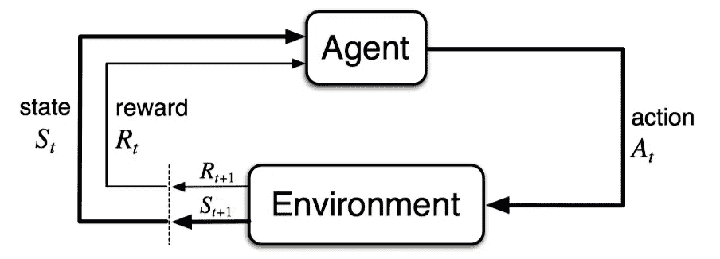
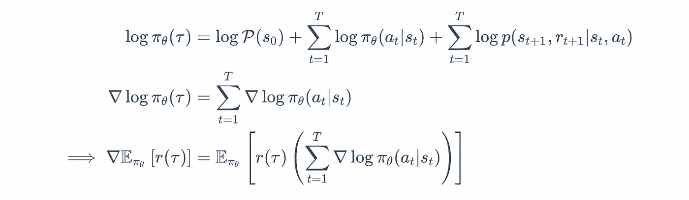
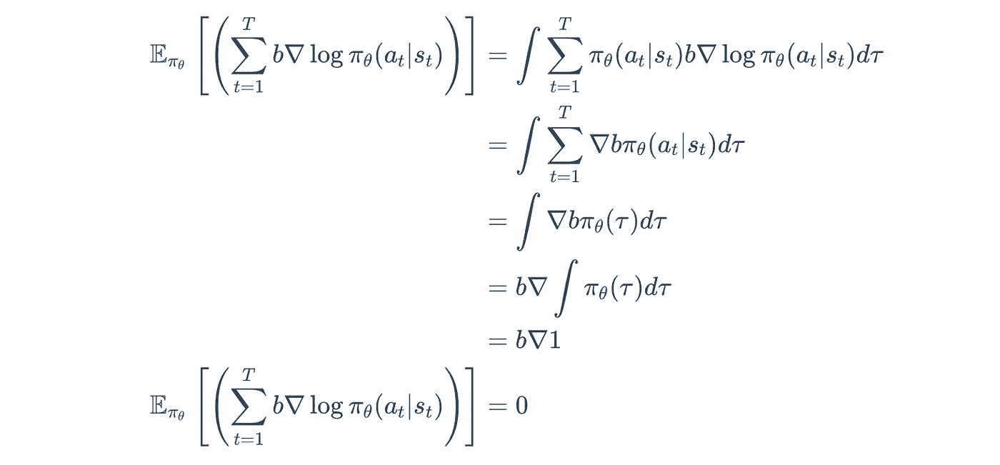
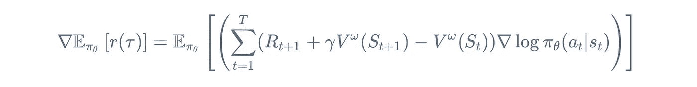

# 简而言之，政策梯度

> 原文：<https://towardsdatascience.com/policy-gradients-in-a-nutshell-8b72f9743c5d?source=collection_archive---------2----------------------->

本文旨在对强化学习中最重要的一类控制算法——策略梯度——提供简明而全面的介绍。我将依次讨论这些算法，从头开始得出众所周知的结果。它针对的是对机器学习中的任何其他主题有合理背景的读者。最后，我希望你能够阅读大量(如果不是全部)强化学习文献。

# 介绍

强化学习(RL)指的是学习问题和机器学习的子领域，它最近在新闻中有很大的原因。基于 RL 的系统现在已经[击败了围棋世界冠军](https://deepmind.com/blog/alphago-zero-learning-scratch/)，[帮助更好地操作数据中心](https://deepmind.com/blog/deepmind-ai-reduces-google-data-centre-cooling-bill-40/)，[掌握了各种各样的雅达利游戏](https://deepmind.com/research/publications/playing-atari-deep-reinforcement-learning/)。研究界看到了更多有希望的结果。有了足够的动力，现在让我们来看看强化学习的问题。

强化学习是对学习问题的最一般的描述，其目的是最大化一个长期目标。系统描述由一个*代理*组成，该代理通过其在离散时间步骤的动作与*环境*交互，并接收*奖励*。这将代理转换到新的*状态*。下图描述了一个典型的代理-环境反馈循环。

The Canonical Agent-Environment Feedback Loop

学习问题的强化学习味道与人类如何有效地行为惊人地相似——体验世界、积累知识并利用学到的知识处理新的情况。像许多人一样，这个问题的吸引人的本质(尽管更难表述)让我兴奋，并希望它也能让你兴奋。

# 背景和定义

RL 背后的大量理论基于*奖励假设*的假设，该假设概括地说，一个主体的所有目标和目的都可以用一个称为*奖励*的单一标量来解释。这仍然是一个争论的话题，但是已经很难反驳了。更正式的说法是，奖励假设如下

> **奖励假说**:我们所说的目标和目的都可以被认为是接收到的标量信号的累积和的期望值的最大化(称为奖励)。

作为一名 RL 实践者和研究人员，一个人的工作是为一个已知的问题找到正确的奖励集，称为*奖励形成*。

*代理*必须通过一个被称为马尔可夫决策过程的理论框架正式工作，该过程包括一个决策(采取什么行动？)在每个州进行。这产生了一系列的状态、行动和奖励，被称为*轨迹*

目标是最大化这些奖励。更正式地说，我们看马尔可夫决策过程框架。

> **马尔可夫决策过程**:一个(贴现)马尔可夫决策过程(MDP)是一个元组(S，A，R， *p* ， *γ* ，这样

> 其中*S _ t*,*S _(t*+1)∈S(状态空间)， *A_(t* +1) ∈ A(行动空间)， *R_(t* +1)， *R_t* ∈ R(报酬空间)， *p* 定义过程的动态， *G_t* 为贴现收益。

简而言之，MDP 定义了转换到一个新状态的概率，在给定当前状态和执行一个动作的情况下获得一些奖励。这个框架在数学上令人满意，因为它是一阶马尔可夫链。这只是一种奇特的说法，即接下来发生的任何事情都只取决于现在，而不是过去。只要你做到了，你如何到达当前状态并不重要。这个框架的另一个重要部分是贴现因子 *γ* 。随着时间的推移，将这些回报与来自未来的回报的不同程度的重要性相加，导致了贴现回报的概念。正如人们所料，较高的 *γ* 会导致对未来回报的更高敏感度。而 *γ* =0 的极端情况，完全不考虑来自未来的奖励。

环境 *p* 的动态在代理的控制之外。为了内化这一点，想象一下站在一个有风的环境中的一块地上，每秒钟向四个方向中的一个方向迈一步。风是如此之大，以至于你很难朝着与北、东、西或南完全一致的方向前进。这种下一秒降落在新状态的概率是由风场的动力学 *p* 给出的。这当然不是你(代理人)能控制的。

然而，如果你以某种方式理解了环境的动态，并朝着除了东、西、南、北之外的方向移动，那该怎么办呢？这个*策略*就是代理控制的。当一个代理遵循一个策略 *π* 时，它生成一系列的状态、动作和奖励，称为*轨迹*。

> 策略:策略被定义为给定状态下动作的概率分布

记住所有这些定义，让我们看看 RL 问题的形式。

# 政策梯度

强化学习代理的目标是在遵循策略 *π* 时最大化“预期”回报。像任何机器学习设置一样，我们定义了一组参数 *θ* (例如，复杂多项式的系数或神经网络中单元的权重和偏差)来参数化该策略— *π_θ* (为了简洁，也写为 *π* )。如果我们用 *r* ( *τ* )来表示给定轨迹 *τ* 的总回报，我们会得到下面的定义。

> **强化学习目标**:遵循参数化策略，最大化“预期”回报

所有有限 MDP 至少有一个最优策略(能给出最大回报),并且在所有最优策略中，至少有一个是稳定的和确定的。

像任何其他机器学习问题一样，如果我们能找到使 *J* 最大化的参数 *θ* ⋆，我们就解决了这个任务。在机器学习文献中，解决这种最大化问题的标准方法是使用梯度上升(或下降)。在梯度上升中，我们使用以下更新规则来逐步通过参数

挑战来了，我们如何找到上面包含期望的目标的梯度。积分在计算环境中总是不好的。我们需要找到绕过它们的方法。第一步是从期望值的扩展开始重新制定梯度(稍微滥用符号)。

> **保单梯度定理**:期望报酬的导数是保单对数的报酬与梯度乘积的期望 *π_θ* 。

现在，让我们扩展一下 *π_θ* ( *τ* )的定义。

为了理解这个计算，让我们把它分解一下——P 代表在某个状态下开始的遍历分布 *s_* 0。从那时起，我们应用概率的乘积法则，因为每个新的行动概率都独立于前一个(还记得马尔科夫吗？).在每一步，我们使用策略*πθ*和环境动力学 *p* 来采取一些行动，以决定转换到哪个新状态。这些乘以代表轨迹长度的 *T* 时间步长。相当于，取日志，我们有

这个结果本身就很漂亮，因为它告诉我们，我们不需要知道状态 P 的遍历分布，也不需要知道环境动力学 *p* 。这是至关重要的，因为对于大多数实际目的来说，很难对这两个变量建模。摆脱他们，当然是好的进步。因此，所有使用这个结果的算法都被称为“*无模型算法*”，因为我们没有对环境进行“建模”。

“期望”(或者相当于一个积分项)仍然存在。一个简单但有效的方法是对大量轨迹进行采样(我真的是指大量！)然后平均一下。这是一种近似，但却是无偏的，类似于用区域中的一组离散点来近似连续空间上的积分。这种技术在形式上被称为马尔可夫链蒙特卡罗(MCMC)，广泛用于概率图形模型和贝叶斯网络中以近似参数概率分布。

在我们上面的讨论中，有一项没有涉及到，那就是轨迹 *r* ( *τ* )的回报。尽管参数化政策的梯度不依赖于报酬，但这一项在 MCMC 抽样中增加了许多方差。实际上，有 *T* 个方差源，每个 *R_t* 都有贡献。然而，我们可以利用回报 *G_t* ，因为从优化 RL 目标的角度来看，过去的回报没有任何贡献。因此，如果我们用贴现回报 *G_t* 代替 *r* ( *τ* )，我们就得到经典算法策略梯度算法，称为*加强*。当我们进一步讨论时，这并不能完全缓解问题。

# 强化(和基线)

再次重申，增强算法计算策略梯度的方式如下

**加固坡度**

我们仍然没有解决采样轨迹的方差问题。认识到这个问题的一个方法是重新设想上面定义的 RL 目标为*似然最大化*(最大似然估计)。在 MLE 设置中，众所周知，数据压倒了先验——换句话说，无论初始估计多么糟糕，在数据的限制下，模型都会收敛到真实参数。然而，在数据样本具有高方差的设置中，稳定模型参数可能是众所周知的困难。在我们的背景下，任何不稳定的轨迹都可能导致政策分配的次优转变。奖励的规模加剧了这个问题。

因此，我们试图通过引入另一个称为基线 *b* 的变量来优化报酬差异。为了保持梯度估计的无偏性，基线独立于政策参数。

**用基线加固**

要了解原因，我们必须表明，随着附加项的增加，梯度保持不变(略有滥用符号)。

在理论和实践中，使用基线可以减少方差，同时保持梯度不偏不倚。一个好的基线是使用状态值当前状态。

> **状态值**:状态值定义为给定一个状态遵循策略 *π_θ* 的期望收益。

# 演员-评论家方法

找到一个好的基线本身是另一个挑战，计算它又是另一个挑战。相反，让我们用参数 *ω* 来近似计算 *V^ω_* ( *s* )。我们使用可学习的 *V^ω_* ( *s* )引导梯度的所有算法都被称为*行动者-批评家*算法，因为这个价值函数估计的行为就像一个“*批评家*”(好的 v/s 坏的值)到“*行动者*”(代理的策略)。然而这一次，我们必须计算演员和评论家的梯度。

> **单步 Bootstrapped Return** :单步 Bootstrapped Return 获取直接回报，并通过使用轨迹中下一个状态的 bootstrapped value-estimate 来估计回报。

**演员-评论家政策梯度**

不言而喻，我们还需要更新评论家的参数 *ω* 。这里的目标通常是均方损失(或不太苛刻的 Huber 损失)和使用随机梯度下降更新的参数。

**评论家的目标**

# 确定性政策梯度

通常，在机器人学中，可微分的控制策略是可用的，但是动作不是随机的。在这种环境下，很难像以前那样建立随机政策。一种方法是将噪声注入控制器。此外，随着控制器维数的增加，以前看到的算法性能开始变差。由于这种情况，让我们直接学习给定状态的确定性动作，而不是学习大量的概率分布。因此，最简单的形式，贪婪的最大化目标是我们所需要的

**确定性动作**

然而，对于大多数实际目的来说，这种最大化操作在计算上是不可行的(因为除了搜索给定动作值函数的整个空间之外没有其他方法)。相反，我们可以渴望做的是，建立一个函数*近似器*来近似这个 *argmax* ，因此被称为*确定性政策梯度* (DPG)。

我们用下面的等式来总结这个。

**DPG 目标**

**确定性政策梯度**

这个值变成了另一个期望值，我们可以使用 MCMC 采样再次估算，这应该不足为奇了。

# 通用强化学习框架

我们现在可以得出一个通用算法，看看我们所学的所有部分在哪里组合在一起。所有新算法通常是下面给出的算法的变体，试图攻击问题的一个(或多个)步骤。

# 密码

对于熟悉 Python 的读者来说，这些代码片段是对上述理论思想的更具体的表达。这些都是从真实代码的学习循环中提取出来的。

## 政策梯度(同步行动者-批评家)

## 深度确定性政策梯度

## 完成实施

可在[***activatedgeek/torch rl***](https://github.com/activatedgeek/torchrl)查看完整流水线的完整模块化实现。

# 参考

**【萨顿和巴尔托，1998】***萨顿，R. S .和巴尔托，A. G. (1998)。强化学习导论。麻省理工学院出版社，美国马萨诸塞州剑桥，第一版。*

**【迪米特里，2017】***迪米特里，P. B. (2017)。动态规划与最优控制。雅典娜科学*

**【Lilli crap 等人，2015】***Lilli crap，T. P .、Hunt、J. J .、Pritzel，a .、Heess，n .、Erez，t .、Tassa，y .、Silver，d .和 Wierstra，D. (2015)。深度强化学习的连续控制。ArXiv 电子印花。*

**【沃特金斯和达扬，1992】***沃特金斯，C. J. C. H .和达扬，P. (1992)。q-学习。机器学习，8(3):279–292。*

**【威廉姆斯，1992】***威廉姆斯，R. J. (1992)。联结主义强化学习的简单统计梯度跟踪算法。强化学习，第 5-32 页。斯普林格。*

**【西尔弗等人，2014】***西尔弗，d .，利弗，g .，赫斯，n .，德格里斯，t .，维斯特拉，d .，里德米勒，M. (2014)。确定性策略梯度算法。Xing，E. P .和 Jebara，t .编辑，第 31 届机器学习国际会议论文集，机器学习研究论文集第 32 卷，第 387-395 页，北京，中国。PMLR。*

本文原载[此处](https://www.sanyamkapoor.com/machine-learning/policy-gradients-nutshell/)。