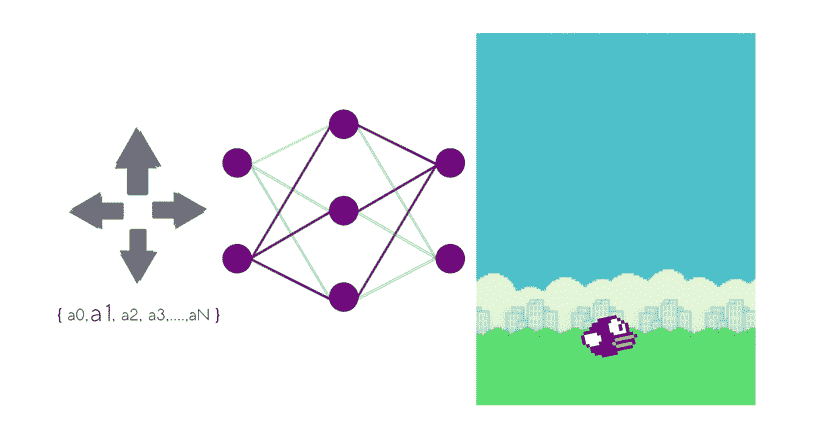
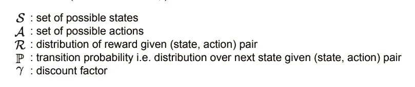
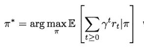
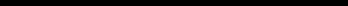
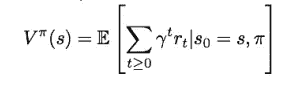

# 强化学习中的政策网络与价值网络

> 原文：<https://towardsdatascience.com/policy-networks-vs-value-networks-in-reinforcement-learning-da2776056ad2?source=collection_archive---------1----------------------->

在强化学习中，代理在他们的环境中采取随机决策，并学习从许多决策中选择正确的决策来实现他们的目标，并以超人的水平进行游戏。策略和价值网络在像[蒙特卡罗树搜索](/monte-carlo-tree-search-158a9)这样的算法中一起使用，以执行强化学习。这两个网络都是一种叫做 MCTS 探索算法的方法的组成部分。

它们也被称为策略迭代&值迭代，因为它们被计算多次，使得它成为一个迭代过程。

**我们来了解一下为什么它们在机器学习中如此重要，它们之间有什么区别？**

# 什么是政策网络？

考虑世界上的任何游戏，输入🎮用户给予游戏的动作称为**动作**。每一个输入(动作)都会导致不同的输出。这些输出被称为游戏的**状态** `**s**`。

由此，我们可以制作不同的状态-动作对`**S** = **{(**s0,a0**)**,s1,a1**)**,...,**(**sN,aN**)}**`，表示哪个动作`aN`导致哪个状态`sN.`同样，我们可以说 **S** 包含策略网络学习到的所有策略。

> 通过给博弈一个特定的输入来学习给出一个确定的输出的网络被称为策略网络

**Policy Network (**action1️, state1**)** , **(**action2, state2**)**

比如:输入`a1`给出一个状态`s1`(上移)&输入`a2`给出一个状态`s2`(下移)在游戏中。

此外，一些行动增加了玩家的点数，导致奖励 **r** 。

**States Getting Rewards**

让我们来看看一些明显的符号:

**Usual Notations for RL environments**

**Optimal Policy**

**为什么我们要使用贴现因子*γ***

> 它被用作一种预防措施(通常保持在 1 以下)。它阻止报酬达到无限。

对一项政策的无限奖励会压垮我们的代理人&偏向于特定的行动，扼杀探索未知领域和游戏行动的欲望😵。

但是我们怎么知道你下一步该选择哪个州，最终进入最后一轮呢？

# 什么是价值网络？

> 价值网络通过计算当前状态`**s**`的预期累积分数来为游戏状态分配价值/分数。每个州都要经过价值网络。获得更多奖励的州显然在网络中获得更多价值。

请记住，奖励是**预期奖励，**因为我们从一组状态中选择了正确的一个。

Value Function

现在，关键目标总是最大化回报*(又名马尔可夫决策过程)*。导致良好状态的行为显然比其他行为获得更大的回报。

因为任何游戏都是通过一个接一个的动作赢得的。博弈的最优策略`***π****` 由许多有助于赢得博弈的状态-行动对组成。

获得最大回报国家-行动对被认为是最优政策。

使用 *arg max* 将最优策略的等式正式写成:

**Optimal Policy** `***π****`

因此，最优策略告诉我们应该采取哪些行动来最大化累积折扣回报。

> 策略网络学习到的最优策略知道在当前状态下应该执行哪些动作以获得最大回报。

如果您有任何疑问、疑问或需求，请在下面评论或发微博给我。

**鼓掌吧…分享一下！在 [**中**](https://medium.com/@sagarsharma4244) 关注我**获取类似的好玩内容。

要获得即时通知，请在 [**Twitter**](https://twitter.com/SagarSharma4244) 上关注我。

乐意帮忙。值得称赞。

# 你会喜欢的以前的故事:

 [## 蒙特卡罗树搜索

### 每个数据科学爱好者的 MCTS

towardsdatascience.com](/monte-carlo-tree-search-158a917a8baa)  [## TensorFlow 图像识别 Python API 教程

### 在带有 Inception-v3 的 CPU 上(以秒为单位)

towardsdatascience.com](/tensorflow-image-recognition-python-api-e35f7d412a70)  [## 激活函数:神经网络

### Sigmoid，tanh，Softmax，ReLU，Leaky ReLU 解释！！！

towardsdatascience.com](/activation-functions-neural-networks-1cbd9f8d91d6)  [## DeepMind 的游戏《用深度强化学习捕捉旗帜》

### #4 研究论文解释

towardsdatascience.com](/deepminds-playing-capture-the-flag-with-deep-reinforcement-learning-a9f71256442e)