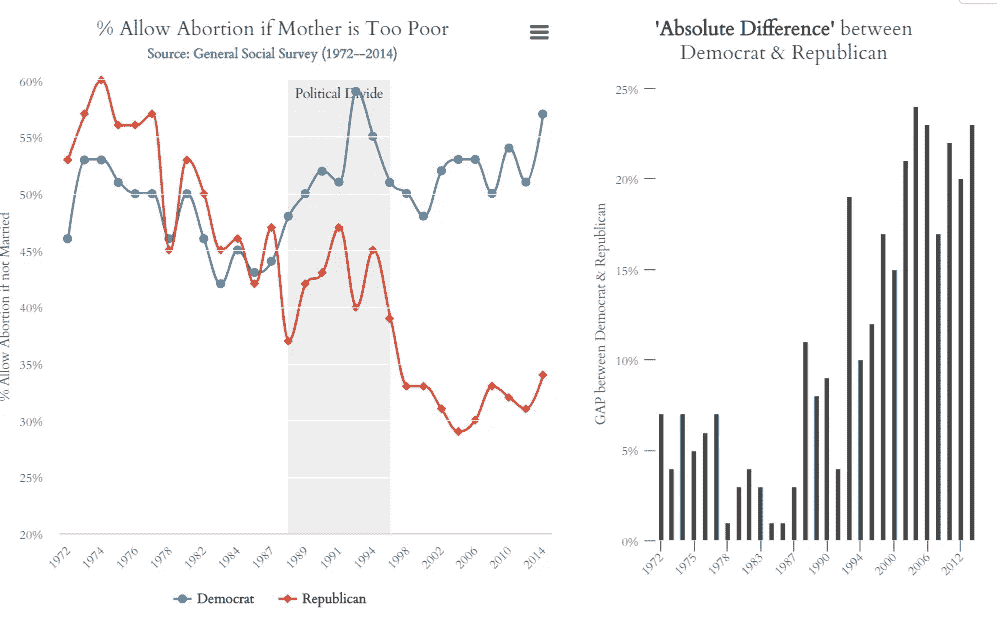
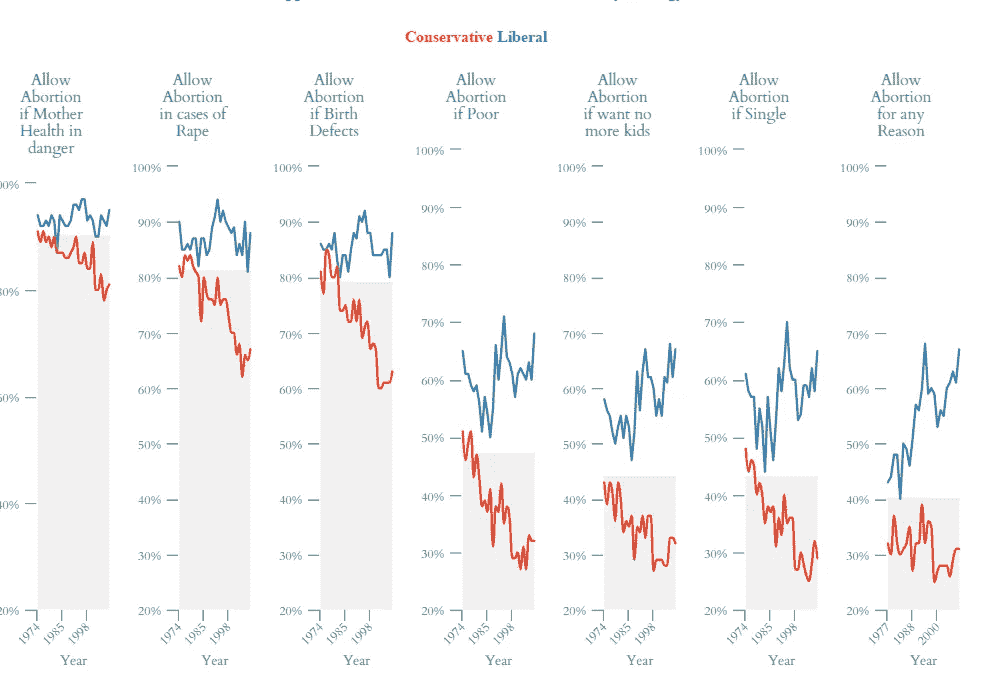
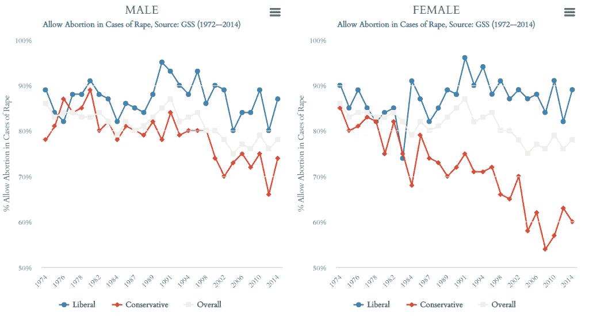

# 堕胎问题上的政治分歧

> 原文：<https://towardsdatascience.com/political-gap-on-abortion-5d983e0d0fdc?source=collection_archive---------4----------------------->

作为他的第一批行动之一，特朗普总统通过了一项行政命令，阻止美国向从事堕胎或提供堕胎信息的外国组织提供援助。自从 1984 年里根总统的“墨西哥城政策”开始实施以来，共和党和民主党总统就一直在这个问题上进行政治拉锯战。

在美国，最高法院在 Roe v . Wade(1973)一案中具有里程碑意义的判决在政治上分裂了国家，并使堕胎成为“文化战争”的一部分。有趣的是，直到 90 年代初，民主党人和共和党人对堕胎的态度差异相对较小。正如下面的分析所示，自克林顿担任总统以来，公众意见发生了巨大的分歧。

下图显示了按受访者意识形态分类的各类堕胎的时间趋势。有趣的是，斯坦福大学杰出的政治学家莫里斯·菲奥莉娜在他的畅销书*“文化战争？*一个两极化的美国的神话”来断定公众对堕胎的意见并不分歧。在第五章(*仔细观察堕胎*)中，菲奥莉娜总结道*..我们经常被告知，这个国家在堕胎问题上存在两极分化。*这种说法是错误的(第 80 页)。

## **性别差异**

让我们看看对“*允许强奸堕胎*”的态度，并探讨其他人口统计学的相互作用。这个问题最近变得很突出，因为众议员托德·阿金(R-Mo。)为他对堕胎的极端反对进行辩护，声称“合法强奸”的受害者很少怀孕，因为“女性身体有办法关闭这一切。”

有趣的是，保守女性的态度比其他群体变化更大，这或许为 2016 年克林顿/特朗普选举中观察到的性别投票模式提供了线索。

## 附录:

分析中使用的数据来自[综合社会调查](http://www.norc.org/PDFs/GSS%20Reports/Trends%20in%20Attitudes%20About%20Abortion_Final.pdf)(1972-2014 年)，该调查提供了不同情况下(例如，婴儿有严重缺陷的风险，太穷而负担不起对孩子的长期护理)合法堕胎公众意见的长期趋势。

I [交互式可视化以及 R 代码](http://onsocialtrends.org/social-issues/public-opinion-on-abortion/)和数据可在[*http://onsocialtrends.org/*](http://onsocialtrends.org/)找到

图表在 Highcharter 中生成(R 包装到 [Highcharts](http://www.highcharts.com/demo) )

