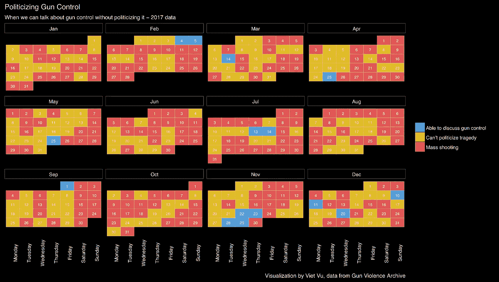

# 将大规模枪击事件政治化——当我们可以谈论枪支管制的时候

> 原文：<https://towardsdatascience.com/politicizing-mass-shootings-when-we-can-talk-about-gun-control-f196ebee2b0c?source=collection_archive---------2----------------------->

2017 年 10 月 1 日，一名枪手从拉斯维加斯一家酒店房间内射出子弹，[造成 59 人死亡，546 人受伤](https://en.wikipedia.org/wiki/2017_Las_Vegas_shooting)。这是美国近代史上最致命的大规模枪击事件。

在每一次大规模枪击事件后，这种叙述都变得很熟悉，几乎是照本宣科。两边的政治家都为受害者及其家人祈祷，而民主党人利用这个机会吸引人们对枪支管制的关注，共和党人谴责民主党人“将悲剧政治化”

让我们从表面上接受这种政治化的论点，并说在大规模枪击事件后立即谈论枪支管制是不合适的。那什么时候可以谈论它？假设用以下两个标准来决定是否可以谈论枪支管制:

1.  当天没有大规模枪击事件(4 起或更多枪击或死亡，不包括枪手)
2.  距离上次大规模枪击事件已经过去至少 3 天了

以下是我利用美国 2017 年大规模拍摄数据得出的结论:

让我们从一些推论开始:

1.  根据这一标准，在下一次枪击事件发生之前，你最多有连续两天的时间谈论枪支管制和枪支问题。
2.  你不能在一月、六月、八月、九月、十月谈控枪。
3.  总的来说，我们有 15 天的时间可以谈论枪支管制——仅仅超过 2 周。

3 天，虽然是一个任意的数字，但与事实相差并不太远，因为 10 月 4 日(拉斯韦加斯枪击案发生 3 天后)发表了数十篇[观点](http://dailycaller.com/2017/10/04/john-rich-on-politicizing-vegas-massacre-most-disgusting-thing-ive-ever-heard/) [文章](http://www.chicagotribune.com/news/opinion/commentary/ct-perspec-las-vegas-democrats-politics-1005-story.html)抨击民主党人将悲剧政治化。

所以，也许这不是为了防止悲剧被政治化。也许是不想谈论枪支管制，并批判性地审查第二修正案，以采取政策防止此类枪击事件再次发生。