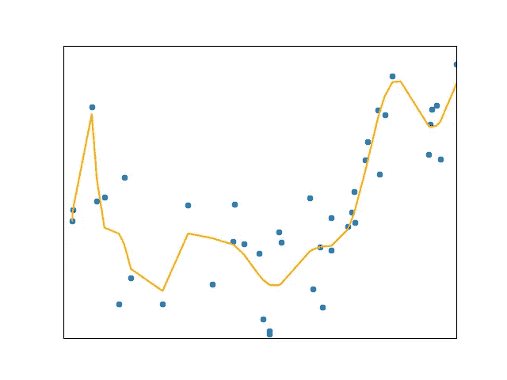
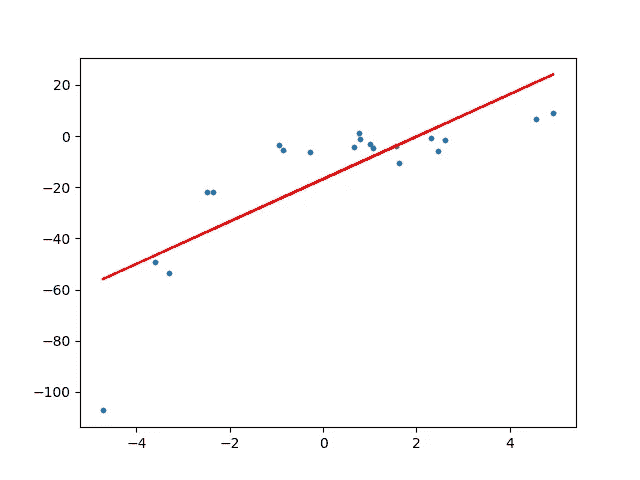
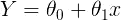
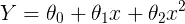
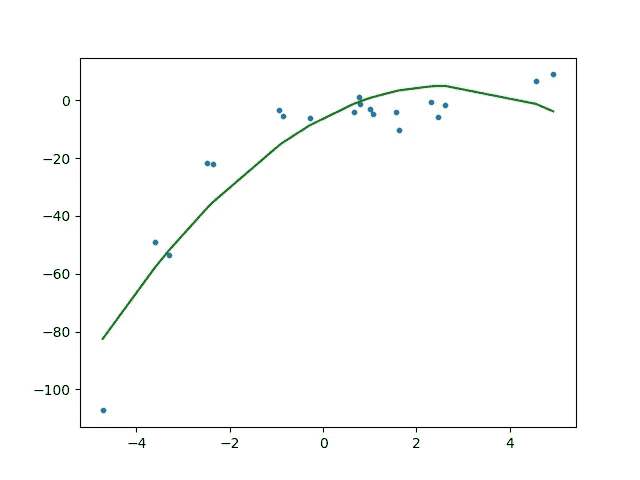
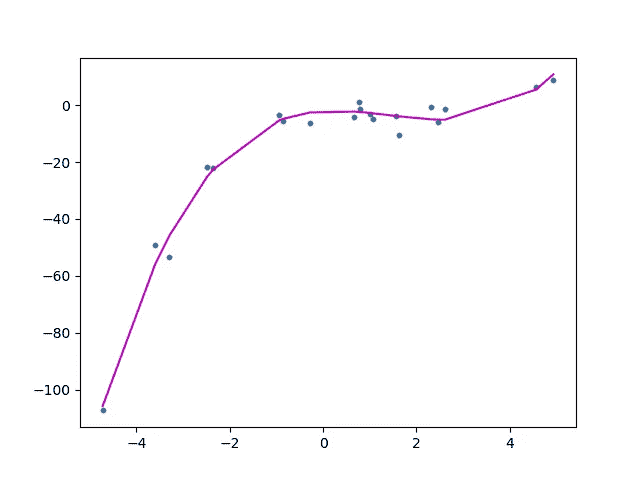
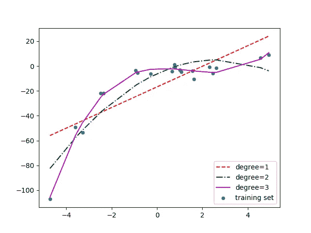
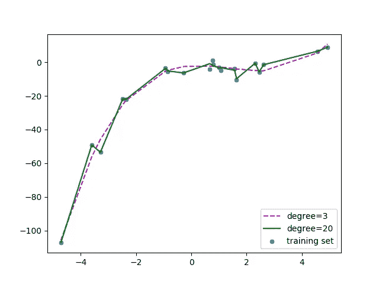
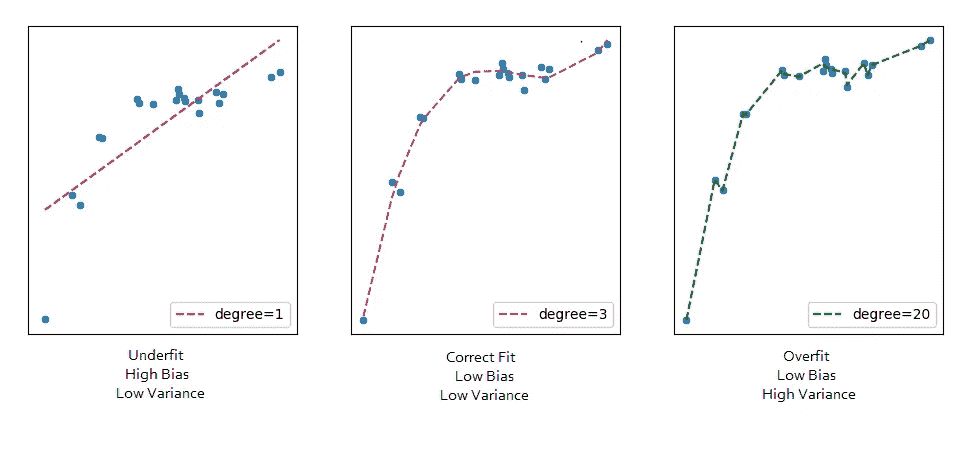

# 多项式回归

> 原文：<https://towardsdatascience.com/polynomial-regression-bbe8b9d97491?source=collection_archive---------0----------------------->

这是我在机器学习系列的第三篇博客。这个博客需要线性回归的先验知识。如果您不了解线性回归或者需要复习一下，请浏览本系列以前的文章。

*   [使用 Python 进行线性回归](/linear-regression-using-python-b136c91bf0a2)
*   [波士顿住房数据集的线性回归](/linear-regression-on-boston-housing-dataset-f409b7e4a155)

> 线性回归要求因变量和自变量之间的关系是线性的。如果数据的分布更复杂，如下图所示，会怎么样？线性模型可以用来拟合非线性数据吗？我们怎样才能生成一条最好地捕捉数据的曲线，如下图所示？那么，我们将在这篇博客中回答这些问题。



## **目录**

*   为什么是多项式回归
*   过度拟合与欠拟合
*   偏差与方差的权衡
*   将多项式回归应用于波士顿住房数据集。

## 为什么要多项式回归？

为了理解多项式回归的需要，让我们首先生成一些随机数据集。

生成的数据如下所示


让我们对这个数据集应用一个线性回归模型。

最佳拟合线的曲线为



我们可以看到，直线无法捕捉数据中的模式。这是**欠装配**的一个例子。计算线性线的 RMSE 和 R 分数得出:

```
RMSE of linear regression is **15.908242501429998**.
R2 score of linear regression is **0.6386750054827146**
```

> **为了克服欠拟合，我们需要增加模型的复杂度。**

为了生成高阶方程，我们可以添加原始特征的幂作为新特征。线性模型，



可以转化为



> 这仍然被认为是**线性模型**，因为与特征相关的系数/权重仍然是线性的。x 只是一个特征。然而，我们正在拟合的曲线实际上是二次曲线。

为了将原始特征转换成它们的高阶项，我们将使用由`scikit-learn`提供的`PolynomialFeatures`类。接下来，我们使用线性回归来训练模型。

```
To generate polynomial features (here 2nd degree polynomial)
------------------------------------------------------------polynomial_features = PolynomialFeatures(degree=2)
x_poly = polynomial_features.fit_transform(x)Explaination
------------Let's take the first three rows of X: 
[[-3.29215704]
 [ 0.79952837]
 [-0.93621395]]If we apply polynomial transformation of degree 2, the feature vectors become[[-3.29215704 10.83829796]
 [ 0.79952837  0.63924562]
 [-0.93621395  0.87649656]]
```

对变换后的要素拟合线性回归模型，给出了下图。



从图中可以清楚地看出，二次曲线比线性曲线更能拟合数据。计算二次图的 RMSE 和 R 分数给出:

```
RMSE of polynomial regression is **10.120437473614711**.
R2 of polynomial regression is **0.8537647164420812**.
```

> **我们可以看到，与直线相比，RMSE 降低了，R 值增加了。**

如果我们尝试将三次曲线(次数=3)拟合到数据集，我们可以看到它通过的数据点比二次曲线和线性曲线多。



三次曲线的度量标准是

```
RMSE is **3.449895507408725**
R2 score is **0.9830071790386679**
```

下面是在数据集上拟合线性、二次和三次曲线的比较。



如果我们进一步增加次数到 20，我们可以看到曲线通过更多的数据点。下面是 3 度和 20 度的曲线比较。



对于 degree=20，模型也捕捉数据中的噪声。这是**过度拟合**的一个例子。即使这个模型通过了大部分数据，它也无法对看不见的数据进行归纳。

> **为了防止过度拟合，我们可以添加更多的训练样本，这样算法就不会学习系统中的噪声，可以变得更一般化。**(注意:如果数据本身就是噪声，添加更多数据可能会有问题)。

我们如何选择一个最优模型？要回答这个问题，我们需要理解偏差与方差的权衡。

## **偏差与方差的权衡**

**偏差**是指由于模型在拟合数据时过于简单的假设而产生的误差。高偏差意味着模型无法捕捉数据中的模式，这导致**欠拟合**。

**方差**是指由于复杂模型试图拟合数据而产生的误差。高方差意味着模型通过了大多数数据点，导致**过度拟合**数据。

下图总结了我们的学习。



从下图中我们可以观察到，随着模型复杂性的增加，偏差减少，方差增加，反之亦然。理想情况下，机器学习模型应该具有**低方差和低偏差**。但实际上不可能两者兼得。因此，为了实现一个在训练和看不见的数据上都表现良好的好模型，进行了**折衷**。


Source: [http://scott.fortmann-roe.com/docs/BiasVariance.html](http://scott.fortmann-roe.com/docs/BiasVariance.html)

到目前为止，我们已经讨论了多项式回归背后的大部分理论。现在，让我们在我们在[之前的](/linear-regression-on-boston-housing-dataset-f409b7e4a155)博客中分析的波士顿住房数据集上实现这些概念。

## **对住房数据集应用多项式回归**

从下图可以看出，`LSTAT`与目标变量`MEDV`有轻微的非线性变化。在训练模型之前，我们将把原始特征转换成高次多项式。


让我们定义一个函数，它将原始特征转换为给定次数的多项式特征，然后对其应用线性回归。

接下来，我们调用上面的次数为 2 的函数。

使用多项式回归的模型性能:

```
**The model performance for the training set** 
------------------------------------------- 
RMSE of training set is 4.703071027847756 
R2 score of training set is 0.7425094297364765 **The model performance for the test set**
------------------------------------------- 
RMSE of test set is 3.784819884545044 
R2 score of test set is 0.8170372495892174
```

这比我们在[之前的](/linear-regression-on-boston-housing-dataset-f409b7e4a155)博客中使用线性回归获得的结果要好。

这个故事到此为止。这个 Github [repo](https://github.com/animesh-agarwal/Machine-Learning/tree/master/PolynomialRegression) 包含了这个博客的所有代码，用于 Boston housing 数据集的完整 Jupyter 笔记本可以在[这里](https://github.com/animesh-agarwal/Machine-Learning-Datasets/blob/master/boston-housing/Polynomial_Regression.ipynb)找到。

## **结论**

在这个机器学习系列中，我们介绍了线性回归和多项式回归，并在波士顿住房数据集上实现了这两个模型。

我们将在下一篇博客中讨论逻辑回归。

感谢阅读！！