# 单个神经元的功率

> 原文：<https://towardsdatascience.com/power-of-a-single-neuron-perceptron-c418ba445095?source=collection_archive---------6----------------------->

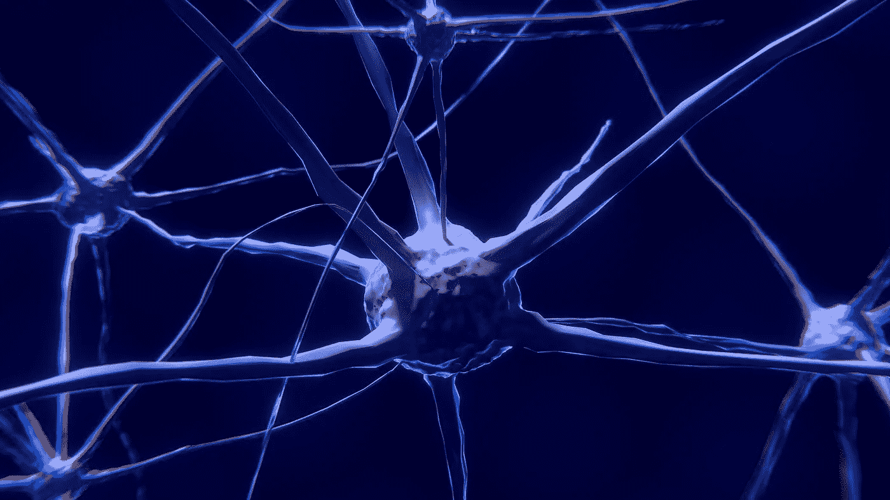

Neuron (Image Source: [https://pixabay.com/illustrations/nerve-cell-neuron-brain-neurons-2213009/](https://pixabay.com/illustrations/nerve-cell-neuron-brain-neurons-2213009/))

Basic Unit of a Artificial Neural Network — Artificial Neuron

神经网络是由**个基本神经元** —也叫**个感知器**(上图所示的一个基本单元——*中间的绿色圆圈*)排列成多层网络的组合(下图中的*)。要了解大型网络的工作原理和功率，首先我们需要了解单个单元的工作原理和功率。这就是我们在这篇文章中要关注的！*

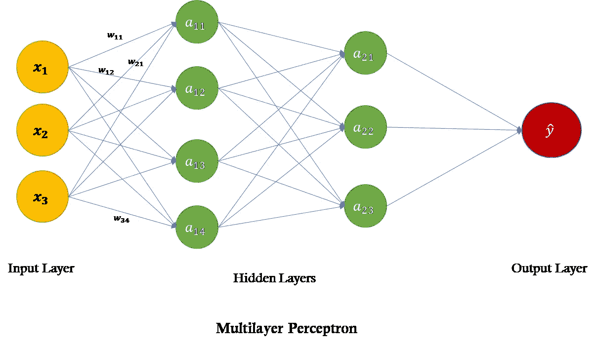

A Network of Neurons

理解任何算法工作的最好方法是尝试自己编写代码。如果您可以编写一个简单的代码，通过计算每次迭代中的质心来创建数据聚类，那么您就知道 k-means。如果您可以编写一个简单的代码，在一个数据子样本上创建多个决策树，并从每个树上获取最大投票来分类一个数据点，您就知道随机森林。同样，如果您可以编写一个简单的代码，通过使用梯度下降来求解一个简单的线性方程、两个线性方程和多个线性方程，您就理解了神经网络和梯度下降。

# 梯度下降

神经网络的主干是梯度下降。要编写梯度下降的代码，我们首先需要理解它。

假设我们有一个简单的线性方程来求解

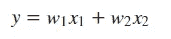

这里，我们需要找到 w1 和 w2 的值，这使得等式对于给定的 y、x1 和 x2 的值为真。如果我们简单地猜测 w1 和 w2 的值，我们将得到 **y_hat**

我们可以通过下式计算由于猜测 w1 和 w2 的值而产生的误差

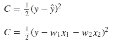

Cost Function

也就是我们一般所说的**成本**。现在，我们的目标是找出 w1 和 w2 的值，使得**成本 C 最小**。成本 C 是相对于 w1 和 w2 的可微分函数。根据一些微积分复习资料，如果我们对 w1 和 w2 的函数进行微分(求导),并使其等于 0，我们将得到 w1 和 w2 的值，此时成本将达到最小值。

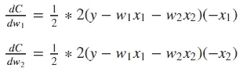

Gradients

这些导数称为**梯度**。基本上，函数在某点的导数是该函数在该点的切线或梯度。看上面的等式，我们不能得到 w1 和 w2 的值，其中成本导数将是 0，因为它们依赖于 w1 和 w2。

现在，为了达到最小值，我们将通过每次少量更新权重，开始朝着最小值的方向(这意味着与梯度方向相反)迈出小步。简而言之，我们是在切线或梯度的相反方向下降——这就是名字**“梯度下降”的原因。**

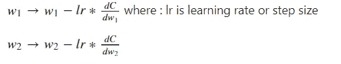

Gradient Descent

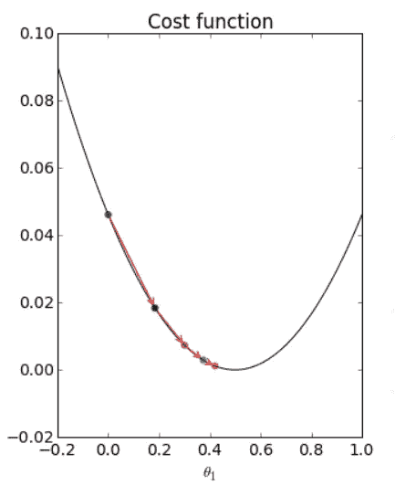

Pictorial Representation of Gradient Descent (Image Source: [https://scipython.com/blog/visualizing-the-gradient-descent-method/](https://scipython.com/blog/visualizing-the-gradient-descent-method/))

## **手动编码单神经元解简单线性方程**

使用实现梯度下降的 numpy

纪元是我们朝着成本最小化迈出一小步的迭代。学习速度告诉你要迈出多小的一步。一大步永远不会让你达到最小值，而非常小的一步要花太多时间才能达到成本最小值。

通过让 x1 = 3、x2 = 8 和 y = 41 来测试函数

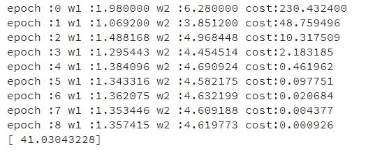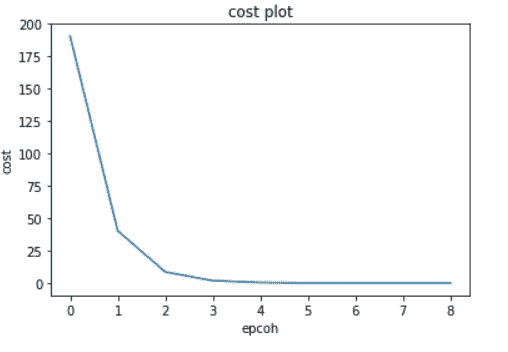

Results

人们可以争辩说，一个方程可以有多个解——神经元将找到最接近开始猜测的解。

**单神经元求解两个线性方程**

同一个函数可以修改为求解两个方程。这个时间成本函数将是

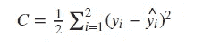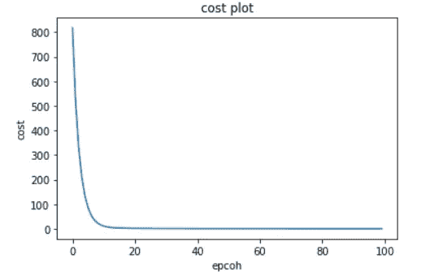

Cost Vs Epochs

**单个神经元求解多个线性方程组**

同一个函数可以修改成解多个方程。这个时间成本函数将是

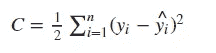

Cost function for Multiple Equations

如果误差随着每个 epoc 的增加而增加，则降低学习率。如果误差减小，但没有低于阈值，则增加周期数(**n _ 周期**)。

本文简单介绍了梯度下降算法，以及如何使用 numpy 求解线性方程来创建基本神经元。

以上所有代码都可以在[我的 git repo](https://github.com/sahuvaibhav/AI_Basics/blob/master/Neural_Netork_Handcoded/Neural%20Networks%20Linear%20Equations.ipynb) 找到。

欢迎评论和反馈！