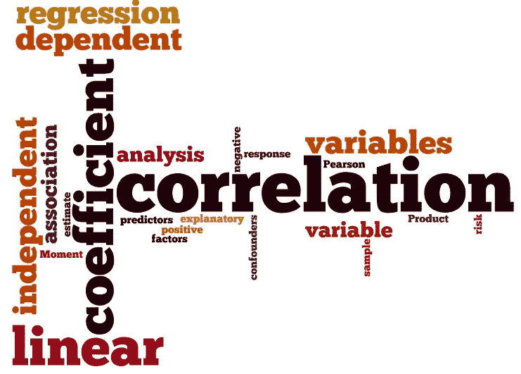
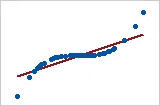
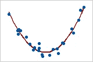

# 相关性测量实用指南

> 原文：<https://towardsdatascience.com/practical-guide-to-correlation-measures-cf8abf534649?source=collection_archive---------6----------------------->

TLDR: 在大多数情况下，使用肯德尔是最好的选择。

[Image source](http://sphweb.bumc.bu.edu/otlt/mph-modules/bs/bs704_correlation-regression/Correlation-Wordle.png)

# 相关性度量

相关性度量用于衡量两个变量之间的相关程度。根据数据类型和用例，可以使用不同种类的相关性度量。一些常见的相关性度量是皮尔逊、斯皮尔曼和肯德尔相关性。在这篇文章中，我将试着简要解释这些工具的作用以及何时使用它们。这些公式可以很容易地在其他地方找到，实现可以在 Pandas 库中找到。

# 皮尔逊

可以计算两个变量之间的相关程度，但是它假设数据是线性的和同方差的。

*   线性:如果 X，Y 是直线，则 X，Y 是线性的
*   同方差性:X，Y 是同方差的，如果它们来自某个高斯分布。

那是什么意思？用简单实用的观点来说。

**使用时**

*   数据似乎有一个简单的线性关系(如果有的话)。
*   数据是稳定的(均值、方差等)。不要改变)
*   数据似乎正态分布在一个中间点周围，有一些差异。
*   有一些测试可用于确定数据是否来自正态分布。

**不使用时**

*   数据是不稳定的
*   数据不是线性相关的
*   如果你把它用于非线性、非高斯数据，它会给出一些读数，但这些不会是可靠的相关性指标。

# 斯皮尔曼相关

这是一个更稳健的相关性度量，因为它没有对数据的分布做任何假设。然而，它只寻找单调的关系，通常适用于顺序变量。找出学生完成比赛的顺序和他们练习的时间之间的关系。注意，这仅捕获单调关系，如图 1 所示，然而它不能捕获如图 2 所示的非单调相关变量。

Fig 1: Spearman coeff = 1

Fig 2: Spearman coeff = 0

*注意:Spearman 相关性有助于确定两个变量是否独立，但是当它们相关时，它不能传达太多信息。*

**使用时**

*   这种关系是单调的(要么总是增加，要么总是减少)
*   变量值的顺序可能是感兴趣的(Spearman rho)
*   有必要检查独立性

# 肯德尔相关

肯德尔相关性不像 Spearman 那样对数据的分布做任何假设。Spearman 有一个缺陷，即很容易发现是否存在单调相关性，如果存在单调相关性，则值很难解释。另一方面，Kendall 可以量化变量之间的依赖强度。

**优点**

*   非参数(不假设数据的分布)
*   可用于确定两个变量是否相关
*   可以量化，有多少依赖。

## 参考

[Minitab Express Support 的相关页面](http://support.minitab.com/en-us/minitab-express/1/help-and-how-to/modeling-statistics/regression/supporting-topics/basics/a-comparison-of-the-pearson-and-spearman-correlation-methods/)
[statistics solutions . com 的相关页面](http://www.statisticssolutions.com/correlation-pearson-kendall-spearman/)
[维基百科—皮尔森相关](https://en.wikipedia.org/wiki/Pearson_correlation_coefficient)
[维基百科—斯皮尔曼相关](https://en.wikipedia.org/wiki/Spearman%27s_rank_correlation_coefficient)
[Statsdirect —肯德尔相关](http://www.statsdirect.com/help/nonparametric_methods/kendall_correlation.htm)
[维基百科—肯德尔相关](https://en.wikipedia.org/wiki/Kendall_rank_correlation_coefficient)

*原载于*[*say tosid . github . io*](https://saytosid.github.io/correlation/)*。*