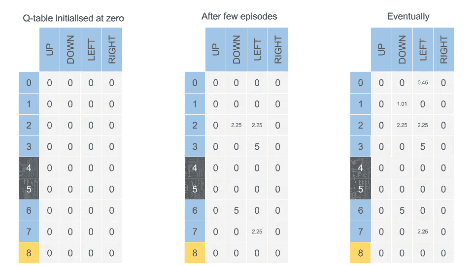
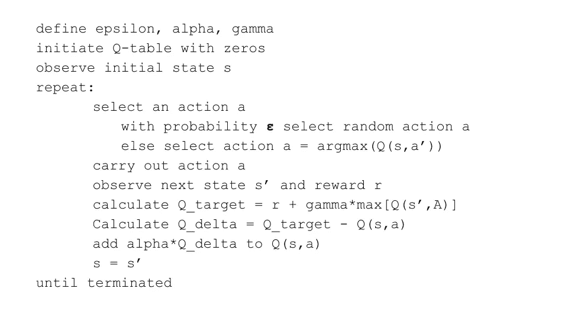

# 实用强化学习—02 Q-Learning 入门

> 原文：<https://towardsdatascience.com/practical-reinforcement-learning-02-getting-started-with-q-learning-582f63e4acd9?source=collection_archive---------0----------------------->

## 最简单的 Q 学习入门。[浏览器中的代码](https://notebooks.azure.com/shreyasgite/libraries/100daysofAI)，未安装:)

Smart Cab — GridWorld

这一次，我们将教会我们的自动驾驶汽车开车送我们回家(橙色节点)。我们必须小心，因为一些街道正在建设中(灰色节点)，我们不希望我们的车撞上它。

如你所见，我们有从 0 到 8 的街道。这给了我们 9 个独特的**州**(街道)。在任何给定的时间，我们的汽车(代理)可以处于这 9 种状态之一。状态 8 是我们的目标，也称为**终端状态**。

我们的车可以左、右、上、下行驶。换句话说，我们的代理可以采取四种不同的**动作**。我们把它写成:*A∈A {上，下，左，右}*

代理因达到终止状态而获得**奖励 10，除此之外没有奖励。**

## Q 学习和 Q 表

现在我们将创建一个矩阵，“Q”也称为 Q-table，这将是我们代理的大脑。矩阵 Q 被初始化为零，因为代理开始时什么都不知道(*就像约翰·斯诺；)*)。当它学习时，它用状态-动作对的新值更新 Q 表。下面是计算 Q[状态，动作]的公式

> *Q[s，a] = Q[s，a] + alpha*(R + gamma*Max[Q(s '，A)] - Q[s，a])*

哪里；

*   **alpha** 是**学习率，**
*   **伽玛**是**贴现因子**。它量化了我们对未来奖励的重视程度。在未来的奖励中估算噪音也很方便。伽玛从 0 到 1 不等。如果 Gamma 接近于零，代理人将倾向于只考虑直接的回报。如果 Gamma 更接近 1，代理人将考虑更大权重的未来奖励，愿意延迟奖励。
*   Max[Q(s '，A)]给出下一状态中所有可能动作的最大 Q 值**。**

代理探索不同的“状态-动作”组合，直到它达到目标或落入洞中。我们将把每一次探索称为**集**。每次代理到达目标或被终止，我们开始下一集。

Q-table

> 下面用一些简单的数学来演示 Q-table 是如何更新的:
> 取学习率(alpha)为 0.5 &折现因子(gamma)为 0.9
> Q[s，a] = Q[s，a] + alpha*(R + gamma*Max[Q(s '，A)] — Q[s，a])
> **早期剧集**
> Q[3，L] = Q[3，L]+0.5*(10+0.9*Max[Q(8，U) 同样 Q[6，D] = 5
> **下一集**
> Q[2，L] = Q[2，L]+0.5*(0+0.9*Max[Q(6，U)，Q(6，D)，Q(6，R)，Q(6，L)]-Q(2，L))
> Q[2，L] = 0 + 0.5 * (0 + 0.9 * Max [0，5，0，0] -0)
> Q[2

## 勘探与开采—ε(***ε***)

当代理开始学习时，我们希望它采取随机行动来探索更多的路径。但是随着代理变得更好，Q 函数收敛到更一致的 Q 值。现在，我们希望我们的代理利用具有最高 Q 值的路径，即采取贪婪的行动。这就是艾司隆的用武之地。

*智能体对概率* ***ε*** *采取随机行动，对概率采取贪婪行动(1-****ε****)。*

Google DeepMind 用了一个衰减的ε-贪婪动作选择。其中ε 随时间从 1 到 0.1 衰减*——开始时，系统完全随机地移动以最大化地探索状态空间，然后它稳定到固定的探索速率。*

## *q 学习伪代码*

**

## *是时候动手 Q 学习了*

*现在继续用 OpenAI 健身房练习 Q-learning。你可以在你的[浏览器中使用 azure 笔记本](https://notebooks.azure.com/shreyasgite/libraries/100daysofAI)来完成。或者克隆[这个 git 回购](https://github.com/shreyasgite/practical-reinforcement-learning)。*

## *更多资源*

*[强化学习:简介](http://people.inf.elte.hu/lorincz/Files/RL_2006/SuttonBook.pdf) —第六章:时差学习
[大卫·西尔弗的强化学习课程第四讲](https://www.youtube.com/watch?v=PnHCvfgC_ZA) —无模型预测
[大卫·西尔弗的强化学习课程第五讲](https://www.youtube.com/watch?v=0g4j2k_Ggc4) —无模型控制*

*希望这篇教程对刚接触 Q-learning 和 TD-reinforcement 学习的人有所帮助！*

*如果你想关注我关于强化学习的文章，请在 Medium [Shreyas Gite](https://medium.com/u/47216364aba9?source=post_page-----582f63e4acd9--------------------------------) 或 twitter [@shreyasgite](https://twitter.com/shreyasgite) 上关注我。
如有任何问题或建议，请随时给我写信:)*

****更多来自我的实用强化学习系列:****

1.  *[强化学习简介](https://medium.com/@shreyas.gite/reinforcement-learning-is-awesome-100daysofai-day-01-intro-1ddebba6d435)*
2.  ***Q-learning 入门***