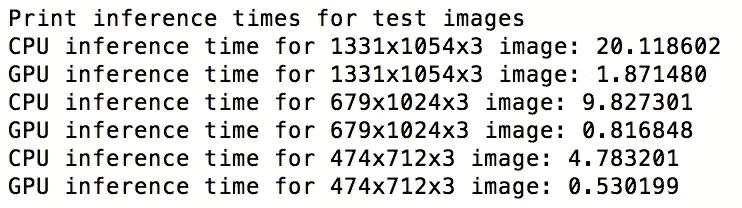
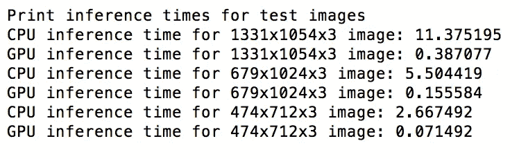
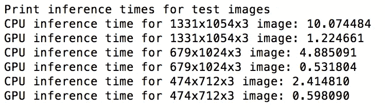
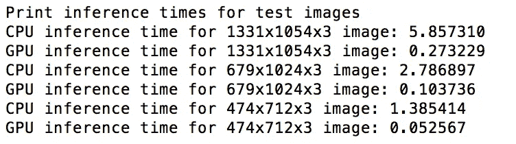
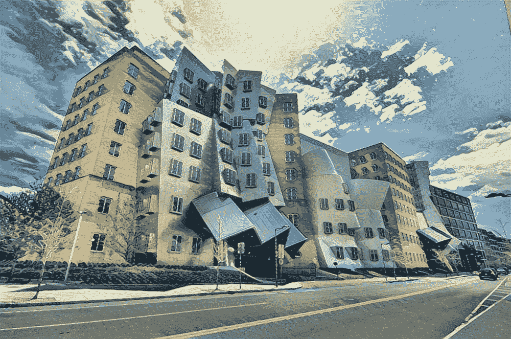
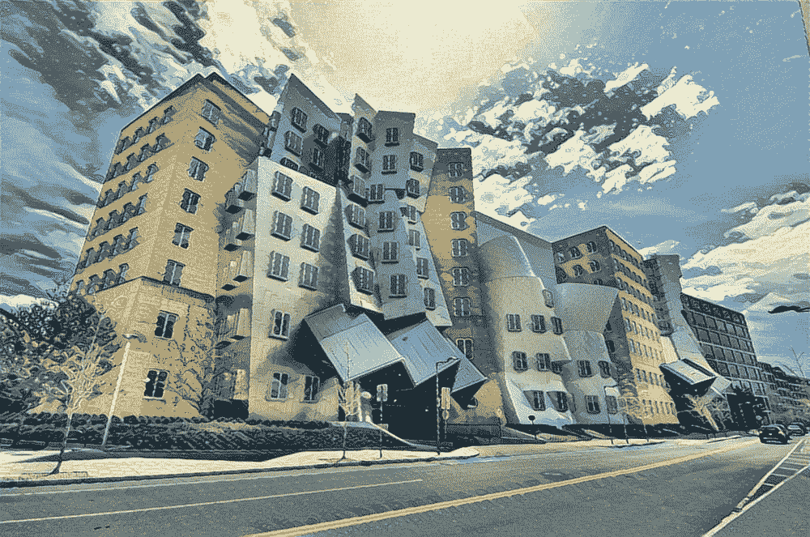
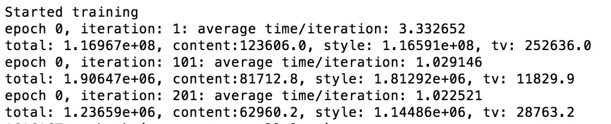
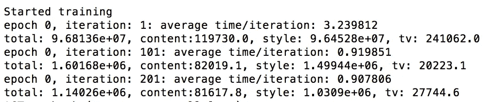

# 将风格转移到工作中的实用技巧

> 原文：<https://towardsdatascience.com/practical-techniques-for-getting-style-transfer-to-work-19884a0d69eb?source=collection_archive---------3----------------------->

不熟悉风格转移的可以看[这篇总结风格转移的博文](https://medium.com/@singlasahil14/introduction-to-style-transfer-faa60f3f5257)。

作为杰瑞米·霍华德的第二部分课程“[程序员的前沿深度学习](http://course.fast.ai/part2.html)的参与者，我想建立一个风格转移神经网络，它的性能与 prisma 不相上下(在生成图像的时间和图像质量方面)。该项目涉及许多有趣的挑战(图像质量、推理时间)。

我首先进行了许多实验，看看如何提高生成图像的质量。以下两篇博文详细介绍了这些实验:

1.  [风格转换不同损失配置实验](https://medium.com/towards-data-science/experiments-on-different-loss-configurations-for-style-transfer-7e3147eda55e)
2.  [让初始架构与风格转移一起工作](https://medium.com/mlreview/getting-inception-architectures-to-work-with-style-transfer-767d53475bf8)

这篇博文总结了我从这些实验中学到的东西，并包含了一些更实用的技巧来实现风格的转变。

# 实际环境中的风格转换

上述两篇博文使用了基于图像优化的方法进行风格转换，即通过最小化损失来学习图像像素。在实际设置中，假设你正在构建一个像 prisma 这样的应用程序，这种技术是没有用的，因为它非常慢。因此，取而代之的是使用基于神经网络的方法，其中训练神经网络从内容图像生成风格化图像。这些是在 AWS p2x.large 实例上使用两种方法对一个 **1000x1000 图像所花费的时间:**

> 基于优化的方法(NVIDIA K80 GPU): 172.21 秒
> 
> 基于神经网络的方法(NVIDIA K80 GPU): 1.53 秒
> 
> 基于神经网络的方法(英特尔至强 E5–2686 v4):14.32 秒

显然，基于神经网络的方法是这里的赢家。基于神经网络的风格转换只是基于优化的方法的近似，但是要快得多。

要详细了解基于神经网络的方法是如何工作的，您可以阅读以下文章:

1.  [实时风格转换和超分辨率的感知损失](https://arxiv.org/abs/1603.08155)
2.  [艺术风格的学术表现](https://arxiv.org/abs/1610.07629)

基于优化的方法描述于:

1.  [艺术风格的神经算法](https://arxiv.org/abs/1508.06576)

# 提高生成图像的质量

让深度学习变得众所周知困难的一件事是搜索最佳超参数。并且风格转移涉及各种超参数，如使用哪些内容层来计算内容损失、使用哪些风格层来计算风格损失、内容权重(与内容损失相乘的常数)、风格权重(与风格损失相乘的常数)、电视权重(与总变化损失相乘的常数)。幸运的是，在风格转换中找到最佳超参数要容易得多。

简单的窍门是:

> 不使用基于神经网络的方法来训练和寻找最佳超参数，您可以简单地在您的测试图像上使用基于优化的方法来创建它们的风格化版本和交叉验证。

以下是我从实验中学到的关于如何使用基于图像优化的方法来寻找风格化超参数的一些东西。

## 1.使输出图像更平滑

总变差损失是输入图像中相邻像素值的绝对差值的总和。这衡量图像中有多少噪声。

如这篇博客文章的[中的实验 10 所示，将总变差损失添加到训练损失中去除了图像的粗糙纹理，结果图像看起来更加平滑。](https://medium.com/towards-data-science/experiments-on-different-loss-configurations-for-style-transfer-7e3147eda55e)

## 2.选择样式层

在大多数发表的作品中(包括[的开创性论文](https://arxiv.org/abs/1508.06576))，从网络中选择一些层来计算风格损失，并给予相等的权重。正如我在[这篇博文](https://medium.com/towards-data-science/experiments-on-different-loss-configurations-for-style-transfer-7e3147eda55e)中的实验#1 所示，这没有意义，因为不同层次对风格损失的贡献可能相差很大数量级。为此，我首先从每一层中找出输出，一次一个。然后通过给每一层赋予权重来创建一个组合图像。通过交叉验证可以再次找到权重。

## 3.选择内容层

与选择样式层的情况不同，选择内容层的组合不会产生太大的差异，因为优化一个内容层的内容丢失会优化所有后续层。使用哪一层可以通过交叉验证再次找到(如这篇博文的[的实验#2 所示)。](https://medium.com/towards-data-science/experiments-on-different-loss-configurations-for-style-transfer-7e3147eda55e)

## 4.修改损耗网络以改善收敛性

vgg-16/vgg-19 网络(在 imagenet 上预训练)通常用于计算内容损失和样式损失。正如我在这篇博文的[的实验 8 中所示，用平均池替换最大池显著减少了收敛时间。](https://medium.com/towards-data-science/experiments-on-different-loss-configurations-for-style-transfer-7e3147eda55e)

我尝试的另一个改变是，用有效的填充替换相同的填充，但效果并不明显。

## 5.样式图像的大小和裁剪区域

正如我在这篇博文的[实验 4 中所展示的，风格图像的大小很重要。如果您使用的是较小尺寸的样式图像，则网络无法计算出足够的样式信息，并且生成的图像质量较差。根据我的实验，我会说风格图片的尺寸至少应该是每边 512。](https://medium.com/towards-data-science/experiments-on-different-loss-configurations-for-style-transfer-7e3147eda55e)

如[这篇博文](https://medium.com/p/7e3147eda55e/edit)的实验 11 所示，风格图像的裁剪区域也很重要，这应该根据包含我们想要的风格化图像中的笔触的区域来选择。

## 6.选择内容、风格权重和电视权重

这些权重只能通过交叉验证找到。但是这里有几条规则，我遵守了，并且做得很好。

当你开始训练时，首先风格损失迅速降低到某个小值，然后内容损失开始降低，风格损失要么降低得更慢，要么波动。这个内容损失和风格损失减少的图表可以在这篇博文的实验#6 中看到。此时，内容权重应使内容损失明显大于样式损失。否则网络将不会学习任何内容。

电视权重应该是这样的，即在训练的后期迭代中，电视损失是内容损失的一半。这是因为如果电视损耗非常高，图像中相邻物体的颜色会混合在一起，图像质量会很差。

## 7.选择损耗网络

[的实验#3、#4、#5、#6 这篇博文](https://medium.com/mlreview/getting-inception-architectures-to-work-with-style-transfer-767d53475bf8)详细介绍了如何通过使用不同的初始网络来生成不同种类的图像。使用盗梦空间网络生成的图像看起来更像蜡笔画。

[的实验#5 这篇博文](https://medium.com/towards-data-science/experiments-on-different-loss-configurations-for-style-transfer-7e3147eda55e)比较了使用 vgg-16 和 vgg-19 生成的图像。我的猜测是，使用 vgg-16 生成的图像也可以使用 vgg-19 生成，只需调整内容和样式损失即可。这是因为从这些网络中产生的仿制品没有太大的不同。使用 vgg 网络生成的图像看起来更像油画。

所以如果你针对的是油画质感，就用 vgg-16 和 vgg-19。如果你的目标是蜡笔纹理，使用任何一个初始网络(交叉验证后)。

# 改善训练和推理时间

假设您正在尝试 10 种不同的风格转换架构，以找出哪种最有效。加速训练以快速交叉验证你的模型变得非常重要。

如果你是和 Prisma 竞争，你需要保证你的网络的推理时间和他们的不相上下。

以下是我用来提高训练和推理时间的技巧。

## 1.对训练图像进行下采样

最简单的做法是将图像从 512x512 下采样到 256x256，然后测试生成的图像看起来有多好。它将训练时间减少了 4 倍，但可以很容易地用于寻找最佳网络架构，因为使用 512 生成的图像质量与使用 256 生成的图像质量非常相似。

## 2.使用深度方向可分离卷积代替卷积

这是改善推断时间的最标准的技巧，其中卷积层被深度方向可分离的卷积代替。这导致计算量显著减少。下面是在 aws p2x 大型实例上使用卷积和深度方向可分离卷积的图像的 CPU 和 GPU 推理时间。

inference times using convolution (in secs)

inference times using separable convolution (in secs)

可以看出，图像的推理时间在 CPU 上大约减半，在 GPU 上减少 5-6 倍。生成的图像质量没有明显差异。

## 3.对图像进行下采样，最后添加上采样层和卷积层

我尝试了许多非标准的架构变化来减少推理时间。一是减少神经网络的层数。另一个是改变卷积运算(将 filter _ size * filter _ size * in _ depth * out _ depth 卷积转换为 filter _ size * filter _ size * in _ depth * k，然后是 1*1*k*out_depth 卷积，其中 k<<out_depth></out_depth>

有效的技巧是，在将图像输入神经网络之前，通过双线性插值将图像的高度和宽度减半。并添加上采样层，然后在末尾添加卷积层。这样你就是在训练你的神经网络学习**风格转移和超分辨率**。

为什么会有帮助？与以前的方法相比，所有中间层的计算量减少了 1/4。增加的额外计算是由于一个额外的层和双线性插值。但是他们并没有增加很多时间，净时间要少得多。这些是 aws p2x 大型实例上图像的 CPU 和 GPU 推理时间。

inference times using baseline architecture (in secs)

inference times using the resize trick (in secs)

正如我们所看到的，这大大缩短了 CPU 的推断时间。并且还减少了大多数图像的 GPU 推断时间。

将此与可分离卷积技巧相结合，得到:

inference times using separable convolution and resize trick (in secs)

正如我们所见，结合使用这两种技巧可以将所有图像的 CPU 推断时间减少 3 倍，将 GPU 推断时间减少 8-10 倍。我在手机上运行了同样的神经网络。**1000 x 1000 的图像需要 6.5 秒。作为对比，prisma 同样的图像需要 9 秒。**

更酷的是。这两个技巧适用于任何图像生成方法，而不仅仅是风格转换。

此外，生成的图像质量是相同的:

image generated using baseline architecture (left) and using separable convolution and resize trick(right)

## 4.预计算训练数据的内容要素

训练数据中的每个图像都需要通过损失网络。并且一些层的输出将用于计算内容损失。这些内容层输出可以预先计算。这样可以节省训练时间。

以下是预计算和未预计算特征的训练时间:

average time without features precomputed

average time with features precomputed

因此，预计算特性带来了 10%的加速，虽然不是很显著，但已经足够了。所用的内容层是 conv4_1。

这些实验中使用的所有代码都可以从 github 上获得[。](https://github.com/singlasahil14/style-transfer)

> 如果你喜欢这篇文章，请点击下面的小拍手图标帮助他人找到它。非常感谢！