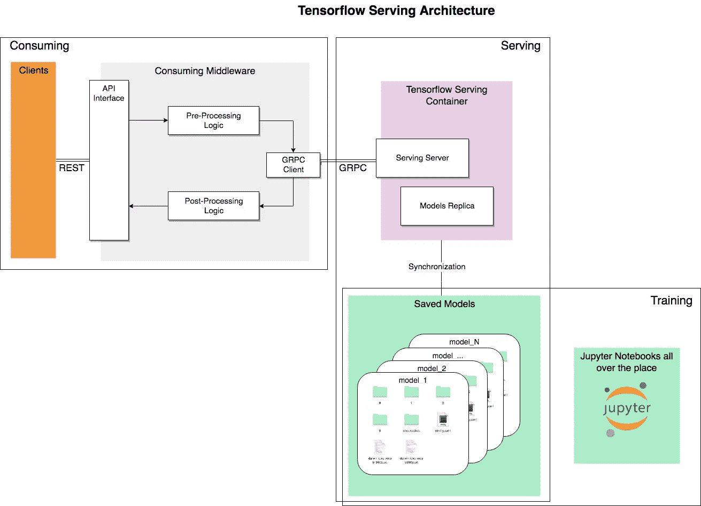
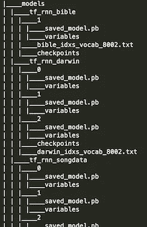
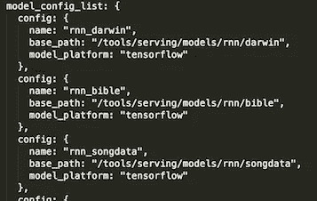
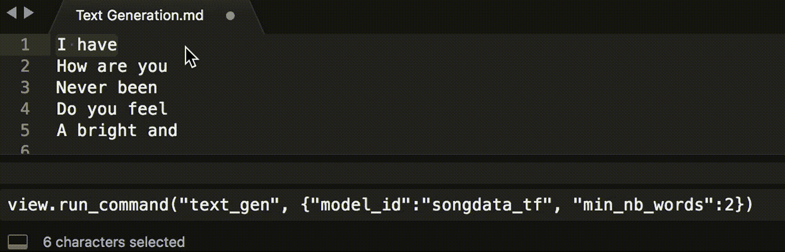

# 基于张量流服务的实用文本生成

> 原文：<https://towardsdatascience.com/practical-text-generation-with-tensorflow-serving-3fa5c792605e?source=collection_archive---------1----------------------->

在这篇文章中，我将讨论深度学习模型通过 Tensorflow 的暴露和服务，同时展示我对灵活实用的文本生成解决方案的设置。

使用*文本生成*,我打算自动生成可变长度的新的语义有效的文本片段，给定一个可选的种子字符串。这一想法是为了能够利用不同用例的不同模型(Q & A，聊天机器人工具，简化，下一个单词建议)，也基于不同类型的内容(例如，叙事，科学，代码)，来源或作者。

这是句子建议的第一个预览。

Text generation example using seed text (the selected part in the video) for different training sources (i.e. song lyrics, Bible, Darwin)

这段录音显示了使用三种不同模型的按需文本生成，每种模型都基于不同的种子字符串，在相应的文本源(即[歌词](https://www.kaggle.com/mousehead/songlyrics/data)、钦定版《圣经》和达尔文的《物种起源》)上进行训练。正如预期的那样，每个模型都反映了原始资料的基调和内容——所有其他潜在的模型都是如此——并显示了其特定用途和场景的潜力，这仍然主要取决于作者的需求和期望。预览还允许获得模型性能的直观感受，暗示哪个模型需要改进以满足定义的需求。

下面的段落将准确地描述我遵循的体系结构方法，以获得第一个和后面的示例背后的文本生成功能的提供和使用。

# 建筑预览

即使 showcase 的重点是文本生成任务，许多与模型管理相关的内容也可以抽象出来。例如，我们可以确定三个独立的步骤，这些步骤已被证明适用于各种不同的用例及情况:

*   **训练:**很多领域里的东西大多都习惯；调查最佳方法，定义架构/算法，处理数据，训练和测试模型。
*   **上菜:**将训练好的模型曝光消费
*   **消费:**使用暴露的模型从原始数据中获得预测

最后两个步骤之间的区别更加微妙，并且很大程度上取决于工作设置和被识别为*的型号。*对于初学者来说，想想你为训练所做的数据预处理有多少实际上没有嵌入到你使用 Keras(或任何其他库)的实际训练中。所有这些工作只是转移到下一个架构块，但是需要委托给一个消费中间件，这样我们就可以通过一个干净的接口只公开基本的所需功能。

这里是我们的架构步骤和交互的示意图。

# 培养

我不打算深入研究文本生成训练的技术细节，但是如果感兴趣的话，您可以在这个 Jupyter 笔记本中找到本文的大部分训练代码，以及额外的指针和资源。

服务架构的好处是培训可以与其他组件高度分离。这允许通过提供更好的执行模型来快速、简单和透明地交付改进的版本。更好的训练数据、更可控的训练过程、更复杂算法的实施或新架构的测试，都是可以产生更好的模型的选项，这些模型反过来似乎可以取代当前提供的模型。

关于打破完美解耦的方面，例如考虑以下最紧迫的依赖关系:

*   **模型签名**(输入/输出形状和类型)，客户必须知道并遵循。目前没有办法直接从服务服务器发现这一点，因此需要“手动”保证与训练步骤的一致，以避免错误。一旦定义了一个签名，您就可以为新版本的模型服务，或者测试新的架构，而没有额外的负担，只要它在所有这样的模型中是一致的。
*   **培训时操作的前后处理**需要在消费层“复制”。
*   **前/后处理的外部/附加模型数据**(如单词索引)需要提供给消费层，同时保证与培训期间使用的数据一致。

## 模型

模型是我们训练过程的产物。我们可以首先根据它们的功能(例如分类、文本生成、问答)对它们进行分类，然后根据版本进行分类。

对于我们的文本生成案例，即使基本任务实际上是相同的，我们也可以考虑模型根据它们被训练的文本内容提供不同的功能。在大多数情况下，训练过程/代码实际上是相同的，改变的是所使用的训练数据。然后，版本化将特定于该模型功能和内容，并且可以在最简单的情况下通过沿着多个时期的训练过程的基本快照来确定，或者通过采用或测试新的算法和架构来确定。

这样做的想法是建立一个包含大量模型的中央存储库，可以根据需要添加新训练的版本。

作为一个实际的例子，考虑我的文件夹的这个快照，用于我们的三个模型的基本文本生成，每个模型都有可能有多个服务就绪版本、更细粒度的训练检查点(或快照)选择和单词索引数据。

partial tree of the models folder

# 服务

模型已经准备好了，我们需要一种方法来*服务于*它们:让它们可以被有效地使用。

TensorFlow 服务是一种灵活、高性能的机器学习模型服务系统，专为生产环境而设计对于那些已经熟悉 Tensorflow 并且没有心情编写自己的服务架构的人来说，这是一种非常好的直接方法。
它包括基于相关模型目录的自动化模型管理，并通过 GRPC 公开它们。樱桃放在上面，可以很容易的 Dockerized。

model config example

您可以在运行 Tensorflow 服务器的机器上拥有所有模型和相关版本的副本，或者您已经可以根据需要进行过滤，以拥有更轻的服务容器。然后，您可以指定直接运行哪个模型，或者通过启动服务服务器时需要传递的模型配置文件来运行。该文件应该为我们计划公开的所有模型指定一个模型配置列表。

然后，Tf 将负责为每个列出的模型提供服务，并自动管理版本。Tensorflow 将自动获取新版本的插入，而全新模型的注入将需要重新启动服务。
所有这些都可以手动完成，但对于生产设置，人们可能更喜欢开发一个“同步”实用程序，它应该负责从托管训练步骤实际结果的任何外部存储中同步 Tensorflow 服务容器内的模型数据。

# 强烈的

考虑我们当前的用例:我们想要获得特定类型或特定来源的生成文本，并且可选地以种子文本为条件。不幸的是，纯 Tensorflow 服务端点远没有这么直接。我们不仅需要转换文本(输入和输出)，而且我们还必须实现一个生成过程，我们希望在最终的界面中完全透明。所有这些都需要委托给消费者中间件来实现。

这适用于许多其他数据科学场景，在这些场景中，导出的模型实际上只是从原始数据到可用预测的管道中的一部分。正如最初的架构模式中所描述的，将需要一个消费者中间件来填补这个预处理和后处理的空白。对于我们的文本生成案例，这个中间件和相关代码再次在[我的 Github 库](https://github.com/5agado/recurrent-neural-networks-intro/tree/master/src)中定义。它包括一个负责文本预处理和后处理的基本类，一个文本生成过程(建立在多个模型调用和二级需求之上)和一个处理不同模型的代理。

假设所需的依赖关系已经解决，可以直接使用代理，否则我建议进一步简化任务，将所有内容公开为一个真正基本的 REST API:使用 Python 和 [Flask](http://flask.pocoo.org/) ，只需要几行代码。此外，我们所有组件的模块化使得通过 Docker 和 AWS 等技术将解决方案外部化和扩展变得容易。

# 展示时间！

如何实际利用到目前为止描述的设置纯粹是想象和需求的问题([这篇文章](https://medium.com/@samim/assisted-writing-7adea9aed19)很好地探索了各种形式的机器辅助写作)。最好的方面是，我们现在有了一个灵活的架构，可重用于各种场景，而没有太多额外的操作负担。

我烘焙的第一个实际例子是一个基本的文本编辑器插件，现在我正在积极地使用它。在我的情况下，我依靠[崇高 3](https://www.sublimetext.com/3) 和[记事本++ T7。一旦我启动并运行了文本生成 API，为前者编写插件就相当简单了；下面实际上是所有需要的代码。](https://notepad-plus-plus.org)

Sublime3 plugin for text-generation via REST API

这里发生的事情是，我自己写一些东西，选择我想用作种子的文本，然后调用首选模型上的生成。这是另一个例子。请再次注意，我在这里依靠三个不同的模型，分别接受了关于歌词的训练，詹姆斯国王版本的圣经和达尔文的物种起源。

text gen on same seed for different models. Again notice the weaker Bible one.

这个“文本应用插件”允许我从内容(完整的句子或单个单词)中获得灵感，否则很少会从我纯粹自发的写作中出现。虽然叙事和诗歌的更具创造性的上下文似乎更好地利用了这一工具，但我经常发现对更正式和“严格”类型的内容也有很好的建议，我相信用于训练的源数据集，同时相信“更有可能意味着正确”。

我正在开发的另一个应用是一个用于聊天和即时消息自动回复的 web 浏览器插件，也是通过简单地利用公开的 REST API。我们将会看到有多少我的朋友能区分我和 RNN。

words suggestion based on the song-lyrics dataset

words suggestion based on Darwin’s On the Origin of Species

# 结论

基于深度学习的技术的文本生成能力已经得到证明，并且适用于各种不同的用例及场景。在这篇文章中，我展示了一个基于 Tensorflow 的基础架构解决方案如何保证高度的灵活性和有效性，为您的内部作者创建一个实用的小文本生成工具箱。

我还相信，我们很快就会看到对预训练模型的更结构化、更精细和更民主化的访问。一种自助服务存储库——类似于[其他流行服务](https://docs.docker.com/registry/)——这样人们可以轻松地即插即用新模型，并将它们直接嵌入到任何选择的环境中，而不必从头开始训练它们。
例如，在本文的上下文中，如果能够访问其他人针对不同任务、文本内容或作者训练的模型，并且能够在一个公共平台或“模型中心”上分享我自己的训练结果，那就太好了。

> 但现在去；好好利用这些强大的机器来达到你的生产和创造目的；用不了多久，他们就会变得非常聪明，不适合这项任务。