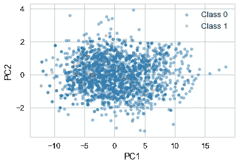
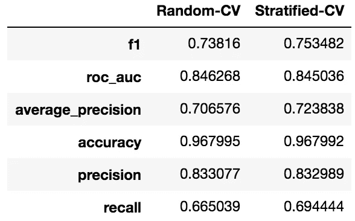
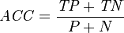
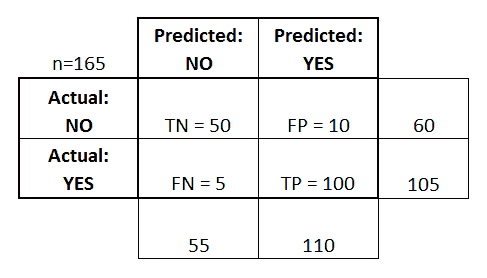
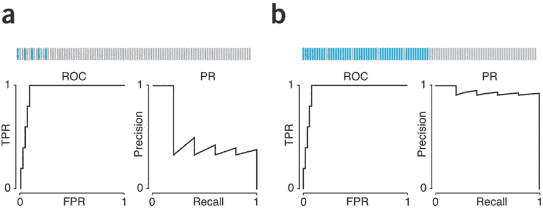
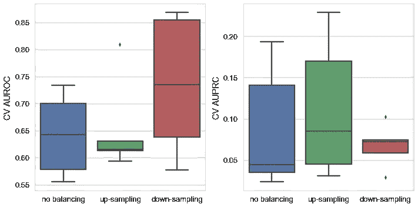
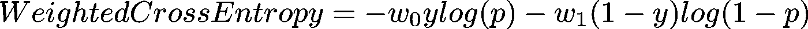
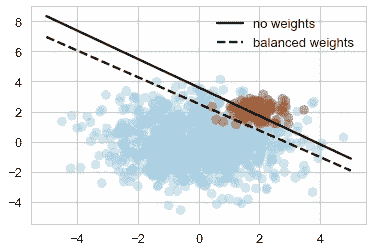

# 二进制分类中类别不平衡的实用技巧

> 原文：<https://towardsdatascience.com/practical-tips-for-class-imbalance-in-binary-classification-6ee29bcdb8a7?source=collection_archive---------1----------------------->

# 0.简介和动机

二元分类问题可以说是机器学习中最简单和最直接的问题之一。通常我们想学习一个模型，试图预测某个实例是否属于某个类。它有许多实际应用，从垃圾邮件检测到医学测试(确定患者是否患有某种疾病)。

稍微正式一点，二进制分类的目标是学习一个函数*f(****x****)*，该函数将 ***x*** (一个实例/例子的特征向量)映射到预测的二进制结果 *ŷ* (0 或 1)。大多数分类算法，例如逻辑回归、朴素贝叶斯和决策树，输出属于正类的实例的概率:Pr(*y*= 1 |***x***)。



类别不平衡是指在一个分类问题中，类别没有被平等地表示，这在实践中是很常见的。例如，欺诈检测、罕见药物不良反应预测和基因家族预测(如激酶、GPCR)。未能解决类别不平衡通常会导致许多分类算法的预测性能不准确和下降。在这篇文章中，我将介绍一些关于如何在二进制分类中克服类不平衡的实用技巧，其中大部分可以很容易地适应多类场景。

# 1.分层很重要！

首先，您需要对数据进行分层，以便进行训练和验证。分层是一种基于样本类别平均分配样本的技术，以便训练集和验证集具有相似的类别比例。

确保您的训练集和验证集共享来自每个类的大约相同比例的示例是非常重要的，这样您就可以在两个集中获得一致的预测性能分数。一些分类算法对它们被训练的数据的类别比率也极其敏感。例如，朴素贝叶斯分类器使用它从训练数据中的类比率中学习的类先验来进行预测。训练集和验证集之间类比率的较大差异导致类先验估计不准确，降低了朴素贝叶斯分类器的预测性能。类似地，k-最近邻也受到这个问题的困扰，因为它只是记住了用于训练的所有数据点，这几乎肯定会在推理阶段从训练数据中搜索 k-最近邻时引入源于类别不平衡的偏差。

[scikit-learn](http://scikit-learn.org/stable/) 有一个分层的实现`[StratifiedKFold](http://scikit-learn.org/stable/modules/generated/sklearn.model_selection.StratifiedKFold.html)`将其放入代码中:

然后，我们可以比较分层和随机交叉验证(CV)的得分，这通常会对对类别不平衡敏感的分类器产生影响:



# 2.二元分类的性能度量

有许多度量来评估二元分类器在预测实例/例子的分类标签方面做得有多好。下面是一些关于选择和解释适当指标的警告和建议。

*   准确性可能会误导人。因为准确性是简单的正确预测的实例与用于评估的所有实例的比率，所以有可能获得相当好的准确性，同时对于少数类具有大多数不正确的预测。



ACC: Accuracy, TP: True Positive, TN: True Negative

*   混淆矩阵有助于分解不同类别的预测性能。



*   基于二分的度量(精确度、召回率、F1 分数等。)默认情况下，计算两个类的平均分数。也许对许多人来说并不明显，人们实际上可以得到每门课的分数细目。在这种情况下,`[classification_report](http://scikit-learn.org/stable/modules/generated/sklearn.metrics.classification_report.html)`函数非常有用:

*   对于不平衡数据，推荐使用精确召回曲线而非 ROC 曲线。如下图所示，ROC 曲线可能高估了不平衡数据上分类器的性能，而 PR 曲线揭示了不平衡数据在相同召回水平下的精度下降。[本文](https://www.nature.com/articles/nmeth.3945)详细讨论了如何选择合适的分类标准。



Fig. 4\. Graphical representation of classifier performance avoids setting an exact threshold on results but may be insensitive to important aspects of the data. (from [Lever et al. (2016) *Nat Methods*](https://www.nature.com/articles/nmeth.3945))

# 3.重新采样以获得更平衡的数据

既然我们已经知道了如何设置评估方案，以及为不平衡数据的分类问题选择什么度量标准，我们就可以继续应用一些技术来解决类别不平衡问题。最直接的方法是通过重采样来平衡数据:

*   向下采样(欠采样)多数类
*   向上采样(过采样)少数类
*   许多更高级的采样技术，如合成少数过采样技术(SMOTE) ( [Chawla *等人，* 2012](https://arxiv.org/abs/1106.1813) )，在[不平衡学习库](https://github.com/scikit-learn-contrib/imbalanced-learn)中实现

重采样技术可以与诸如随机森林的 Bagging 集合模型相结合。Bagging 代表 bootstrap-aggregation，它们通过在构建单个估计器(通常是决策树)时引导数据来工作，然后聚合单个估计器的预测。由于自举(带替换的随机采样)本质上是一种重采样技术，我们可以用其他重采样技术(如下采样或上采样)来替换自举，以平衡数据。

下面是一些实现随机森林的核心 Python 代码，带有上/下采样。实现重采样森林的完整代码可以在[这里](https://github.com/wangz10/class_imbalance/blob/master/resample_forest.py)找到。

接下来，我们可以比较随机森林在不同重采样技术下的性能。该图表明上采样和下采样都提高了随机森林对不平衡数据的预测性能。



Performance of Random Forest coupled with different resampling techniques on imbalanced dataset.

# 4.类别加权/成本敏感学习

在不重新采样数据的情况下，还可以通过将类的权重合并到成本函数(也称为目标函数)中来使分类器意识到不平衡的数据。直觉上，我们想给少数类更高的权重，给多数类更低的权重。scikit-learn 有一个方便的实用函数，可以根据课程频率计算权重:

```
**from** sklearn.utils.class_weight **import** compute_class_weight
class_weights = compute_class_weight('balanced', np.unique(y), y)
```

交叉熵是许多二元分类算法(如逻辑回归)的成本函数的常见选择。交叉熵被定义为:

交叉熵=*y*log(*p)*—*—(1—*y*)log(1—*p*)*

其中 y 是类别二进制指示符(0 或 1 ), p 是例如属于类别 1 的预测概率。为了将两个类别(0 和 1)的权重合并到交叉熵中，可以定义一个[加权交叉熵](https://www.tensorflow.org/api_docs/python/tf/nn/weighted_cross_entropy_with_logits):



，其中 w_0 和 w_1 分别是类 1 和类 0 的权重。可以使用`[tf.nn.weighted_cross_entropy_with_logits](https://www.tensorflow.org/api_docs/python/tf/nn/weighted_cross_entropy_with_logits)`在 Tensorflow 中实现类权重。在 Keras 中，`class_weight`可以在训练时作为参数传递给模型的`fit`方法。将来我会在 Tensorflow 和 Keras 中实现代价敏感分类器的例子。

也可以通过在许多 scikit-learn 分类器(如支持向量机(SVM)和随机森林)中设置`class_weight`参数来实现敏感学习。



Classification boundaries for cost-sensitive and cost-insensitive linear SVM

*   在随机森林中:

1.  `class_weight='balanced'`:使用 y 值自动调整输入数据中与类别频率成反比的权重
2.  `class_weight='balanced_subsample'`:与“平衡”相同，只是权重是根据每棵生长的树的 bootstrap 样本计算的。

# 5.梯度推进

一些分类模型内置了对抗类别不平衡的方法。例如，梯度推进机器(GBM)通过基于错误分类的例子构建连续的训练集来处理类别不平衡。在不平衡数据集上，它通常优于随机森林:


Comparing GBM with Random Forests (RF) with different balancing techniques on imbalanced dataset. 20 trees are grown for every ensemble model.

我希望这些提示有助于改进不平衡数据集的分类模型。我的 GitHub 上有本教程的 Jupyter 笔记本版本:

[](https://github.com/wangz10/class_imbalance) [## Wang 10/class _ 失衡

### 二进制分类中类别不平衡的 Jupyter 笔记本演示

github.com](https://github.com/wangz10/class_imbalance) 

感谢阅读！