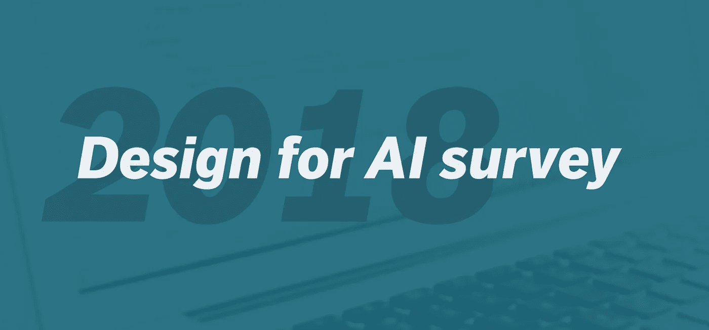
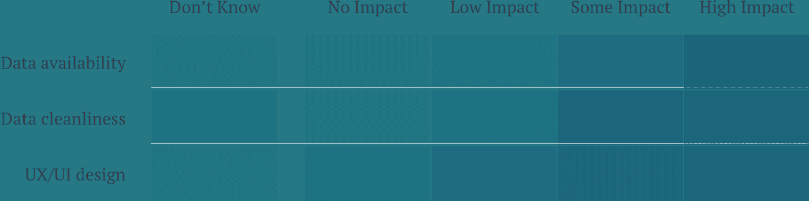
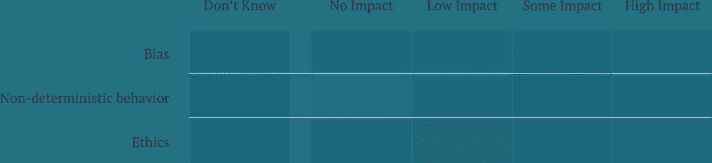
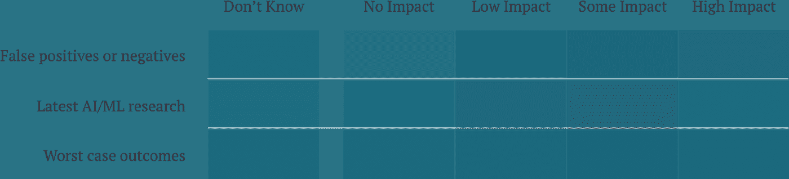
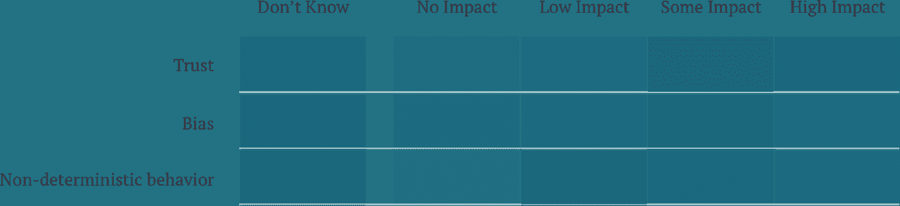

# 练习 AI 的团队不知道偏见

> 原文：<https://towardsdatascience.com/practicing-ai-teams-dont-know-about-bias-b6e8d8e27c54?source=collection_archive---------13----------------------->

## 人工智能设计 2018 报告，第 1 部分

我们总是试图向学术界和工业界的其他人学习。单独研究成 AI，机器学习，深度学习等。自 1996 年以来[增加了 9 倍。我们想知道当将这些技术应用于人们的问题时，行业中的其他人在做什么，并导致我们创建了“人工智能设计”调查。](https://aiindex.org/2017-report.pdf)

起初，我们真的专注于设计方面，并想知道其他团队是如何做的。超过 18 个问题(平均每个回答约 7 分钟)我们深入到人们如何在构建人工智能的团队中工作。我们会发现对 UX 设计的关注较少，而对团队沟通的关注较多。

你可以在这里看到整个报告:

 [## 2018 人工智能设计报告

### 今天，团队被推至包括人工智能(AI)、机器学习(ML)、深度学习(DL)和…

哲学是](https://philosophie.is/design-for-ai-report-2018) 

虽然在[报告](https://philosophie.is/design-for-ai-report-2018)中有很多有趣的信息，但我想进一步探讨一些要点，并提供一些我们必须解决它们的建议。特别是，我想谈谈结盟，沟通，以及在构建人工智能项目时，团队应该更多地关注什么。

# 最具影响力

调查的影响部分旨在了解人们在构建人工智能系统时在哪里花费脑力。“数据可用性”和“数据清洁度”在影响中排名靠前是有道理的。关于全套因素[请查看报告](https://philosophie.is/design-for-ai-report-2018)。

# 没有影响力

最低的影响因素是“伦理”和“法律”业内一直在讨论道德问题，以及当出现不良人类后果时，工程师应该如何更好地考虑这一问题。然而，我不确定这是思考这个问题的正确方式。伦理显然是人类的问题，而不是机器的问题。为什么我们认为工程师不会像他们团队中的其他人一样关注道德？法律是一个很好的例子，说明公司已经有了相关的专家:律师。

# 最具争议

我们想知道什么是有争议的，所以我们计算了在没有/低影响和一些/高影响之间总体上最接近零的那些。

最让我着迷的是“假阳性/假阴性”和“最坏结果”当处理这些系统的非确定性方面时，我们并不总是知道它将如何失败。由于这一事实，我本以为审议会更加一致。我们发现像[混淆映射](/robots-are-wrong-too-confusion-mapping-for-the-worst-case-2e01b7e19936)这样的练习可以帮助每个人在这些问题上达成共识。

# 最不为人知

最后，一个最少被考虑的因素(大多数“不知道”的回答)今天得到了很多媒体的关注:“偏见。”与伦理不同，偏见是机器知道的东西。他们可以分析识别人类偏见的模式。

我们使用的数据集将严重影响我们系统中的偏差量。机器学习可能是一种可以帮助我们检测和纠正它的机制(正如在[深度领域混淆:最大化领域不变性](https://arxiv.org/pdf/1412.3474.pdf)中所讨论的)。

最大的问题是，团队甚至不知道偏见是否应该影响他们的人工智能项目。他们甚至没有进行对话。

# 接下来是什么:更多的对话

需要就所有这些因素进行更多的对话，尤其是那些没有被提及的因素。

在接下来的两篇文章中，我们将讨论如何在技术和非技术团队成员之间进行讨论，以及如何实现这一点的一些案例研究。

我们如何让包括顾客在内的每个人都有一席之地？

## 关于克里斯·巴特勒

我帮助团队理解他们应该用以人工智能为中心的解决方案解决的真正的商业问题。我们工作的团队通常被要求用他们拥有的数据“做一些有趣的事情”。我们通过偶发事件相关性帮助他们避免局部极值，并专注于解决巨大的业务问题。我的背景包括在微软、KAYAK 和 Waze 等公司超过 18 年的产品和业务开发经验。在 Philosophie，我创造了像[机器移情映射](https://uxdesign.cc/robots-need-love-too-empathy-mapping-for-ai-59585ad3548d)和[混淆映射](/robots-are-wrong-too-confusion-mapping-for-the-worst-case-2e01b7e19936)这样的技术，以在构建人工智能产品时创建跨团队对齐。如果你想了解更多或通过电子邮件联系，LinkedIn 或访问 http://philosophie.is/human-centered-ai。