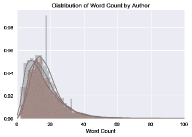

# 自然语言机器学习中的预处理

> 原文：<https://towardsdatascience.com/pre-processing-in-natural-language-machine-learning-898a84b8bd47?source=collection_archive---------1----------------------->


我们很容易忘记我们每天的对话中存储了多少数据。随着数字景观的演变，挖掘文本或自然语言处理(NLP)是人工智能和机器学习中一个不断增长的领域。本文涵盖了应用于 NLP 问题的常见预处理概念。

文本可以有多种形式，从单个单词的列表，到句子，再到包含特殊字符的多个段落(比如 tweets)。像任何数据科学问题一样，理解被问的问题将告知可以采用什么步骤来将单词转换为与机器学习算法一起工作的数字特征。

# 不良贷款的历史

当我还是个孩子的时候，科幻小说几乎总是有一台电脑，你可以吠叫命令，让他们理解，有时，但不总是，执行。当时，这项技术似乎还很遥远，但今天我口袋里装着一部手机，它比任何人想象的都要小，而且功能更强大。语音转文本的历史复杂而漫长，但却是 NPL 的萌芽。

早期的努力需要大量手工编码的词汇和语言规则。1954 年在乔治敦大学首次实现的从英语到俄语的自动翻译仅限于少数几个句子。

1964 年，第一个聊天机器人伊莱扎在麻省理工学院诞生。它建立在模式匹配和替代的基础上，通过提出开放式问题来模拟治疗过程。虽然它似乎复制了意识，但它没有真正的对话背景。尽管能力有限，许多人还是对这种人性化的互动感到惊讶。

该领域的大部分发展实际上始于 20 世纪 80 年代，当时引入了机器学习算法。研究人员从更严格的[转换语法模型](https://en.wikipedia.org/wiki/Transformational_grammar)转向了在[缓存语言模型](https://en.wikipedia.org/wiki/Cache_language_model)中描述的更宽松的概率关系，这允许更快速的缩放，并更轻松地处理不熟悉的输入。

整个 90 年代，计算能力的指数级增长推动了科技的进步，但直到 2006 年 IBM 的沃森(Watson)上了《危险边缘》(Jeopardy)节目，公众才看到计算机智能的进步。对我来说，是 2011 年 iPhone 引入 Siri 让我意识到了它的潜力。

当前的 NLP 前景很容易成为它自己的文章。私营公司前所未有的投资和普遍的开源态度已经扩展了一些很大程度上为更多的受众和应用所专有的东西。一个有趣的例子是在翻译领域，谷歌正在努力翻译任何语言(即使用户体验中的一些错误需要解决)。

[](https://betanews.com/2017/10/05/google-pixel-buds/) [## 谷歌的即时翻译 Pixel Buds 是其迄今为止最令人难以置信的版本

### 谷歌昨天宣布了许多激动人心的发布，但也许最激动人心的当然是…

betanews.com](https://betanews.com/2017/10/05/google-pixel-buds/) 

# 预处理的重要性

如果没有大量的后端工作，上面描述的魔术就不会发生。将文本转换成某种算法可以消化的东西是一个复杂的过程。有四个不同的部分:

*   **清理**包括通过去除停用词来去除文本中不太有用的部分，处理大写和字符以及其他细节。
*   **注释**包括对文本应用一个方案。注释可能包括结构标记和[词性](https://en.wikipedia.org/wiki/Lexical_category)标注。
*   **标准化**包括通过词干化、词汇化和其他形式的标准化来翻译(映射)方案中的术语或语言简化。
*   **分析**包括对数据集进行统计探测、操作和归纳，以进行特征分析。

# 工具

有多种预处理方法。下面的列表并不全面，但它确实给出了从哪里开始的想法。重要的是要认识到，就像所有的数据问题一样，将任何东西转换成机器学习的格式都会将其简化为一种一般化的状态，这意味着在此过程中会损失一些数据的保真度。真正的艺术是了解每一种方法的利弊，从而谨慎地选择正确的方法。

# 资本化

文本常常有各种反映句子开头、专有名词强调的大写形式。为了简单起见，最常见的方法是将所有内容都简化为小写，但重要的是要记住，一些单词，如“us”到“US”，在简化为小写时可能会改变含义。

# 无用词

给定文本中的大多数单词是句子的连接部分，而不是显示主语、宾语或意图。像“the”或“and”这样的词可以通过将文本与停用词列表进行比较来删除。

```
IN:
['He', 'did', 'not', 'try', 'to', 'navigate', 'after', 'the', 'first', 'bold', 'flight', ',', 'for', 'the', 'reaction', 'had', 'taken', 'something', 'out', 'of', 'his', 'soul', '.']OUT:
['try', 'navigate', 'first', 'bold', 'flight', ',', 'reaction', 'taken', 'something', 'soul', '.']
```

在上面的例子中，它将 23 个单词减少到了 11 个，但是需要注意的是，单词“not”被删除了，这取决于我在做什么，这可能是一个大问题。根据所需的敏感度，用户可以手动创建自己的停用词词典或利用预建的库。

# 标记化

标记化描述了将段落分割成句子，或者将句子分割成单个单词。对于前一个[句子，可以应用边界歧义消除](https://en.wikipedia.org/wiki/Sentence_boundary_disambiguation) (SBD)来创建单个句子的列表。这依赖于预先训练的语言特定算法，如 NLTK 的 Punkt 模型。

通过类似的过程，可以将句子拆分成单个单词和标点符号。最常见的是这种跨越空格的拆分，例如:

```
IN:"He did not try to navigate after the first bold flight, for the reaction had taken something out of his soul."OUT:['He', 'did', 'not', 'try', 'to', 'navigate', 'after', 'the', 'first', 'bold', 'flight', ',', 'for', 'the', 'reaction', 'had', 'taken', 'something', 'out', 'of', 'his', 'soul', '.']
```

当一个单词被缩写、删节或被所有格时，这有时会引起问题。专有名词在使用标点符号的情况下也会受到影响(比如奥尼尔)。

# 词性标注

理解词类对确定句子的意思有很大的影响。词性(POS)通常需要查看前面和后面的单词，并结合基于规则或随机的方法。然后，它可以与其他过程相结合，以实现更多的功能工程。

```
IN:
['And', 'from', 'their', 'high', 'summits', ',', 'one', 'by', 'one', ',', 'drop', 'everlasting', 'dews', '.']OUT:
[('And', 'CC'),
 ('from', 'IN'),
 ('their', 'PRP$'),
 ('high', 'JJ'),
 ('summits', 'NNS'),
 (',', ','),
 ('one', 'CD'),
 ('by', 'IN'),
 ('one', 'CD'),
 (',', ','),
 ('drop', 'NN'),
 ('everlasting', 'VBG'),
 ('dews', 'NNS'),
 ('.', '.')]Definitions of Parts of Speech
('their', 'PRP$') PRP$: pronoun, possessive
    her his mine my our ours their thy your
```

# 堵塞物

很多自然语言机器学习都是关于文本的情感。词干化是通过去掉不必要的字符(通常是后缀)来去除词尾变化，从而将单词简化为词根的过程。有几个词干模型，包括波特和雪球。结果可用于识别大型数据集之间的关系和共性。

```
IN:
["It never once occurred to me that the fumbling might be a mere mistake."]OUT:
 ['it', 'never',  'onc',  'occur',  'to',  'me',  'that',  'the', 'fumbl',  'might', 'be', 'a', 'mere',  'mistake.'],
```

显而易见，缩减可能会产生一个不是真正单词的“根”单词。这不一定会对其效率产生负面影响，但如果像“universe”和“university”这样的词被简化为“univers”的同一个词根，就有“越界”的危险。

# 词汇化

词干变化是从词干变化到消除词形变化的另一种方法。通过确定词性和利用 WordNet 的英语词汇库，词汇化可以得到更好的结果。

```
The stemmed form of leafs is: leaf
The stemmed form of leaves is: leavThe lemmatized form of leafs is: leaf
The lemmatized form of leaves is: leaf
```

Lemmazation 是一个更密集，因此更慢的过程，但更准确。词干在数据库查询中可能更有用，而词汇化在试图确定文本情感时可能工作得更好。

# 计数/密度

也许特征工程的更基本的工具之一，增加字数、句子数、标点数和行业特定的字数可以极大地帮助预测或分类。有多种统计方法，其相关性严重依赖于上下文。



# 单词嵌入/文本向量

单词嵌入是将单词表示为向量的现代方法。单词嵌入的目的是将高维单词特征重新定义为低维特征向量。换句话说，它表示 X 和 Y 向量坐标上的单词，其中基于关系语料库的相关单词被更紧密地放置在一起。 [Word2Vec](https://code.google.com/archive/p/word2vec/) 和 [GloVe](http://nlp.stanford.edu/projects/glove/) 是最常见的将文本转换为矢量的模型。

# 结论

虽然这远不是一个全面的列表，但准备文本是一门复杂的艺术，需要在给定数据和问题的情况下选择最佳的工具。许多预建的库和服务可以提供帮助，但有些可能需要手动映射术语和单词。

一旦数据集准备就绪，就可以应用有监督和无监督的机器学习技术。从我最初的实验(这将是我自己的文章)来看，对单个字符串应用预处理技术与对大型数据帧应用预处理技术有很大的不同。调整步骤以获得最佳效率将是面对扩展保持灵活性的关键。

如果你喜欢这篇文章，请鼓掌，如果你有兴趣看更多关于自然语言处理的文章，请关注！

# 额外资源

[](https://en.wikipedia.org/wiki/Natural_language_processing) [## 自然语言处理-维基百科

### 自然语言处理是计算机科学、人工智能和计算科学的一个领域

en.wikipedia.org](https://en.wikipedia.org/wiki/Natural_language_processing) [](https://www.analyticsvidhya.com/blog/2017/01/ultimate-guide-to-understand-implement-natural-language-processing-codes-in-python/) [## 理解和实现自然语言处理的终极指南(带 Python 代码)

### 根据行业估计，只有 21%的可用数据以结构化形式存在。正在生成数据…

www.analyticsvidhya.com](https://www.analyticsvidhya.com/blog/2017/01/ultimate-guide-to-understand-implement-natural-language-processing-codes-in-python/) [](http://textminingonline.com/dive-into-nltk-part-i-getting-started-with-nltk) [## 深入 NLTK，第一部分:NLTK 入门

### 第一部分:NLTK 入门(本文)第二部分:句子标记化和单词标记化第三部分:词性…

textminingonline.com](http://textminingonline.com/dive-into-nltk-part-i-getting-started-with-nltk) [](https://www.theatlantic.com/technology/archive/2014/06/when-parry-met-eliza-a-ridiculous-chatbot-conversation-from-1972/372428/) [## 当帕里遇到伊莱扎时:1972 年的一段可笑的聊天机器人对话

### 他们可能没有通过图灵测试，但他们赢得了这场古怪之战。

www.theatlantic.com](https://www.theatlantic.com/technology/archive/2014/06/when-parry-met-eliza-a-ridiculous-chatbot-conversation-from-1972/372428/)