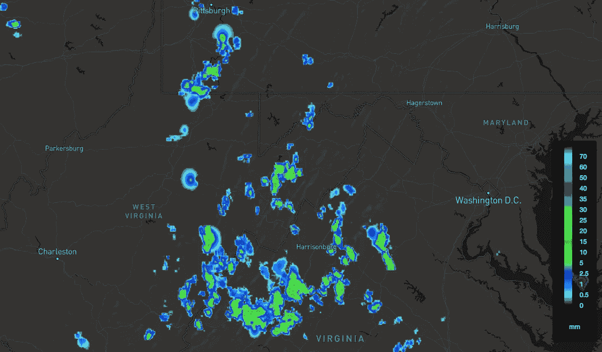
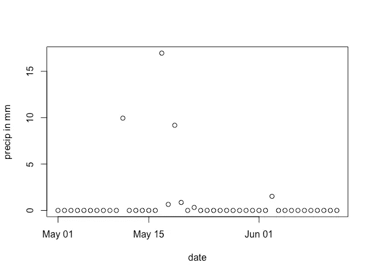
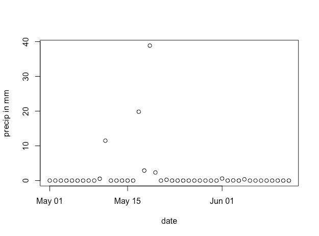

# 使用 InsightR R 包进行沉淀

> 原文：<https://towardsdatascience.com/precipitation-with-the-insightr-r-package-bdda409321ba?source=collection_archive---------2----------------------->

使用 [Insight API](https://wdtinc.com/skywise-home/insight-api/) 的好处之一是数据的质量和分辨率。大多数气象 API 依赖于一个点观测系统。这意味着当你询问你所在地的天气时，你实际上可能得到的是 20 英里外某个地方的天气。这对于很多用例来说是好的，但是对于其他用例来说就很糟糕了。降水是这种方法失败的一个常见用例:相隔几英里的两个站点收到的总降雨量相差很大的情况并不少见。

Insight API 建立在我们的 SkyWise 数据之上，而不是仅仅依赖于观察站点。这些数据是通过运行一个集成了观测站、卫星和雷达的 1 公里模型产生的。你可以在下图中看到它的好处。如果你依靠一个点观测系统，你可能在你的位置有大雨，而观测站什么也没有收到，反之亦然。



我一直在听新闻报道说俄克拉荷马州中部需要降雨，所以我决定借此机会做一个小项目。

我决定在 R 做这个项目作为学习练习。我的第一步是实际学习一些 r。我从 [Rkoans 项目](https://github.com/DASpringate/Rkoans)开始，并修复了所有的测试。在编写了一些示例代码之后，我认为一个包是合适的。我发现希拉里·帕克的这个[关于创建 R 包的很好的参考](https://hilaryparker.com/2014/04/29/writing-an-r-package-from-scratch/)。接下来我开始阅读 Hadley Wickham 的一些优秀教程，尤其是编写 API 包装器的最佳实践。[完成](https://github.com/wdtinc/InsightR)后，让我们看看如何用它来测量降水量。

首先，我们需要安装软件包:

```
devtools::install_github('wdtinc/InsightR')
```

加载后，您需要存储您的认证凭证([免费演示注册](https://wdtinc.com/skywise-home/insight-api)):

```
Authenticate('your_app_id', 'your_app_key')
```

然后，只需调用包装函数:

```
dp <- DailyPrecipitation(35.235762, -97.428966, "2017-05-01", "2017-06-13")
```

假设一切顺利，我们就可以得到总降雨量并绘制数据:

```
> dp$response$status_code == 200
[1] TRUE
> x <- as.Date(dp$content$series[[1]], "%Y-%m-%d")
> y <- dp$content$series[[3]]
> sum(y)
[1] 39.44
> plot(x,y, xlab="date", ylab="precip in mm")
```



让我们与几英里外的一个地点进行比较:

```
> dp <- DailyPrecipitation(35.183235, -97.437611, "2017-05-01", "2017-06-13")
> x <- as.Date(dp$content$series[[1]], "%Y-%m-%d")
> y <- dp$content$series[[3]]
> sum(y)
[1] 77.19
```



77.19mm vs 39.44mm 就差几里！

在一开始对 R 的语法有点反感之后，我发现自己真的很喜欢写 R 代码。尤其是 RStudio。包装器有点不完整:它缺少文档和测试，并且它目前不支持 Insight API 的“资产”特性，该特性允许您检索字段级轮廓。也就是说，基本级别的功能已经存在，希望有些人会发现它很有用。