# 用 R 预测客户流失

> 原文：<https://towardsdatascience.com/predict-customer-churn-with-r-9e62357d47b4?source=collection_archive---------0----------------------->


Photo credit: Pixabay

对于任何一家定期计费的服务公司来说，一个关键的变量就是流失率。《哈佛商业评论》2016 年 3 月

***对于这个“即服务”的世界中几乎所有的成长型公司来说，两个最重要的指标是客户流失率和终身价值。创业者，2016 年 2 月***

# 介绍

当客户或订户停止与公司或服务做生意时，就会发生客户流失，也称为客户流失。它也被称为失去客户或顾客。流失率特别有用的一个行业是电信业，因为大多数客户在一个地理位置内有多种选择。

类似于[预测员工流动](/predict-employee-turnover-with-python-da4975588aa3)的概念，我们将使用[电信数据集](https://www.ibm.com/communities/analytics/watson-analytics-blog/guide-to-sample-datasets/)预测客户流失。我们将介绍逻辑回归、决策树和随机森林。但这一次，我们将在 r 中完成上述所有工作。让我们开始吧！

# 数据预处理

数据是从 [IBM 样本数据集](https://www.ibm.com/communities/analytics/watson-analytics-blog/guide-to-sample-datasets/)下载的。每行代表一个客户，每列包含该客户的属性:

```
library(plyr)
library(corrplot)
library(ggplot2)
library(gridExtra)
library(ggthemes)
library(caret)
library(MASS)
library(randomForest)
library(party)churn <- read.csv('Telco-Customer-Churn.csv')
str(churn)
```

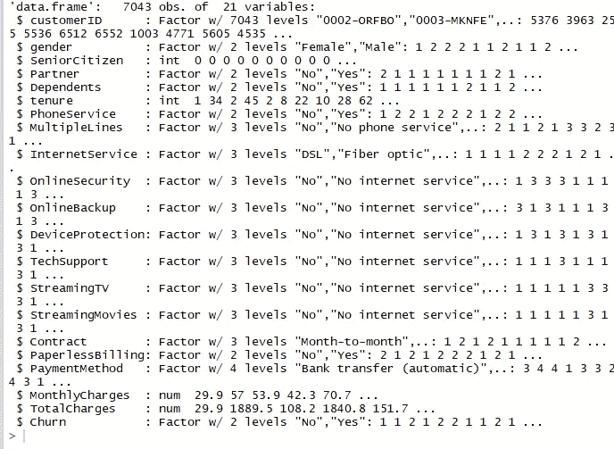

Figure 1

*   customerID
*   性别(女性、男性)
*   老年人(无论客户是否是老年人(1，0))
*   合作伙伴(无论客户是否有合作伙伴(是，否))
*   家属(客户是否有家属(是，否))
*   任期(客户在公司工作的月数)
*   电话服务(无论客户是否有电话服务(是，否))
*   多条线路(客户是否有多条线路(是，否，无电话服务)
*   互联网服务(客户的互联网服务提供商(DSL、光纤、否)
*   在线安全(客户是否有在线安全(是，否，无互联网服务)
*   在线备份(无论客户是否有在线备份(是，否，无互联网服务)
*   设备保护(客户是否有设备保护(是，否，无互联网服务)
*   技术支持(无论客户是否有技术支持(是，否，无互联网服务)
*   流媒体电视(客户是否有流媒体电视(是，否，无互联网服务)
*   流媒体电影(无论客户是否有流媒体电影(是，否，无互联网服务)
*   合同(客户的合同期限(逐月、一年、两年)
*   无纸账单(无论客户是否有无纸账单(是，否))
*   付款方式(客户的付款方式(电子支票、邮寄支票、银行转账(自动)、信用卡(自动)))
*   月度费用(每月向客户收取的金额—数字)
*   总费用(向客户收取的总额——数字)
*   客户流失(客户是否流失(是或否))

原始数据包含 7043 行(客户)和 21 列(特性)。“客户流失”专栏是我们的目标。

我们使用 sapply 来检查每一列中是否有缺失值。我们发现“总费用”列中有 11 个缺失值。因此，让我们删除所有缺少值的行。

```
sapply(churn, function(x) sum(is.na(x)))
```

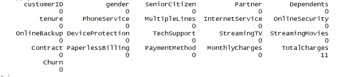

Figure 2

```
churn <- churn[complete.cases(churn), ]
```

**看变量，可以看到我们有些扯皮要做**。

1.  我们将六个栏目的“无互联网服务”改为“无”，它们是:“在线安全”、“在线备份”、“设备保护”、“技术支持”、“流媒体电视”、“流媒体电影”。

```
cols_recode1 <- c(10:15)
for(i in 1:ncol(churn[,cols_recode1])) {
        churn[,cols_recode1][,i] <- as.factor(mapvalues
                                              (churn[,cols_recode1][,i], from =c("No internet service"),to=c("No")))
}
```

2.我们将把“多线”栏中的“无电话服务”改为“无”

```
churn$MultipleLines <- as.factor(mapvalues(churn$MultipleLines, 
                                           from=c("No phone service"),
                                           to=c("No")))
```

3.由于最短任期为 1 个月，最长任期为 72 个月，我们可以将他们分为五个任期组:“0-12 个月”、“12-24 个月”、“24-48 个月”、“48-60 个月”、“60 个月以上”

```
min(churn$tenure); max(churn$tenure)
```

***【1】1***

***【1】72***

```
group_tenure <- function(tenure){
    if (tenure >= 0 & tenure <= 12){
        return('0-12 Month')
    }else if(tenure > 12 & tenure <= 24){
        return('12-24 Month')
    }else if (tenure > 24 & tenure <= 48){
        return('24-48 Month')
    }else if (tenure > 48 & tenure <=60){
        return('48-60 Month')
    }else if (tenure > 60){
        return('> 60 Month')
    }
}churn$tenure_group <- sapply(churn$tenure,group_tenure)
churn$tenure_group <- as.factor(churn$tenure_group)
```

4.将“老年人”列中的值从 0 或 1 更改为“否”或“是”。

```
churn$SeniorCitizen <- as.factor(mapvalues(churn$SeniorCitizen,
                                      from=c("0","1"),
                                      to=c("No", "Yes")))
```

5.删除分析中不需要的列。

```
churn$customerID <- NULL
churn$tenure <- NULL
```

# 探索性数据分析和特征选择

**数值变量之间的相关性**

```
numeric.var <- sapply(churn, is.numeric)
corr.matrix <- cor(churn[,numeric.var])
corrplot(corr.matrix, main="\n\nCorrelation Plot for Numerical Variables", method="number")
```

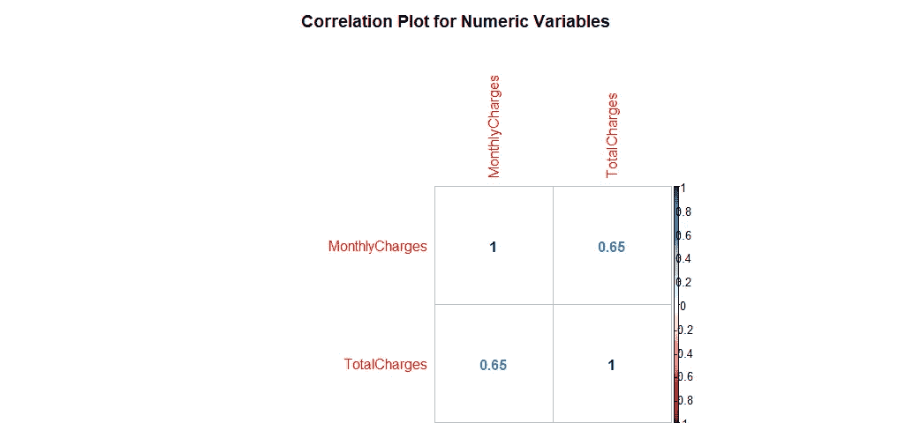

Figure 3

每月费用和总费用是相互关联的。因此其中一个将从模型中移除。我们取消所有指控。

```
churn$TotalCharges <- NULL
```

**分类变量柱状图**

```
p1 <- ggplot(churn, aes(x=gender)) + ggtitle("Gender") + xlab("Gender") +
  geom_bar(aes(y = 100*(..count..)/sum(..count..)), width = 0.5) + ylab("Percentage") + coord_flip() + theme_minimal()
p2 <- ggplot(churn, aes(x=SeniorCitizen)) + ggtitle("Senior Citizen") + xlab("Senior Citizen") + 
  geom_bar(aes(y = 100*(..count..)/sum(..count..)), width = 0.5) + ylab("Percentage") + coord_flip() + theme_minimal()
p3 <- ggplot(churn, aes(x=Partner)) + ggtitle("Partner") + xlab("Partner") + 
  geom_bar(aes(y = 100*(..count..)/sum(..count..)), width = 0.5) + ylab("Percentage") + coord_flip() + theme_minimal()
p4 <- ggplot(churn, aes(x=Dependents)) + ggtitle("Dependents") + xlab("Dependents") +
  geom_bar(aes(y = 100*(..count..)/sum(..count..)), width = 0.5) + ylab("Percentage") + coord_flip() + theme_minimal()
grid.arrange(p1, p2, p3, p4, ncol=2)
```

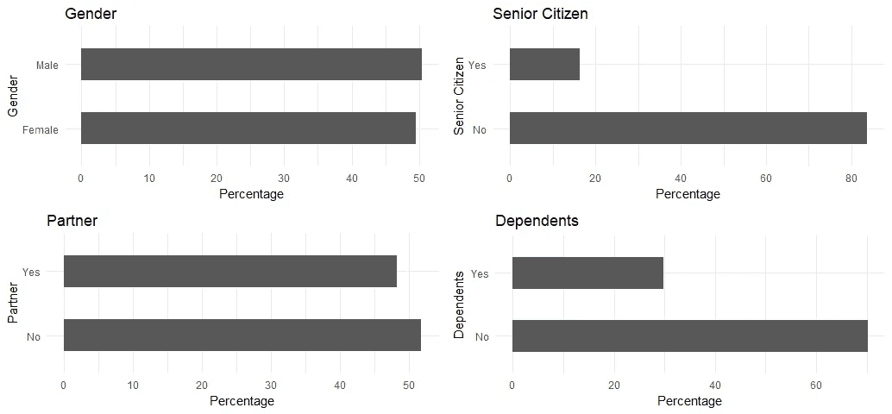

Figure 4

```
p5 <- ggplot(churn, aes(x=PhoneService)) + ggtitle("Phone Service") + xlab("Phone Service") +
  geom_bar(aes(y = 100*(..count..)/sum(..count..)), width = 0.5) + ylab("Percentage") + coord_flip() + theme_minimal()
p6 <- ggplot(churn, aes(x=MultipleLines)) + ggtitle("Multiple Lines") + xlab("Multiple Lines") + 
  geom_bar(aes(y = 100*(..count..)/sum(..count..)), width = 0.5) + ylab("Percentage") + coord_flip() + theme_minimal()
p7 <- ggplot(churn, aes(x=InternetService)) + ggtitle("Internet Service") + xlab("Internet Service") + 
  geom_bar(aes(y = 100*(..count..)/sum(..count..)), width = 0.5) + ylab("Percentage") + coord_flip() + theme_minimal()
p8 <- ggplot(churn, aes(x=OnlineSecurity)) + ggtitle("Online Security") + xlab("Online Security") +
  geom_bar(aes(y = 100*(..count..)/sum(..count..)), width = 0.5) + ylab("Percentage") + coord_flip() + theme_minimal()
grid.arrange(p5, p6, p7, p8, ncol=2)
```

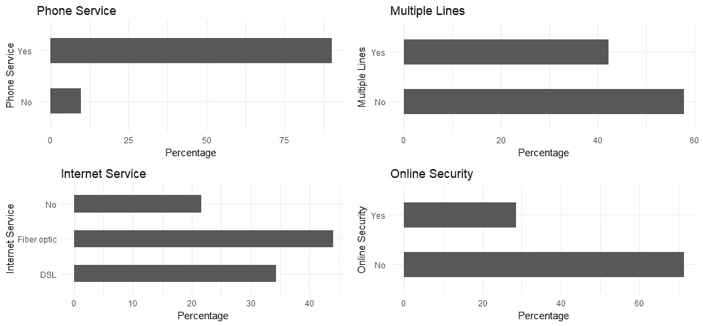

Figure 5

```
p9 <- ggplot(churn, aes(x=OnlineBackup)) + ggtitle("Online Backup") + xlab("Online Backup") +
  geom_bar(aes(y = 100*(..count..)/sum(..count..)), width = 0.5) + ylab("Percentage") + coord_flip() + theme_minimal()
p10 <- ggplot(churn, aes(x=DeviceProtection)) + ggtitle("Device Protection") + xlab("Device Protection") + 
  geom_bar(aes(y = 100*(..count..)/sum(..count..)), width = 0.5) + ylab("Percentage") + coord_flip() + theme_minimal()
p11 <- ggplot(churn, aes(x=TechSupport)) + ggtitle("Tech Support") + xlab("Tech Support") + 
  geom_bar(aes(y = 100*(..count..)/sum(..count..)), width = 0.5) + ylab("Percentage") + coord_flip() + theme_minimal()
p12 <- ggplot(churn, aes(x=StreamingTV)) + ggtitle("Streaming TV") + xlab("Streaming TV") +
  geom_bar(aes(y = 100*(..count..)/sum(..count..)), width = 0.5) + ylab("Percentage") + coord_flip() + theme_minimal()
grid.arrange(p9, p10, p11, p12, ncol=2)
```

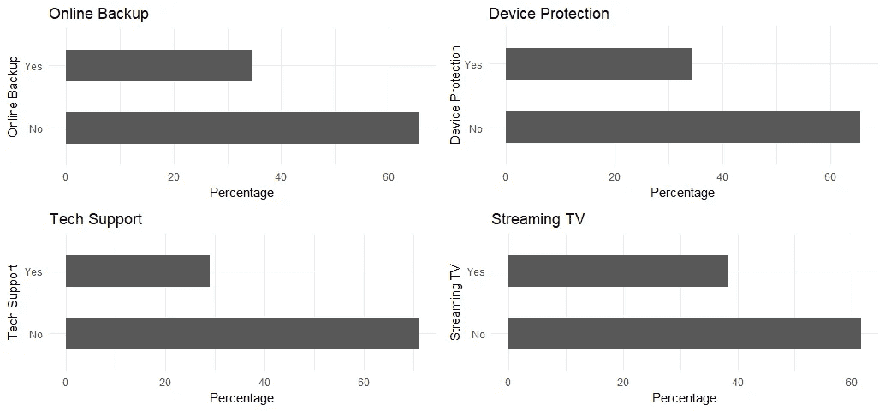

Figure 6

```
p13 <- ggplot(churn, aes(x=StreamingMovies)) + ggtitle("Streaming Movies") + xlab("Streaming Movies") +
  geom_bar(aes(y = 100*(..count..)/sum(..count..)), width = 0.5) + ylab("Percentage") + coord_flip() + theme_minimal()
p14 <- ggplot(churn, aes(x=Contract)) + ggtitle("Contract") + xlab("Contract") + 
  geom_bar(aes(y = 100*(..count..)/sum(..count..)), width = 0.5) + ylab("Percentage") + coord_flip() + theme_minimal()
p15 <- ggplot(churn, aes(x=PaperlessBilling)) + ggtitle("Paperless Billing") + xlab("Paperless Billing") + 
  geom_bar(aes(y = 100*(..count..)/sum(..count..)), width = 0.5) + ylab("Percentage") + coord_flip() + theme_minimal()
p16 <- ggplot(churn, aes(x=PaymentMethod)) + ggtitle("Payment Method") + xlab("Payment Method") +
  geom_bar(aes(y = 100*(..count..)/sum(..count..)), width = 0.5) + ylab("Percentage") + coord_flip() + theme_minimal()
p17 <- ggplot(churn, aes(x=tenure_group)) + ggtitle("Tenure Group") + xlab("Tenure Group") +
  geom_bar(aes(y = 100*(..count..)/sum(..count..)), width = 0.5) + ylab("Percentage") + coord_flip() + theme_minimal()
grid.arrange(p13, p14, p15, p16, p17, ncol=2)
```

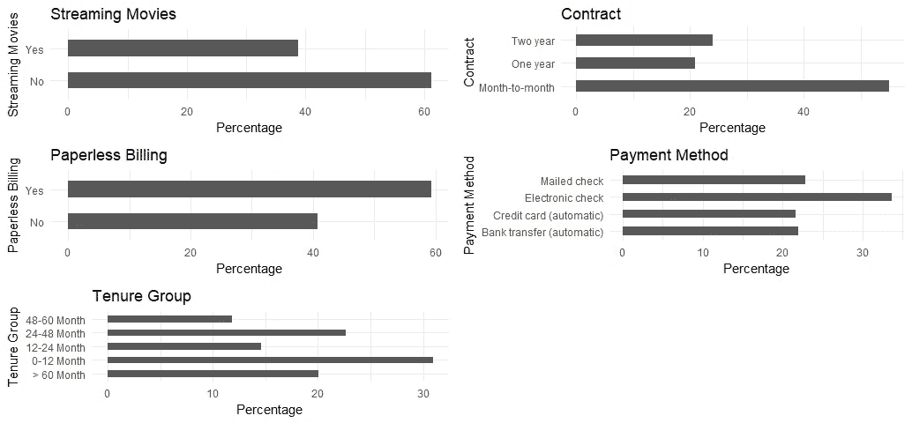

Figure 7

所有的分类变量似乎有一个合理的广泛分布，因此，他们都将被保留，以供进一步分析。

# 逻辑回归

**首先，我们将数据分成训练集和测试集**:

```
intrain<- createDataPartition(churn$Churn,p=0.7,list=FALSE)
set.seed(2017)
training<- churn[intrain,]
testing<- churn[-intrain,]
```

**确认分割正确**:

```
dim(training); dim(testing)
```

***【1】4924*19**

***【1】2108 19***

**拟合逻辑回归模型**:

```
LogModel <- glm(Churn ~ .,family=binomial(link="logit"),data=training)
print(summary(LogModel))
```

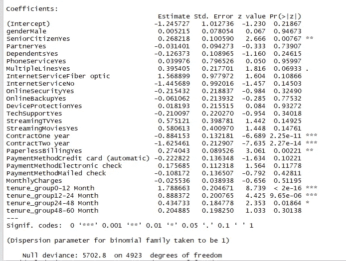

Figure 8

**特征分析**:

前三个最相关的功能包括合同，任期 _ 组和无纸账单。

```
anova(LogModel, test="Chisq")
```

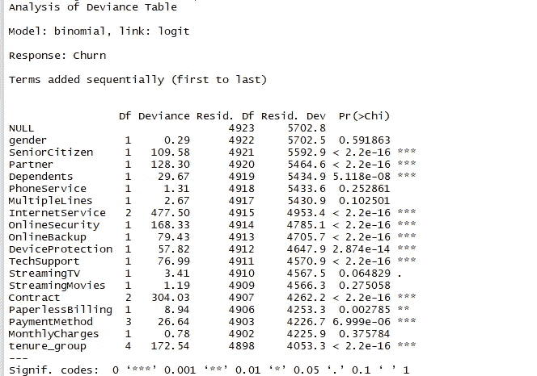

Figure 9

分析偏差表，我们可以看到每次增加一个变量时偏差的下降。加入互联网服务、合同和保有权组显著降低了剩余偏离度。其他变量如 PaymentMethod 和 Dependents 对模型的改善似乎较小，尽管它们都具有较低的 p 值。

**评估逻辑回归模型的预测能力**

```
testing$Churn <- as.character(testing$Churn)
testing$Churn[testing$Churn=="No"] <- "0"
testing$Churn[testing$Churn=="Yes"] <- "1"
fitted.results <- predict(LogModel,newdata=testing,type='response')
fitted.results <- ifelse(fitted.results > 0.5,1,0)
misClasificError <- mean(fitted.results != testing$Churn)
print(paste('Logistic Regression Accuracy',1-misClasificError))
```

***【1】Logistic 回归精度 0.789373814041746***

**逻辑回归混淆矩阵**

```
print("Confusion Matrix for Logistic Regression"); table(testing$Churn, fitted.results > 0.5)
```

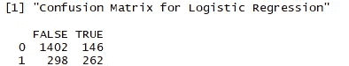

Figure 10

**赔率比**

逻辑回归中一个有趣的性能测量是优势比。基本上，比值比是一个事件发生的概率。

```
library(MASS)
exp(cbind(OR=coef(LogModel), confint(LogModel)))
```


Figure 11

# **决策树**

**决策树可视化**

为了便于说明，我们将只使用三个变量来绘制决策树，它们是“合同”、“任期 _ 组”和“无纸账单”。

```
tree <- ctree(Churn~Contract+tenure_group+PaperlessBilling, training)
plot(tree)
```

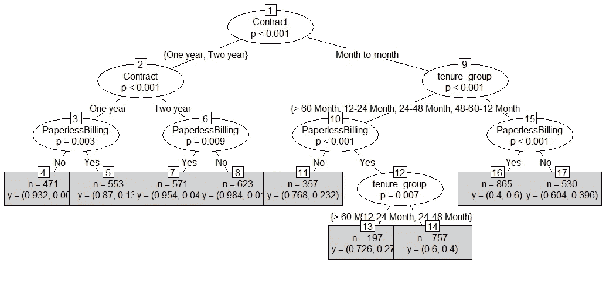

Figure 12

1.  在我们使用的三个变量中，合同是预测客户流失与否的最重要变量。
2.  如果客户是一年期或两年期合同，无论他(她)是否有纸质账单，他(她)都不太可能流失。
3.  另一方面，如果客户签订的是逐月合同，租期为 0-12 个月，并且使用无纸化账单，那么该客户更有可能流失。

**决策树混淆矩阵**

我们使用所有变量来制作混淆矩阵表并做出预测。

```
pred_tree <- predict(tree, testing)
print("Confusion Matrix for Decision Tree"); table(Predicted = pred_tree, Actual = testing$Churn)
```

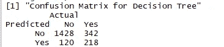

Figure 13

**决策树精度**

```
p1 <- predict(tree, training)
tab1 <- table(Predicted = p1, Actual = training$Churn)
tab2 <- table(Predicted = pred_tree, Actual = testing$Churn)
print(paste('Decision Tree Accuracy',sum(diag(tab2))/sum(tab2)))
```

***【1】决策树准确率 0.780834914611006***

决策树的准确性几乎没有提高。让我们看看使用随机森林是否能做得更好。

# 随机森林

**随机森林初始模型**

```
rfModel <- randomForest(Churn ~., data = training)
print(rfModel)
```

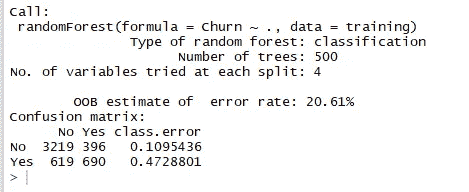

Figure 14

预测“否”时错误率相对较低，预测“是”时错误率高得多。

**随机森林预测和混淆矩阵**

```
pred_rf <- predict(rfModel, testing)
caret::confusionMatrix(pred_rf, testing$Churn)
```

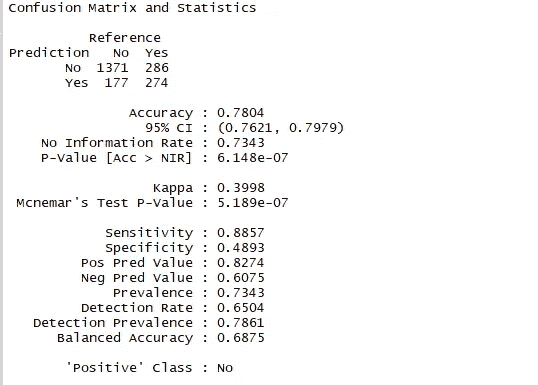

Figure 15

**随机森林错误率**

```
plot(rfModel)
```

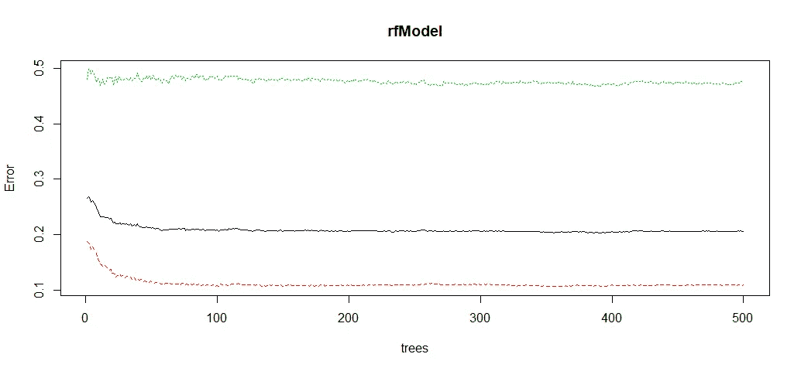

Figure 16

我们用这个图来帮助我们确定树的数量。随着树的数量增加，OOB 错误率降低，然后变得几乎恒定。我们不能在大约 100 到 200 棵树后降低 OOB 错误率。

**调整随机森林模型**

```
t <- tuneRF(training[, -18], training[, 18], stepFactor = 0.5, plot = TRUE, ntreeTry = 200, trace = TRUE, improve = 0.05)
```

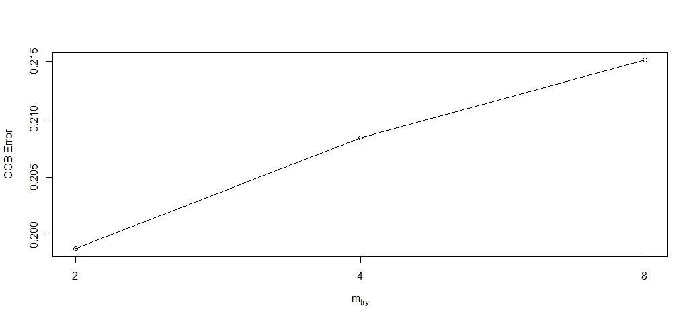

Figure 17

我们用这个图来给我们一些选择项目数量的想法。当 mtry 为 2 时，OOB 误码率最低。因此，我们选择 mtry=2。

**调整后拟合随机森林模型**

```
rfModel_new <- randomForest(Churn ~., data = training, ntree = 200, mtry = 2, importance = TRUE, proximity = TRUE)
print(rfModel_new)
```

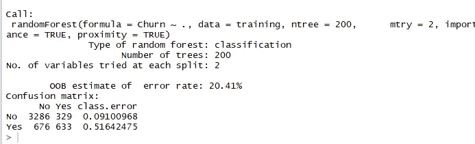

Figure 18

OOB 误差率从图 14 的 20.61%下降到 20.41%。

**随机森林预测和调优后的混乱矩阵**

```
pred_rf_new <- predict(rfModel_new, testing)
caret::confusionMatrix(pred_rf_new, testing$Churn)
```

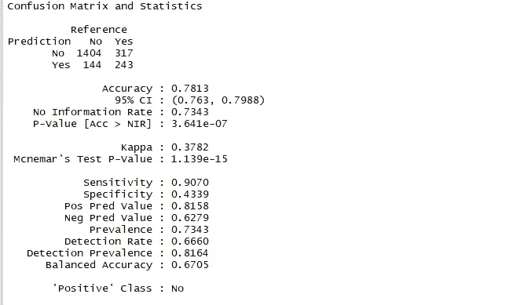

Figure 19

与图 15 相比，精确度和灵敏度都得到了提高。

**随机森林特征重要性**

```
varImpPlot(rfModel_new, sort=T, n.var = 10, main = 'Top 10 Feature Importance')
```

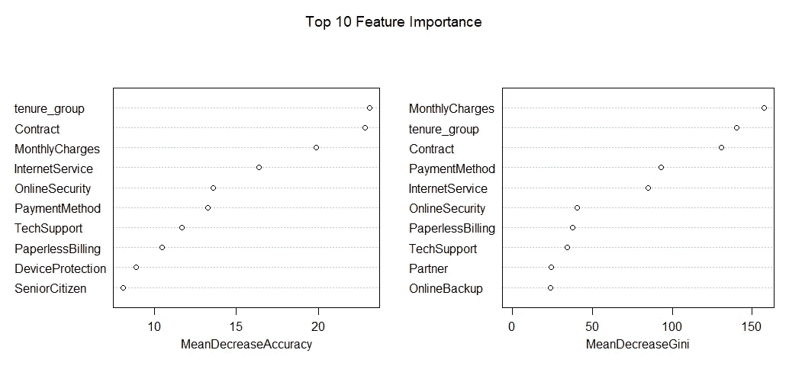

Figure 20

# 摘要

从上面的例子，我们可以看到，逻辑回归，决策树和随机森林可以用于客户流失分析这一特定的数据集一样好。

在整个分析过程中，我学到了几件重要的事情:

*   诸如使用权组、合同、无纸账单、月费和互联网服务等功能似乎在客户流失中发挥了作用。
*   性别和客户流失之间似乎没有关系。
*   月结合同、无单据账单且任期在 12 个月以内的客户更有可能流失；另一方面，拥有一年或两年合同、超过 12 个月任期、不使用无纸化计费的客户不太可能流失。

创建这篇文章的源代码可以在[这里](https://github.com/susanli2016/Data-Analysis-with-R/blob/master/customer_churn.Rmd)找到。我将很高兴收到关于上述任何反馈或问题。