# 用 Python 预测员工流动率

> 原文：<https://towardsdatascience.com/predict-employee-turnover-with-python-da4975588aa3?source=collection_archive---------0----------------------->


***“大数据可以让公司识别出预测自己队伍中人员流动的变量。”《哈佛商业评论》2017 年 8 月***

***“员工流失分析是评估员工流动率的过程，旨在预测未来并减少员工流失。”福布斯 2016 年 3 月***

# 介绍

本文展示了一个员工离职分析项目的参考实现，该项目是使用 Python 的 Scikit-Learn 库构建的。在本文中，我们介绍了逻辑回归，随机森林和支持向量机。我们还测量通过使用机器学习建立的模型的准确性，并评估进一步发展的方向。我们将用 Python 来完成以上所有的工作。我们开始吧！

# 数据预处理

数据是从 [Kaggle](https://www.kaggle.com/ludobenistant/hr-analytics/data) 下载的。这很简单。每行代表一名员工，每列包含员工属性:

*   满意度 _ 级别(0–1)
*   last_evaluation(自上次评估以来的时间，以年为单位)
*   number_projects(工作时完成的项目数)
*   平均每月小时数(工作场所平均每月小时数)
*   time_spend_company(在公司工作的时间，以年为单位)
*   工作事故(员工是否发生工作场所事故)
*   离开(无论员工是否离开工作场所(1 或 0))
*   promotion_last_5years(员工在过去五年中是否得到晋升)
*   销售(他们工作的部门)
*   工资(相对工资水平)

```
import pandas as pd
hr = pd.read_csv('HR.csv')
col_names = hr.columns.tolist()
print("Column names:")
print(col_names)print("\nSample data:")
hr.head()
```

***栏目名称:
['满意度 _ 等级'，'上次 _ 评估'，'人数 _ 项目'，'平均 _ 月 _ 小时'，'时间 _ 花费 _ 公司'，'工作 _ 事故'，'离职'，'促销 _ 上次 _ 5 年'，'销售'，'薪资']***

***样本数据:***


Figure 1

将列名从“销售”重命名为“部门”

```
hr=hr.rename(columns = {'sales':'department'})
```

列的类型如下所示:

```
hr.dtypes
```

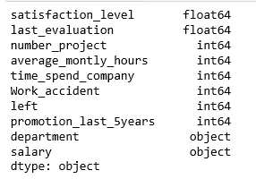

Figure 2

我们的数据非常干净，没有缺失值

```
hr.isnull().any()
```

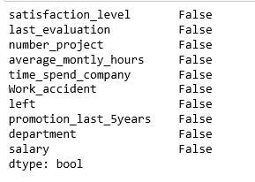

Figure 3

该数据包含 14，999 名员工和 10 项功能

```
hr.shape
```

***(14999，10)***

“左”列是记录 1 和 0 的结果变量。1 为离职员工，0 为未离职员工。

数据集的部门列有许多类别，为了更好地建模，我们需要减少类别。“部门”列有以下类别:

```
hr['department'].unique()
```

***数组(['销售'，'会计'，'人力资源'，'技术'，'支持'，'管理'，【T25 '，' IT '，'产品 _mng '，'营销'，' RandD']，dtype =对象)***

让我们将“技术”、“支持”和“IT”结合在一起，称之为“技术”。

```
import numpy as np
hr['department']=np.where(hr['department'] =='support', 'technical', hr['department'])
hr['department']=np.where(hr['department'] =='IT', 'technical', hr['department'])
```

更改后，部门类别的外观如下:

***【'销售' '会计' '人力资源' '技术' '管理' '产品 _ mng '】
【市场营销' '随机】】***

# 数据探索

首先，让我们找出离开公司和没有离开公司的员工人数:

```
hr['left'].value_counts()
```

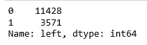

Figure 4

剩下 3571 名员工，11428 名员工留在我们的数据中。

让我们来了解一下这两个类别的数字:

```
hr.groupby('left').mean()
```

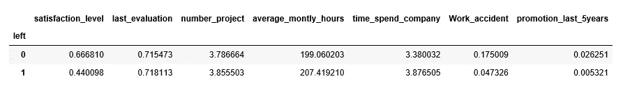

Figure 5

***几种观察:***

*   留在公司的员工的平均满意度高于离开公司的员工。
*   离开公司的员工平均每月工作时间比留下来的员工多。
*   发生工伤事故的员工比没有发生工伤事故的员工更不容易离职。
*   与过去五年中没有获得晋升的员工相比，过去五年中获得晋升的员工离职的可能性更小。

我们可以计算分类变量(如部门和工资)的分类平均值，以获得更详细的数据，如下所示:

```
hr.groupby('department').mean()
```

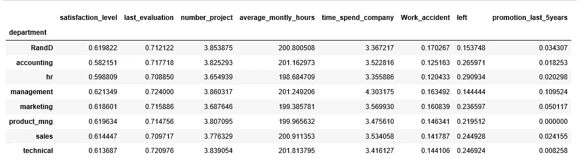

Figure 6

```
hr.groupby('salary').mean()
```


Figure 7

# 数据可视化

让我们将数据可视化，以便更清楚地了解数据和重要特征。

***条形图为部门员工工作争取和离职频率***

```
%matplotlib inline
import matplotlib.pyplot as plt
pd.crosstab(hr.department,hr.left).plot(kind='bar')
plt.title('Turnover Frequency for Department')
plt.xlabel('Department')
plt.ylabel('Frequency of Turnover')
plt.savefig('department_bar_chart')
```

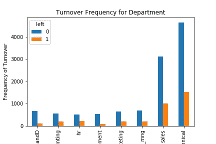

Figure 8

很明显，员工流动的频率在很大程度上取决于他们工作的部门。因此，部门可以很好地预测结果变量。

***员工薪资水平和离职频率条形图***

```
table=pd.crosstab(hr.salary, hr.left)
table.div(table.sum(1).astype(float), axis=0).plot(kind='bar', stacked=True)
plt.title('Stacked Bar Chart of Salary Level vs Turnover')
plt.xlabel('Salary Level')
plt.ylabel('Proportion of Employees')
plt.savefig('salary_bar_chart')
```

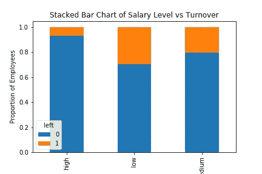

Figure 9

员工流动的比例在很大程度上取决于他们的工资水平；因此，工资水平可以是预测结果的一个很好的预测因素。

在探索阶段，直方图通常是我们可以用于数值变量的最有用的工具之一。

***数值变量直方图***

```
num_bins = 10hr.hist(bins=num_bins, figsize=(20,15))
plt.savefig("hr_histogram_plots")
plt.show()
```


Figure 10

# 为分类变量创建虚拟变量

数据集中有两个分类变量(部门、薪水),它们需要转换成虚拟变量才能用于建模。

```
cat_vars=['department','salary']
for var in cat_vars:
    cat_list='var'+'_'+var
    cat_list = pd.get_dummies(hr[var], prefix=var)
    hr1=hr.join(cat_list)
    hr=hr1
```

一旦创建了虚拟变量，就需要删除实际的分类变量。

为分类变量创建虚拟变量后的列名:

```
hr.drop(hr.columns[[8, 9]], axis=1, inplace=True)
hr.columns.values
```

***数组(['满意度 _ 等级'，'上次 _ 评价'，'人数 _ 项目'，
'平均 _ 月 _ 小时'，'时间 _ 花费 _ 公司'，
'离职'，'晋升 _ 最近 _ 5 年'，'部门 _ 随机'，
'部门 _ 会计'，'部门 _ 人力资源'，'部门 _ 管理'，【T26'部门 _ 营销'，
'部门 _ 产品 _ 管理'，【部门 _ 销售'，【部门 _ 技术】，【薪资 _ 高】，
'薪资 _ 薪资***

结果变量为“左”，其他变量均为预测变量。

```
hr_vars=hr.columns.values.tolist()
y=['left']
X=[i for i in hr_vars if i not in y]
```

# 特征选择

[递归特征消除(RFE)](http://scikit-learn.org/stable/modules/generated/sklearn.feature_selection.RFE.html) 的工作原理是递归地移除变量，并在剩余的变量上建立模型。它使用模型精度来确定哪些变量(和变量组合)对预测目标属性贡献最大。

让我们使用特征选择来帮助我们决定哪些变量是重要的，可以非常准确地预测员工流动率。X 总共有 18 列，选 10 列怎么样？

```
from sklearn.feature_selection import RFE
from sklearn.linear_model import LogisticRegressionmodel = LogisticRegression()rfe = RFE(model, 10)
rfe = rfe.fit(hr[X], hr[y])
print(rfe.support_)
print(rfe.ranking_)
```

***【真真假假真真假假真真假假真真假假

【1 1 3 9 1 1 1 1 1 1 1 5 1 1 6 8 7 4 1 1 2】***

您可以看到 RFE 为我们选择了 10 个变量，它们在 *support_* 数组中标记为 True，在 *ranking_* 数组中标记为 choice“1”。它们是:

***['满意度 _ 等级'，'上次 _ 评价'，'时间 _ 花费 _ 公司'，'工作 _ 事故'，'晋升 _ 最近 _ 5 年'，'部门 _ 随机'，'部门 _ 人力资源'，'部门 _ 管理'，'薪资 _ 高'，'薪资 _ 低']***

```
cols=['satisfaction_level', 'last_evaluation', 'time_spend_company', 'Work_accident', 'promotion_last_5years', 
      'department_RandD', 'department_hr', 'department_management', 'salary_high', 'salary_low'] 
X=hr[cols]
y=hr['left']
```

# 逻辑回归模型

```
from sklearn.cross_validation import train_test_split
X_train, X_test, y_train, y_test = train_test_split(X, y, test_size=0.3, random_state=0)from sklearn.linear_model import LogisticRegression
from sklearn import metrics
logreg = LogisticRegression()
logreg.fit(X_train, y_train)
```

***LogisticRegression(C = 1.0，class_weight=None，dual=False，fit_intercept=True，intercept_scaling=1，max_iter=100，multi_class='ovr '，n_jobs=1，penalty='l2 '，random_state=None，solver='liblinear '，tol=0.0001，verbose=0，warm_start=False)***

```
from sklearn.metrics import accuracy_score
print('Logistic regression accuracy: {:.3f}'.format(accuracy_score(y_test, logreg.predict(X_test))))
```

***逻辑回归精度:0.771***

# 随机森林

```
from sklearn.ensemble import RandomForestClassifier
rf = RandomForestClassifier()
rf.fit(X_train, y_train)
```

***RandomForestClassifier(bootstrap = True，class_weight=None，criterion='gini '，max_depth=None，max_features='auto '，max_leaf_nodes=None，min _ infinity _ split = 1e-07，min_samples_leaf=1，min_samples_split=2，min_weight_fraction_leaf=0.0，n _ estimators = 10，n_jobs=1，oob_score=False，random_state=None，verbose=0，warm _ start = False)【T24***

```
print('Random Forest Accuracy: {:.3f}'.format(accuracy_score(y_test, rf.predict(X_test))))
```

***随机森林精度:0.978***

# 支持向量机

```
from sklearn.svm import SVC
svc = SVC()
svc.fit(X_train, y_train)
```

***SVC(C=1.0，cache_size=200，class_weight=None，coef0=0.0，
decision _ function _ shape = None，degree=3，gamma='auto '，kernel='rbf '，
max_iter=-1，probability=False，random_state=None，shrinking=True，
tol=0.001，verbose=False)***

```
print('Support vector machine accuracy: {:.3f}'.format(accuracy_score(y_test, svc.predict(X_test))))
```

***支持向量机精度:0.909***

获胜者是… ***随机森林*** 对吧？

# 交互效度分析

交叉验证试图避免过度拟合，同时仍然为每个观察数据集生成预测。我们使用 10 重交叉验证来训练我们的随机森林模型。

```
from sklearn import model_selection
from sklearn.model_selection import cross_val_score
kfold = model_selection.KFold(n_splits=10, random_state=7)
modelCV = RandomForestClassifier()
scoring = 'accuracy'
results = model_selection.cross_val_score(modelCV, X_train, y_train, cv=kfold, scoring=scoring)
print("10-fold cross validation average accuracy: %.3f" % (results.mean()))
```

***十重交叉验证平均准确率:0.977***

平均精度保持非常接近随机森林模型精度；因此，我们可以得出结论，该模型具有良好的通用性。

# 精确度和召回率

我们构建混淆矩阵来可视化分类器做出的预测，并评估分类的准确性。

**随机森林**

```
from sklearn.metrics import classification_report
print(classification_report(y_test, rf.predict(X_test)))
```

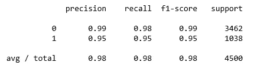

Figure 11

```
y_pred = rf.predict(X_test)
from sklearn.metrics import confusion_matrix
import seaborn as sns
forest_cm = metrics.confusion_matrix(y_pred, y_test, [1,0])
sns.heatmap(forest_cm, annot=True, fmt='.2f',xticklabels = ["Left", "Stayed"] , yticklabels = ["Left", "Stayed"] )
plt.ylabel('True class')
plt.xlabel('Predicted class')
plt.title('Random Forest')
plt.savefig('random_forest')
```

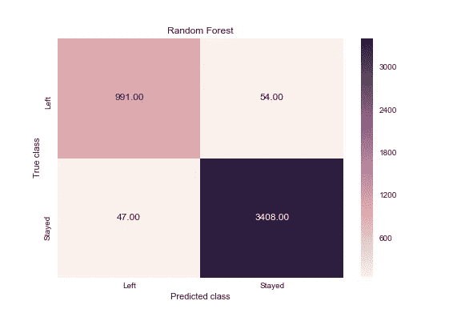

Figure 12

**逻辑回归**

```
print(classification_report(y_test, logreg.predict(X_test)))
```

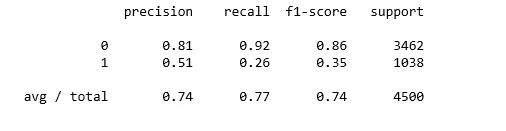

Figure 13

```
logreg_y_pred = logreg.predict(X_test)
logreg_cm = metrics.confusion_matrix(logreg_y_pred, y_test, [1,0])
sns.heatmap(logreg_cm, annot=True, fmt='.2f',xticklabels = ["Left", "Stayed"] , yticklabels = ["Left", "Stayed"] )
plt.ylabel('True class')
plt.xlabel('Predicted class')
plt.title('Logistic Regression')
plt.savefig('logistic_regression')
```

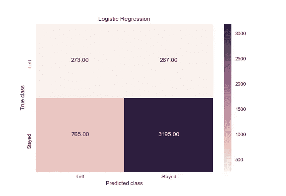

Figure 14

**支持向量机**

```
print(classification_report(y_test, svc.predict(X_test)))
```

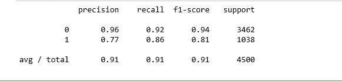

Figure 15

```
svc_y_pred = svc.predict(X_test)
svc_cm = metrics.confusion_matrix(svc_y_pred, y_test, [1,0])
sns.heatmap(svc_cm, annot=True, fmt='.2f',xticklabels = ["Left", "Stayed"] , yticklabels = ["Left", "Stayed"] )
plt.ylabel('True class')
plt.xlabel('Predicted class')
plt.title('Support Vector Machine')
plt.savefig('support_vector_machine')
```

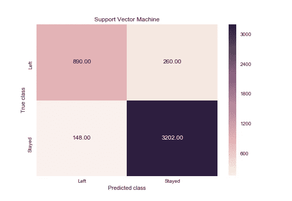

Figure 16

当一名员工离职时，我的分类器多久能正确预测一次？这种测量被称为“召回”，快速浏览这些图表可以证明随机森林显然最适合这一标准。在所有的周转案例中，random forest 在 1038 个案例中正确检索了 991 个案例。这转化为约 95% (991/1038)的周转“召回”，远好于逻辑回归(26%)或支持向量机(85%)。

当一个分类器预测一个员工将离开时，这个员工实际上多久离开一次？这种测量称为“精度”。随机森林再次以大约 95%的精度(1045 中的 991)优于其他两个，逻辑回归为大约 51%(540 中的 273)，支持向量机为大约 77%(1150 中的 890)。

# ROC 曲线

```
from sklearn.metrics import roc_auc_score
from sklearn.metrics import roc_curvelogit_roc_auc = roc_auc_score(y_test, logreg.predict(X_test))
fpr, tpr, thresholds = roc_curve(y_test, logreg.predict_proba(X_test)[:,1])rf_roc_auc = roc_auc_score(y_test, rf.predict(X_test))
rf_fpr, rf_tpr, rf_thresholds = roc_curve(y_test, rf.predict_proba(X_test)[:,1])plt.figure()
plt.plot(fpr, tpr, label='Logistic Regression (area = %0.2f)' % logit_roc_auc)
plt.plot(rf_fpr, rf_tpr, label='Random Forest (area = %0.2f)' % rf_roc_auc)
plt.plot([0, 1], [0, 1],'r--')
plt.xlim([0.0, 1.0])
plt.ylim([0.0, 1.05])
plt.xlabel('False Positive Rate')
plt.ylabel('True Positive Rate')
plt.title('Receiver operating characteristic')
plt.legend(loc="lower right")
plt.savefig('ROC')
plt.show()
```

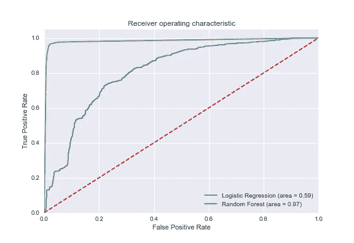

Figure 17

[受试者操作特征(ROC)](https://en.wikipedia.org/wiki/Receiver_operating_characteristic) 曲线是二进制分类器使用的另一个常用工具。虚线代表纯随机分类器的 ROC 曲线；一个好的分类器尽可能远离那条线(朝向左上角)。

# 随机森林模型的特征重要性

```
feature_labels = np.array(['satisfaction_level', 'last_evaluation', 'time_spend_company', 'Work_accident', 'promotion_last_5years', 
      'department_RandD', 'department_hr', 'department_management', 'salary_high', 'salary_low'])
importance = rf.feature_importances_
feature_indexes_by_importance = importance.argsort()
for index in feature_indexes_by_importance:
    print('{}-{:.2f}%'.format(feature_labels[index], (importance[index] *100.0)))
```

***晋升 _ 最后 _ 5 年-0.20%
部门 _ 管理-0.22%
部门 _ 人力资源-0.29%
部门 _ 随机-0.34%
薪资 _ 高-0.55%
薪资 _ 低-1.35%
工作 _ 意外-1.46%
最后 _ 评估-19.19%
时间 _ 花费 _ 公司-25.77***

根据我们的随机森林模型，上面以升序显示了影响员工是否会离开公司的最重要的特征。

# 摘要

这就把我们带到了文章的结尾。我不打算打印出模型预测他们可能会辞职的员工名单。这不是本分析的目的。记住我们不可能有一个适用于所有人的算法。员工离职分析可以帮助指导决策，但不能做出决策。[小心使用分析以避免法律问题和员工的不信任，并结合员工反馈使用它们，以做出最佳决策。](https://www.entrepreneur.com/article/271753#)

创建这篇文章的源代码可以在[这里](https://github.com/susanli2016/Machine-Learning-with-Python/blob/master/Employee_Turnover.ipynb)找到。我将很高兴收到关于上述任何反馈或问题。